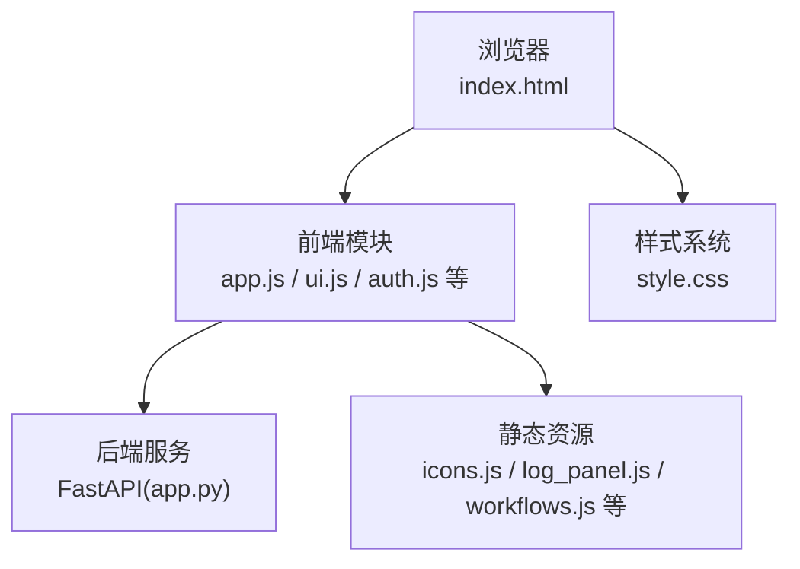
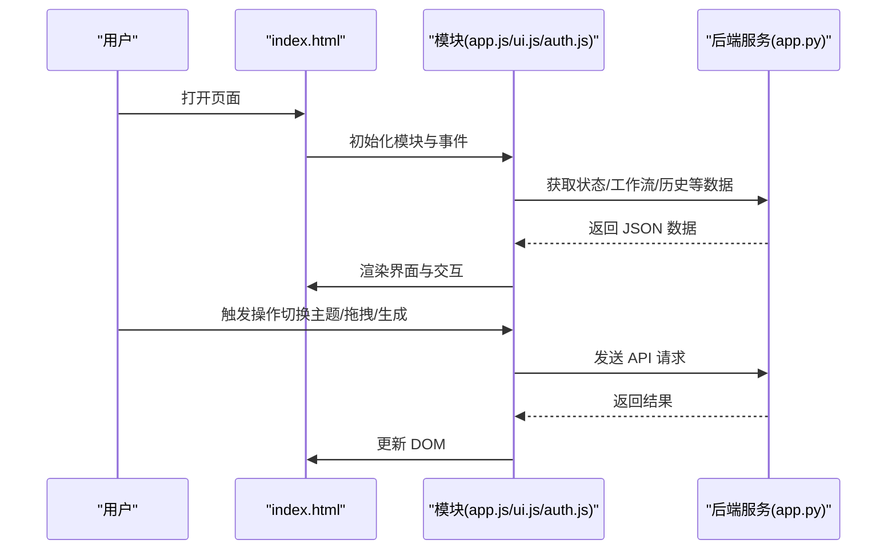
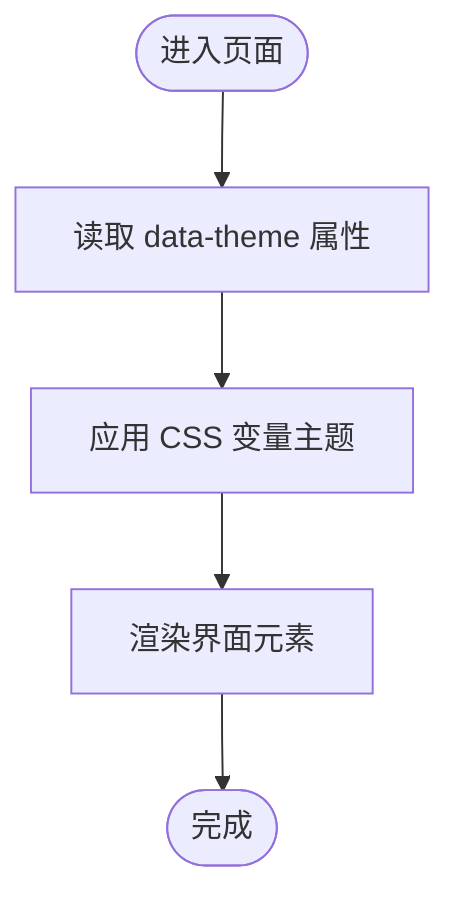
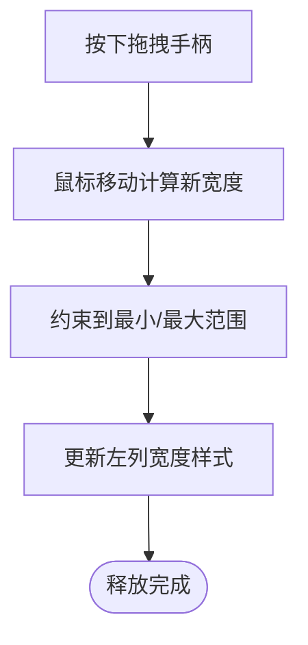
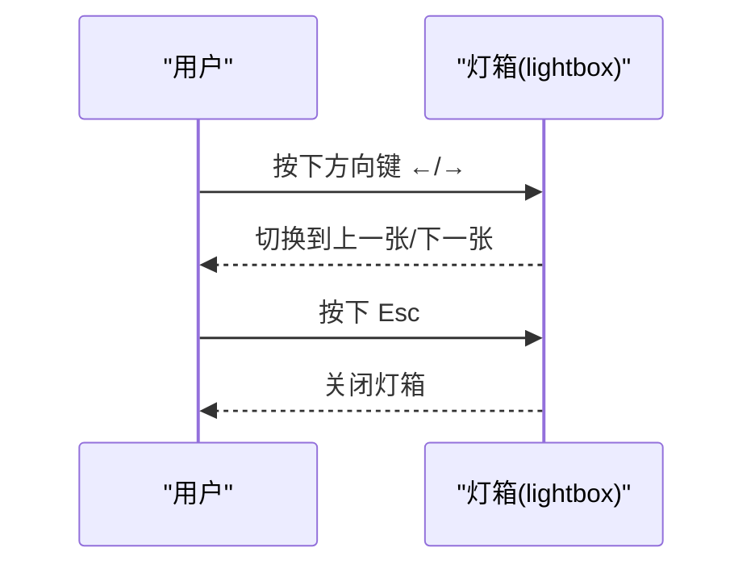
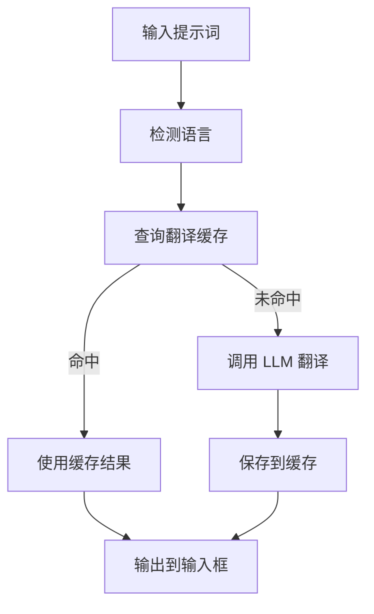
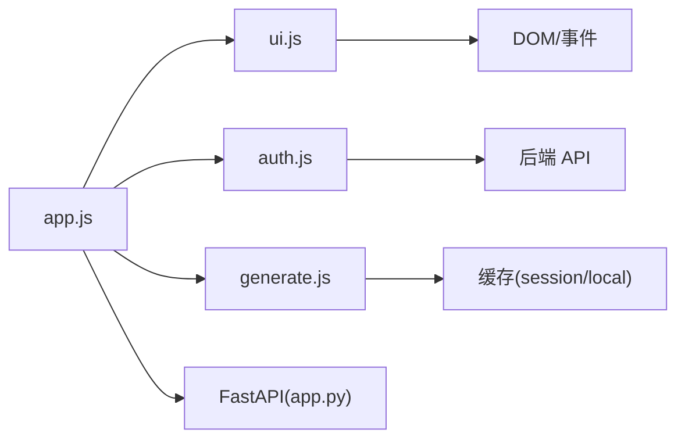

# 界面定制与个性化

<cite>
**本文档引用的文件**
- [index.html](file://static/index.html)
- [style.css](file://static/css/style.css)
- [app.js](file://static/js/app.js)
- [ui.js](file://static/js/modules/ui.js)
- [auth.js](file://static/js/modules/auth.js)
- [generate.js](file://static/js/modules/generate.js)
- [log_panel.js](file://static/js/modules/log_panel.js)
- [workflows.js](file://static/js/modules/workflows.js)
- [app.py](file://app.py)
</cite>

## 目录
1. [简介](#简介)
2. [项目结构](#项目结构)
3. [核心组件](#核心组件)
4. [架构总览](#架构总览)
5. [详细组件分析](#详细组件分析)
6. [依赖关系分析](#依赖关系分析)
7. [性能考虑](#性能考虑)
8. [故障排除指南](#故障排除指南)
9. [结论](#结论)
10. [附录](#附录)

## 简介
本指南面向 Ez ComfyUI Showcase 的界面定制与个性化功能，帮助用户掌握主题切换、布局调整、快捷键使用、语言设置、响应式适配、性能优化以及常见问题排查。文档基于前端静态资源与后端服务的实际实现进行说明，确保内容与代码一致。

## 项目结构
- 前端采用单页应用结构，HTML 页面负责布局与挂载点，CSS 提供主题与样式，JS 模块负责交互逻辑与状态管理。
- 后端使用 Python FastAPI 提供 API 服务，前端通过 fetch 与后端交互，实现工作流管理、生成任务、日志、认证等功能。

图表来源
- [index.html](file://static/index.html)
- [app.js](file://static/js/app.js)
- [style.css](file://static/css/style.css)
- [app.py](file://app.py)

章节来源
- [index.html:1-659](file://static/index.html#L1-L659)
- [style.css:1-800](file://static/css/style.css#L1-L800)
- [app.js:1-800](file://static/js/app.js#L1-L800)
- [app.py:1-800](file://app.py#L1-L800)

## 核心组件
- 主题系统：通过页面根元素 data-theme 属性与 CSS 变量实现主题切换（如深色 OLED 主题），支持动态切换与持久化。
- 布局系统：采用三列布局（左工作流/快速出图、中历史瀑布流、右日志面板），支持列宽拖拽调整与移动端自适应。
- 交互模块：UI 模块负责拖拽调整、滚动、提示气泡等；认证模块负责登录/注册与用户偏好；生成模块负责提示词翻译与缓存。
- 日志面板：支持吸附到右侧、过滤级别、清空与尺寸调整。
- 语言与本地化：界面多处使用中文，提示词翻译具备中英切换能力；系统设置中可配置 LLM API 以辅助提示词处理。

章节来源
- [index.html:19](file://static/index.html#L19)
- [style.css:6-66](file://static/css/style.css#L6-L66)
- [ui.js:21-56](file://static/js/modules/ui.js#L21-L56)
- [auth.js:1-200](file://static/js/modules/auth.js#L1-L200)
- [generate.js:1-200](file://static/js/modules/generate.js#L1-L200)
- [log_panel.js:21](file://static/js/modules/log_panel.js#L21)

## 架构总览
前端通过模块化 JS 组织功能，主入口初始化状态与事件绑定，各模块分别负责 UI、认证、生成、日志等子系统。后端提供 REST API，前端通过统一的 fetch 封装进行请求。

图表来源
- [index.html](file://static/index.html)
- [app.js:630-728](file://static/js/app.js#L630-L728)
- [app.py:1-800](file://app.py#L1-L800)

## 详细组件分析

### 主题切换与界面外观
- 主题入口：页面根元素带有 data-theme 属性，CSS 使用 CSS 变量定义主题色板（背景、文本、强调色、边框、阴影等）。
- 主题变量：通过 :root 定义 --bg-*、--text、--accent、--border 等变量，配合动画与玻璃卡片样式形成统一风格。
- 切换机制：当前页面未内置显式的“深色/浅色”切换按钮，但可通过修改 data-theme 值或引入额外样式实现。建议结合浏览器开发者工具临时切换验证效果。

图表来源
- [index.html:19](file://static/index.html#L19)
- [style.css:6-66](file://static/css/style.css#L6-L66)

章节来源
- [index.html:19](file://static/index.html#L19)
- [style.css:6-66](file://static/css/style.css#L6-L66)

### 布局与列宽调整
- 三列布局：左列（工作流/快速出图）、中列（历史瀑布流）、右列（日志面板）。中间列固定宽度，左右列可调整。
- 拖拽调整：通过 resize-handle 元素实现拖拽调整左列宽度，移动时限制最小/最大宽度，移动端自动清除内联宽度以适配媒体查询。
- 响应式：CSS 媒体查询在小屏设备上调整网格列数、间距与头部布局，保证移动端体验。

图表来源
- [ui.js:21-56](file://static/js/modules/ui.js#L21-L56)
- [style.css:277-298](file://static/css/style.css#L277-L298)

章节来源
- [ui.js:21-56](file://static/js/modules/ui.js#L21-L56)
- [style.css:277-298](file://static/css/style.css#L277-L298)

### 快捷键与键盘操作
- 灯箱（图片/视频预览）：支持 Esc 关闭、左右方向键切换图片。
- 其他交互：生成表单、工作流管理、节点编辑器等通过按钮与表单控件触发，未发现全局快捷键绑定。

图表来源
- [app.js:602-607](file://static/js/app.js#L602-L607)

章节来源
- [app.js:602-607](file://static/js/app.js#L602-L607)

### 语言设置与本地化
- 界面语言：HTML 设置为 zh，大量中文文案（如“开始生成”“排队中”“错误”等）。
- 提示词翻译：生成模块维护中英提示词缓存，支持一键切换中英提示词，并在 UI 中提供格式化与语言切换按钮。
- 系统设置：认证模块提供系统设置入口，可配置 LLM API 等参数，间接影响提示词处理流程。

图表来源
- [generate.js:16-72](file://static/js/modules/generate.js#L16-L72)
- [ui.js:443-455](file://static/js/modules/ui.js#L443-L455)
- [auth.js:560-621](file://static/js/modules/auth.js#L560-L621)

章节来源
- [generate.js:16-72](file://static/js/modules/generate.js#L16-L72)
- [ui.js:443-455](file://static/js/modules/ui.js#L443-L455)
- [auth.js:560-621](file://static/js/modules/auth.js#L560-L621)

### 响应式设计
- 移动端适配：CSS 在小屏设备上调整瀑布流列数、间距、头部布局与按钮尺寸，保证在窄屏设备上的可读性与可用性。
- 触摸手势：灯箱支持滑动手势切换图片，避免误触导航。

章节来源
- [style.css:854-859](file://static/css/style.css#L854-L859)
- [app.js:695-710](file://static/js/app.js#L695-L710)

### 性能优化与缓存
- 前端缓存：
  - 提示词翻译缓存：使用 sessionStorage 存储最近翻译对，降低重复翻译开销。
  - 历史收藏缓存：使用 localStorage 存储用户收藏，跨会话持久化。
  - 日志清空时间戳：记录上次清空时间，便于清理策略。
- 后端缓存：节点配置加载具备缓存与过期策略，避免频繁磁盘读取。
- 界面渲染：瀑布流采用懒加载与分批渲染策略，减少首屏压力。

章节来源
- [generate.js:32-72](file://static/js/modules/generate.js#L32-L72)
- [auth.js:44-71](file://static/js/modules/auth.js#L44-L71)
- [log_panel.js:21](file://static/js/modules/log_panel.js#L21)
- [app.py:757-778](file://app.py#L757-L778)

### 界面个性化设置
- 工作流管理：支持上传工作流、编辑封面与标签、版本管理与同步。
- 节点编辑器：按区域（用户输入/高级参数/输出/隐藏）组织字段，支持可见性切换与默认恢复。
- 日志面板：支持吸附到右侧、过滤级别、清空与拖拽调整尺寸。
- 快速出图：支持展开/收起详细参数，便于快速生成与精细控制。

章节来源
- [index.html:36-248](file://static/index.html#L36-L248)
- [ui.js:788-794](file://static/js/modules/ui.js#L788-L794)
- [log_panel.js:21](file://static/js/modules/log_panel.js#L21)

## 依赖关系分析
- 模块耦合：
  - app.js 作为入口，依赖各模块（ui.js、auth.js、generate.js 等）提供的功能。
  - ui.js 与 DOM 结构紧密耦合，负责拖拽、滚动、提示等交互。
  - auth.js 与后端 API 交互，负责认证状态与用户偏好。
  - generate.js 与翻译缓存、提示词格式化相关。
- 外部依赖：
  - 浏览器环境（fetch、localStorage/sessionStorage、CSS 变量）。
  - 后端 FastAPI 服务提供 REST API。

图表来源
- [app.js:630-728](file://static/js/app.js#L630-L728)
- [ui.js:21-56](file://static/js/modules/ui.js#L21-L56)
- [auth.js:179-185](file://static/js/modules/auth.js#L179-L185)
- [generate.js:32-72](file://static/js/modules/generate.js#L32-L72)
- [app.py:1-800](file://app.py#L1-L800)

章节来源
- [app.js:630-728](file://static/js/app.js#L630-L728)
- [ui.js:21-56](file://static/js/modules/ui.js#L21-L56)
- [auth.js:179-185](file://static/js/modules/auth.js#L179-L185)
- [generate.js:32-72](file://static/js/modules/generate.js#L32-L72)
- [app.py:1-800](file://app.py#L1-L800)

## 性能考虑
- 前端性能：
  - 使用 sessionStorage/localStorage 缓存热点数据，减少网络往返。
  - 瀑布流分批渲染与懒加载，降低首屏渲染压力。
  - CSS 变量与媒体查询实现主题与响应式，避免重复脚本计算。
- 后端性能：
  - 节点配置加载具备缓存与过期策略，避免频繁磁盘读取。
  - 日志缓冲与持久化分离，减少 I/O 压力。
- 建议：
  - 对于频繁切换的主题/语言场景，可在本地存储中持久化用户偏好。
  - 对大文件上传与历史加载，建议结合分页与虚拟滚动进一步优化。

章节来源
- [generate.js:32-72](file://static/js/modules/generate.js#L32-L72)
- [auth.js:44-71](file://static/js/modules/auth.js#L44-L71)
- [log_panel.js:21](file://static/js/modules/log_panel.js#L21)
- [app.py:757-778](file://app.py#L757-L778)

## 故障排除指南
- 界面显示异常：
  - 检查 data-theme 是否被意外修改，恢复为默认值后刷新页面。
  - 确认 CSS 文件加载正常，无 404 或跨域问题。
- 布局错乱：
  - 拖拽调整后宽度异常，尝试刷新页面或重置为默认宽度。
  - 移动端显示异常，检查 viewport 设置与媒体查询生效情况。
- 快捷键无效：
  - 确保焦点在灯箱内，Esc/方向键才能触发。
- 语言/翻译问题：
  - 清除 sessionStorage 中的翻译缓存后重试。
  - 检查系统设置中的 LLM API 配置是否正确。
- 日志面板异常：
  - 使用“清空”按钮清理日志，重新打开面板。
  - 若吸附到右侧无效，尝试关闭吸附后重新开启。

章节来源
- [index.html:19](file://static/index.html#L19)
- [style.css:854-859](file://static/css/style.css#L854-L859)
- [app.js:602-607](file://static/js/app.js#L602-L607)
- [generate.js:32-72](file://static/js/modules/generate.js#L32-L72)
- [log_panel.js:21](file://static/js/modules/log_panel.js#L21)

## 结论
Ez ComfyUI Showcase 的界面定制围绕主题系统、三列布局、交互模块与缓存策略构建，既满足日常高效使用，又兼顾移动端体验。通过合理利用现有模块与缓存机制，用户可获得稳定且可扩展的个性化体验。后续可在前端增加主题/语言开关与持久化存储，进一步提升易用性。

## 附录
- 用户反馈与建议：
  - 可通过系统设置中的“LLM API”配置入口进行反馈与建议的收集与处理。
  - 历史收藏与偏好使用 localStorage 存储，便于跨会话保持个性化设置。

章节来源
- [auth.js:560-621](file://static/js/modules/auth.js#L560-L621)
- [auth.js:44-71](file://static/js/modules/auth.js#L44-L71)