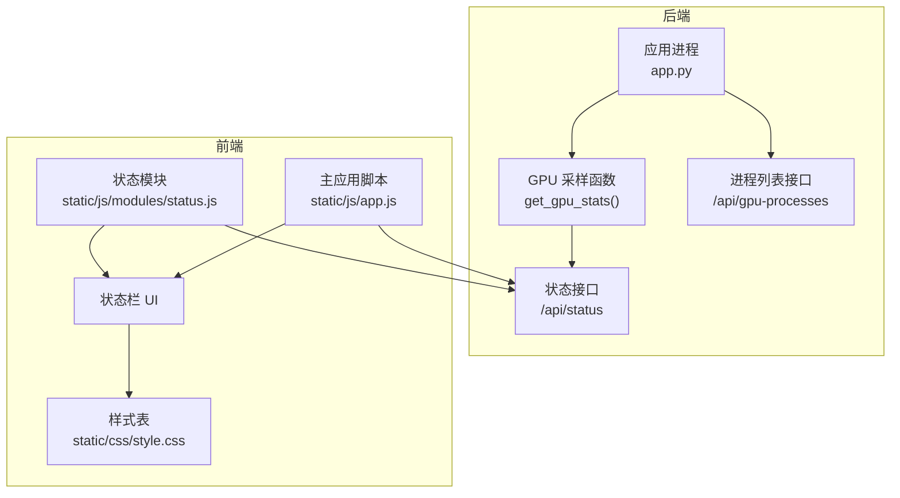
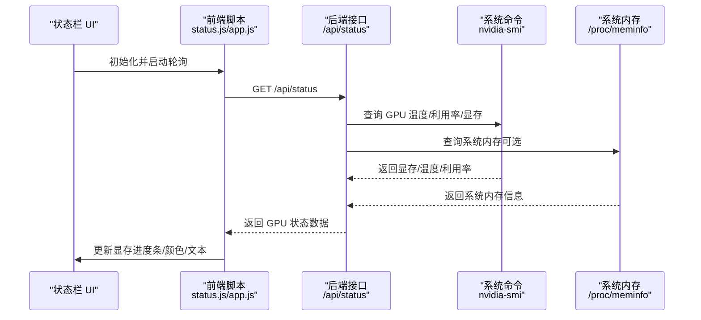
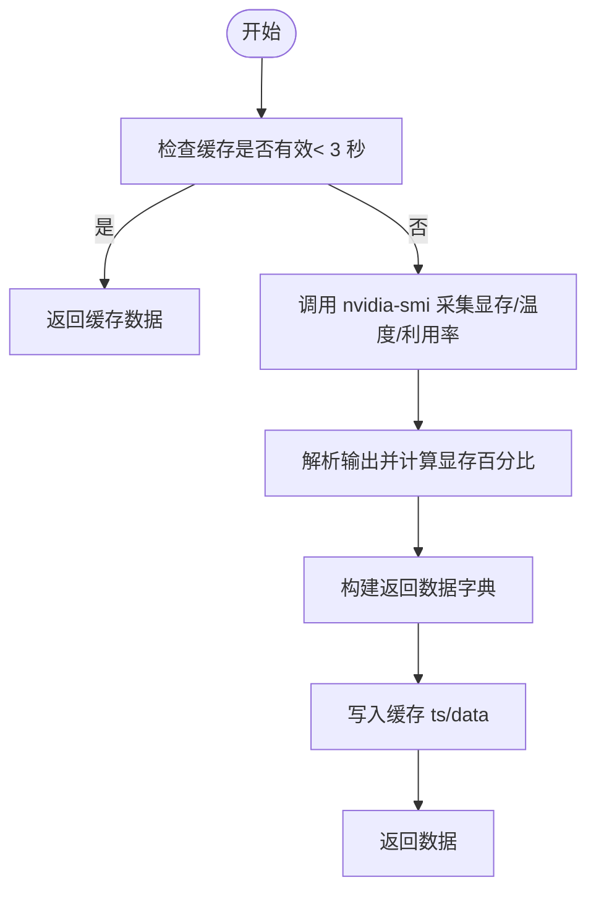
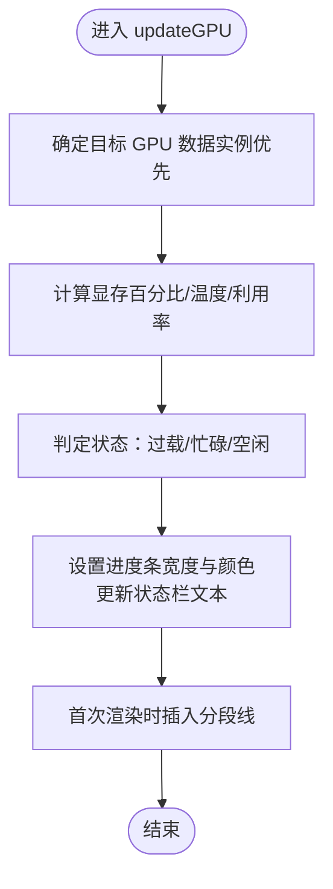
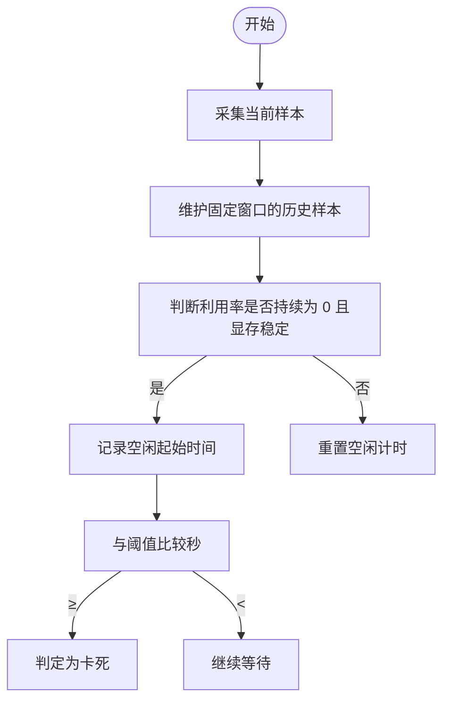
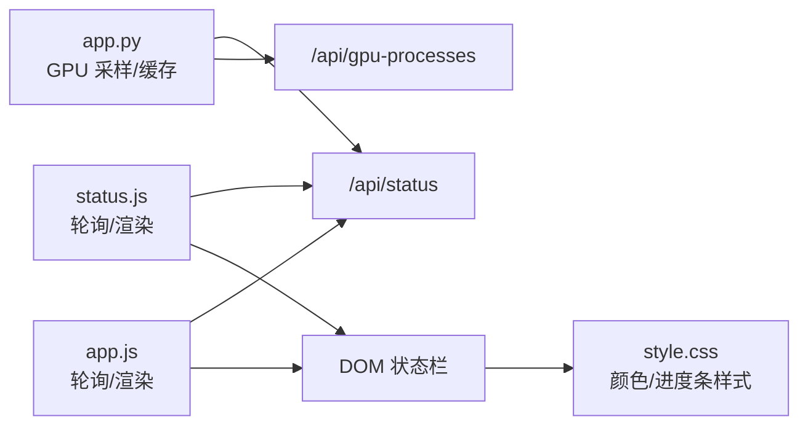

# GPU 监控

<cite>
**本文引用的文件**
- [app.py](file://app.py)
- [status.js](file://static/js/modules/status.js)
- [app.js](file://static/js/app.js)
- [style.css](file://static/css/style.css)
- [test_status_button_runtime.py](file://tests/test_status_button_runtime.py)
- [_gpu_activity_idle_since](file://app.py)
- [test_status_ui.py](file://tests/test_status_ui.py)
</cite>

## 目录
1. [简介](#简介)
2. [项目结构](#项目结构)
3. [核心组件](#核心组件)
4. [架构总览](#架构总览)
5. [详细组件分析](#详细组件分析)
6. [依赖关系分析](#依赖关系分析)
7. [性能考量](#性能考量)
8. [故障排查指南](#故障排查指南)
9. [结论](#结论)

## 简介
本指南面向 Ez ComfyUI Showcase 的 GPU 监控功能，帮助用户正确理解并使用 GPU 状态监控界面的各项指标（显存使用率、显存总量、GPU 利用率、温度、系统内存占比等），掌握实时显存图表与功耗/温度仪表盘的解读方法，并基于监控数据进行性能优化与异常诊断。

## 项目结构
GPU 监控由后端采集与前端展示两部分组成：
- 后端：通过系统命令采集 GPU/显存/温度/利用率等信息，缓存并提供 /api/status 与 /api/gpu 接口。
- 前端：定时轮询接口，更新状态栏显存进度条、数值文本与颜色状态；支持按任务目标实例选择监控对象。

图示来源
- [app.py](file://app.py)
- [status.js](file://static/js/modules/status.js)
- [app.js](file://static/js/app.js)
- [style.css](file://static/css/style.css)

章节来源
- [app.py](file://app.py)
- [status.js](file://static/js/modules/status.js)
- [app.js](file://static/js/app.js)
- [style.css](file://static/css/style.css)

## 核心组件
- GPU 数据采集与缓存
  - 通过系统命令查询显存使用、显存总量、温度、GPU 利用率，计算显存使用百分比，缓存最近一次有效结果，避免频繁调用系统工具。
  - 当无法获取显存总量时，返回空占位数据，前端据此提示“未获取到 VRAM”或“无可用设备”。

- 前端状态栏渲染
  - 轮询 /api/status 获取最新 GPU 数据，更新显存进度条宽度与颜色状态（空闲/忙碌/过载）。
  - 在状态栏显示显存使用量、百分比、温度、GPU 利用率等信息；在移动端适配紧凑显示。
  - 提供“占用 GPU 显存的进程”卡片，列出其他进程显存占用并可终止。

- 进程级显存监控
  - 通过 /api/gpu-processes 获取当前占用 GPU 显存的进程列表，辅助定位显存泄漏或异常占用。

章节来源
- [app.py](file://app.py)
- [status.js](file://static/js/modules/status.js)
- [app.js](file://static/js/app.js)

## 架构总览
后端负责采集与聚合 GPU/系统内存数据，前端负责轮询与可视化呈现。两者通过 /api/status 与 /api/gpu 接口交互；同时提供 /api/gpu-processes 辅助排查。

图示来源
- [app.py](file://app.py)
- [status.js](file://static/js/modules/status.js)
- [app.js](file://static/js/app.js)

## 详细组件分析

### 后端 GPU 采样与缓存
- 采样来源
  - nvidia-smi：显存已用/总量、温度、GPU 利用率。
  - 可选：系统内存统计（用于对比系统内存压力）。
- 缓存策略
  - 最近一次采样结果缓存 3 秒，减少系统调用频率。
  - 对节点级 GPU 数据有独立缓存与过期控制，保证在采样失败时仍可返回“缓存值”以维持界面连续性。
- 输出字段
  - vram_used_mb、vram_total_mb、vram_pct、temp_c、util_pct、memory_source、system_used_mb、system_total_mb。
  - 若显存总量为 0 或无效，则视为“无显存数据”，前端显示相应提示。

图示来源
- [app.py](file://app.py)

章节来源
- [app.py](file://app.py)

### 前端状态栏更新逻辑
- 轮询与更新
  - 定时请求 /api/status，分别更新服务状态与 GPU 状态。
  - 在多实例/任务场景下，优先选择当前活动实例的目标 GPU 数据；若无目标实例则回退到全局 GPU 数据。
- 颜色状态判定
  - 过载：显存使用 ≥ 80% 或温度 ≥ 85°C；或在多实例模式下，利用率 ≥ 95%。
  - 忙碌：不满足过载但显存使用 ≥ 50% 或温度 ≥ 70°C（或利用率 ≥ 70%）。
  - 空闲：其他情况。
- 文本显示
  - 显示显存使用/总量（GB）、百分比、GPU 利用率、温度；移动端紧凑显示。
- 进度条与分段线
  - 进度条宽度对应显存使用百分比；颜色随状态切换。
  - 首次渲染时添加 25%/50%/75% 分段线，便于直观判断区间。

图示来源
- [status.js](file://static/js/modules/status.js)
- [app.js](file://static/js/app.js)
- [style.css](file://static/css/style.css)

章节来源
- [status.js](file://static/js/modules/status.js)
- [app.js](file://static/js/app.js)
- [style.css](file://static/css/style.css)

### 进程级显存监控
- 接口：/api/gpu-processes 返回占用 GPU 显存的进程列表。
- 功能：展示进程名、PID、显存占用（MB），支持一键终止进程，便于快速释放显存。
- 适用场景：发现其他进程长期占用显存导致显存不足，或定位疑似泄漏进程。

章节来源
- [status.js](file://static/js/modules/status.js)
- [app.py](file://app.py)

### GPU 工作状态与“卡死”检测（高级）
- 目的：在生成/下载等阶段，检测 GPU 是否长时间无活动（利用率持续为 0 且显存稳定）。
- 方法：对近期采样窗口内的利用率与显存签名进行比较，计算“空闲起始时间”，超过阈值（如 60 秒）判定为“卡死”。
- 应用：用于作业调度与告警，避免资源长时间闲置。

图示来源
- [app.py](file://app.py)

章节来源
- [app.py](file://app.py)

## 依赖关系分析
- 后端依赖
  - 系统命令：nvidia-smi（查询 GPU/显存/温度/利用率）。
  - 缓存：全局缓存与节点级缓存，控制采样频率与过期策略。
- 前端依赖
  - 接口：/api/status、/api/gpu、/api/gpu-processes。
  - 样式：状态栏颜色与进度条样式由 CSS 控制。
  - 事件：轮询定时器、DOM 更新、移动端自适应。

图示来源
- [app.py](file://app.py)
- [status.js](file://static/js/modules/status.js)
- [app.js](file://static/js/app.js)
- [style.css](file://static/css/style.css)

章节来源
- [app.py](file://app.py)
- [status.js](file://static/js/modules/status.js)
- [app.js](file://static/js/app.js)
- [style.css](file://static/css/style.css)

## 性能考量
- 采样频率
  - 后端缓存 3 秒，避免频繁调用 nvidia-smi；在高并发场景下可降低轮询频率以减轻系统开销。
- 显存使用趋势
  - 结合“占用 GPU 显存的进程”列表，定位长尾进程或泄漏进程；必要时终止进程释放显存。
- 温度与功耗
  - 温度阈值：过载阈值 ≥ 85°C；忙碌阈值 ≥ 70°C。温度过高时应降低并发或缩短单次生成时长。
  - 利用率：在多实例模式下，利用率 ≥ 95% 视为过载；需减少并发或迁移实例。
- 移动端体验
  - 紧凑显示模式下隐藏百分比，仅保留关键指标，确保在小屏上仍可快速判断状态。

章节来源
- [app.py](file://app.py)
- [status.js](file://static/js/modules/status.js)
- [app.js](file://static/js/app.js)

## 故障排查指南
- 无法获取显存数据
  - 现象：状态栏显示“未获取到 VRAM”或“无可用设备”。
  - 处理：确认系统安装并可执行 nvidia-smi；检查驱动与权限；等待下次轮询自动恢复。
- 显存持续高位
  - 现象：显存使用长期接近或超过 80%，颜色变为“忙碌/过载”。
  - 处理：检查是否有其他进程占用显存；查看“占用 GPU 显存的进程”列表，必要时终止异常进程；减小批量大小或模型尺寸。
- 温度过高
  - 现象：温度 ≥ 85°C，状态栏变为“过载”。
  - 处理：降低并发、缩短生成时长、改善机箱风道、暂停非关键任务；待温度回落后再继续。
- 利用率异常
  - 现象：利用率长期 0% 且显存稳定，可能为“卡死”。
  - 处理：检查作业状态与节点健康；重启实例或切换到其他实例；必要时终止卡死任务。
- 测试验证
  - 单元测试覆盖了状态栏文本包含 GPU 利用率与温度、状态颜色判定等行为，可作为功能回归参考。

章节来源
- [app.py](file://app.py)
- [status.js](file://static/js/modules/status.js)
- [app.js](file://static/js/app.js)
- [test_status_button_runtime.py](file://tests/test_status_button_runtime.py)
- [test_status_ui.py](file://tests/test_status_ui.py)

## 结论
Ez ComfyUI Showcase 的 GPU 监控通过“后端采样 + 前端可视化”的方式，提供了直观、实时的显存、温度与利用率信息。结合进程级显存列表与“卡死”检测机制，用户可以快速定位问题、优化工作负载，并在温度/功耗异常时采取保护措施。建议在日常使用中关注以下关键阈值：显存使用 ≥ 80%、温度 ≥ 85°C、利用率 ≥ 95%（多实例），并据此动态调整并发与实例配置。