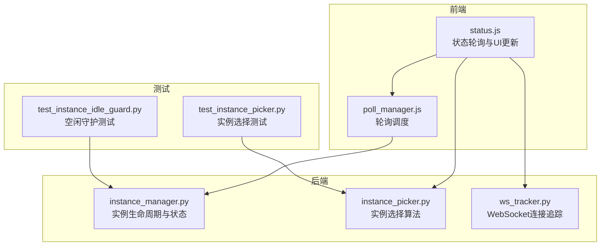
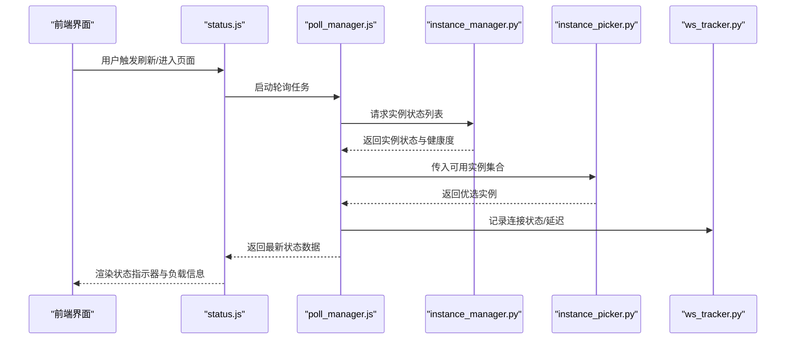
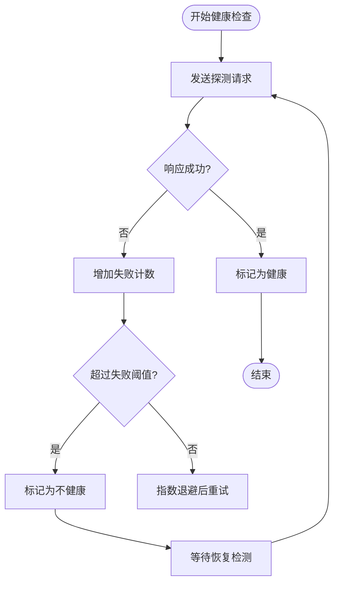
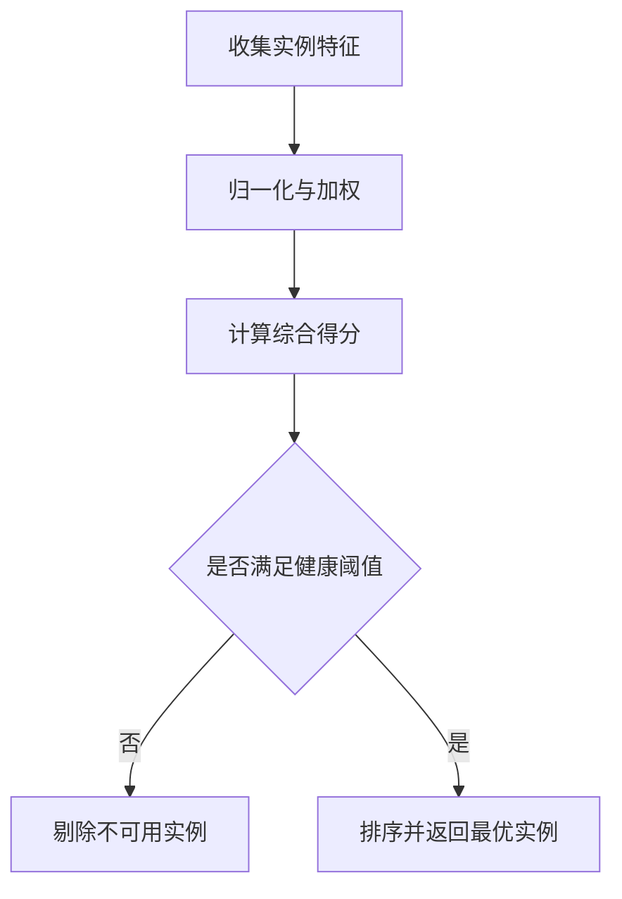
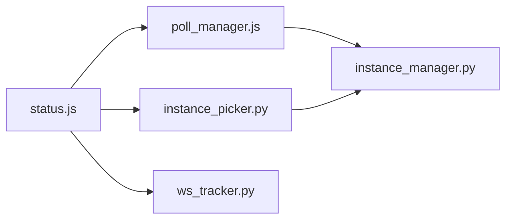

# 实例状态监控

<cite>
**本文引用的文件**
- [modules/instance_manager.py](file://modules/instance_manager.py)
- [modules/instance_picker.py](file://modules/instance_picker.py)
- [static/js/modules/status.js](file://static/js/modules/status.js)
- [static/js/modules/poll_manager.js](file://static/js/modules/poll_manager.js)
- [modules/ws_tracker.py](file://modules/ws_tracker.py)
- [tests/test_instance_picker.py](file://tests/test_instance_picker.py)
- [tests/test_instance_idle_guard.py](file://tests/test_instance_idle_guard.py)
- [README.md](file://README.md)
</cite>

## 目录
1. [简介](#简介)
2. [项目结构](#项目结构)
3. [核心组件](#核心组件)
4. [架构总览](#架构总览)
5. [详细组件分析](#详细组件分析)
6. [依赖关系分析](#依赖关系分析)
7. [性能考量](#性能考量)
8. [故障排查指南](#故障排查指南)
9. [结论](#结论)
10. [附录](#附录)

## 简介
本指南面向 Ez ComfyUI Showcase 的“实例状态监控”能力，围绕以下目标展开：  
- 解释实例状态指示器（在线、离线、忙碌、空闲）的含义与视觉表现  
- 说明健康检查机制（检测周期、失败重试、故障恢复）  
- 介绍连接状态监控（连接异常、网络延迟、响应超时）  
- 解释实例负载监控（当前任务数、队列长度、处理速度）  
- 说明实例选择算法（基于负载、地理、性能等维度的自动选择）  
- 提供异常处理建议（崩溃、网络中断、资源不足）

## 项目结构
本项目采用前后端分离与模块化设计：前端通过 JavaScript 模块负责状态轮询与 UI 更新；后端模块负责实例管理、实例选择与 WebSocket 追踪；测试用例覆盖实例选择与空闲守护等关键行为。

图表来源
- [static/js/modules/status.js](file://static/js/modules/status.js)
- [static/js/modules/poll_manager.js](file://static/js/modules/poll_manager.js)
- [modules/instance_manager.py](file://modules/instance_manager.py)
- [modules/instance_picker.py](file://modules/instance_picker.py)
- [modules/ws_tracker.py](file://modules/ws_tracker.py)
- [tests/test_instance_picker.py](file://tests/test_instance_picker.py)
- [tests/test_instance_idle_guard.py](file://tests/test_instance_idle_guard.py)

章节来源
- [README.md](file://README.md)

## 核心组件
- 实例管理器：维护实例列表、状态变更、健康检查与恢复流程  
- 实例选择器：根据负载、性能、地理等维度进行实例优选  
- 前端状态模块：负责定时轮询、渲染状态指示器、处理连接异常  
- 轮询管理器：统一调度轮询周期、并发控制与错误重试  
- WebSocket 追踪器：记录连接状态、延迟与断线事件  

章节来源
- [modules/instance_manager.py](file://modules/instance_manager.py)
- [modules/instance_picker.py](file://modules/instance_picker.py)
- [static/js/modules/status.js](file://static/js/modules/status.js)
- [static/js/modules/poll_manager.js](file://static/js/modules/poll_manager.js)
- [modules/ws_tracker.py](file://modules/ws_tracker.py)

## 架构总览
下图展示从前端到后端的关键交互路径，以及状态更新与选择逻辑：

图表来源
- [static/js/modules/status.js](file://static/js/modules/status.js)
- [static/js/modules/poll_manager.js](file://static/js/modules/poll_manager.js)
- [modules/instance_manager.py](file://modules/instance_manager.py)
- [modules/instance_picker.py](file://modules/instance_picker.py)
- [modules/ws_tracker.py](file://modules/ws_tracker.py)

## 详细组件分析

### 实例状态指示器与判断标准
- 在线：实例可正常接收请求，健康检查通过，WebSocket 可建立且无明显延迟  
- 离线：实例不可达或健康检查连续失败，WebSocket 无法建立或频繁断开  
- 忙碌：实例当前任务数超过阈值或队列长度过长，处理速度下降  
- 空闲：实例当前任务数与队列长度均处于低位，响应时间稳定  

前端通过状态模块对实例状态进行可视化呈现，并结合实例选择器的权重计算，动态调整实例优先级。

章节来源
- [static/js/modules/status.js](file://static/js/modules/status.js)
- [modules/instance_manager.py](file://modules/instance_manager.py)
- [modules/instance_picker.py](file://modules/instance_picker.py)

### 健康检查机制
- 自动检测间隔：由轮询管理器统一配置，定期向实例发起轻量探测请求  
- 失败重试策略：连续失败达到阈值后标记为不健康，停止分配新任务  
- 故障恢复流程：实例在不健康后持续自检，恢复至健康阈值后重新纳入可用池  

图表来源
- [static/js/modules/poll_manager.js](file://static/js/modules/poll_manager.js)
- [modules/instance_manager.py](file://modules/instance_manager.py)

章节来源
- [static/js/modules/poll_manager.js](file://static/js/modules/poll_manager.js)
- [modules/instance_manager.py](file://modules/instance_manager.py)

### 连接状态监控
- 连接异常：WebSocket 建立失败、认证失败、协议不匹配  
- 网络延迟：Ping 延迟持续高于阈值，或 RTT 波动较大  
- 响应超时：探测或业务请求在限定时间内未返回  

前端通过 WebSocket 追踪器记录连接事件与延迟，并在状态模块中进行可视化提示与告警。

章节来源
- [modules/ws_tracker.py](file://modules/ws_tracker.py)
- [static/js/modules/status.js](file://static/js/modules/status.js)

### 实例负载监控
- 当前任务数：实例正在执行的任务数量，用于判断忙碌程度  
- 队列长度：等待执行的任务数量，反映积压情况  
- 处理速度：单位时间内完成的任务数，用于评估吞吐能力  

前端将上述指标以数值与趋势图形式展示，辅助用户直观感知实例负载。

章节来源
- [modules/instance_manager.py](file://modules/instance_manager.py)
- [static/js/modules/status.js](file://static/js/modules/status.js)

### 实例选择算法
- 输入：实例集合（含健康度、负载、延迟、地理位置等特征）  
- 权重：根据负载、延迟、健康度、地理距离等维度计算综合得分  
- 输出：返回得分最高的实例作为候选  

图表来源
- [modules/instance_picker.py](file://modules/instance_picker.py)
- [modules/instance_manager.py](file://modules/instance_manager.py)

章节来源
- [modules/instance_picker.py](file://modules/instance_picker.py)
- [tests/test_instance_picker.py](file://tests/test_instance_picker.py)

### 异常处理指南
- 实例崩溃：健康检查持续失败，自动降级并停止分配任务；待实例重启后恢复  
- 网络中断：WebSocket 断连与延迟异常，前端提示并重试；必要时切换到备用实例  
- 资源不足：实例处理速度骤降或队列堆积，前端显示警告；后端减少分配或扩容  

章节来源
- [modules/instance_manager.py](file://modules/instance_manager.py)
- [modules/ws_tracker.py](file://modules/ws_tracker.py)
- [static/js/modules/status.js](file://static/js/modules/status.js)
- [tests/test_instance_idle_guard.py](file://tests/test_instance_idle_guard.py)

## 依赖关系分析
- 前端状态模块依赖轮询管理器进行周期性拉取  
- 轮询管理器依赖实例管理器获取状态与健康度  
- 实例选择器依赖实例管理器提供的实例特征  
- WebSocket 追踪器为状态模块与轮询管理器提供连接质量数据

图表来源
- [static/js/modules/status.js](file://static/js/modules/status.js)
- [static/js/modules/poll_manager.js](file://static/js/modules/poll_manager.js)
- [modules/instance_manager.py](file://modules/instance_manager.py)
- [modules/instance_picker.py](file://modules/instance_picker.py)
- [modules/ws_tracker.py](file://modules/ws_tracker.py)

章节来源
- [static/js/modules/status.js](file://static/js/modules/status.js)
- [static/js/modules/poll_manager.js](file://static/js/modules/poll_manager.js)
- [modules/instance_manager.py](file://modules/instance_manager.py)
- [modules/instance_picker.py](file://modules/instance_picker.py)
- [modules/ws_tracker.py](file://modules/ws_tracker.py)

## 性能考量
- 轮询频率与并发：避免过于频繁导致实例压力过大，建议按实例数量动态调节  
- 健康检查成本：探测请求应尽量轻量化，避免影响实例真实负载  
- 缓存与去抖：对高频状态变化进行去抖与本地缓存，减少不必要的 UI 刷新  
- 地理位置就近：优先选择延迟低的实例，提升用户体验  

## 故障排查指南
- 状态长时间不变：检查轮询是否仍在运行、实例是否被标记为不健康  
- 连接频繁断开：查看 WebSocket 追踪日志，确认网络波动或服务端异常  
- 选择结果异常：核对实例特征与权重配置，确保健康阈值与评分规则合理  
- 负载过高：观察队列长度与处理速度，考虑扩容或优化工作流  

章节来源
- [modules/ws_tracker.py](file://modules/ws_tracker.py)
- [modules/instance_manager.py](file://modules/instance_manager.py)
- [static/js/modules/status.js](file://static/js/modules/status.js)
- [tests/test_instance_picker.py](file://tests/test_instance_picker.py)
- [tests/test_instance_idle_guard.py](file://tests/test_instance_idle_guard.py)

## 结论
通过前端状态模块、轮询管理器、实例管理器、实例选择器与 WebSocket 追踪器的协同，系统实现了对 ComfyUI 实例的全链路状态监控与智能选择。用户可通过状态指示器与负载信息快速判断实例健康状况，并在异常发生时依据本指南进行定位与处置。

## 附录
- 关键文件索引：  
  - 实例管理：[modules/instance_manager.py](file://modules/instance_manager.py)  
  - 实例选择：[modules/instance_picker.py](file://modules/instance_picker.py)  
  - 前端状态：[static/js/modules/status.js](file://static/js/modules/status.js)  
  - 轮询调度：[static/js/modules/poll_manager.js](file://static/js/modules/poll_manager.js)  
  - WebSocket 追踪：[modules/ws_tracker.py](file://modules/ws_tracker.py)  
  - 测试用例：  
    - [tests/test_instance_picker.py](file://tests/test_instance_picker.py)  
    - [tests/test_instance_idle_guard.py](file://tests/test_instance_idle_guard.py)