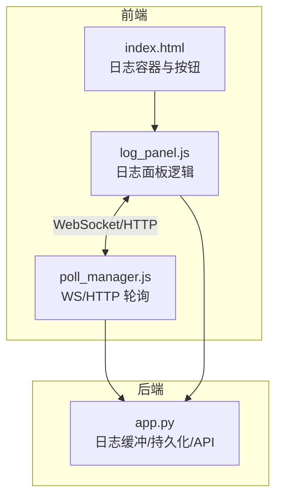
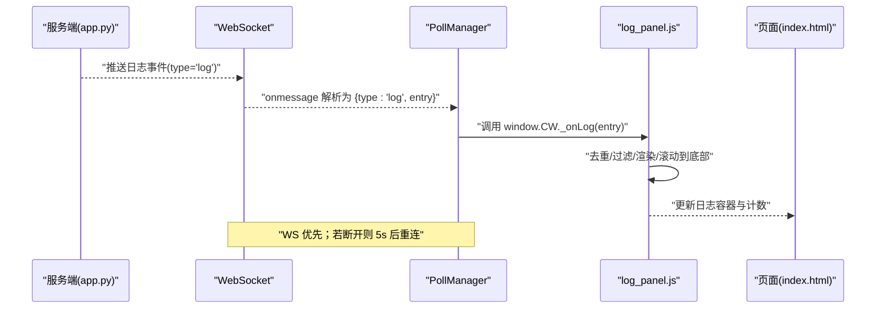
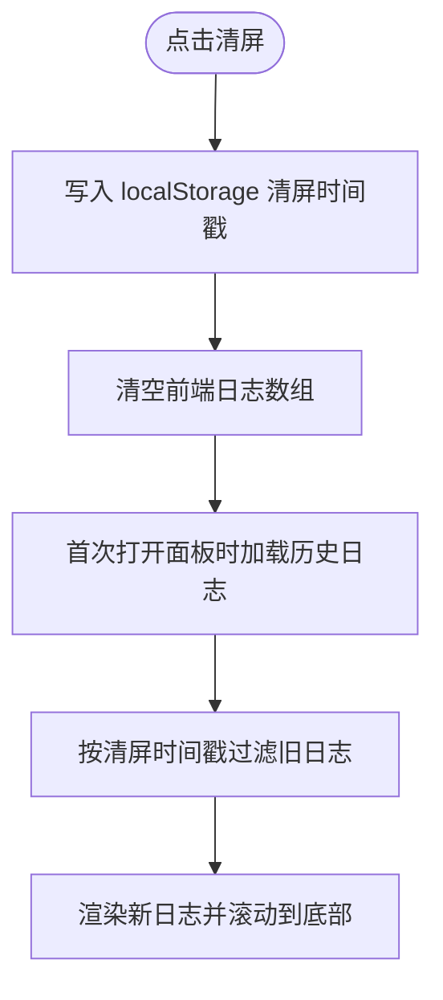
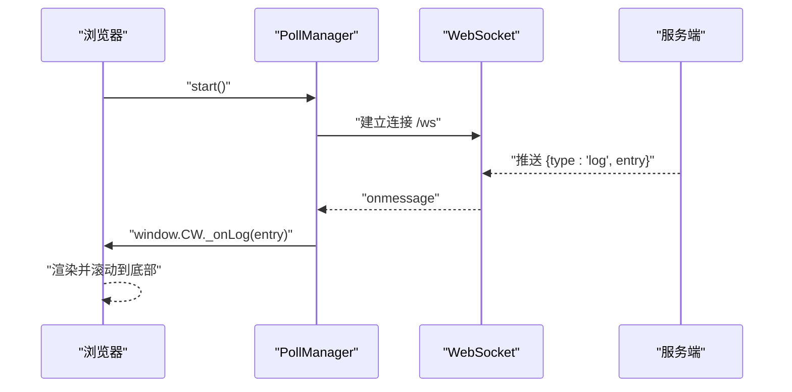
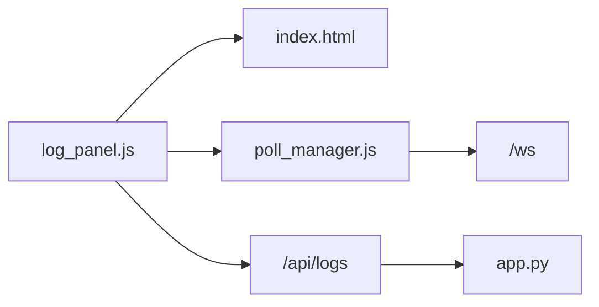

# 日志系统

<cite>
**本文引用的文件**
- [static/js/modules/log_panel.js](file://static/js/modules/log_panel.js)
- [static/js/modules/poll_manager.js](file://static/js/modules/poll_manager.js)
- [tests/test_log_panel_ui.py](file://tests/test_log_panel_ui.py)
- [tests/test_logs_api.py](file://tests/test_logs_api.py)
- [static/index.html](file://static/index.html)
- [app.py](file://app.py)
</cite>

## 目录
1. [简介](#简介)
2. [项目结构](#项目结构)
3. [核心组件](#核心组件)
4. [架构总览](#架构总览)
5. [详细组件分析](#详细组件分析)
6. [依赖关系分析](#依赖关系分析)
7. [性能考量](#性能考量)
8. [故障排查指南](#故障排查指南)
9. [结论](#结论)
10. [附录](#附录)

## 简介
本指南面向 Ez ComfyUI Showcase 的日志系统，帮助用户高效使用日志面板，理解日志级别与过滤机制，掌握实时更新与历史查看方式，并提供日志分析技巧、导出与清理策略建议。文档以仓库中的前端模块、测试用例与后端实现为依据，确保内容可追溯、可验证。

## 项目结构
日志系统涉及以下关键文件与职责：
- 前端日志面板模块：负责日志面板的显示、分组、过滤、拖拽与本地清理。
- 轮询与推送模块：负责 WebSocket 推送与 HTTP 轮询，统一数据来源。
- 测试用例：验证日志面板 UI 行为与 API 行为。
- 页面模板：定义日志容器与按钮等 DOM 结构。
- 后端应用：维护日志缓冲区、持久化与 API 输出。

图表来源
- [static/js/modules/log_panel.js:1-416](file://static/js/modules/log_panel.js#L1-L416)
- [static/js/modules/poll_manager.js:161-218](file://static/js/modules/poll_manager.js#L161-L218)
- [static/index.html:475](file://static/index.html#L475)
- [app.py:116-284](file://app.py#L116-L284)

章节来源
- [static/js/modules/log_panel.js:1-416](file://static/js/modules/log_panel.js#L1-L416)
- [static/js/modules/poll_manager.js:161-218](file://static/js/modules/poll_manager.js#L161-L218)
- [static/index.html:475](file://static/index.html#L475)
- [app.py:116-284](file://app.py#L116-L284)

## 核心组件
- 日志面板模块（log_panel.js）
  - 面板状态切换：浮动、停靠、移动端停靠、隐藏。
  - 日志渲染：按时间顺序追加，支持百分比进度高亮、阶段分类、消息分类。
  - 分组展示：按 job_id 自动分组，支持展开/折叠。
  - 过滤与去重：按级别过滤、按唯一键去重、滚动至底部。
  - 清理与持久化：基于 localStorage 的“清屏后只保留新日志”策略。
  - 拖拽与响应式：面板拖拽、移动设备自动停靠/浮动切换。
- 轮询与推送模块（poll_manager.js）
  - WebSocket 主通道：接收服务端推送的 log 类型事件，触发前端渲染。
  - HTTP 轮询兜底：在 WS 不可用时每 3 秒拉取一次作业状态（用于其他业务），日志推送仍以 WS 为主。
  - 心跳与重连：30 秒心跳，断线自动重连。
- 页面模板（index.html）
  - 提供日志容器与控制按钮的 DOM 结构，面板通过 JS 动态挂载与渲染。
- 后端应用（app.py）
  - 维护内存日志缓冲区，限制最大长度并裁剪过期条目。
  - 将日志写入文件，启动时从文件加载最近日志。
  - 提供 /api/logs 接口，按用户可见性返回日志列表。
  - 对特定阶段进行本地化处理，过滤非关键噪声日志。

章节来源
- [static/js/modules/log_panel.js:46-77](file://static/js/modules/log_panel.js#L46-L77)
- [static/js/modules/log_panel.js:128-151](file://static/js/modules/log_panel.js#L128-L151)
- [static/js/modules/log_panel.js:184-240](file://static/js/modules/log_panel.js#L184-L240)
- [static/js/modules/log_panel.js:327-364](file://static/js/modules/log_panel.js#L327-L364)
- [static/js/modules/poll_manager.js:161-218](file://static/js/modules/poll_manager.js#L161-L218)
- [static/index.html:475](file://static/index.html#L475)
- [app.py:116-284](file://app.py#L116-L284)

## 架构总览
日志系统采用“WebSocket 推送 + HTTP 轮询兜底”的双通道设计，前端通过 log_panel.js 渲染日志，后端通过 app.py 维护日志缓冲与持久化。

图表来源
- [static/js/modules/poll_manager.js:187-198](file://static/js/modules/poll_manager.js#L187-L198)
- [static/js/modules/log_panel.js:327-341](file://static/js/modules/log_panel.js#L327-L341)
- [static/index.html:475](file://static/index.html#L475)

## 详细组件分析

### 日志面板（log_panel.js）
- 打开/关闭与停靠
  - 切换面板状态：隐藏、停靠右侧、移动端停靠、浮动。
  - 首次打开时触发加载历史日志。
- 日志显示与滚动
  - 每条日志包含时间、级别、阶段、消息与详情。
  - 自动滚动到最新日志，保持可视区域始终可见。
- 日志分组与展开
  - 按 job_id 聚合，当出现“完成”类日志时，整组作为可折叠单元展示。
- 过滤与去重
  - 支持按日志级别过滤（下拉选择）。
  - 基于唯一键去重，避免重复渲染。
- 清理与本地存储
  - 清屏后设置“仅保留此后日志”的时间戳，刷新或重新加载时生效。
  - 清屏操作不删除服务器日志文件，仅影响前端显示。
- 拖拽与响应式
  - 非停靠状态下支持拖拽移动面板位置。
  - 移动端宽度小于阈值时自动切换为移动端停靠/浮动。

图表来源
- [static/js/modules/log_panel.js:357-364](file://static/js/modules/log_panel.js#L357-L364)
- [static/js/modules/log_panel.js:46-77](file://static/js/modules/log_panel.js#L46-L77)
- [tests/test_log_panel_ui.py:8-134](file://tests/test_log_panel_ui.py#L8-L134)

章节来源
- [static/js/modules/log_panel.js:242-296](file://static/js/modules/log_panel.js#L242-L296)
- [static/js/modules/log_panel.js:128-151](file://static/js/modules/log_panel.js#L128-L151)
- [static/js/modules/log_panel.js:184-240](file://static/js/modules/log_panel.js#L184-L240)
- [static/js/modules/log_panel.js:327-364](file://static/js/modules/log_panel.js#L327-L364)
- [tests/test_log_panel_ui.py:8-134](file://tests/test_log_panel_ui.py#L8-L134)

### 实时日志更新机制（WebSocket 推送）
- WebSocket 主通道
  - 前端连接到 /ws，接收类型为 log 的事件，解析为单条日志 entry。
  - 收到后直接调用 window.CW._onLog，走统一渲染流程。
- HTTP 轮询兜底
  - WS 不可用时每 3 秒轮询一次作业状态（用于其他业务），日志推送仍以 WS 为主。
- 心跳与重连
  - 每 30 秒发送 ping，断线后 5 秒自动重连。

图表来源
- [static/js/modules/poll_manager.js:161-218](file://static/js/modules/poll_manager.js#L161-L218)
- [static/js/modules/log_panel.js:327-341](file://static/js/modules/log_panel.js#L327-L341)

章节来源
- [static/js/modules/poll_manager.js:161-218](file://static/js/modules/poll_manager.js#L161-L218)
- [static/js/modules/log_panel.js:327-341](file://static/js/modules/log_panel.js#L327-L341)

### 日志级别与含义
- 级别字段：前端渲染时根据级别动态添加样式，区分普通信息与其他级别。
- 阶段字段：如“节点”“采样”“步进”“开始”“完成”等，用于标识工作流阶段。
- 消息分类：对包含“采样”“VAE”等关键词的消息进行分类高亮，便于快速识别。
- 本地化与过滤：后端对特定阶段消息进行本地化处理，同时过滤掉非关键噪声日志（例如缩略图生成失败等）。

章节来源
- [static/js/modules/log_panel.js:134-144](file://static/js/modules/log_panel.js#L134-L144)
- [tests/test_logs_api.py:55-64](file://tests/test_logs_api.py#L55-L64)
- [tests/test_logs_api.py:86-121](file://tests/test_logs_api.py#L86-L121)

### 日志过滤功能
- 时间范围：通过“清屏后只保留新日志”的策略实现“时间范围”过滤效果（localStorage 存储清屏时间戳）。
- 日志级别：通过下拉选择框按级别过滤，仅渲染匹配级别的日志。
- 关键词：前端对消息进行分类高亮，辅助快速定位（如采样进度、VAE 相关）。

章节来源
- [static/js/modules/log_panel.js:348-355](file://static/js/modules/log_panel.js#L348-L355)
- [static/js/modules/log_panel.js:357-364](file://static/js/modules/log_panel.js#L357-L364)

### 历史日志加载与滚动
- 首次打开面板时，通过 /api/logs 获取历史日志并渲染。
- 每条新增日志自动滚动到底部，保证用户始终看到最新日志。
- 分组模式下，完成的整组会折叠展示，减少视觉噪音。

章节来源
- [static/js/modules/log_panel.js:46-77](file://static/js/modules/log_panel.js#L46-L77)
- [static/js/modules/log_panel.js:327-341](file://static/js/modules/log_panel.js#L327-L341)

### 日志导出与保存
- 前端当前实现
  - 日志面板未提供直接导出按钮或下载功能。
  - 可通过浏览器开发者工具复制日志内容，或截图保存。
- 后端持久化
  - 日志写入文件，启动时从文件加载最近日志，具备一定“持久化”能力。
  - 建议结合后端日志文件进行归档与备份。

章节来源
- [app.py:158-162](file://app.py#L158-L162)
- [app.py:210-211](file://app.py#L210-L211)

### 日志清理与轮转策略
- 前端清理
  - 清屏后仅保留此后日志，localStorage 存储清屏时间戳，刷新/重新打开面板生效。
- 后端清理
  - 内存缓冲区限制最大长度，超过阈值时丢弃最早日志。
  - 文件层面定期归档与轮转（建议）：结合系统日志轮转工具进行周期性压缩与清理。

章节来源
- [static/js/modules/log_panel.js:357-364](file://static/js/modules/log_panel.js#L357-L364)
- [app.py:150-155](file://app.py#L150-L155)

## 依赖关系分析
- log_panel.js 依赖
  - DOM 结构：日志容器、计数器、过滤器、停靠/关闭按钮。
  - 用户认证：从 window.CW.auth 获取当前用户，用于 localStorage 键命名。
  - 轮询模块：通过 WS 推送接收日志事件。
- poll_manager.js 依赖
  - WebSocket 目标地址：根据 API 基础或当前路径推导 /ws。
  - 事件回调：将 log 类型事件转发给 window.CW._onLog。
- app.py 依赖
  - 日志缓冲区与文件持久化，提供 /api/logs 接口。
  - 用户可见性：仅返回当前用户可访问的任务日志。

图表来源
- [static/js/modules/log_panel.js:46-77](file://static/js/modules/log_panel.js#L46-L77)
- [static/js/modules/poll_manager.js:166-174](file://static/js/modules/poll_manager.js#L166-L174)
- [app.py:1992-2000](file://app.py#L1992-L2000)

章节来源
- [static/js/modules/log_panel.js:46-77](file://static/js/modules/log_panel.js#L46-L77)
- [static/js/modules/poll_manager.js:166-174](file://static/js/modules/poll_manager.js#L166-L174)
- [app.py:1992-2000](file://app.py#L1992-L2000)

## 性能考量
- 渲染优化
  - 采用最小化 DOM 更新策略：先构建渲染项列表，再复用/插入/移除元素，避免全量重绘。
  - 百分比进度与阶段高亮仅在命中关键词时添加，降低额外计算。
- 数据量控制
  - 前端：清屏后仅保留新日志，减少 DOM 节点数量。
  - 后端：内存缓冲区裁剪，避免无限增长。
- 网络与资源
  - WS 优先，HTTP 轮询仅用于兜底，降低不必要的请求。
  - 心跳与断线重连策略平衡稳定性与资源消耗。

章节来源
- [static/js/modules/log_panel.js:184-240](file://static/js/modules/log_panel.js#L184-L240)
- [static/js/modules/log_panel.js:357-364](file://static/js/modules/log_panel.js#L357-L364)
- [app.py:150-155](file://app.py#L150-L155)

## 故障排查指南
- 日志不显示或为空
  - 检查面板是否处于隐藏状态，尝试切换为浮动或停靠。
  - 首次打开面板会触发历史日志加载，确认网络请求成功。
- 日志被清屏后消失
  - 清屏后仅保留此后日志，刷新/重新打开面板后生效。
  - localStorage 中存在清屏时间戳，属于预期行为。
- WS 断开导致日志不更新
  - 查看浏览器控制台与日志面板状态，等待自动重连。
  - 若长时间无更新，检查网络与服务端 /ws 可达性。
- 过滤无效
  - 确认已选择正确的日志级别过滤项。
  - 分组模式下，仅对可见条目应用过滤。

章节来源
- [static/js/modules/log_panel.js:242-296](file://static/js/modules/log_panel.js#L242-L296)
- [static/js/modules/log_panel.js:348-355](file://static/js/modules/log_panel.js#L348-L355)
- [static/js/modules/poll_manager.js:200-209](file://static/js/modules/poll_manager.js#L200-L209)
- [tests/test_log_panel_ui.py:8-134](file://tests/test_log_panel_ui.py#L8-L134)

## 结论
Ez ComfyUI Showcase 的日志系统以 WebSocket 为核心，辅以 HTTP 轮询兜底，配合前端高效的渲染与过滤机制，实现了低延迟、易用的日志查看体验。通过清屏时间戳、分组折叠与阶段/进度高亮，用户可以快速聚焦关键信息。建议结合后端日志文件进行归档与轮转，进一步完善长期运维与审计需求。

## 附录

### 使用步骤速览
- 打开/关闭日志面板：点击工具栏按钮或快捷切换。
- 停靠/浮动：右上角按钮切换面板位置，移动端自动适配。
- 调整显示区域大小：拖拽面板标题栏（非停靠状态）。
- 滚动查看历史：面板自动滚动到底部，也可手动滚动。
- 按级别过滤：选择下拉框中的日志级别。
- 清屏与时间范围：清屏后仅显示此后日志，刷新/重新打开面板生效。
- 导出与保存：当前版本未提供一键导出，可通过浏览器开发者工具复制或截图保存。
- 日志清理与轮转：前端通过清屏时间戳清理，后端通过缓冲区裁剪；建议结合系统工具进行文件级轮转与归档。

章节来源
- [static/js/modules/log_panel.js:242-296](file://static/js/modules/log_panel.js#L242-L296)
- [static/js/modules/log_panel.js:348-355](file://static/js/modules/log_panel.js#L348-L355)
- [static/js/modules/log_panel.js:357-364](file://static/js/modules/log_panel.js#L357-L364)
- [app.py:150-155](file://app.py#L150-L155)