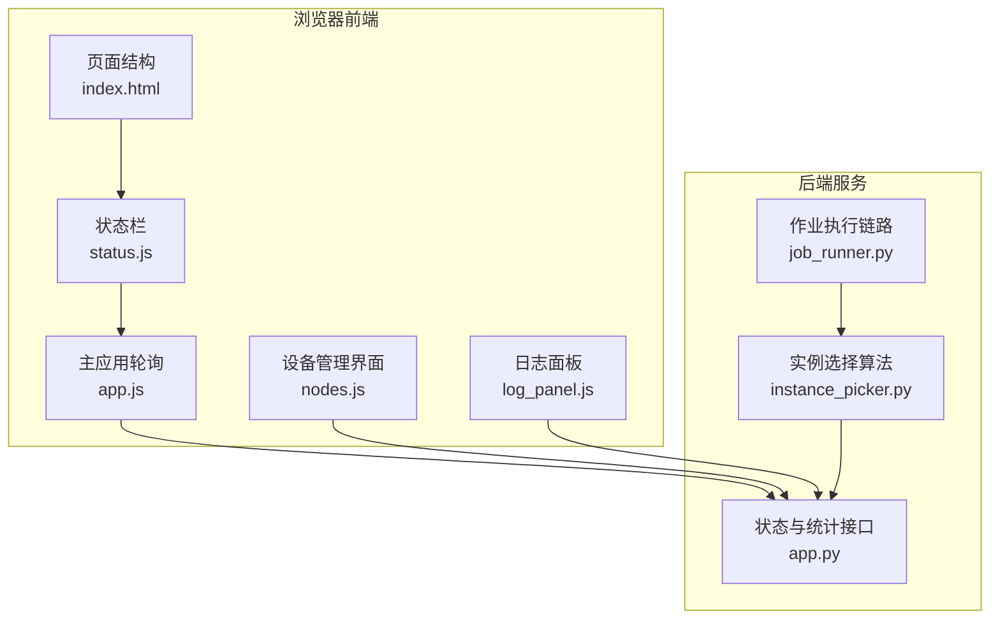
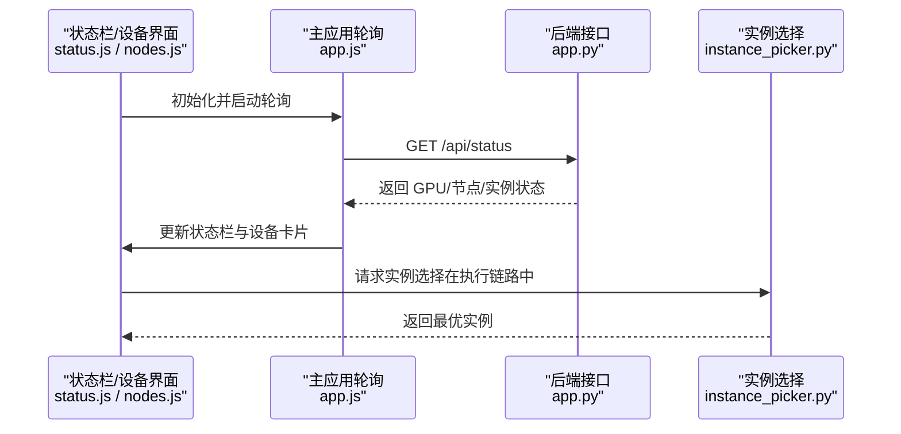
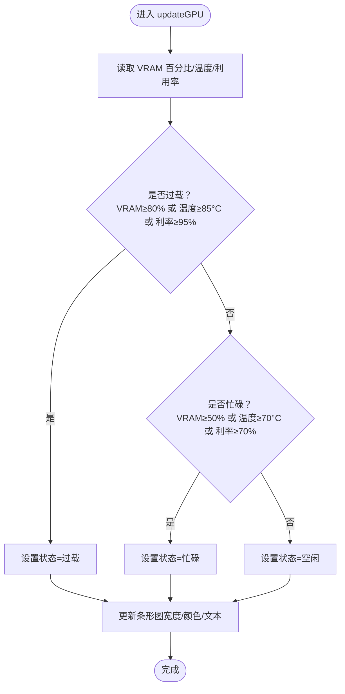
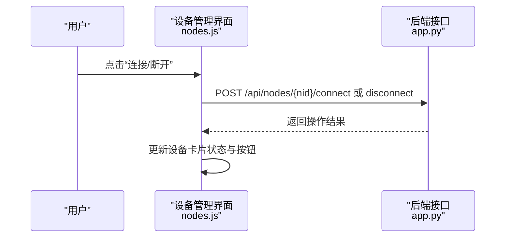
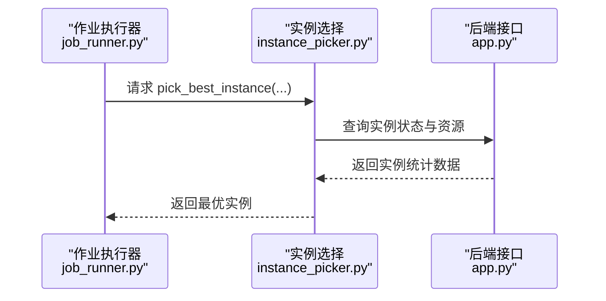
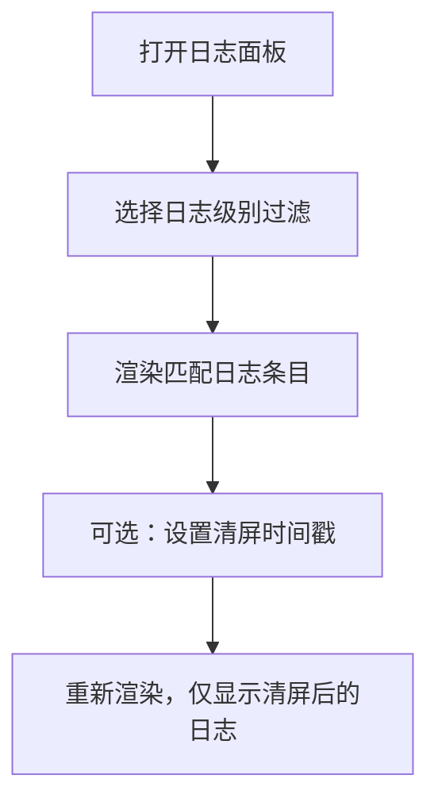
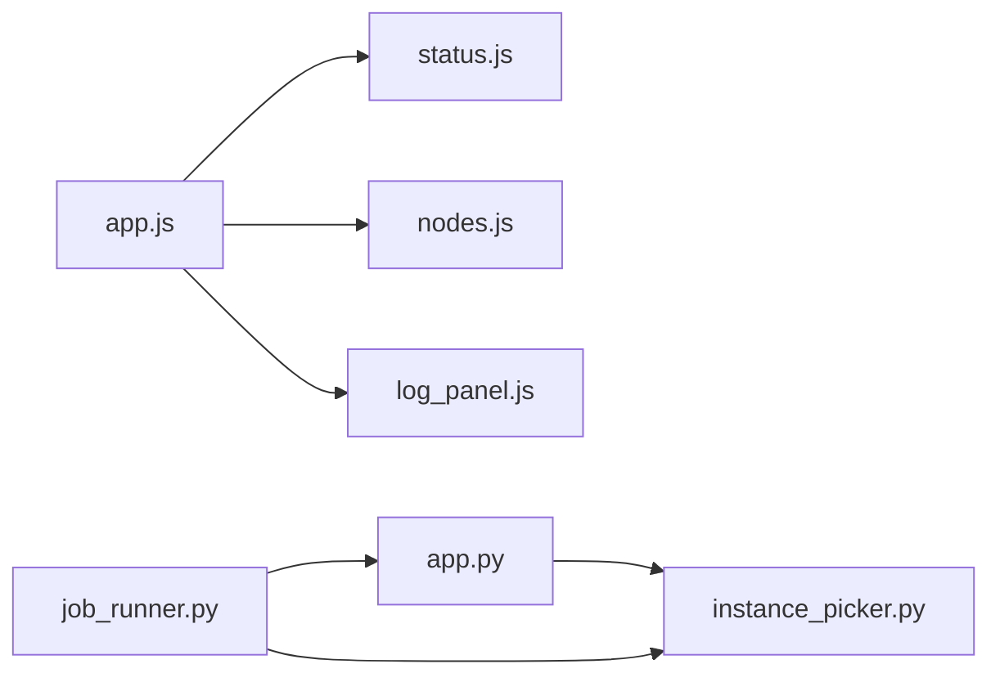

# 设备监控与状态

<cite>
**本文引用的文件**
- [app.py](file://app.py)
- [index.html](file://static/index.html)
- [style.css](file://static/css/style.css)
- [status.js](file://static/js/modules/status.js)
- [nodes.js](file://static/js/modules/nodes.js)
- [app.js](file://static/js/app.js)
- [log_panel.js](file://static/js/modules/log_panel.js)
- [instance_picker.py](file://modules/instance_picker.py)
- [job_runner.py](file://modules/job_runner.py)
- [test_status_button_runtime.py](file://tests/test_status_button_runtime.py)
- [test_status_gpu_message.py](file://tests/test_status_gpu_message.py)
- [test_log_panel_ui.py](file://tests/test_log_panel_ui.py)
</cite>

## 目录
1. [简介](#简介)
2. [项目结构](#项目结构)
3. [核心组件](#核心组件)
4. [架构总览](#架构总览)
5. [详细组件分析](#详细组件分析)
6. [依赖关系分析](#依赖关系分析)
7. [性能考量](#性能考量)
8. [故障排查指南](#故障排查指南)
9. [结论](#结论)
10. [附录](#附录)

## 简介
本指南面向 Ez ComfyUI Showcase 的设备监控与状态管理功能，帮助用户理解并高效使用以下能力：
- 状态栏指标：VRAM 显存使用率、GPU 温度、利用率等关键指标的含义与状态判定逻辑
- GPU 监控界面：实时显存图表、功耗仪表盘、温度读数的解读技巧
- ComfyUI 实例状态监控：服务状态指示、连接状态、健康检查
- 设备管理界面：添加、编辑、删除设备，设备间切换与选择
- 实例选择算法：系统如何自动选择最优 ComfyUI 实例进行任务执行
- 日志系统：查看系统日志、过滤日志级别、定位问题
- 异常处理：实例离线、资源不足等紧急情况的应对策略

## 项目结构
该功能由前端模块与后端服务协同实现：
- 前端负责状态栏渲染、GPU 图表与仪表盘展示、设备管理界面交互、日志面板与过滤
- 后端负责采集 GPU 统计数据、聚合节点与实例状态、提供实例选择算法接口

图示来源
- [status.js:389-427](file://static/js/modules/status.js#L389-L427)
- [app.js:151-221](file://static/js/app.js#L151-L221)
- [nodes.js:562-604](file://static/js/modules/nodes.js#L562-L604)
- [log_panel.js:1-248](file://static/js/modules/log_panel.js#L1-L248)
- [index.html:582-597](file://static/index.html#L582-L597)
- [app.py:532-3495](file://app.py#L532-L3495)
- [instance_picker.py:1-200](file://modules/instance_picker.py#L1-L200)
- [job_runner.py:1-50](file://modules/job_runner.py#L1-L50)

章节来源
- [index.html:582-597](file://static/index.html#L582-L597)
- [app.js:151-221](file://static/js/app.js#L151-L221)
- [status.js:389-427](file://static/js/modules/status.js#L389-L427)
- [nodes.js:562-604](file://static/js/modules/nodes.js#L562-L604)
- [log_panel.js:1-248](file://static/js/modules/log_panel.js#L1-L248)
- [app.py:532-3495](file://app.py#L532-L3495)
- [instance_picker.py:1-200](file://modules/instance_picker.py#L1-L200)
- [job_runner.py:1-50](file://modules/job_runner.py#L1-L50)

## 核心组件
- 状态栏与 GPU 监控
  - 状态栏通过数值与颜色状态反映设备压力：空闲、忙碌、过载
  - 指标包括：VRAM 使用百分比、温度、GPU 利用率
- 设备管理界面
  - 支持添加/编辑/删除设备，切换连接状态，查看实例列表与队列
- 日志系统
  - 提供日志面板、日志级别过滤、按时间清屏等能力
- 实例选择算法
  - 在作业执行链路中，依据实例状态与资源使用进行优选

章节来源
- [app.js:151-221](file://static/js/app.js#L151-L221)
- [status.js:389-427](file://static/js/modules/status.js#L389-L427)
- [nodes.js:96-604](file://static/js/modules/nodes.js#L96-L604)
- [log_panel.js:1-248](file://static/js/modules/log_panel.js#L1-L248)
- [instance_picker.py:1-200](file://modules/instance_picker.py#L1-L200)
- [job_runner.py:1-50](file://modules/job_runner.py#L1-L50)

## 架构总览
前端通过轮询接口获取后端状态，后端聚合 GPU 数据与节点实例信息，前端据此更新状态栏与设备卡片。

图示来源
- [app.js:151-221](file://static/js/app.js#L151-L221)
- [status.js:389-427](file://static/js/modules/status.js#L389-L427)
- [nodes.js:562-604](file://static/js/modules/nodes.js#L562-L604)
- [app.py:532-3495](file://app.py#L532-L3495)
- [instance_picker.py:1-200](file://modules/instance_picker.py#L1-L200)

## 详细组件分析

### 状态栏与 GPU 监控
- 指标含义
  - VRAM 使用率：显存占用百分比，用于判断显存压力
  - GPU 温度：设备温度，过高可能触发降频或保护
  - GPU 利用率：计算单元使用率，高利用率通常表示繁忙
- 状态判定
  - 过载：VRAM ≥ 80% 或温度 ≥ 85°C 或利用率 ≥ 95%
  - 忙碌：非过载下，VRAM ≥ 50% 或温度 ≥ 70°C 或利用率 ≥ 70%
  - 空闲：其他情况
- 界面呈现
  - 状态栏条形图宽度对应 VRAM 百分比
  - 状态栏背景色随状态变化（空闲/忙碌/过载）
  - 文本显示：显存用量与总量、显存百分比、GPU 利用率、温度

图示来源
- [app.js:187-221](file://static/js/app.js#L187-L221)
- [status.js:389-427](file://static/js/modules/status.js#L389-L427)

章节来源
- [app.js:187-221](file://static/js/app.js#L187-L221)
- [status.js:389-427](file://static/js/modules/status.js#L389-L427)
- [test_status_button_runtime.py:382-412](file://tests/test_status_button_runtime.py#L382-L412)

### GPU 监控界面使用
- 实时显存图表
  - 条形图宽度代表显存使用百分比；配合状态色（空闲/忙碌/过载）直观反映压力
- 功耗仪表盘与温度读数
  - 仪表盘与温度数值用于辅助判断设备热压力与能耗趋势
- 解读技巧
  - 长期处于“忙碌”状态且利用率接近上限，建议减少并发或迁移至更高显存设备
  - 温度过高时优先降低并发或改善散热条件

章节来源
- [status.js:389-427](file://static/js/modules/status.js#L389-L427)
- [app.js:187-221](file://static/js/app.js#L187-L221)

### ComfyUI 实例状态监控
- 服务状态指示
  - 设备卡片头部包含在线/离线/待机状态标签，支持一键切换连接状态
- 连接状态
  - 可对单个设备发起连接/断开操作，前端即时更新按钮与状态标签
- 健康检查
  - 实例行包含状态点与状态文本，队列数量用于反映积压情况

图示来源
- [nodes.js:578-604](file://static/js/modules/nodes.js#L578-L604)
- [style.css:4234-4245](file://static/css/style.css#L4234-L4245)

章节来源
- [nodes.js:96-604](file://static/js/modules/nodes.js#L96-L604)
- [style.css:4204-4245](file://static/css/style.css#L4204-L4245)

### 设备管理界面使用
- 添加/编辑设备
  - 打开设备编辑器，自动填充访问地址模板；支持填写主机、连接方式、SSH 参数、预设端口、工作流目录、共享属性等
- 删除设备
  - 在设备卡片中执行删除操作（具体入口以界面为准）
- 设备间切换与选择
  - 通过设备卡片与实例列表进行切换；实例选择算法会在执行链路中参与决策

章节来源
- [nodes.js:145-200](file://static/js/modules/nodes.js#L145-L200)
- [index.html:582-597](file://static/index.html#L582-L597)

### 实例选择算法说明
- 触发位置
  - 作业执行链路中调用实例选择模块，结合实例状态与资源使用进行优选
- 关键输入
  - 实例集合、当前活动任务、目标节点与实例配置
- 输出
  - 返回最优实例，确保任务在合适设备上运行

图示来源
- [job_runner.py:1-50](file://modules/job_runner.py#L1-L50)
- [instance_picker.py:1-200](file://modules/instance_picker.py#L1-L200)
- [app.py:532-3495](file://app.py#L532-L3495)

章节来源
- [job_runner.py:1-50](file://modules/job_runner.py#L1-L50)
- [instance_picker.py:1-200](file://modules/instance_picker.py#L1-L200)
- [test_status_gpu_message.py:119-132](file://tests/test_status_gpu_message.py#L119-L132)

### 日志系统使用
- 查看系统日志
  - 打开日志面板，滚动查看日志条目
- 过滤日志级别
  - 通过下拉选择器按级别过滤，仅显示符合要求的日志
- 定位问题
  - 使用“清屏后时间戳”功能，仅保留清理时间之后的日志，便于追踪问题发生时段

图示来源
- [log_panel.js:1-248](file://static/js/modules/log_panel.js#L1-L248)
- [test_log_panel_ui.py:1-68](file://tests/test_log_panel_ui.py#L1-L68)

章节来源
- [log_panel.js:1-248](file://static/js/modules/log_panel.js#L1-L248)
- [test_log_panel_ui.py:1-68](file://tests/test_log_panel_ui.py#L1-L68)

## 依赖关系分析
- 前端模块耦合
  - app.js 负责轮询与状态更新，status.js/nodes.js 分别负责状态栏与设备管理界面
  - log_panel.js 独立于 app.js 加载，避免作用域冲突
- 后端模块耦合
  - app.py 提供状态与统计接口，instance_picker.py 提供实例选择算法
  - job_runner.py 串联实例选择与执行流程

图示来源
- [app.js:151-221](file://static/js/app.js#L151-L221)
- [status.js:389-427](file://static/js/modules/status.js#L389-L427)
- [nodes.js:562-604](file://static/js/modules/nodes.js#L562-L604)
- [log_panel.js:1-248](file://static/js/modules/log_panel.js#L1-L248)
- [app.py:532-3495](file://app.py#L532-L3495)
- [instance_picker.py:1-200](file://modules/instance_picker.py#L1-L200)
- [job_runner.py:1-50](file://modules/job_runner.py#L1-L50)

章节来源
- [app.js:151-221](file://static/js/app.js#L151-L221)
- [status.js:389-427](file://static/js/modules/status.js#L389-L427)
- [nodes.js:562-604](file://static/js/modules/nodes.js#L562-L604)
- [log_panel.js:1-248](file://static/js/modules/log_panel.js#L1-L248)
- [app.py:532-3495](file://app.py#L532-L3495)
- [instance_picker.py:1-200](file://modules/instance_picker.py#L1-L200)
- [job_runner.py:1-50](file://modules/job_runner.py#L1-L50)

## 性能考量
- 状态栏刷新频率
  - 建议保持合理的轮询间隔，避免频繁请求导致带宽与 CPU 开销增加
- 图表与面板渲染
  - 大量日志渲染时建议启用过滤与清屏功能，减少 DOM 更新成本
- 实例选择
  - 优先选择低利用率、低温度、显存充足的实例，避免跨设备频繁切换造成抖动

## 故障排查指南
- 实例离线
  - 现象：设备卡片显示“离线”，按钮为“已断开”
  - 处理：点击“连接”尝试重连；若仍失败，检查网络、SSH 配置与防火墙
- 资源不足
  - 现象：状态栏持续“忙碌/过载”，温度偏高
  - 处理：减少并发任务、迁移至更高显存设备、优化工作流参数
- 日志定位
  - 使用日志面板过滤器缩小范围；设置清屏时间戳聚焦问题发生时段
- GPU 数据不可用
  - 现象：状态栏显示“未获取到 VRAM”或提示消息
  - 处理：检查远程 SSH 连接、驱动与监控脚本权限；确认后端缓存数据有效

章节来源
- [nodes.js:578-604](file://static/js/modules/nodes.js#L578-L604)
- [log_panel.js:1-248](file://static/js/modules/log_panel.js#L1-L248)
- [test_status_gpu_message.py:15-33](file://tests/test_status_gpu_message.py#L15-L33)

## 结论
通过状态栏与设备管理界面，用户可以快速掌握设备的显存、温度与利用率状况，并基于实例选择算法与日志系统实现高效的任务调度与问题定位。建议在高负载场景下关注温度与利用率阈值，合理分配任务，保障系统稳定运行。

## 附录
- 状态栏阈值参考
  - 过载：VRAM ≥ 80% 或温度 ≥ 85°C 或利用率 ≥ 95%
  - 忙碌：非过载下，VRAM ≥ 50% 或温度 ≥ 70°C 或利用率 ≥ 70%
- 设备管理快捷入口
  - “设备管理”覆盖层包含“已登记实例”区域，支持设备增删改查与连接切换

章节来源
- [app.js:187-221](file://static/js/app.js#L187-L221)
- [status.js:389-427](file://static/js/modules/status.js#L389-L427)
- [index.html:582-597](file://static/index.html#L582-L597)