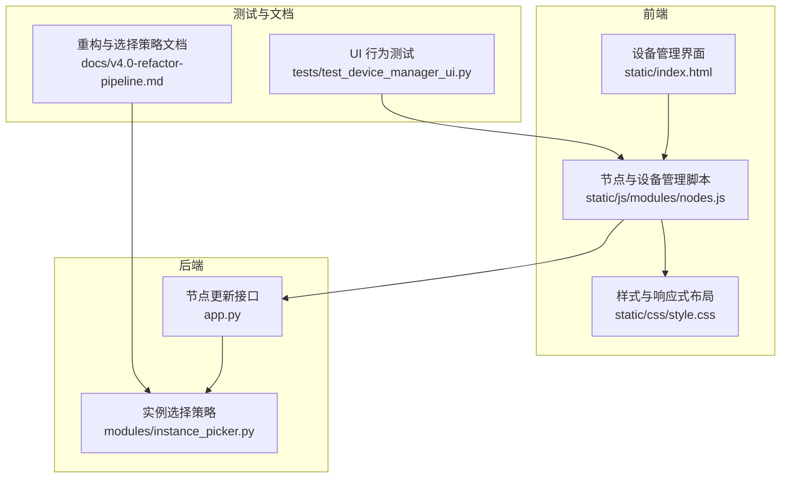
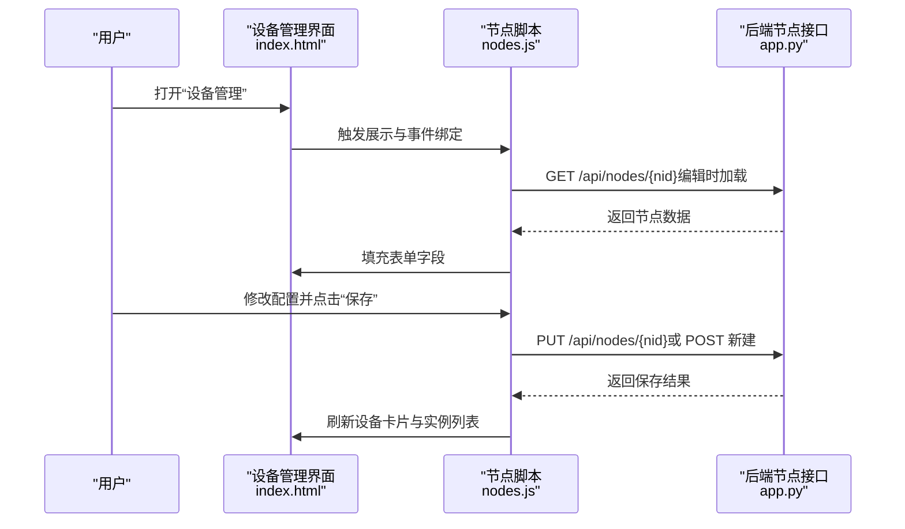
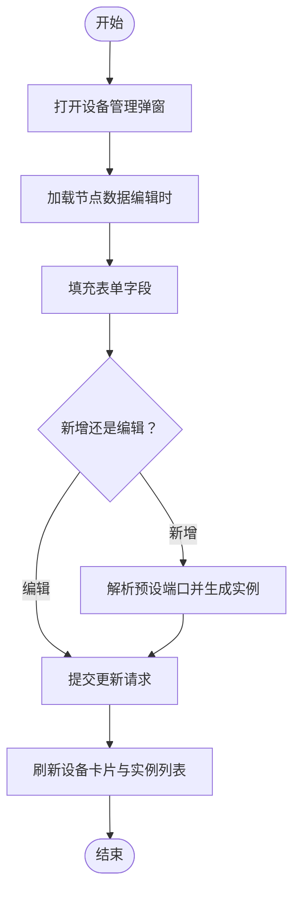
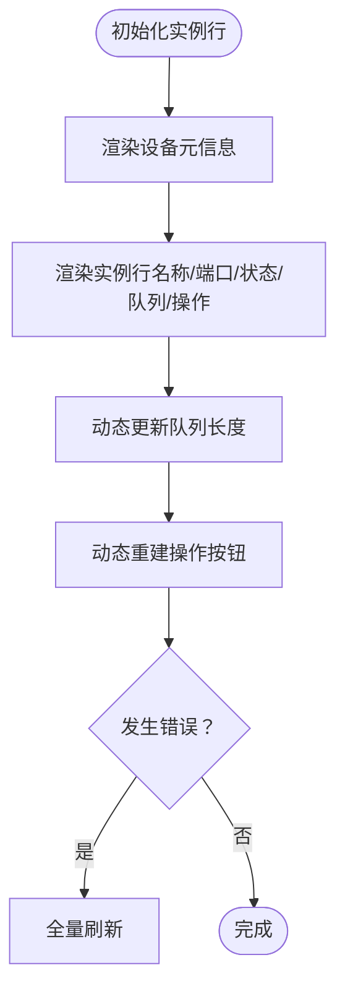
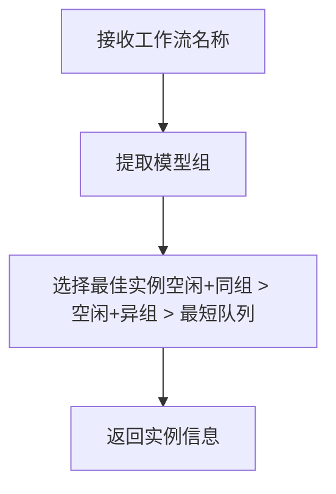
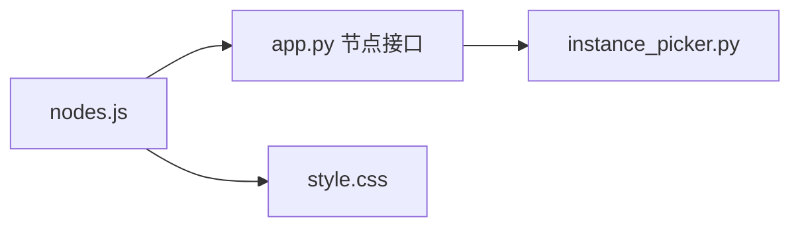

# 设备管理

<cite>
**本文引用的文件**
- [app.py](file://app.py)
- [nodes.js](file://static/js/modules/nodes.js)
- [style.css](file://static/css/style.css)
- [index.html](file://static/index.html)
- [test_device_manager_ui.py](file://tests/test_device_manager_ui.py)
- [instance_picker.py](file://modules/instance_picker.py)
- [v4.0-refactor-pipeline.md](file://docs/v4.0-refactor-pipeline.md)
</cite>

## 目录
1. [简介](#简介)
2. [项目结构](#项目结构)
3. [核心组件](#核心组件)
4. [架构总览](#架构总览)
5. [详细组件分析](#详细组件分析)
6. [依赖关系分析](#依赖关系分析)
7. [性能考量](#性能考量)
8. [故障排除指南](#故障排除指南)
9. [结论](#结论)
10. [附录](#附录)

## 简介
本指南面向 Ez ComfyUI Showcase 的“设备管理”功能，帮助用户理解并高效使用设备管理界面与相关后台逻辑。内容涵盖：
- 如何在界面中添加新 ComfyUI 实例、编辑现有实例配置、删除不再使用的实例
- 设备配置参数详解（实例名称、主机地址、端口、认证信息、权重等）
- 设备间切换与选择机制（手动选择与自动选择），以及适用场景
- 设备分组与标签管理，提升多实例组织效率
- 配置最佳实践（命名规范、网络与安全建议）
- 常见问题排查（配置错误、连接失败、权限问题）

## 项目结构
设备管理功能涉及前端界面、样式与交互脚本，以及后端 API 接口与文档说明。关键位置如下：
- 前端设备管理弹窗与表单：static/js/modules/nodes.js、static/index.html
- 样式与响应式布局：static/css/style.css
- 后端节点更新接口：app.py
- 自动选择策略与文档：modules/instance_picker.py、docs/v4.0-refactor-pipeline.md
- UI 行为测试：tests/test_device_manager_ui.py

图表来源
- [nodes.js:144-270](file://static/js/modules/nodes.js#L144-L270)
- [index.html:582-597](file://static/index.html#L582-L597)
- [style.css:4369-4437](file://static/css/style.css#L4369-L4437)
- [app.py:8999-9032](file://app.py#L8999-L9032)
- [instance_picker.py:1-48](file://modules/instance_picker.py#L1-L48)
- [v4.0-refactor-pipeline.md:373-410](file://docs/v4.0-refactor-pipeline.md#L373-L410)
- [test_device_manager_ui.py:1-30](file://tests/test_device_manager_ui.py#L1-L30)

章节来源
- [nodes.js:144-270](file://static/js/modules/nodes.js#L144-L270)
- [index.html:582-597](file://static/index.html#L582-L597)
- [style.css:4369-4437](file://static/css/style.css#L4369-L4437)
- [app.py:8999-9032](file://app.py#L8999-L9032)
- [instance_picker.py:1-48](file://modules/instance_picker.py#L1-L48)
- [v4.0-refactor-pipeline.md:373-410](file://docs/v4.0-refactor-pipeline.md#L373-L410)
- [test_device_manager_ui.py:1-30](file://tests/test_device_manager_ui.py#L1-L30)

## 核心组件
- 设备管理弹窗与表单
  - 弹窗打开/关闭、表单填充与保存、实例预设端口生成、SSH 认证显示控制等均由前端脚本实现。
- 节点更新 API
  - 后端提供节点更新接口，支持部分字段合并更新，包含连接方式、SSH 配置、扫描端口范围、实例列表、标签、共享属性等。
- 实例选择策略
  - 自动选择策略根据工作流类型、实例状态与模型组亲和性进行优选，不执行冷启动与健康检查，由调用方负责。

章节来源
- [nodes.js:144-270](file://static/js/modules/nodes.js#L144-L270)
- [app.py:8999-9032](file://app.py#L8999-L9032)
- [instance_picker.py:1-48](file://modules/instance_picker.py#L1-L48)

## 架构总览
设备管理的前后端交互流程如下：

图表来源
- [nodes.js:144-270](file://static/js/modules/nodes.js#L144-L270)
- [app.py:8999-9032](file://app.py#L8999-L9032)

## 详细组件分析

### 设备管理界面与操作流程
- 打开设备管理
  - 通过工具栏按钮触发，弹出覆盖层并加载设备列表。
- 添加设备
  - 填写基础信息（名称、主机、连接方式、访问 URL）、可选 SSH 配置、预设端口（用于自动生成实例）、标签、共享属性等；保存时若未指定实例，将基于预设端口批量生成实例。
- 编辑设备
  - 加载已有节点数据，填充表单；支持修改连接方式、SSH 认证、扫描端口范围、实例列表、标签、共享属性等；保存后刷新界面。
- 删除设备
  - 在设备卡片上触发删除动作（具体实现位于前端脚本中），删除后应刷新列表。

图表来源
- [nodes.js:144-270](file://static/js/modules/nodes.js#L144-L270)

章节来源
- [nodes.js:144-270](file://static/js/modules/nodes.js#L144-L270)
- [index.html:582-597](file://static/index.html#L582-L597)

### 设备配置参数详解
以下参数来自前端表单与后端接口定义，用于描述设备与实例的配置项。请以表单字段与接口定义为准。

- 基础信息
  - 名称：设备显示名称
  - 主机地址：设备 IP 或域名
  - 连接方式：远程 SSH 等
  - 访问 URL：用于打开 ComfyUI 页面的模板，支持占位符替换
- SSH 认证
  - 用户、端口、认证方式（密码或密钥）、密码或密钥路径
- 网络与实例
  - 预设端口：逗号分隔的端口列表，用于自动生成实例
  - 扫描端口范围：由预设端口推导出的范围
  - 实例列表：已登记的实例集合（保存后继续沿用）
- 元数据
  - 标签：逗号分隔的标签字符串
  - 共享：是否公开给其他用户使用
  - 排序顺序：用于排序的数值

章节来源
- [nodes.js:177-270](file://static/js/modules/nodes.js#L177-L270)
- [app.py:8999-9032](file://app.py#L8999-L9032)

### 设备实例卡片与状态展示
- 卡片元信息
  - 地址与实例数量、共享/私有标识
- 实例行展示
  - 实例名称、端口、状态、队列长度、操作按钮（启动/停止/重启/强制重启/打开）
- 动态更新
  - 实时更新队列长度与操作按钮，异常时回退全量刷新

图表来源
- [nodes.js:33-576](file://static/js/modules/nodes.js#L33-L576)
- [style.css:4369-4437](file://static/css/style.css#L4369-L4437)

章节来源
- [nodes.js:33-576](file://static/js/modules/nodes.js#L33-L576)
- [style.css:4369-4437](file://static/css/style.css#L4369-L4437)

### 设备间的切换与选择机制
- 自动选择
  - 根据工作流类型与模型组亲和性，优先空闲且同组实例，其次最短队列；不执行冷启动与健康检查，由调用方负责。
- 手动选择
  - 用户可在界面中直接选择目标设备或实例，适用于需要固定资源或特定实例的场景。
- 适用场景
  - 自动选择适合通用任务与负载均衡；手动选择适合对实例有强约束的任务（如特定显存、特定模型组）。

图表来源
- [instance_picker.py:1-48](file://modules/instance_picker.py#L1-L48)
- [v4.0-refactor-pipeline.md:373-410](file://docs/v4.0-refactor-pipeline.md#L373-L410)

章节来源
- [instance_picker.py:1-48](file://modules/instance_picker.py#L1-L48)
- [v4.0-refactor-pipeline.md:373-410](file://docs/v4.0-refactor-pipeline.md#L373-L410)

### 设备分组与标签管理
- 标签
  - 支持为设备设置标签，便于筛选与归类（例如按环境、用途、区域等）
- 分组
  - 可结合模型组亲和性与标签共同影响实例选择策略
- 组织建议
  - 使用统一前缀/后缀命名设备与实例，配合标签实现快速检索与可视化

章节来源
- [nodes.js:177-270](file://static/js/modules/nodes.js#L177-L270)

### 设备配置最佳实践
- 实例命名规范
  - 建议采用“设备名-实例后缀:端口”的格式，便于识别与定位
- 网络配置建议
  - 访问 URL 使用占位符模板，确保端口变更时无需重复配置
  - 预设端口应连续且避免与系统保留端口冲突
- 安全设置要点
  - 优先使用密钥认证；限制共享设备的可见范围；定期轮换凭据
- 权重与亲和性
  - 对关键任务分配空闲且同组实例，减少跨组调度带来的额外开销

章节来源
- [nodes.js:177-270](file://static/js/modules/nodes.js#L177-L270)
- [instance_picker.py:1-48](file://modules/instance_picker.py#L1-L48)

## 依赖关系分析
- 前端依赖
  - 设备管理脚本依赖于后端节点接口；样式文件控制响应式布局与交互元素外观
- 后端依赖
  - 节点更新接口处理来自前端的设备配置变更；实例选择策略独立于设备管理，但共同服务于任务路由

图表来源
- [nodes.js:144-270](file://static/js/modules/nodes.js#L144-L270)
- [app.py:8999-9032](file://app.py#L8999-L9032)
- [style.css:4369-4437](file://static/css/style.css#L4369-L4437)
- [instance_picker.py:1-48](file://modules/instance_picker.py#L1-L48)

章节来源
- [nodes.js:144-270](file://static/js/modules/nodes.js#L144-L270)
- [app.py:8999-9032](file://app.py#L8999-L9032)
- [style.css:4369-4437](file://static/css/style.css#L4369-L4437)
- [instance_picker.py:1-48](file://modules/instance_picker.py#L1-L48)

## 性能考量
- 实时更新
  - 实例队列与操作按钮的局部更新可降低页面抖动与重绘成本
- 响应式布局
  - 移动端隐藏队列列，减少小屏下的渲染压力
- 选择策略
  - 自动选择避免冷启动与健康检查，降低路由延迟

章节来源
- [nodes.js:540-576](file://static/js/modules/nodes.js#L540-L576)
- [style.css:4434-4437](file://static/css/style.css#L4434-L4437)
- [instance_picker.py:1-48](file://modules/instance_picker.py#L1-L48)

## 故障排除指南
- 配置错误
  - 症状：保存后界面未更新或报错
  - 排查：确认表单字段填写完整；检查预设端口格式与范围；核对访问 URL 占位符
- 连接失败
  - 症状：无法打开实例页面或实例状态异常
  - 排查：验证主机可达性、端口开放情况、SSH 凭据正确性；确认连接方式与认证方式匹配
- 权限问题
  - 症状：编辑/删除设备失败
  - 排查：确认当前用户角色具备相应权限；共享设备的修改可能受管理员限制
- UI 行为异常
  - 症状：移动端布局异常或列显示不一致
  - 排查：参考 UI 行为测试用例，确认样式规则生效

章节来源
- [nodes.js:144-270](file://static/js/modules/nodes.js#L144-L270)
- [test_device_manager_ui.py:1-30](file://tests/test_device_manager_ui.py#L1-L30)
- [style.css:4369-4437](file://static/css/style.css#L4369-L4437)

## 结论
设备管理功能通过清晰的表单与卡片化界面，结合后端节点接口与自动选择策略，实现了对多 ComfyUI 实例的高效组织与调度。遵循本文的配置规范与最佳实践，可显著提升稳定性与运维效率；遇到问题时，可依据故障排除指南快速定位并解决。

## 附录
- 快速入口
  - 打开设备管理：工具栏按钮 → “设备管理”
  - 添加设备：填写基础信息与 SSH 配置 → 保存（可自动生成实例）
  - 编辑设备：加载节点数据 → 修改配置 → 保存
  - 删除设备：在设备卡片上触发删除（前端脚本实现）