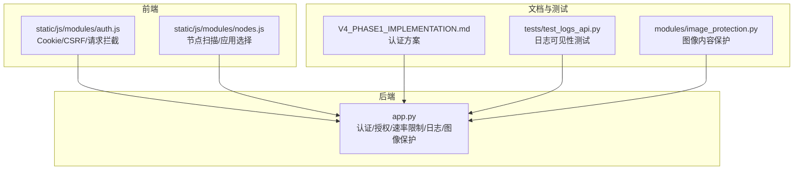
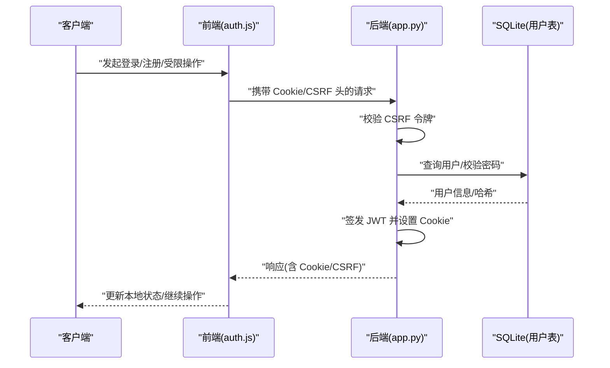
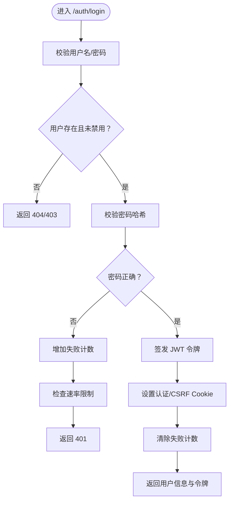
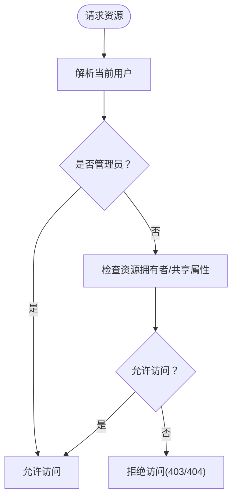
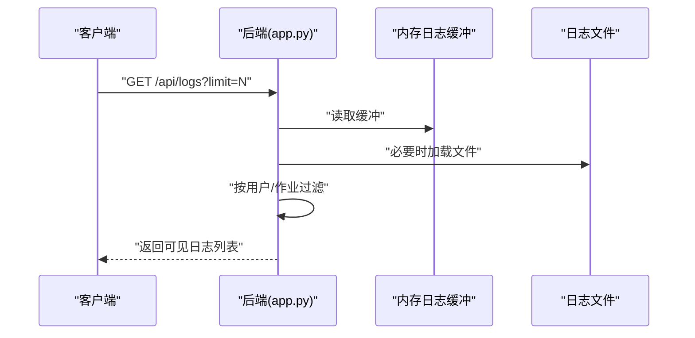
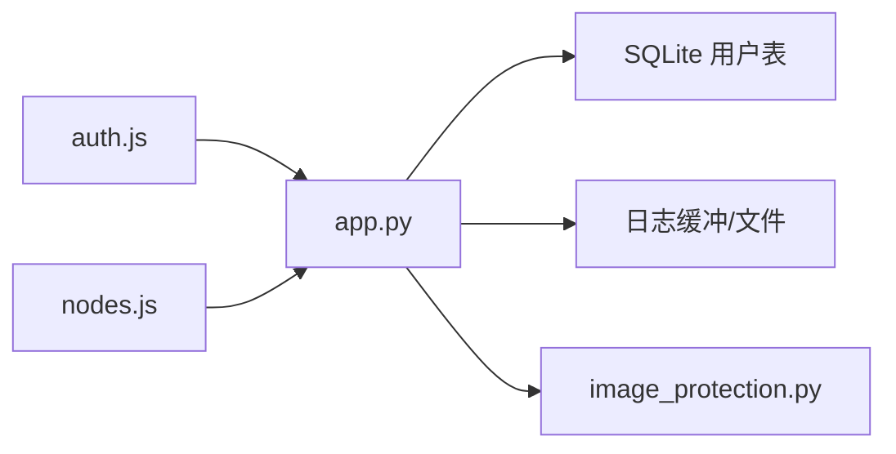

# 安全配置

<cite>
**本文引用的文件**
- [app.py](file://app.py)
- [auth.js](file://static/js/modules/auth.js)
- [V4_PHASE1_IMPLEMENTATION.md](file://docs/archive/root-md-2026-06-03/V4_PHASE1_IMPLEMENTATION.md)
- [test_logs_api.py](file://tests/test_logs_api.py)
- [image_protection.py](file://modules/image_protection.py)
- [nodes.js](file://static/js/modules/nodes.js)
</cite>

## 目录
1. [引言](#引言)
2. [项目结构](#项目结构)
3. [核心组件](#核心组件)
4. [架构总览](#架构总览)
5. [详细组件分析](#详细组件分析)
6. [依赖关系分析](#依赖关系分析)
7. [性能考量](#性能考量)
8. [故障排查指南](#故障排查指南)
9. [结论](#结论)
10. [附录](#附录)

## 引言
本文件面向系统安全配置，围绕访问控制、权限控制、认证安全、日志审计、数据保护与安全策略展开，结合后端应用与前端模块的实际实现进行说明，并提供最佳实践与加固建议。内容覆盖但不限于：IP 白名单、访问频率限制、会话与 CSRF 管理、用户角色与资源访问控制、JWT 令牌与密码策略、日志可见性与审计、图像内容保护、以及安全策略与扫描流程。

## 项目结构
本项目采用“后端主程序 + 前端静态模块”的分层组织方式，安全相关能力主要集中在后端主程序与前端认证模块中：
- 后端主程序负责认证、授权、速率限制、日志、图像保护、节点扫描等安全相关逻辑
- 前端认证模块负责 Cookie/CSRF 管理、请求拦截与安全头附加
- 文档与测试文件提供了早期实现方案与验证用例

图表来源
- [app.py](file://app.py)
- [auth.js](file://static/js/modules/auth.js)
- [nodes.js](file://static/js/modules/nodes.js)
- [V4_PHASE1_IMPLEMENTATION.md](file://docs/archive/root-md-2026-06-03/V4_PHASE1_IMPLEMENTATION.md)
- [test_logs_api.py](file://tests/test_logs_api.py)
- [image_protection.py](file://modules/image_protection.py)

章节来源
- [app.py](file://app.py)
- [auth.js](file://static/js/modules/auth.js)
- [V4_PHASE1_IMPLEMENTATION.md](file://docs/archive/root-md-2026-06-03/V4_PHASE1_IMPLEMENTATION.md)

## 核心组件
- 认证与会话管理：基于 Cookie 的会话与 CSRF 令牌，支持 HTTPS 下的安全传输与 SameSite/Lax 策略；登录成功返回令牌并设置 Cookie，登出清理 Cookie。
- 访问频率限制：针对认证动作（如登录）按主机与用户名维度进行滑动窗口计数，超过阈值触发 429。
- 权限控制：用户角色（admin/user），资源访问控制（节点/工作流/作业），管理员可查看/管理所有资源。
- 日志审计：本地日志缓冲与持久化，按用户与作业可见性过滤，支持 API 查询。
- 图像内容保护：对生成图像进行分类评估，判定“受保护/安全”，并记录日志。
- 节点扫描：通过 SSH 扫描远端节点端口并应用选择，涉及外部命令调用与严格参数拼接。

章节来源
- [app.py](file://app.py)
- [auth.js](file://static/js/modules/auth.js)
- [image_protection.py](file://modules/image_protection.py)
- [nodes.js](file://static/js/modules/nodes.js)

## 架构总览
下图展示认证、授权与安全中间件在请求生命周期中的交互：

图表来源
- [app.py](file://app.py)
- [auth.js](file://static/js/modules/auth.js)

## 详细组件分析

### 认证与会话管理
- 令牌与密钥
  - 使用 HS256 算法的对称密钥；密钥来源优先级：环境变量 > 秘钥文件 > 自动生成 > 临时密钥。
  - 默认令牌有效期天数可配置。
- Cookie 与 CSRF
  - 登录成功设置认证 Cookie 与 CSRF Cookie，启用 HttpOnly、Secure（HTTPS 时）、SameSite=Lax。
  - 对非安全方法（POST/PUT/PATCH/DELETE）自动附加 CSRF 头并与 Cookie 校验。
- 登录/登出
  - 登录：校验用户名/密码，成功后签发令牌并设置 Cookie；失败或错误返回相应状态码。
  - 登出：删除认证与 CSRF Cookie。
- 速率限制
  - 针对认证动作（如登录）按“动作:主机:用户名”键进行滑动窗口计数，超过阈值返回 429。

图表来源
- [app.py](file://app.py)

章节来源
- [app.py](file://app.py)
- [auth.js](file://static/js/modules/auth.js)

### 权限控制系统
- 角色模型
  - 用户具备 role 字段（admin/user），管理员拥有最高权限。
- 资源访问控制
  - 节点/工作流/实例的查看与管理权限基于“拥有者 ID + 共享标记”判断；管理员可绕过限制。
  - 作业日志可见性：管理员可见全部；普通用户仅可见自身作业或关联其可访问作业的日志条目。
- 管理员专用
  - 提供用户管理界面（创建/修改/禁用/删除用户），密码重置，角色变更等。

图表来源
- [app.py](file://app.py)

章节来源
- [app.py](file://app.py)
- [auth.js](file://static/js/modules/auth.js)
- [test_logs_api.py](file://tests/test_logs_api.py)

### 日志审计与可见性
- 日志存储
  - 内存缓冲 + 文件持久化，按时间窗口裁剪，保留最近若干条。
- 可见性规则
  - 管理员可查看全部；普通用户仅可见自身作业或与其关联的作业日志。
- API
  - 支持分页与上限限制的查询接口，内部进行可见性过滤后再返回。

图表来源
- [app.py](file://app.py)

章节来源
- [app.py](file://app.py)
- [test_logs_api.py](file://tests/test_logs_api.py)

### 数据保护与传输安全
- 传输安全
  - Cookie 设置 Secure 标记（仅 HTTPS），HttpOnly 防止 XSS，SameSite=Lax 抵御 CSRF。
  - CSRF 令牌与请求头比对，确保跨站请求被拒绝。
- 存储安全
  - 密码使用强哈希算法存储；JWT 密钥通过多源加载，避免硬编码。
- 敏感信息处理
  - 日志中避免记录敏感字段；图像保护模块对生成结果进行分类评估并记录状态与分数。

章节来源
- [app.py](file://app.py)
- [auth.js](file://static/js/modules/auth.js)
- [image_protection.py](file://modules/image_protection.py)

### 节点扫描与安全策略
- 扫描流程
  - 前端触发扫描，后端通过 SSH 在目标主机上执行命令查找工作流文件，返回检测结果。
  - 应用选择时仅对勾选项写入设备配置，未选中端口不写入。
- 安全要点
  - 严格拼接命令参数，避免注入风险；对 SSH 选项进行最小化配置以降低暴露面。
  - 仅在受信任网络内执行远程扫描，建议配合防火墙与网络隔离。

章节来源
- [nodes.js](file://static/js/modules/nodes.js)
- [app.py](file://app.py)

## 依赖关系分析
- 前端依赖后端提供的 Cookie/CSRF 与认证接口，自动附加安全头并维护会话状态。
- 后端依赖 SQLite 存储用户信息，使用 bcrypt 校验密码，JWT 用于会话标识。
- 日志模块依赖内存缓冲与文件系统，按用户与作业维度进行可见性控制。
- 图像保护模块依赖分类器输出，对生成图像进行“受保护/安全”判定并记录日志。

图表来源
- [app.py](file://app.py)
- [auth.js](file://static/js/modules/auth.js)
- [nodes.js](file://static/js/modules/nodes.js)
- [image_protection.py](file://modules/image_protection.py)

章节来源
- [app.py](file://app.py)
- [auth.js](file://static/js/modules/auth.js)
- [nodes.js](file://static/js/modules/nodes.js)
- [image_protection.py](file://modules/image_protection.py)

## 性能考量
- 速率限制
  - 滑动窗口基于内存字典计数，窗口大小与最大尝试次数可调；注意高并发场景下的内存占用与清理策略。
- 日志
  - 内存缓冲与文件 IO 需要平衡吞吐与持久化开销；建议根据部署规模调整保留时长与上限。
- 图像保护
  - 分类器推理成本较高，建议在后台任务中异步执行，并缓存结果以减少重复计算。

## 故障排查指南
- 登录失败/频繁 429
  - 检查速率限制阈值与窗口设置；确认客户端是否正确传递 CSRF 头；核对用户名是否存在且未被禁用。
- Cookie/CSRF 无效
  - 确认站点是否通过 HTTPS；浏览器是否允许第三方 Cookie；前端是否正确附加 X-CSRF-Token 头。
- 日志不可见
  - 普通用户仅能看到自身或关联作业的日志；管理员可查看全部；检查作业归属与用户角色。
- 图像保护未生效
  - 确认图像路径与候选文件存在；检查分类器输出格式与阈值设置；查看日志中保护状态与分数。

章节来源
- [app.py](file://app.py)
- [auth.js](file://static/js/modules/auth.js)
- [test_logs_api.py](file://tests/test_logs_api.py)
- [image_protection.py](file://modules/image_protection.py)

## 结论
本项目在认证、授权、会话与 CSRF、速率限制、日志可见性与图像保护等方面提供了基础而实用的安全能力。建议在生产环境中进一步完善：引入 IP 白名单、双因素认证、入侵检测与安全扫描、传输加密与密钥轮换、以及更严格的输入校验与审计留痕。

## 附录

### 最佳实践与加固建议
- 认证与密钥
  - 强制使用 HTTPS；定期轮换 JWT 密钥；避免在代码中硬编码密钥。
- 会话与 CSRF
  - 严格启用 HttpOnly/Secure/SameSite；对非 GET 方法强制 CSRF 校验；短时效令牌+刷新机制。
- 速率限制
  - 区分不同动作与用户类型；结合地理位置/IP 维度进行动态阈值调整；记录告警并联动封禁。
- 权限控制
  - 最小权限原则；资源访问前二次校验；审计关键操作（用户管理/角色变更）。
- 日志与审计
  - 结构化日志；敏感字段脱敏；保留合规期限；建立异常行为检测规则。
- 数据保护
  - 传输加密；存储加密；最小化日志记录；定期备份与恢复演练。
- 安全策略
  - 防火墙与网络隔离；入侵检测与告警；定期安全扫描与漏洞修复；节点扫描仅在可信网络执行。