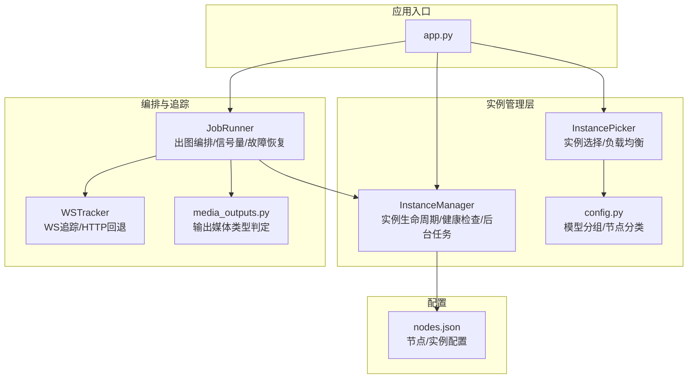
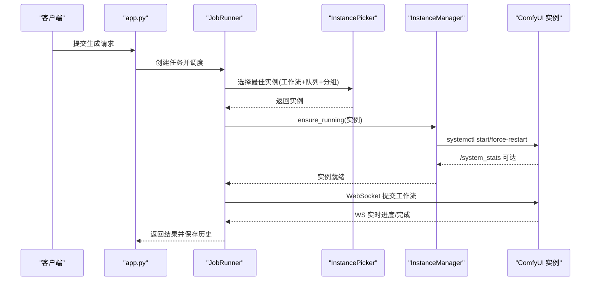
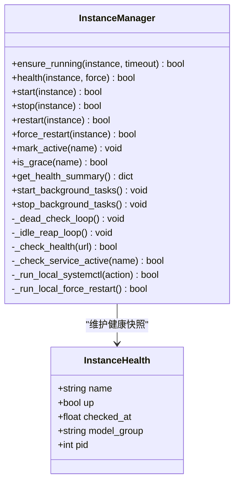
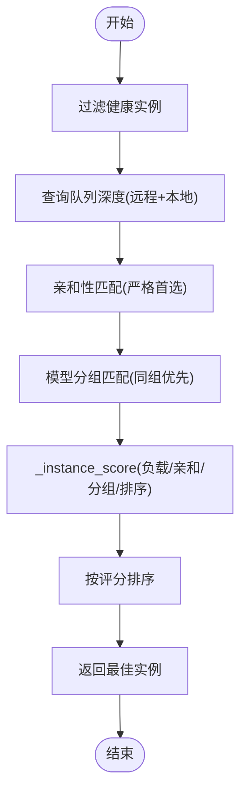
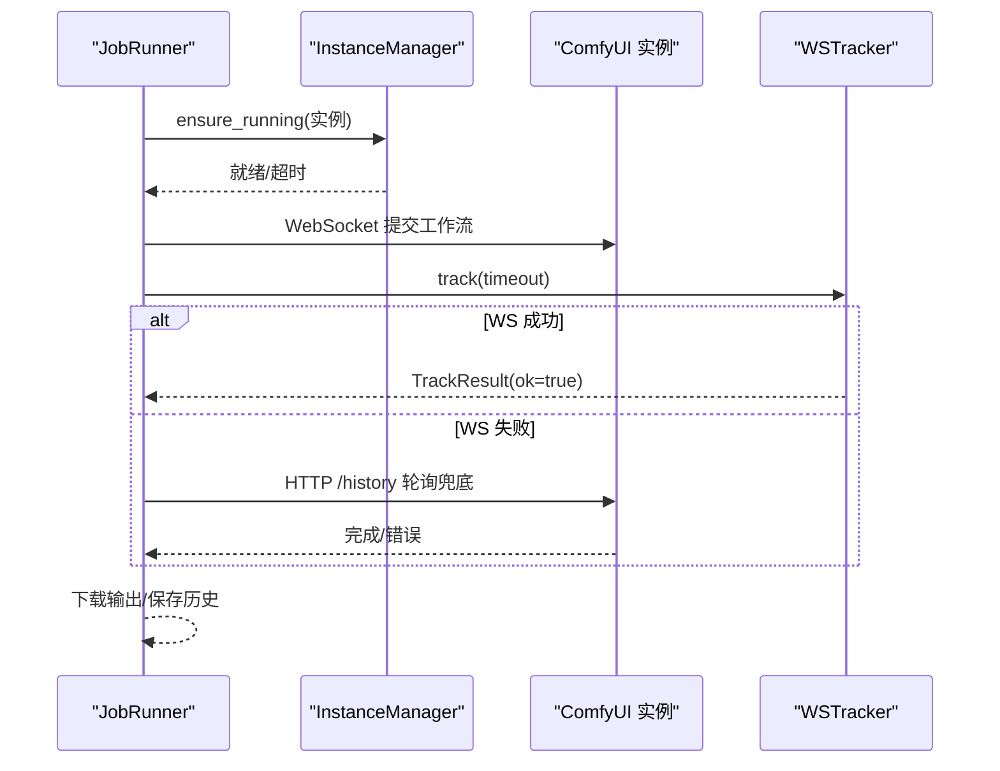
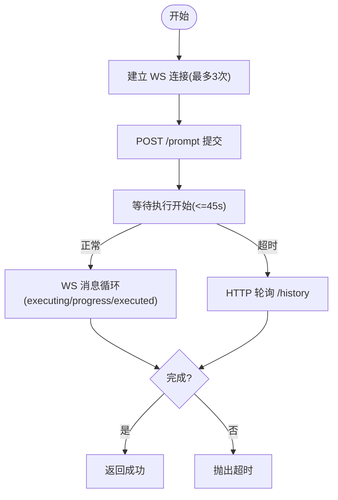
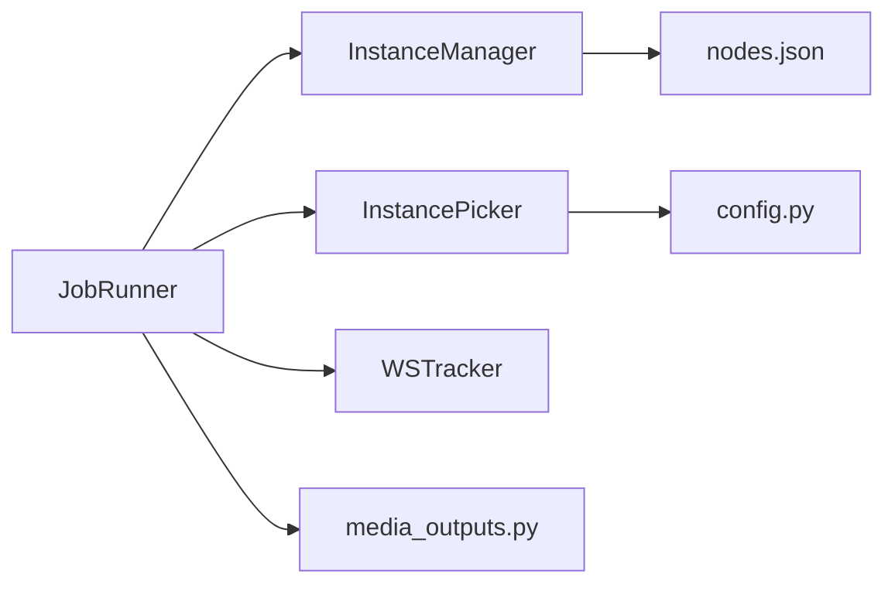
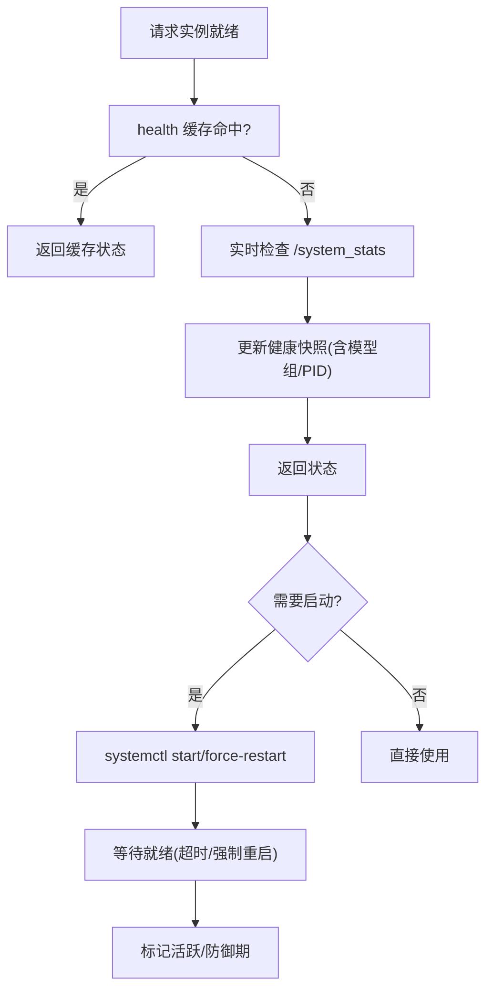
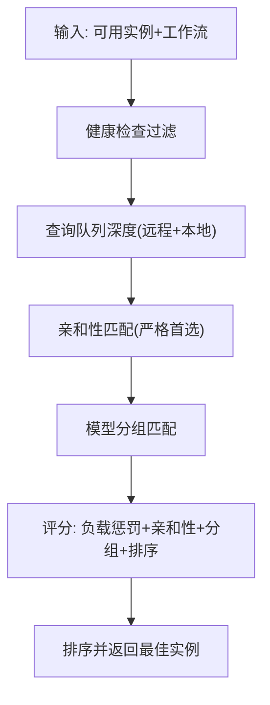

# 实例管理

<cite>
**本文档引用的文件**
- [modules/instance_manager.py](file://modules/instance_manager.py)
- [modules/instance_picker.py](file://modules/instance_picker.py)
- [modules/job_runner.py](file://modules/job_runner.py)
- [modules/ws_tracker.py](file://modules/ws_tracker.py)
- [modules/config.py](file://modules/config.py)
- [app.py](file://app.py)
- [config/nodes.json](file://config/nodes.json)
- [modules/media_outputs.py](file://modules/media_outputs.py)
</cite>

## 目录
1. [简介](#简介)
2. [项目结构](#项目结构)
3. [核心组件](#核心组件)
4. [架构总览](#架构总览)
5. [详细组件分析](#详细组件分析)
6. [依赖分析](#依赖分析)
7. [性能考量](#性能考量)
8. [故障排查指南](#故障排查指南)
9. [结论](#结论)
10. [附录](#附录)

## 简介
本文件面向 Ez ComfyUI v4.0 的实例管理子系统，系统性阐述 ComfyUI 实例的生命周期管理（启动、停止、重启、删除）、健康检查与自动恢复、实例选择与负载均衡、状态监控与故障恢复、实例间通信与协调机制，并提供最佳实践与故障排除建议。文档以代码为依据，结合可视化图示帮助读者快速理解与落地。

## 项目结构
围绕实例管理的关键模块与配置如下：
- 实例生命周期与健康检查：modules/instance_manager.py
- 实例选择与负载均衡：modules/instance_picker.py
- 出图流程编排与实例交互：modules/job_runner.py
- WebSocket 进度追踪与 HTTP 回退：modules/ws_tracker.py
- 配置与模型分组：modules/config.py
- 应用入口与后台任务：app.py
- 节点与实例配置：config/nodes.json
- 输出媒体类型判定：modules/media_outputs.py

**图表来源**
- [app.py](file://app.py)
- [modules/instance_manager.py](file://modules/instance_manager.py)
- [modules/instance_picker.py](file://modules/instance_picker.py)
- [modules/job_runner.py](file://modules/job_runner.py)
- [modules/ws_tracker.py](file://modules/ws_tracker.py)
- [modules/config.py](file://modules/config.py)
- [config/nodes.json](file://config/nodes.json)
- [modules/media_outputs.py](file://modules/media_outputs.py)

**章节来源**
- [app.py](file://app.py)
- [modules/instance_manager.py](file://modules/instance_manager.py)
- [modules/instance_picker.py](file://modules/instance_picker.py)
- [modules/job_runner.py](file://modules/job_runner.py)
- [modules/ws_tracker.py](file://modules/ws_tracker.py)
- [modules/config.py](file://modules/config.py)
- [config/nodes.json](file://config/nodes.json)
- [modules/media_outputs.py](file://modules/media_outputs.py)

## 核心组件
- 实例管理器（InstanceManager）
  - 负责实例启动、停止、重启、强制重启、健康检查、防御期、空闲回收、死实例检测、健康快照等。
  - 通过 systemd 用户服务进行本地或远程实例控制。
- 实例选择器（InstancePicker）
  - 基于工作流类型、模型分组、实例队列深度、亲和性与排序，选择最优实例。
  - 不执行冷启动与健康检查，职责纯粹。
- 出图编排器（JobRunner）
  - 串联实例选择、实例管理、进度计算、WebSocket 追踪、输出下载与历史入库。
  - 支持提交停滞自动纠错、GPU 静止重启、vLLM 生命周期协同。
- WebSocket 追踪器（WSTracker）
  - WebSocket 连接、提交工作流、实时进度、断线回退 HTTP 轮询、超时与错误处理。
- 配置与模型分组（config.py）
  - 定义节点分类、模型分组提取规则，支撑实例亲和与路由。
- 应用入口（app.py）
  - FastAPI 生命周期挂载实例管理器后台任务，集成 GPU 监控、队列与任务管理。

**章节来源**
- [modules/instance_manager.py](file://modules/instance_manager.py)
- [modules/instance_picker.py](file://modules/instance_picker.py)
- [modules/job_runner.py](file://modules/job_runner.py)
- [modules/ws_tracker.py](file://modules/ws_tracker.py)
- [modules/config.py](file://modules/config.py)
- [app.py](file://app.py)

## 架构总览
实例管理子系统采用“编排-选择-执行-追踪”的分层设计：
- 编排层：JobRunner 负责任务编排与实例信号量控制。
- 选择层：InstancePicker 基于工作流与实例状态进行路由决策。
- 执行层：InstanceManager 负责实例生命周期与健康检查。
- 追踪层：WSTracker 提供 WS 实时追踪与 HTTP 回退。
- 配置层：config.py 提供模型分组与节点分类，nodes.json 描述节点与实例。

**图表来源**
- [modules/job_runner.py](file://modules/job_runner.py)
- [modules/instance_picker.py](file://modules/instance_picker.py)
- [modules/instance_manager.py](file://modules/instance_manager.py)
- [modules/ws_tracker.py](file://modules/ws_tracker.py)

## 详细组件分析

### 实例管理器（InstanceManager）
- 生命周期管理
  - 启动：通过 systemd 用户服务启动实例，支持强制重启清理残留进程。
  - 停止/重启：统一通过 run_action 调用 systemctl。
  - 删除：通过 stop 后的后续流程实现（例如回收空闲实例）。
- 健康检查
  - 通过 /system_stats 端点探测实例可达性，支持缓存与强制刷新。
  - 缓存有效期、健康快照包含模型组与 PID。
- 防御期与空闲回收
  - 启动后 90 秒为防御期，避免误判死实例。
  - 空闲超时（默认 15 分钟）触发停止，跳过活跃任务。
- 死实例检测
  - systemd 服务处于 active 但健康检查失败时，自动重启。
- 后台任务
  - 死实例检测循环（60s 间隔）与空闲回收循环（60s 间隔）。
- 与节点/远程实例的集成
  - 支持通过节点配置执行远程实例动作（预留扩展）。

**图表来源**
- [modules/instance_manager.py](file://modules/instance_manager.py)

**章节来源**
- [modules/instance_manager.py](file://modules/instance_manager.py)

### 实例选择器（InstancePicker）
- 选择策略
  - 工作流类型偏好：T2I/I2I/视频/放大等固定偏好实例。
  - 模型分组匹配：优先同模型组实例，避免过度集中。
  - 队列深度：综合远程队列与本地等待队列，降低热点。
  - 亲和性：严格首选实例（如 bernini）优先。
  - 排序：按 sort_order 与评分排序，评分包含负载惩罚与亲和性加分。
- 输入接口
  - 注入健康检查、队列查询、模型分组查询回调，保证纯函数与异步安全。
- 输出
  - 返回最优实例字典，若无可用实例抛出异常。

**图表来源**
- [modules/instance_picker.py](file://modules/instance_picker.py)

**章节来源**
- [modules/instance_picker.py](file://modules/instance_picker.py)
- [modules/config.py](file://modules/config.py)

### 出图编排器（JobRunner）
- 主要流程
  - 选择实例 → 获取实例信号量 → 停止 vLLM（如需）→ 冷启动实例 → 准备工作流 → WebSocket 追踪 → 下载输出 → 释放信号量 → 标记活跃 → 恢复 vLLM。
- 信号量与并发
  - 每个实例维护独立信号量，限制并发，避免资源争用。
- 故障恢复
  - 提交停滞自动纠错：清理队列、中断、重启实例、重试。
  - GPU 静止检测：连续 60 秒无波动自动中断并重启任务。
  - 超时与错误：统一友好提示与日志记录。
- 与实例管理器协作
  - 通过 ensure_running 保障实例就绪，通过健康检查与队列查询优化选择。

**图表来源**
- [modules/job_runner.py](file://modules/job_runner.py)
- [modules/ws_tracker.py](file://modules/ws_tracker.py)
- [modules/instance_manager.py](file://modules/instance_manager.py)

**章节来源**
- [modules/job_runner.py](file://modules/job_runner.py)
- [modules/ws_tracker.py](file://modules/ws_tracker.py)

### WebSocket 追踪器（WSTracker）
- WS 连接与回退
  - 3 次重试连接；超时或断开退化为 HTTP 轮询。
- 提交与追踪
  - 提交 /prompt 后等待执行开始；实时 progress 与 executing 消息驱动进度。
- 超时与错误
  - PromptStartTimeout：提交后长时间未开始执行。
  - execution_error：ComfyUI 执行错误。
- 时长推算节点
  - 对 weight=0 的节点通过进入时间与时长估计推进进度。

**图表来源**
- [modules/ws_tracker.py](file://modules/ws_tracker.py)

**章节来源**
- [modules/ws_tracker.py](file://modules/ws_tracker.py)

### 配置与模型分组（config.py）
- 模型分组
  - 从工作流文件名提取模型组，用于实例亲和与路由。
- 节点分类
  - 定义采样器、放大、自由节点等类别，支撑进度计算与节点状态映射。

**章节来源**
- [modules/config.py](file://modules/config.py)

### 应用入口（app.py）
- 生命周期与后台任务
  - FastAPI lifespan 启动实例管理器后台任务、队列与 GPU 监控。
- 实例状态与日志
  - 维护 jobs 与历史，记录实例启停/恢复/卡住等日志。
- GPU 活动监控
  - 通过 VRAM 使用率与采样进度判断 GPU 静止并自动重启任务。

**章节来源**
- [app.py](file://app.py)

## 依赖分析
- 模块耦合
  - JobRunner 依赖 InstanceManager、InstancePicker、WSTracker、StepCalculator、MediaOutputs。
  - InstanceManager 依赖 nodes_provider 与 systemd 调用，保持与节点配置解耦。
  - InstancePicker 依赖 config.py 的模型分组与节点分类。
- 外部依赖
  - systemd 用户服务（systemctl --user）、D-Bus 会话、网络访问 /system_stats 与 /prompt。
- 循环依赖
  - 未发现循环依赖，模块边界清晰。

**图表来源**
- [modules/job_runner.py](file://modules/job_runner.py)
- [modules/instance_manager.py](file://modules/instance_manager.py)
- [modules/instance_picker.py](file://modules/instance_picker.py)
- [modules/ws_tracker.py](file://modules/ws_tracker.py)
- [modules/config.py](file://modules/config.py)
- [config/nodes.json](file://config/nodes.json)
- [modules/media_outputs.py](file://modules/media_outputs.py)

**章节来源**
- [modules/job_runner.py](file://modules/job_runner.py)
- [modules/instance_manager.py](file://modules/instance_manager.py)
- [modules/instance_picker.py](file://modules/instance_picker.py)
- [modules/ws_tracker.py](file://modules/ws_tracker.py)
- [modules/config.py](file://modules/config.py)
- [config/nodes.json](file://config/nodes.json)
- [modules/media_outputs.py](file://modules/media_outputs.py)

## 性能考量
- 健康检查缓存
  - 默认 15 秒缓存，减少频繁 HTTP 调用，提升选择与监控效率。
- 队列深度聚合
  - 合并远程队列与本地等待队列，避免热点实例过载。
- 信号量并发控制
  - 按实例粒度控制并发，避免显存与 CPU 抢占。
- WS 与 HTTP 回退
  - WS 为主、HTTP 为辅，降低网络抖动影响。
- GPU 静止检测
  - 60 秒静止窗口自动重启，避免僵尸任务占用资源。

[本节为通用指导，无需特定文件引用]

## 故障排查指南
- 实例无法启动/就绪
  - 检查 systemd 服务状态与日志；InstanceManager 会在超时后尝试强制重启。
  - 关注冷启动超时（默认 300s）与强制重启策略。
- 实例健康检查失败
  - 确认 /system_stats 可达；检查防火墙与代理配置。
  - 防御期内（90s）不会被误判为死实例。
- 提交后无响应
  - 触发提交停滞自动纠错：清理队列、中断、重启实例、重试。
  - 若多次失败，检查实例容器或设备状态。
- GPU 静止导致任务卡住
  - 系统检测到 60 秒无波动后自动中断并重启任务。
- 日志与状态
  - 通过 app.py 的日志系统查看实例启停、恢复、卡住等记录。
  - 使用 InstanceManager 的健康快照与队列深度辅助定位问题。

**章节来源**
- [modules/instance_manager.py](file://modules/instance_manager.py)
- [modules/job_runner.py](file://modules/job_runner.py)
- [app.py](file://app.py)

## 结论
该实例管理子系统通过清晰的分层设计与完善的后台监控，实现了高可用、可扩展的 ComfyUI 实例编排与运维能力。InstanceManager 提供可靠的生命周期与健康检查，InstancePicker 实现智能路由与负载均衡，JobRunner 与 WSTracker 确保生成流程的稳定性与可观测性。配合 app.py 的 GPU 监控与日志体系，形成闭环的实例管理方案。

[本节为总结，无需特定文件引用]

## 附录

### 实例生命周期与健康检查流程图

**图表来源**
- [modules/instance_manager.py](file://modules/instance_manager.py)

### 实例选择与负载均衡流程图

**图表来源**
- [modules/instance_picker.py](file://modules/instance_picker.py)
- [modules/config.py](file://modules/config.py)

### 实例间通信与协调要点
- 通过 nodes.json 描述节点与实例，支持本地与远程（SSH）实例。
- app.py 中通过 _managed_instance_action 与 _check_service_active 实现统一的服务状态检查与动作执行。
- JobRunner 在生成过程中通过信号量隔离实例间并发，避免跨实例干扰。

**章节来源**
- [config/nodes.json](file://config/nodes.json)
- [app.py](file://app.py)
- [modules/job_runner.py](file://modules/job_runner.py)