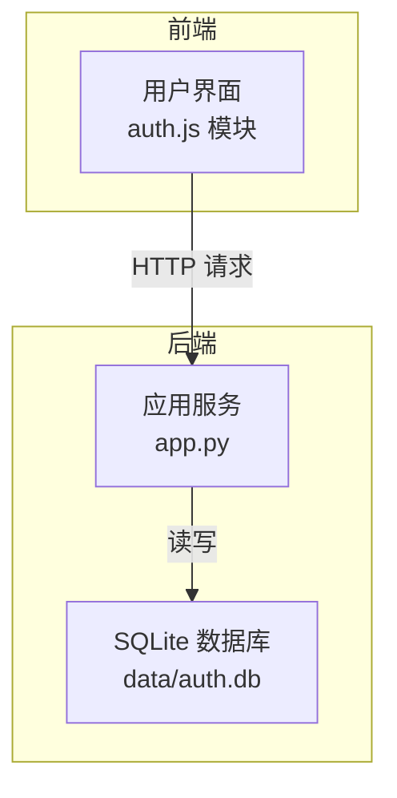
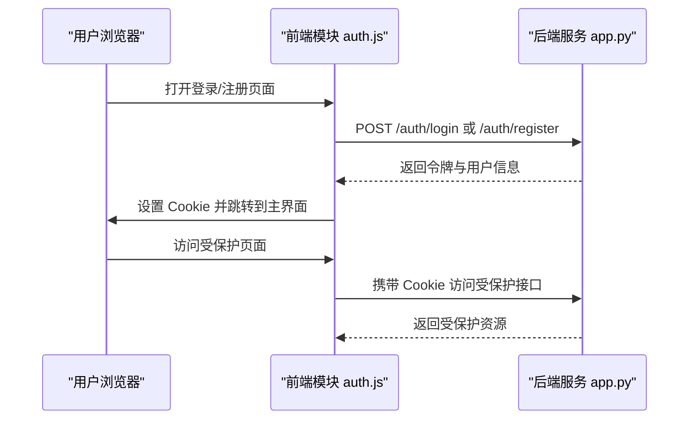
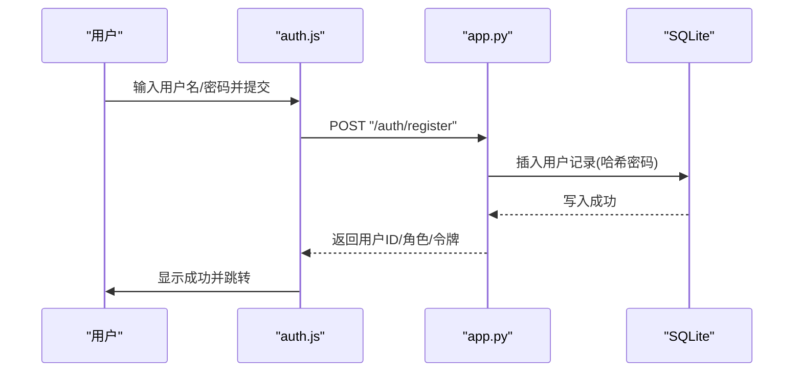
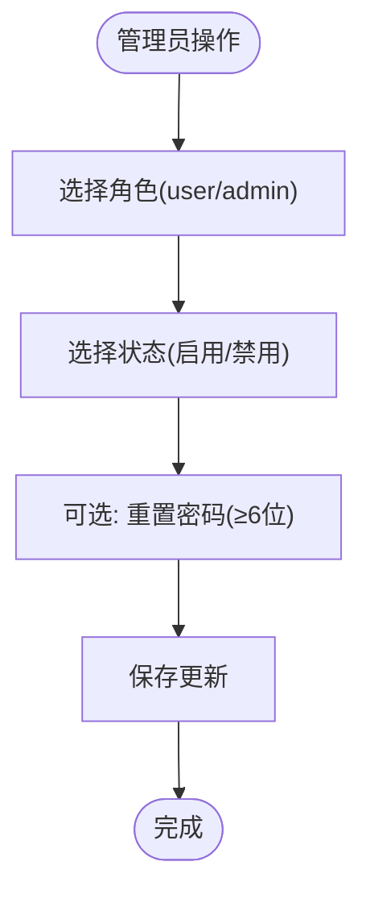
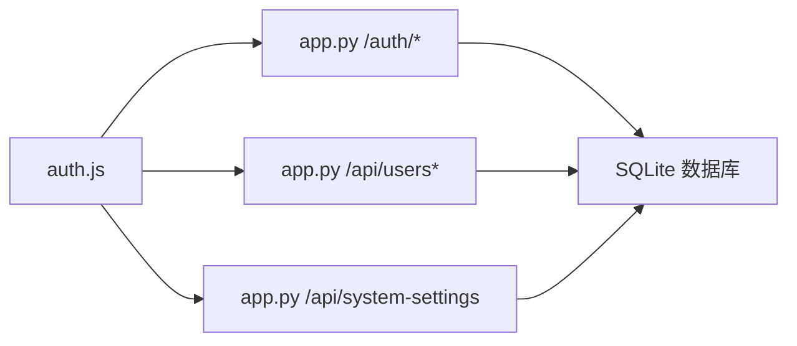

# 用户账户管理

<cite>
**本文引用的文件**
- [app.py](file://app.py)
- [auth.js](file://static/js/modules/auth.js)
- [V4_PHASE1_IMPLEMENTATION.md](file://docs/archive/root-md-2026-06-03/V4_PHASE1_IMPLEMENTATION.md)
- [module_loader.js](file://static/js/module_loader.js)
- [poll_manager.js](file://static/js/modules/poll_manager.js)
- [test_site_notifications_api.py](file://tests/test_site_notifications_api.py)
- [test_system_settings_api.py](file://tests/test_system_settings_api.py)
</cite>

## 目录
1. [简介](#简介)
2. [项目结构](#项目结构)
3. [核心组件](#核心组件)
4. [架构总览](#架构总览)
5. [详细组件分析](#详细组件分析)
6. [依赖关系分析](#依赖关系分析)
7. [性能考量](#性能考量)
8. [故障排除指南](#故障排除指南)
9. [结论](#结论)
10. [附录](#附录)

## 简介
本文件面向用户账户管理的使用与运维人员，系统性说明以下能力与流程：
- 用户注册：用户名与密码要求、邮箱验证（如有）等
- 权限管理：普通用户与管理员权限差异、权限分配与撤销
- 密码管理：密码修改、密码重置、密码强度要求
- 用户状态管理：启用/禁用、账户锁定/解锁
- 个人信息管理：头像上传、偏好设置
- 批量管理：批量导入、导出用户数据
- 最佳实践与安全建议

说明：当前仓库未发现邮箱验证与头像上传、偏好设置的具体实现；本文在“最佳实践与安全建议”中给出建议与替代方案。

## 项目结构
用户账户管理由前端模块与后端服务共同实现：
- 前端模块负责用户界面交互、表单校验、调用后端 API
- 后端服务负责认证鉴权、数据库持久化、权限控制与业务逻辑

图表来源
- [auth.js](file://static/js/modules/auth.js)
- [app.py](file://app.py)

章节来源
- [auth.js](file://static/js/modules/auth.js)
- [app.py](file://app.py)

## 核心组件
- 认证与会话
  - 登录/登出、获取当前用户信息、修改密码
- 用户管理（管理员）
  - 列表查询、创建、更新（角色、状态、密码）、删除
- 系统设置（管理员）
  - 图片保护、提示词规则等系统级配置

章节来源
- [app.py](file://app.py)
- [auth.js](file://static/js/modules/auth.js)

## 架构总览
用户账户管理采用前后端分离模式：
- 前端通过 fetch 调用后端 REST 接口，携带 Cookie 与 CSRF 头
- 后端基于 SQLite 存储用户信息，使用 JWT 进行身份标识
- 管理员权限通过依赖注入进行保护

图表来源
- [auth.js](file://static/js/modules/auth.js)
- [app.py](file://app.py)

## 详细组件分析

### 用户注册流程
- 前端校验
  - 用户名与密码非空
  - 注册时需二次确认密码一致
- 后端校验与处理
  - 用户名长度与密码长度下限
  - 首个用户自动提升为管理员
  - 密码使用 bcrypt 哈希存储
  - 成功后签发 JWT 并设置 Cookie

图表来源
- [auth.js](file://static/js/modules/auth.js)
- [app.py](file://app.py)

章节来源
- [auth.js](file://static/js/modules/auth.js)
- [app.py](file://app.py)

### 登录与会话管理
- 前端
  - 登录时校验用户名/密码非空
  - 错误映射为友好提示
- 后端
  - 查询用户并校验是否禁用
  - 使用 bcrypt 校验密码
  - 成功后签发 JWT 并设置 Cookie

章节来源
- [auth.js](file://static/js/modules/auth.js)
- [app.py](file://app.py)

### 密码管理
- 修改密码
  - 当前密码正确性校验
  - 新密码长度下限
  - bcrypt 哈希更新
- 密码重置
  - 代码库未提供“忘记密码/邮件重置”的实现
  - 建议通过管理员在后台重置密码

章节来源
- [auth.js](file://static/js/modules/auth.js)
- [app.py](file://app.py)

### 用户权限管理
- 角色
  - user：普通用户
  - admin：管理员，拥有受保护接口访问权限
- 权限差异
  - 管理员可访问 /api/users、/api/system-settings 等
  - 非管理员访问将被拒绝
- 分配与撤销
  - 管理员通过更新用户角色完成
  - 禁用/启用通过更新 disabled 字段完成

图表来源
- [app.py](file://app.py)
- [auth.js](file://static/js/modules/auth.js)

章节来源
- [app.py](file://app.py)
- [auth.js](file://static/js/modules/auth.js)

### 用户状态管理
- 启用/禁用
  - 管理员可切换用户状态
  - 不允许自我禁用
- 账户锁定/解锁
  - 通过禁用/启用实现
- 删除用户
  - 管理员可删除其他用户
  - 不允许自我删除

章节来源
- [app.py](file://app.py)
- [auth.js](file://static/js/modules/auth.js)

### 个人信息管理
- 当前实现
  - 获取当前用户信息（含角色、是否禁用、头像、创建时间）
  - 修改密码
- 未实现
  - 头像上传
  - 偏好设置
- 建议
  - 在后端新增头像上传接口与偏好设置接口
  - 前端增加对应 UI 与校验

章节来源
- [app.py](file://app.py)
- [auth.js](file://static/js/modules/auth.js)

### 批量管理
- 当前实现
  - 列出所有用户
  - 管理员可逐个创建/更新/删除
- 批量导入/导出
  - 代码库未提供批量导入/导出接口
  - 建议通过数据库备份/恢复或 CSV 导入工具实现

章节来源
- [app.py](file://app.py)
- [auth.js](file://static/js/modules/auth.js)

### 系统设置（管理员）
- 图片保护、提示词规则等系统级配置
- 管理员可读取与更新

章节来源
- [auth.js](file://static/js/modules/auth.js)
- [app.py](file://app.py)
- [test_system_settings_api.py](file://tests/test_system_settings_api.py)

## 依赖关系分析
- 前端依赖
  - auth.js 依赖后端 REST 接口
  - 依赖模块加载器确保认证状态恢复后再加载其他模块
- 后端依赖
  - SQLite 存储用户数据
  - bcrypt 进行密码哈希
  - JWT 进行身份标识
  - 管理员权限通过依赖注入保护

图表来源
- [auth.js](file://static/js/modules/auth.js)
- [app.py](file://app.py)

章节来源
- [auth.js](file://static/js/modules/auth.js)
- [app.py](file://app.py)
- [module_loader.js](file://static/js/module_loader.js)
- [poll_manager.js](file://static/js/modules/poll_manager.js)

## 性能考量
- 前端
  - 使用缓存破坏策略避免陈旧数据
  - 按需加载与延迟初始化
- 后端
  - SQLite 适合小中型部署
  - 对高频接口考虑连接池与索引优化
- 安全
  - 速率限制与防暴力破解
  - HTTPS 传输与安全 Cookie

## 故障排除指南
- 常见错误与提示
  - 用户名或密码为空
  - 用户名已存在
  - 用户名或密码错误
  - 账号已被禁用
  - 新密码过短
  - 自己不能禁用/删除自己
- 前端处理
  - 统一错误映射为中文提示
  - 登录/注册按钮禁用与重新尝试
- 后端处理
  - 严格的参数校验与异常返回
  - 管理员权限校验失败返回 403

章节来源
- [auth.js](file://static/js/modules/auth.js)
- [app.py](file://app.py)

## 结论
该用户账户管理体系以 JWT + SQLite 为基础，提供了完整的注册、登录、密码管理与管理员用户管理能力。对于头像上传、偏好设置与批量导入导出，当前代码库尚未实现，建议按“最佳实践与安全建议”逐步扩展。

## 附录

### API 摘要（后端）
- 认证
  - POST /auth/register：注册
  - POST /auth/login：登录
  - POST /auth/logout：登出
  - POST /auth/me：获取当前用户
  - POST /auth/change-password：修改密码
- 用户管理（管理员）
  - GET /api/users：列出用户
  - PUT /api/users/{user_id}：更新用户
  - DELETE /api/users/{user_id}：删除用户
- 系统设置（管理员）
  - GET /api/system-settings：读取
  - PUT /api/system-settings：更新

章节来源
- [app.py](file://app.py)

### 安全与最佳实践
- 密码安全
  - 强制密码最小长度
  - 使用 bcrypt 哈希
  - 禁止明文存储
- 身份与权限
  - JWT 密钥通过环境变量配置
  - 受限接口通过依赖注入保护
  - 管理员权限严格校验
- 用户体验
  - 提供清晰的错误提示
  - 支持速率限制防止暴力破解
- 功能扩展建议
  - 邮箱验证：添加邮箱字段与验证码流程
  - 头像上传：后端接口与静态资源路径
  - 偏好设置：用户个性化配置项
  - 批量导入/导出：CSV/JSON 导入导出工具

章节来源
- [V4_PHASE1_IMPLEMENTATION.md](file://docs/archive/root-md-2026-06-03/V4_PHASE1_IMPLEMENTATION.md)
- [app.py](file://app.py)
- [auth.js](file://static/js/modules/auth.js)