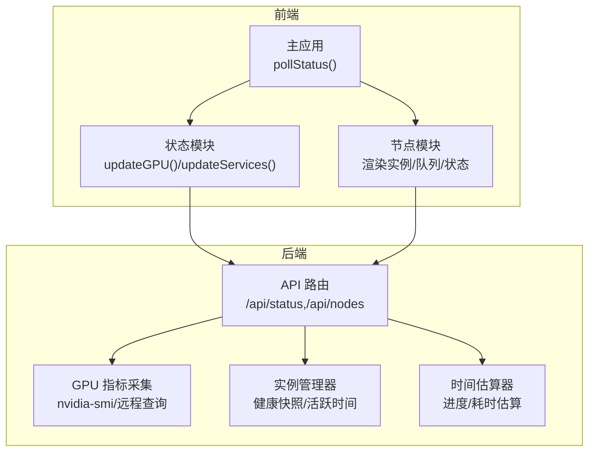
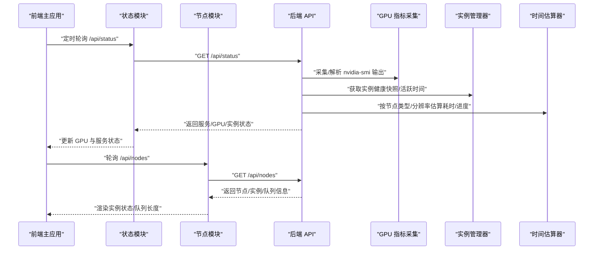
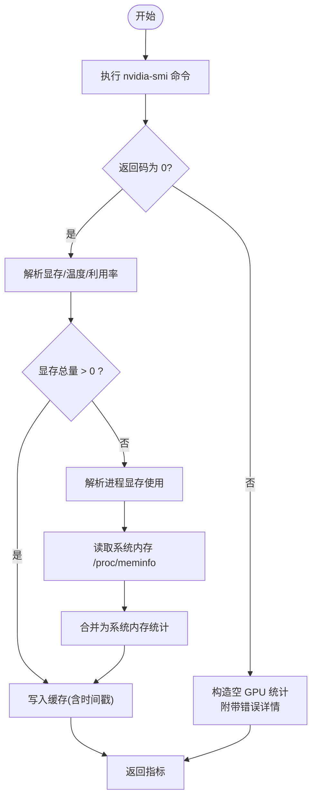
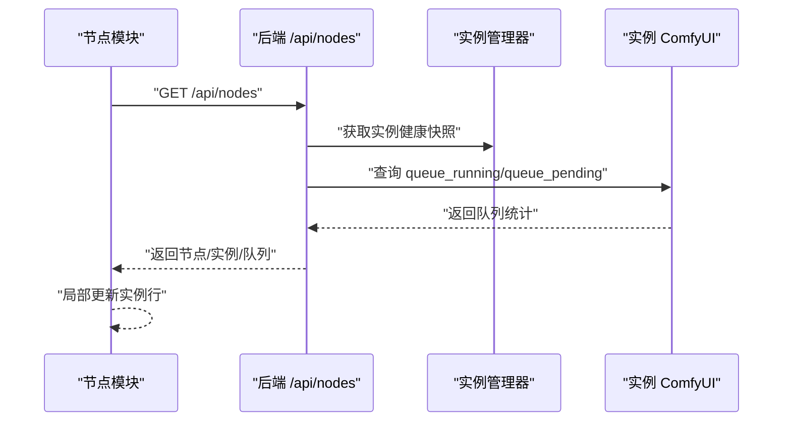
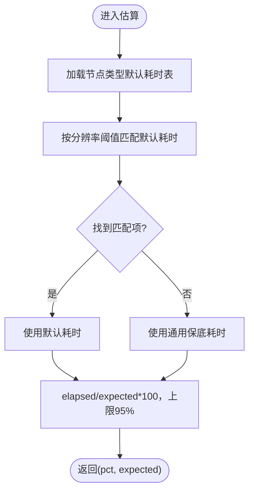
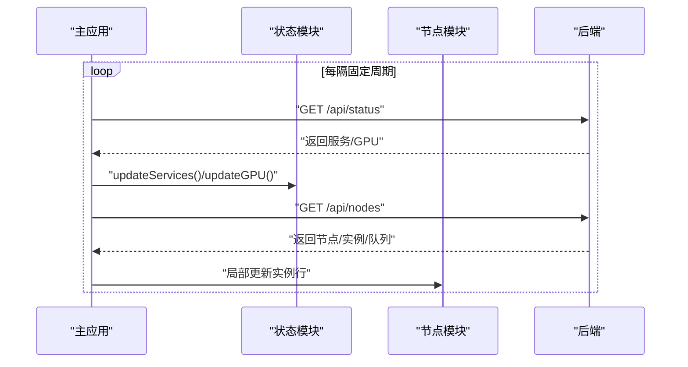
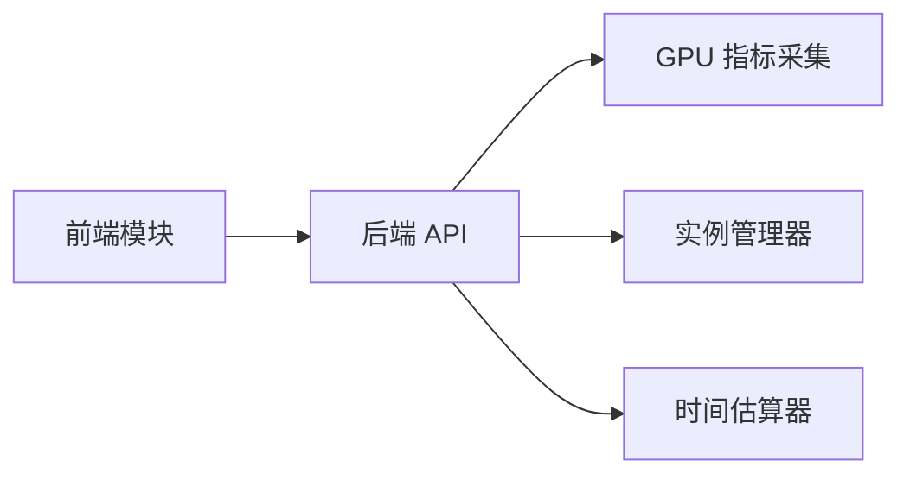

# 监控仪表板

<cite>
**本文引用的文件**
- [app.py](file://app.py)
- [status.js](file://static/js/modules/status.js)
- [nodes.js](file://static/js/modules/nodes.js)
- [app.js](file://static/js/app.js)
- [instance_manager.py](file://modules/instance_manager.py)
- [time_estimator.py](file://modules/time_estimator.py)
- [test_status_gpu_message.py](file://tests/test_status_gpu_message.py)
- [test_site_notifications_api.py](file://tests/test_site_notifications_api.py)
- [STATUS_INDICATOR_SPEC.md](file://docs/archive/root-md-2026-06-03/STATUS_INDICATOR_SPEC.md)
</cite>

## 目录
1. [简介](#简介)
2. [项目结构](#项目结构)
3. [核心组件](#核心组件)
4. [架构总览](#架构总览)
5. [详细组件分析](#详细组件分析)
6. [依赖关系分析](#依赖关系分析)
7. [性能考量](#性能考量)
8. [故障排查指南](#故障排查指南)
9. [结论](#结论)
10. [附录](#附录)

## 简介
本文件面向“系统监控仪表板”的使用与运维，聚焦以下能力：
- 实时状态监控：GPU 使用率、内存占用、温度、CPU 利用率等关键指标的实时显示
- 系统健康度评估：实例状态、任务队列长度、响应时间等健康指标
- 告警机制配置：阈值设置、告警规则、通知方式
- 性能分析工具：历史趋势分析、瓶颈识别、容量规划
- 可视化展示：图表类型、数据聚合、时间范围选择
- 数据导出与报告：监控数据的导出与报告生成
- 最佳实践与预警策略：监控最佳实践与故障预警策略

## 项目结构
监控相关的前端与后端模块分布如下：
- 后端
  - 应用入口与 API：负责系统状态聚合、节点与实例健康检查、GPU 指标采集与缓存
  - 实例管理器：维护实例健康快照、活跃时间、防御期判定
  - 时间估算器：基于节点类型与分辨率的历史经验，估算任务耗时与进度
- 前端
  - 状态模块：轮询后端状态接口，渲染 GPU 与服务状态
  - 节点模块：渲染节点与实例状态卡片、队列长度、状态指示灯
  - 主应用：定时轮询状态，驱动 UI 更新

**图表来源**
- [app.js:147-158](file://static/js/app.js#L147-L158)
- [status.js](file://static/js/modules/status.js)
- [nodes.js:357-543](file://static/js/modules/nodes.js#L357-L543)
- [app.py](file://app.py)
- [instance_manager.py:167-214](file://modules/instance_manager.py#L167-L214)
- [time_estimator.py:76-106](file://modules/time_estimator.py#L76-L106)

**章节来源**
- [app.js:147-158](file://static/js/app.js#L147-L158)
- [status.js](file://static/js/modules/status.js)
- [nodes.js:357-543](file://static/js/modules/nodes.js#L357-L543)
- [app.py](file://app.py)
- [instance_manager.py:167-214](file://modules/instance_manager.py#L167-L214)
- [time_estimator.py:76-106](file://modules/time_estimator.py#L76-L106)

## 核心组件
- 实时状态轮询与渲染
  - 前端通过定时轮询后端状态接口，拉取服务与 GPU 指标，并更新 UI
  - GPU 指标包含显存使用、显存总量、温度、利用率、系统内存等
- 节点与实例健康度
  - 节点级健康：HTTP 服务可用性、SSH 连接、systemd 状态
  - 实例级健康：运行/空闲/离线/死亡状态；队列长度（进行中/待处理）
- 健康快照与活跃时间
  - 实例管理器维护健康快照与活跃时间，支持防御期（刚启动）避免误判
- 响应时间与进度估算
  - 基于节点类型与分辨率的经验估算，输出进度百分比与剩余时间

**章节来源**
- [app.js:147-158](file://static/js/app.js#L147-L158)
- [status.js](file://static/js/modules/status.js)
- [nodes.js:357-543](file://static/js/modules/nodes.js#L357-L543)
- [instance_manager.py:167-214](file://modules/instance_manager.py#L167-L214)
- [time_estimator.py:76-106](file://modules/time_estimator.py#L76-L106)

## 架构总览
下图展示了从前端轮询到后端聚合再到前端渲染的整体流程。

**图表来源**
- [app.js:147-158](file://static/js/app.js#L147-L158)
- [status.js](file://static/js/modules/status.js)
- [nodes.js:357-543](file://static/js/modules/nodes.js#L357-L543)
- [app.py](file://app.py)
- [instance_manager.py:167-214](file://modules/instance_manager.py#L167-L214)
- [time_estimator.py:76-106](file://modules/time_estimator.py#L76-L106)

## 详细组件分析

### GPU 指标采集与缓存
- 指标来源
  - 本地或远程节点通过 nvidia-smi 查询显存使用、显存总量、温度、GPU 利用率
  - 若无法直接获取显存使用，则回退解析进程占用与系统内存
- 缓存与过期
  - 将最近一次有效数据写入缓存，并记录时间戳
  - 当缓存超过 TTL（陈旧阈值）时，仍可返回带“stale”标记的缓存数据，附带错误详情
- 错误处理
  - SSH 失败或命令执行失败时，构造“暂不可用”的消息与详细原因，避免将连接细节泄露到用户可见消息中

**图表来源**
- [app.py:3460-3625](file://app.py#L3460-L3625)

**章节来源**
- [app.py:3460-3625](file://app.py#L3460-L3625)
- [test_status_gpu_message.py:1-33](file://tests/test_status_gpu_message.py#L1-L33)
- [test_status_gpu_message.py:134-155](file://tests/test_status_gpu_message.py#L134-L155)

### 实例健康度与队列长度
- 健康度来源
  - HTTP 服务可用性、SSH 连通性、systemd 状态
  - 实例状态：running/idle/dead/offline
- 队列长度
  - 从实例的 ComfyUI 接口获取“进行中/待处理”队列长度，并汇总到实例状态
- 前端渲染
  - 节点页面按实例行局部更新，包括状态点颜色、状态文本、队列显示

**图表来源**
- [nodes.js:357-543](file://static/js/modules/nodes.js#L357-L543)
- [app.py:8903-8923](file://app.py#L8903-L8923)
- [instance_manager.py:167-214](file://modules/instance_manager.py#L167-L214)

**章节来源**
- [nodes.js:357-543](file://static/js/modules/nodes.js#L357-L543)
- [app.py:8903-8923](file://app.py#L8903-L8923)
- [instance_manager.py:167-214](file://modules/instance_manager.py#L167-L214)
- [test_status_gpu_message.py:134-155](file://tests/test_status_gpu_message.py#L134-L155)

### 响应时间与进度估算
- 估算逻辑
  - 基于节点类型与分辨率提示，返回期望耗时与当前进度百分比
  - 进度上限保留 5%，用于 completing 状态
- 用途
  - 为任务队列长度与等待时间提供更直观的“剩余时间”参考

**图表来源**
- [time_estimator.py:76-106](file://modules/time_estimator.py#L76-L106)

**章节来源**
- [time_estimator.py:76-106](file://modules/time_estimator.py#L76-L106)

### 前端状态轮询与渲染
- 轮询策略
  - 主应用定时请求 /api/status，分别更新服务与 GPU 区域
- 渲染策略
  - 状态模块根据返回数据更新 GPU 指标与服务可用性
  - 节点模块按需局部更新实例行，避免整页闪烁

**图表来源**
- [app.js:147-158](file://static/js/app.js#L147-L158)
- [status.js](file://static/js/modules/status.js)
- [nodes.js:357-543](file://static/js/modules/nodes.js#L357-L543)

**章节来源**
- [app.js:147-158](file://static/js/app.js#L147-L158)
- [status.js](file://static/js/modules/status.js)
- [nodes.js:357-543](file://static/js/modules/nodes.js#L357-L543)

### 健康状态指示与样式规范
- 状态指示
  - idle=绿色、running=橙色、dead=红色、offline=灰色
  - 启动中/停止中支持闪烁动画
- 规范与验证
  - 文档中明确了状态点颜色与闪烁行为的完成条件

**章节来源**
- [STATUS_INDICATOR_SPEC.md:66-72](file://docs/archive/root-md-2026-06-03/STATUS_INDICATOR_SPEC.md#L66-L72)

## 依赖关系分析
- 前端依赖后端 API 提供统一状态数据
- 后端依赖 GPU 指标采集模块与实例管理器
- 健康度与队列长度相互独立但共同决定系统健康度

**图表来源**
- [app.js:147-158](file://static/js/app.js#L147-L158)
- [status.js](file://static/js/modules/status.js)
- [nodes.js:357-543](file://static/js/modules/nodes.js#L357-L543)
- [app.py](file://app.py)
- [instance_manager.py:167-214](file://modules/instance_manager.py#L167-L214)
- [time_estimator.py:76-106](file://modules/time_estimator.py#L76-L106)

**章节来源**
- [app.js:147-158](file://static/js/app.js#L147-L158)
- [status.js](file://static/js/modules/status.js)
- [nodes.js:357-543](file://static/js/modules/nodes.js#L357-L543)
- [app.py](file://app.py)
- [instance_manager.py:167-214](file://modules/instance_manager.py#L167-L214)
- [time_estimator.py:76-106](file://modules/time_estimator.py#L76-L106)

## 性能考量
- 轮询频率与开销
  - 建议合理设置轮询间隔，避免对后端与网络造成压力
- 缓存与陈旧数据
  - GPU 指标缓存与 TTL 有助于在采集失败时维持可用视图，但需注意“stale”标记与年龄提示
- 队列长度与响应时间
  - 结合时间估算器的进度与耗时，可辅助判断是否需要扩容或限流

[本节为通用建议，无需特定文件引用]

## 故障排查指南
- GPU 指标不可用
  - 现象：显示“VRAM 暂不可用”，并附带详细错误
  - 排查：确认 SSH 连通性、nvidia-smi 可用性、远程节点权限
  - 参考测试：验证错误详情未被误用为用户可见消息
- 实例状态异常
  - 现象：实例状态为 dead/offline，或队列长时间堆积
  - 排查：检查 HTTP 服务、SSH、systemd 状态；查看实例健康快照与活跃时间
- 通知与告警
  - 站点通知：管理员可创建通知，用户可“暂时忽略”，直到新通知出现
  - 建议：结合实例状态与队列长度设定阈值告警，如队列超长、实例长期离线

**章节来源**
- [test_status_gpu_message.py:1-33](file://tests/test_status_gpu_message.py#L1-L33)
- [test_status_gpu_message.py:134-155](file://tests/test_status_gpu_message.py#L134-L155)
- [test_site_notifications_api.py:65-100](file://tests/test_site_notifications_api.py#L65-L100)

## 结论
本监控仪表板通过前后端协同，实现了对 GPU 指标、节点与实例健康度、任务队列与响应时间的实时可视化。配合健康快照与时间估算，可为容量规划与瓶颈识别提供依据；通过站点通知机制，可将重要告警传达给用户。建议在生产环境中合理设置轮询频率、阈值与告警策略，并结合历史趋势进行容量规划。

[本节为总结，无需特定文件引用]

## 附录

### 实时状态监控功能清单
- GPU 使用率、显存使用/总量、温度、CPU 利用率
- 系统内存使用与总量
- 前端轮询刷新与缓存陈旧提示

**章节来源**
- [app.py:3460-3625](file://app.py#L3460-L3625)
- [app.js:147-158](file://static/js/app.js#L147-L158)

### 系统健康度评估指标
- 实例状态：running/idle/dead/offline
- 节点健康：HTTP/SSH/systemd
- 任务队列：queue_running/queue_pending
- 响应时间：基于节点类型与分辨率的估算

**章节来源**
- [nodes.js:357-543](file://static/js/modules/nodes.js#L357-L543)
- [app.py:8903-8923](file://app.py#L8903-L8923)
- [time_estimator.py:76-106](file://modules/time_estimator.py#L76-L106)

### 告警机制配置建议
- 阈值设置
  - 队列长度：例如 pending+running 超过阈值触发告警
  - 实例状态：连续一段时间 dead/offline 触发告警
  - GPU 指标：显存使用率/温度/利用率异常
- 告警规则
  - 持续时间：超过 N 分钟才触发，避免瞬时波动
  - 降噪：同一实例/节点的同类告警去重
- 通知方式
  - 站点通知：管理员发布，用户可暂时忽略至新通知出现
  - 邮件/IM：结合外部集成（本仓库未内置）

**章节来源**
- [test_site_notifications_api.py:65-100](file://tests/test_site_notifications_api.py#L65-L100)

### 性能分析工具使用指南
- 历史趋势分析
  - 基于缓存的 GPU 指标与队列长度，结合时间序列存储（本仓库未内置），可绘制趋势图
- 瓶颈识别
  - 关注队列堆积、实例频繁 dead、GPU 利用率低但显存占用高
- 容量规划
  - 依据时间估算器的期望耗时与队列长度，推导并发与资源配额

**章节来源**
- [time_estimator.py:76-106](file://modules/time_estimator.py#L76-L106)
- [instance_manager.py:167-214](file://modules/instance_manager.py#L167-L214)

### 监控数据可视化展示
- 图表类型
  - 折线图：GPU 指标随时间变化
  - 柱状图：队列长度分布
  - 状态指示：圆形点颜色表示实例状态
- 数据聚合
  - 按节点/实例聚合，支持分组与筛选
- 时间范围
  - 支持近 1 小时/1 天/1 周等时间窗口切换

[本节为通用建议，无需特定文件引用]

### 监控数据导出与报告
- 导出
  - 可将节点/实例状态、队列统计、GPU 指标导出为 CSV/JSON
- 报告
  - 周报/月报：汇总健康度、队列峰值、GPU 使用率、实例可用性

[本节为通用建议，无需特定文件引用]

### 监控最佳实践与预警策略
- 最佳实践
  - 固定轮询间隔，避免过度拉取
  - 对 GPU 指标与队列长度设置分级告警
  - 记录并分析“stale”数据，定位采集链路问题
- 预警策略
  - 队列超长且实例空闲：可能任务过大或参数不当
  - 实例频繁重启：检查 systemd 与日志
  - GPU 温度过高：检查散热与负载

[本节为通用建议，无需特定文件引用]