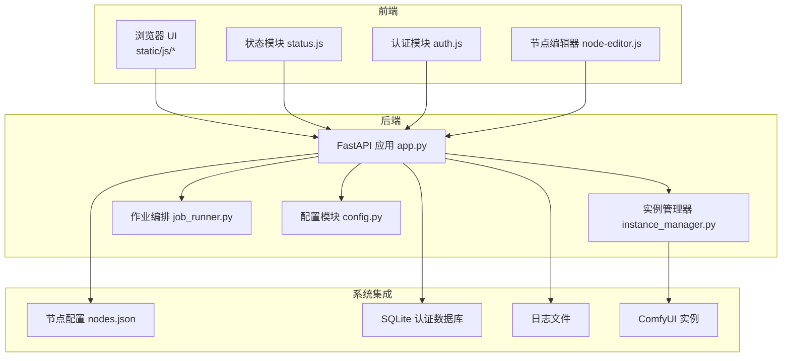
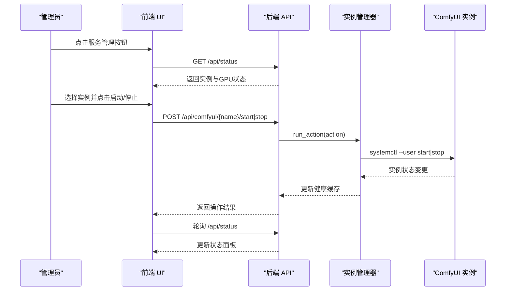
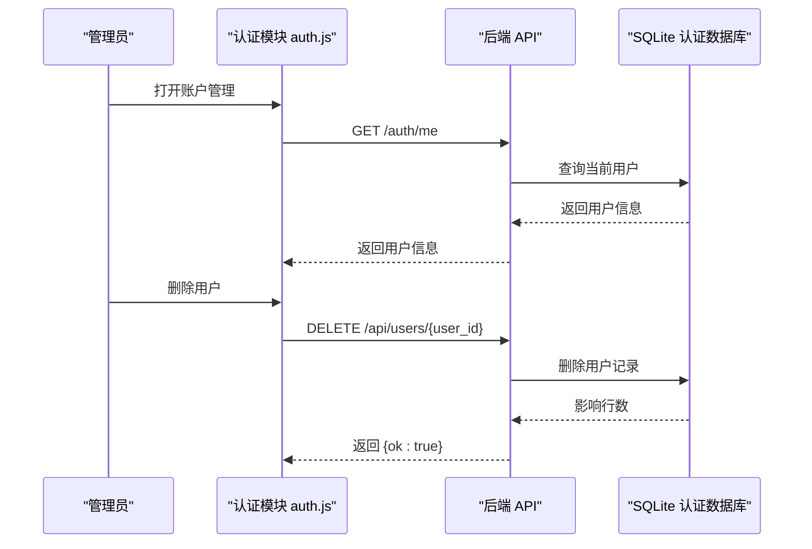
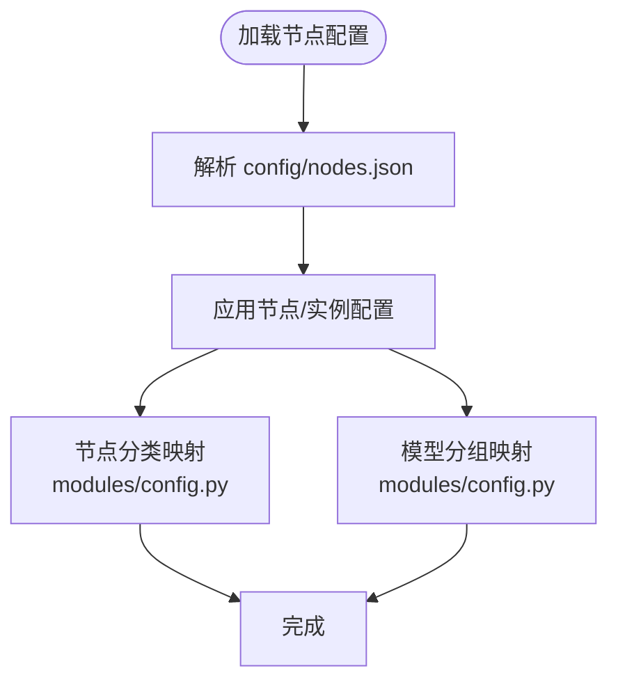
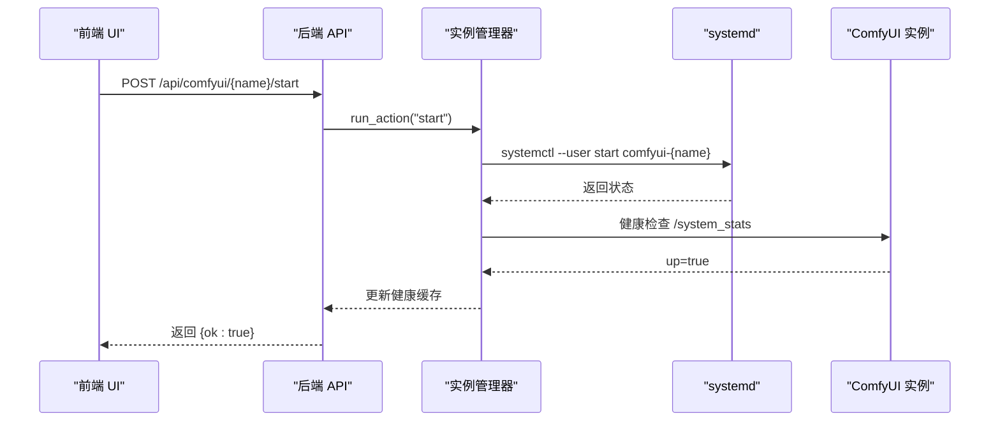
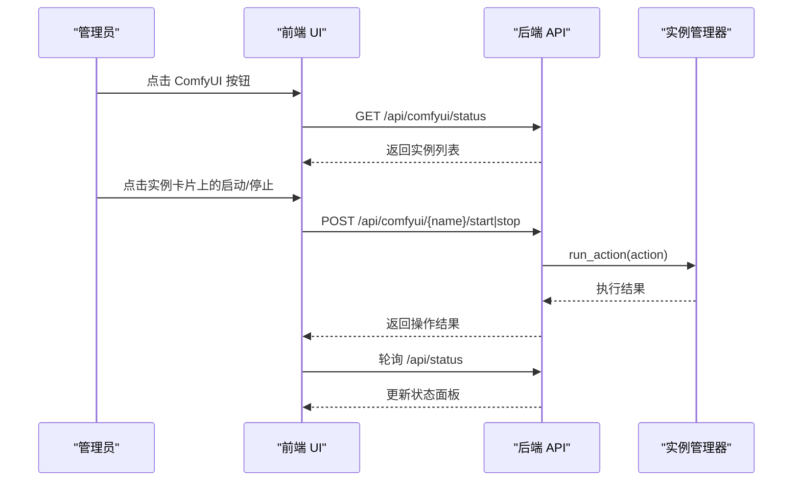
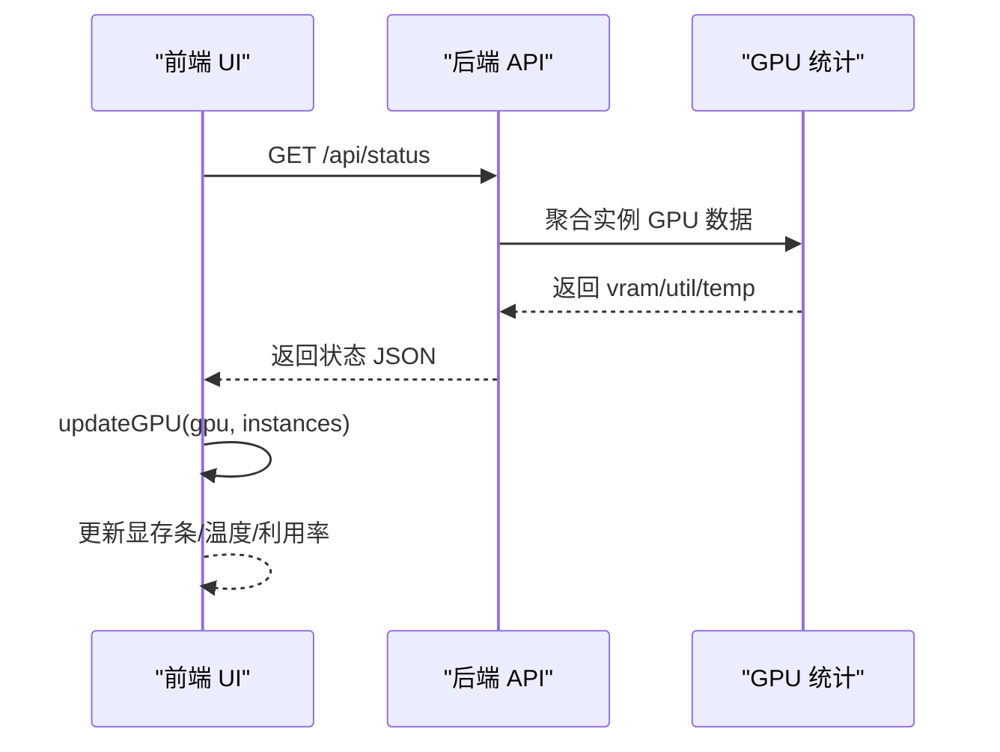
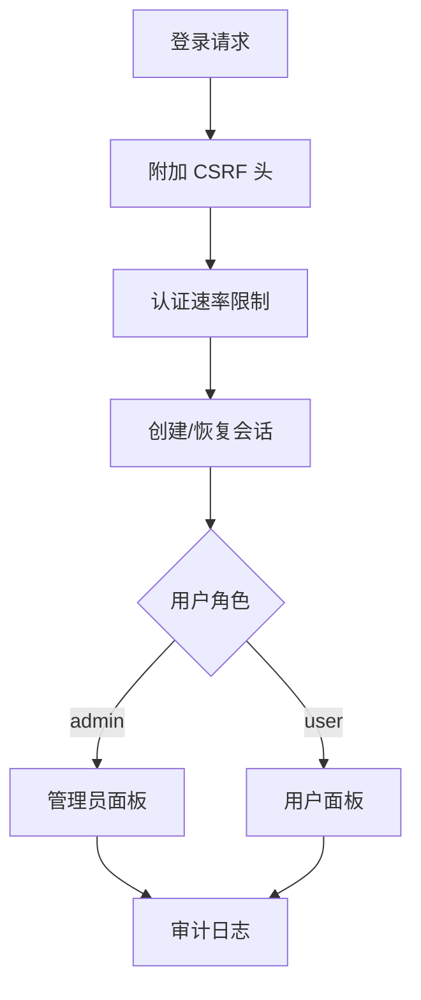
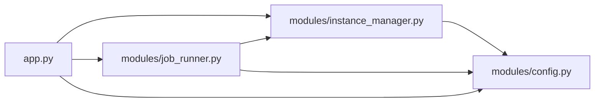

# 管理员指南

<cite>
**本文档引用的文件**
- [README.md](file://README.md)
- [app.py](file://app.py)
- [config/nodes.json](file://config/nodes.json)
- [modules/config.py](file://modules/config.py)
- [modules/instance_manager.py](file://modules/instance_manager.py)
- [modules/job_runner.py](file://modules/job_runner.py)
- [static/js/app.js](file://static/js/app.js)
- [static/js/modules/status.js](file://static/js/modules/status.js)
- [static/js/modules/auth.js](file://static/js/modules/auth.js)
- [static/js/modules/node-editor.js](file://static/js/modules/node-editor.js)
</cite>

## 目录
1. [简介](#简介)
2. [项目结构](#项目结构)
3. [核心组件](#核心组件)
4. [架构总览](#架构总览)
5. [详细组件分析](#详细组件分析)
6. [依赖关系分析](#依赖关系分析)
7. [性能考虑](#性能考虑)
8. [故障排除指南](#故障排除指南)
9. [结论](#结论)
10. [附录](#附录)

## 简介
本指南面向 Ez ComfyUI Showcase 的系统管理员，提供完整的运维与管理操作手册。内容涵盖用户账户管理、系统配置管理、实例生命周期管理、GPU 监控、安全配置、系统维护与故障排除等。所有操作均基于前端 UI 与后端 API 的协作实现，管理员可通过浏览器内的服务管理面板完成 ComfyUI 实例的一键启停与健康监控。

## 项目结构
系统采用前后端分离架构：后端基于 FastAPI 提供 REST API 与 WebSocket 支持，前端使用原生 JavaScript 模块化构建，通过统一的 API 基础地址与后端交互。核心目录与职责如下：
- config：系统配置文件（如节点与实例配置）
- modules：后端业务模块（实例管理、作业编排、节点分类等）
- static：前端静态资源（HTML、CSS、JS 模块）
- data：运行时数据与持久化存储（用户认证、日志、历史记录等）

**图表来源**
- [app.py](file://app.py)
- [modules/instance_manager.py](file://modules/instance_manager.py)
- [modules/job_runner.py](file://modules/job_runner.py)
- [modules/config.py](file://modules/config.py)
- [config/nodes.json](file://config/nodes.json)
- [static/js/app.js](file://static/js/app.js)
- [static/js/modules/status.js](file://static/js/modules/status.js)
- [static/js/modules/auth.js](file://static/js/modules/auth.js)
- [static/js/modules/node-editor.js](file://static/js/modules/node-editor.js)

**章节来源**
- [README.md:40-59](file://README.md#L40-L59)

## 核心组件
- 实例管理器（InstanceManager）：负责 ComfyUI 实例的健康检查、冷启动、空闲回收、死实例检测与生命周期动作（启动/停止/重启/强制重启）。
- 作业编排器（JobRunner）：串联实例选择、信号量控制、进度追踪、输出下载与历史入库，处理提交停滞、GPU 卡顿恢复等异常场景。
- 节点与模型分组（config.py）：定义节点分类与模型分组映射，支撑实例亲和路由与进度计算。
- 前端状态模块（status.js）：轮询后端 /api/status，渲染实例状态、GPU 使用率与温度、队列情况。
- 前端认证模块（auth.js）：提供登录/注册/会话管理、用户管理（管理员）、系统设置（管理员）能力。
- 节点编辑器（node-editor.js）：可视化工作流参数编辑、字段可见性与排序配置。

**章节来源**
- [modules/instance_manager.py:43-532](file://modules/instance_manager.py#L43-L532)
- [modules/job_runner.py:93-1086](file://modules/job_runner.py#L93-L1086)
- [modules/config.py:11-151](file://modules/config.py#L11-L151)
- [static/js/modules/status.js:330-659](file://static/js/modules/status.js#L330-L659)
- [static/js/modules/auth.js:269-326](file://static/js/modules/auth.js#L269-L326)
- [static/js/modules/node-editor.js:124-573](file://static/js/modules/node-editor.js#L124-L573)

## 架构总览
系统通过前端 UI 与后端 API 的交互实现全生命周期管理：
- 前端通过 /api/status 获取实例与 GPU 状态，周期性轮询更新。
- 管理员可在服务管理弹窗中对实例执行启动/停止/重启/强制重启。
- 作业编排器在后端协调实例冷启动、进度追踪与结果下载。
- 实例管理器负责健康检查与后台监控（死实例检测、空闲回收）。

**图表来源**
- [static/js/modules/status.js:330-387](file://static/js/modules/status.js#L330-L387)
- [modules/instance_manager.py:216-275](file://modules/instance_manager.py#L216-L275)
- [app.py:941-962](file://app.py#L941-L962)

## 详细组件分析

### 用户账户管理
管理员可通过前端账户管理界面进行用户注册、权限分配与密码管理：
- 登录/注册：前端 auth.js 调用 /auth/login 与 /auth/register，携带 CSRF 头与会话凭证。
- 会话管理：/auth/me 恢复会话，/auth/logout 清理会话并重载页面。
- 用户管理（管理员）：账户管理界面提供用户列表、删除用户（禁止删除自身）等操作。
- 密码管理：后端使用 bcrypt 存储密码哈希，管理员可重置用户密码（通过后端流程）。

**图表来源**
- [static/js/modules/auth.js:269-326](file://static/js/modules/auth.js#L269-L326)
- [app.py:8541-8551](file://app.py#L8541-L8551)

**章节来源**
- [static/js/modules/auth.js:269-326](file://static/js/modules/auth.js#L269-L326)
- [app.py:8541-8551](file://app.py#L8541-L8551)

### 系统配置管理
系统配置主要通过以下方式管理：
- 节点与实例配置：config/nodes.json 定义节点、实例、SSH 访问、代理 URL、扫描端口等。
- 节点分类与模型分组：modules/config.py 定义节点分类表与模型分组映射，影响进度计算与实例亲和路由。
- 工作流参数配置：前端节点编辑器（node-editor.js）支持为工作流字段设置可见性、标签、排序与类型约束，后端通过 /api/workflows/{name}/config 读写配置。

**图表来源**
- [config/nodes.json:1-57](file://config/nodes.json#L1-L57)
- [modules/config.py:11-151](file://modules/config.py#L11-L151)

**章节来源**
- [config/nodes.json:1-57](file://config/nodes.json#L1-L57)
- [modules/config.py:11-151](file://modules/config.py#L11-L151)
- [static/js/modules/node-editor.js:278-331](file://static/js/modules/node-editor.js#L278-L331)

### 实例管理功能
实例管理通过前端服务管理弹窗与后端 API 协作完成：
- 启动/停止/重启/强制重启：前端调用 /api/comfyui/{name}/start|stop|restart|force-restart，后端通过 InstanceManager 执行 systemctl --user 命令。
- 健康检查：后端定期检查 /system_stats，缓存健康状态，后台任务检测死实例并自动重启。
- 空闲回收：超过空闲超时且无活跃任务时自动停止实例以释放显存。

**图表来源**
- [static/js/modules/status.js:605-620](file://static/js/modules/status.js#L605-L620)
- [modules/instance_manager.py:216-275](file://modules/instance_manager.py#L216-L275)
- [app.py:941-962](file://app.py#L941-L962)

**章节来源**
- [static/js/modules/status.js:605-620](file://static/js/modules/status.js#L605-L620)
- [modules/instance_manager.py:216-275](file://modules/instance_manager.py#L216-L275)
- [app.py:941-962](file://app.py#L941-L962)

### 服务管理指南（浏览器内一键管理）
管理员可通过浏览器内的服务管理面板完成 ComfyUI 实例的生命周期管理：
- 打开服务管理弹窗：点击顶部状态栏的 ComfyUI 按钮，弹出实例卡片列表。
- 实时状态：弹窗展示每个实例的 up 状态、运行中任务数、排队任务数与当前工作流进度。
- 操作实例：点击“启动/停止”按钮，前端调用对应 API，后端通过 InstanceManager 执行 systemctl 命令。
- GPU 进程管理：弹窗可查看占用显存的其他进程，支持一键终止（kill）。

**图表来源**
- [static/js/modules/status.js:429-444](file://static/js/modules/status.js#L429-L444)
- [static/js/modules/status.js:462-558](file://static/js/modules/status.js#L462-L558)
- [static/js/modules/status.js:605-620](file://static/js/modules/status.js#L605-L620)

**章节来源**
- [static/js/modules/status.js:429-444](file://static/js/modules/status.js#L429-L444)
- [static/js/modules/status.js:462-558](file://static/js/modules/status.js#L462-L558)
- [static/js/modules/status.js:605-620](file://static/js/modules/status.js#L605-L620)

### GPU 监控系统
GPU 监控通过前端 status.js 轮询后端 /api/status 获取 GPU 使用率、温度与显存占比，并在状态栏动态展示：
- 数据来源：后端聚合各实例 GPU 信息，前端根据当前目标实例或活动实例选择展示数据。
- 实时更新：每 5 秒轮询一次，更新显存条宽度、温度与利用率文本。
- 视觉反馈：根据使用率与温度动态切换状态栏颜色（空闲/忙碌/过载）。

**图表来源**
- [static/js/modules/status.js:330-387](file://static/js/modules/status.js#L330-L387)
- [static/js/modules/status.js:389-427](file://static/js/modules/status.js#L389-L427)

**章节来源**
- [static/js/modules/status.js:330-387](file://static/js/modules/status.js#L330-L387)
- [static/js/modules/status.js:389-427](file://static/js/modules/status.js#L389-L427)

### 安全配置选项
系统内置多项安全措施：
- 认证与会话：JWT 密钥自动生成并存储于 data/jwt_secret.key，支持会话恢复与注销。
- CSRF 保护：前端在非安全方法请求时附加 X-CSRF-Token 头，后端进行速率限制与防暴力破解。
- 权限控制：管理员角色可访问用户管理与系统设置，普通用户仅能访问个人账户与历史记录。
- 日志审计：后端维护内存与文件日志缓冲，记录关键事件（启动/停止/重启/错误等），支持持久化。

**图表来源**
- [static/js/modules/auth.js:74-105](file://static/js/modules/auth.js#L74-L105)
- [app.py:2545-2558](file://app.py#L2545-L2558)
- [app.py:8554-8561](file://app.py#L8554-L8561)

**章节来源**
- [static/js/modules/auth.js:74-105](file://static/js/modules/auth.js#L74-L105)
- [app.py:2545-2558](file://app.py#L2545-L2558)
- [app.py:8554-8561](file://app.py#L8554-L8561)

### 系统维护与故障排除
- 常见问题诊断
  - 实例无法启动：检查 /api/status 中实例 up 状态与队列运行/排队数量；查看后端日志定位错误。
  - 提交后无响应：前端会自动尝试清理队列与中断，必要时强制重启实例。
  - GPU 卡顿：系统检测 60 秒窗口内无波动自动重启任务，最多重试 3 次。
- 性能优化建议
  - 合理设置空闲超时，避免长时间占用显存。
  - 使用节点编辑器优化工作流字段可见性与默认值，减少生成前配置成本。
- 备份与恢复
  - 认证数据库与日志位于 data/ 目录，建议定期备份。
  - 工作流配置通过 /api/workflows/{name}/config 读写，可导出/导入以实现版本管理。

**章节来源**
- [modules/job_runner.py:716-768](file://modules/job_runner.py#L716-L768)
- [modules/instance_manager.py:334-375](file://modules/instance_manager.py#L334-L375)
- [app.py:159-176](file://app.py#L159-L176)

## 依赖关系分析
后端模块之间的耦合与协作：
- app.py 作为入口，注入实例管理器、作业编排器、WSTracker 等组件，提供 REST API 与 WebSocket。
- instance_manager.py 依赖 systemd 与网络探测实现健康检查与生命周期管理。
- job_runner.py 依赖 instance_manager、ws_tracker、step_calculator 等模块完成端到端生成流程。
- config.py 提供节点分类与模型分组常量，被多个模块引用。

**图表来源**
- [app.py](file://app.py)
- [modules/instance_manager.py](file://modules/instance_manager.py)
- [modules/job_runner.py](file://modules/job_runner.py)
- [modules/config.py](file://modules/config.py)

**章节来源**
- [app.py](file://app.py)
- [modules/instance_manager.py:43-532](file://modules/instance_manager.py#L43-L532)
- [modules/job_runner.py:93-1086](file://modules/job_runner.py#L93-L1086)
- [modules/config.py:11-151](file://modules/config.py#L11-L151)

## 性能考虑
- 实例健康缓存：InstanceManager 对健康状态进行缓存，降低频繁探测带来的开销。
- 信号量控制：作业编排器为每个实例设置并发信号量，避免多任务同时抢占显存。
- 空闲回收：后台任务定期停止长时间空闲的实例，释放显存资源。
- GPU 卡顿自愈：检测到 GPU 静止窗口后自动重启任务，提升系统鲁棒性。

**章节来源**
- [modules/instance_manager.py:152-182](file://modules/instance_manager.py#L152-L182)
- [modules/job_runner.py:201-232](file://modules/job_runner.py#L201-L232)
- [modules/instance_manager.py:322-375](file://modules/instance_manager.py#L322-L375)
- [modules/job_runner.py:671-736](file://modules/job_runner.py#L671-L736)

## 故障排除指南
- 实例启动失败
  - 检查 /api/comfyui/status 中实例 up 状态与队列情况。
  - 在服务管理弹窗中尝试“重启/强制重启”，观察后端日志。
- 生成任务卡住
  - 前端会自动检测并尝试清理队列与中断，必要时强制重启实例。
  - 查看后端日志定位具体错误（连接被拒、超时等）。
- GPU 过载/温度过高
  - 通过状态栏颜色与数值判断，适当降低并发或调整空闲超时。
  - 检查是否有其他进程占用显存，必要时在弹窗中终止相关进程。

**章节来源**
- [static/js/modules/status.js:389-427](file://static/js/modules/status.js#L389-L427)
- [modules/job_runner.py:716-768](file://modules/job_runner.py#L716-L768)
- [app.py:296-303](file://app.py#L296-L303)

## 结论
本指南提供了 Ez ComfyUI Showcase 的完整管理员操作手册，涵盖用户管理、系统配置、实例生命周期、GPU 监控与安全配置等方面。通过浏览器内的服务管理面板，管理员可以高效地完成 ComfyUI 实例的启停与监控；借助后端的健康检查与自愈机制，系统具备良好的稳定性与可维护性。

## 附录
- 快速启动与环境变量
  - 默认端口：9091
  - 环境变量：WORKFLOW_DIR、COMFYUI_A_PORT、COMFYUI_B_PORT、OUTPUT_DIR
- API 端点概览
  - /api/status：获取实例与 GPU 状态
  - /api/comfyui/{name}/start|stop|restart|force-restart：实例生命周期管理
  - /api/system-settings：系统设置（管理员）
  - /api/users/{user_id}：用户管理（管理员）

**章节来源**
- [README.md:78-98](file://README.md#L78-L98)
- [app.py:8554-8561](file://app.py#L8554-L8561)
- [app.py:9009-9031](file://app.py#L9009-L9031)