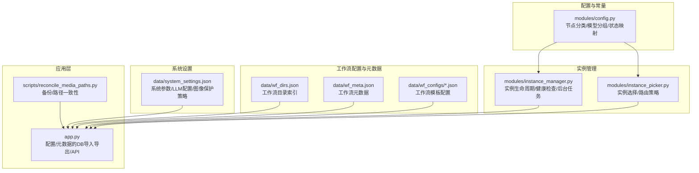
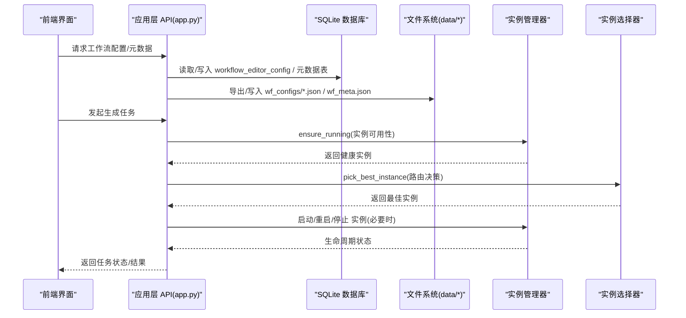
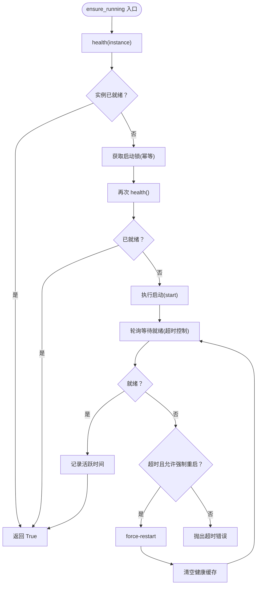
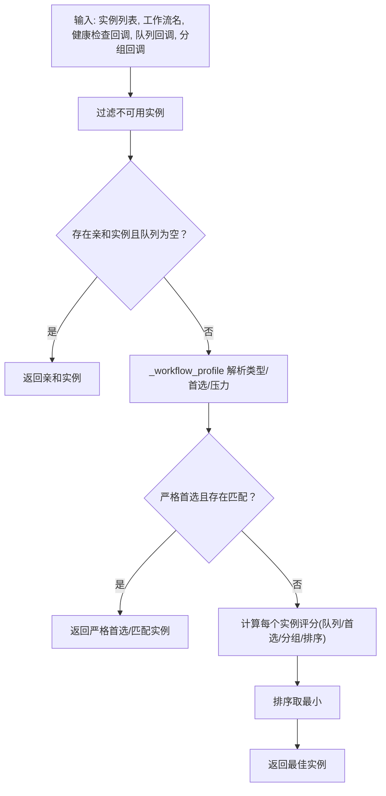
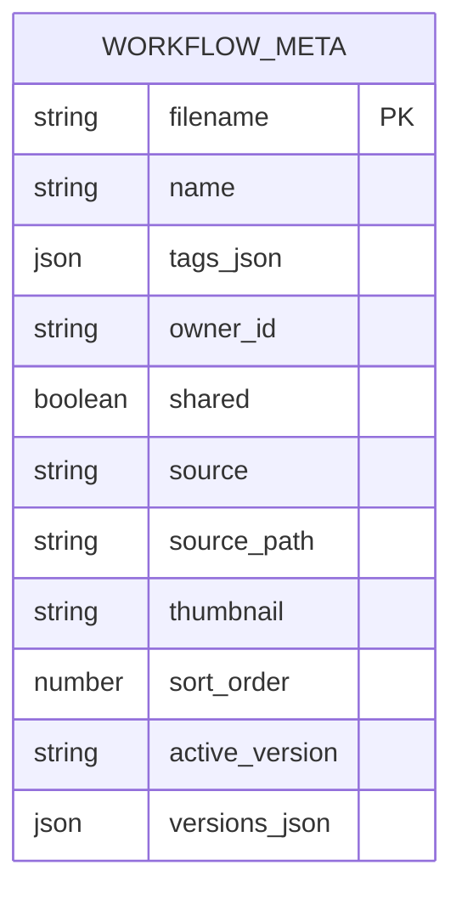
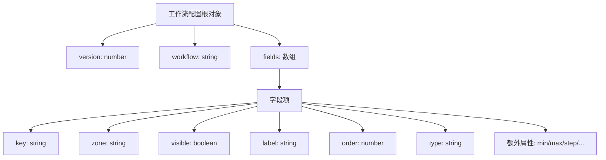
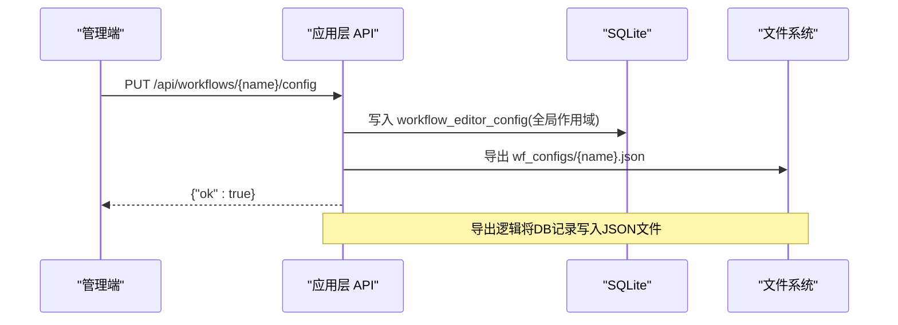
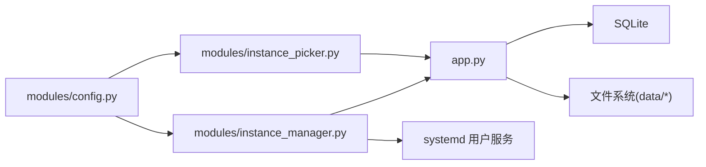

# 系统配置管理

<cite>
**本文档引用的文件**
- [modules/config.py](file://modules/config.py)
- [modules/instance_manager.py](file://modules/instance_manager.py)
- [modules/instance_picker.py](file://modules/instance_picker.py)
- [data/wf_meta.json](file://data/wf_meta.json)
- [data/wf_dirs.json](file://data/wf_dirs.json)
- [data/system_settings.json](file://data/system_settings.json)
- [data/wf_configs/I2V_10eros_v3_TiledSampler.json](file://data/wf_configs/I2V_10eros_v3_TiledSampler.json)
- [data/wf_configs/SeedVR2_upscale_2k.json](file://data/wf_configs/SeedVR2_upscale_2k.json)
- [app.py](file://app.py)
- [scripts/reconcile_media_paths.py](file://scripts/reconcile_media_paths.py)
</cite>

## 目录
1. [简介](#简介)
2. [项目结构](#项目结构)
3. [核心组件](#核心组件)
4. [架构总览](#架构总览)
5. [组件详解](#组件详解)
6. [依赖关系分析](#依赖关系分析)
7. [性能考量](#性能考量)
8. [故障排查指南](#故障排查指南)
9. [结论](#结论)
10. [附录](#附录)

## 简介
本文件系统化梳理 Ez ComfyUI v4.0 的“系统配置管理”能力，覆盖以下主题：
- ComfyUI 实例配置与连接信息管理
- 工作流元数据与模板配置管理
- 系统参数与全局配置项
- 配置文件的备份与恢复机制
- 配置热更新与重启策略
- 配置验证与错误处理
- 最佳实践与常见配置示例

## 项目结构
围绕配置管理的关键目录与文件如下：
- modules：集中常量、节点分类、实例生命周期与实例选择逻辑
- data：工作流元数据、工作流配置、系统设置、工作流目录索引
- scripts：媒体路径一致性脚本，包含备份流程示例
- app.py：工作流配置与元数据的数据库持久化与导出逻辑



**图表来源**
- [modules/config.py:1-152](file://modules/config.py#L1-L152)
- [modules/instance_manager.py:1-532](file://modules/instance_manager.py#L1-L532)
- [modules/instance_picker.py:1-227](file://modules/instance_picker.py#L1-L227)
- [data/wf_dirs.json:1-4](file://data/wf_dirs.json#L1-L4)
- [data/wf_meta.json:1-537](file://data/wf_meta.json#L1-L537)
- [data/system_settings.json:1-64](file://data/system_settings.json#L1-L64)
- [app.py:4824-4889](file://app.py#L4824-L4889)
- [scripts/reconcile_media_paths.py:80-88](file://scripts/reconcile_media_paths.py#L80-L88)

**章节来源**
- [modules/config.py:1-152](file://modules/config.py#L1-L152)
- [modules/instance_manager.py:1-532](file://modules/instance_manager.py#L1-L532)
- [modules/instance_picker.py:1-227](file://modules/instance_picker.py#L1-L227)
- [data/wf_dirs.json:1-4](file://data/wf_dirs.json#L1-L4)
- [data/wf_meta.json:1-537](file://data/wf_meta.json#L1-L537)
- [data/system_settings.json:1-64](file://data/system_settings.json#L1-L64)
- [app.py:4824-4889](file://app.py#L4824-L4889)
- [scripts/reconcile_media_paths.py:80-88](file://scripts/reconcile_media_paths.py#L80-L88)

## 核心组件
- 节点分类与状态映射：统一管理节点类别、权重、加载器、采样器等，支撑进度计算与可视化状态映射。
- 实例管理器：负责实例健康检查、冷启动、空闲回收、死实例检测、生命周期动作（启动/停止/重启/强制重启）。
- 实例选择器：基于工作流类型、实例健康度、队列深度、模型组亲和性进行路由决策。
- 工作流元数据：描述工作流名称、标签、来源、排序、共享状态、缩略图等。
- 工作流配置：定义模板字段区（用户输入/高级/隐藏）、可见性、顺序、类型、校验约束等。
- 系统设置：图像保护策略、LLM API 配置、多配置档案与活动档案切换。
- 应用层导出与导入：将工作流配置与元数据从数据库导出为 JSON 文件，支持热更新。

**章节来源**
- [modules/config.py:11-152](file://modules/config.py#L11-L152)
- [modules/instance_manager.py:43-532](file://modules/instance_manager.py#L43-L532)
- [modules/instance_picker.py:40-227](file://modules/instance_picker.py#L40-L227)
- [data/wf_meta.json:1-537](file://data/wf_meta.json#L1-L537)
- [data/wf_configs/I2V_10eros_v3_TiledSampler.json:1-800](file://data/wf_configs/I2V_10eros_v3_TiledSampler.json#L1-L800)
- [data/system_settings.json:1-64](file://data/system_settings.json#L1-L64)
- [app.py:4824-4889](file://app.py#L4824-L4889)

## 架构总览
下图展示配置管理在系统中的交互关系：前端通过 API 与应用层交互，应用层读写数据库与文件系统，实例管理器与实例选择器保障工作流调度的稳定性与性能。



**图表来源**
- [app.py:6739-6756](file://app.py#L6739-L6756)
- [app.py:7195-7229](file://app.py#L7195-L7229)
- [modules/instance_manager.py:93-151](file://modules/instance_manager.py#L93-L151)
- [modules/instance_picker.py:40-124](file://modules/instance_picker.py#L40-L124)

## 组件详解

### 节点配置与常量
- 节点分类：将节点归类为采样器、放大、免费节点、权重节点、加载器、运行时节点等，便于进度计算与可视化。
- 模型分组：通过关键词映射到模型组，支持实例亲和性路由。
- 状态映射：将节点名称映射为可读状态文案，提升用户体验。

```mermaid
classDiagram
class NodeCategory {
+SAMPLER : set[str]
+UPSCALE : set[str]
+FREE : set[str]
+WEIGHT_1 : set[str]
+LOADER : set[str]
+FREE_RUNTIME : set[str]
}
class ModelGroup {
+GROUPS : list[tuple[str, list[str]]]
+extract_model_group(workflow_name) str
}
class NODE_STATUS_MAP : dict[str, str]
NodeCategory <.. ModelGroup : "配合使用"
```

**图表来源**
- [modules/config.py:11-152](file://modules/config.py#L11-L152)

**章节来源**
- [modules/config.py:11-152](file://modules/config.py#L11-L152)

### 实例配置与连接信息
- 实例连接信息：实例字典包含名称、URL、服务名、节点ID等字段，用于健康检查与生命周期操作。
- 健康检查：通过 /system_stats 端点探测实例可用性，带缓存与超时控制。
- 生命周期动作：支持启动、停止、重启、强制重启；强制重启会先 KILL 再启动，用于冷启动异常场景。
- 后台任务：死实例检测（服务 active 但健康失败时自动重启）、空闲回收（超过阈值停止实例）。



**图表来源**
- [modules/instance_manager.py:93-151](file://modules/instance_manager.py#L93-L151)
- [modules/instance_manager.py:216-251](file://modules/instance_manager.py#L216-L251)
- [modules/instance_manager.py:334-375](file://modules/instance_manager.py#L334-L375)

**章节来源**
- [modules/instance_manager.py:43-532](file://modules/instance_manager.py#L43-L532)

### 实例选择与路由策略
- 选择规则：优先健康实例；结合工作流类型（T2I/I2I/视频/放大/bernini）与亲和性；考虑队列深度与模型组匹配；最终按评分排序返回最佳实例。
- 严格首选：部分工作流可指定严格首选实例，优先匹配模型组或固定实例名。
- 评分因子：队列深度惩罚、首选实例加分、模型组匹配加分、实例排序号等。



**图表来源**
- [modules/instance_picker.py:40-124](file://modules/instance_picker.py#L40-L124)
- [modules/instance_picker.py:126-152](file://modules/instance_picker.py#L126-L152)
- [modules/instance_picker.py:159-190](file://modules/instance_picker.py#L159-L190)

**章节来源**
- [modules/instance_picker.py:18-227](file://modules/instance_picker.py#L18-L227)

### 工作流元数据管理
- 元数据结构：包含工作流名称、标签、拥有者、共享状态、来源、源路径、缩略图、排序号等。
- 版本控制：元数据条目支持 active_version 字段与 versions 字典，便于版本追踪与回滚。
- 权限控制：更新/删除需要具备相应权限，管理员可更改共享状态。
- 数据持久化：通过数据库表存储，同时导出为 JSON 文件以供前端与工具使用。



**图表来源**
- [app.py:1593-1616](file://app.py#L1593-L1616)
- [app.py:7195-7229](file://app.py#L7195-L7229)

**章节来源**
- [data/wf_meta.json:1-537](file://data/wf_meta.json#L1-L537)
- [app.py:1593-1616](file://app.py#L1593-L1616)
- [app.py:7195-7229](file://app.py#L7195-L7229)

### 工作流模板配置（字段定义）
- 配置结构：包含版本号、工作流文件名、字段数组。
- 字段属性：键名（节点ID::参数名）、区域（用户输入/高级/隐藏）、可见性、标签、顺序、类型（文本/数字/种子/图像/切换等）。
- 高级字段：支持步进、上下限、布尔开关、嵌套子字段等，满足不同节点参数需求。
- 示例：放大工作流配置包含图像输入、种子、分辨率、批量、颜色校正、调试开关等。



**图表来源**
- [data/wf_configs/I2V_10eros_v3_TiledSampler.json:1-800](file://data/wf_configs/I2V_10eros_v3_TiledSampler.json#L1-L800)
- [data/wf_configs/SeedVR2_upscale_2k.json:1-266](file://data/wf_configs/SeedVR2_upscale_2k.json#L1-L266)

**章节来源**
- [data/wf_configs/I2V_10eros_v3_TiledSampler.json:1-800](file://data/wf_configs/I2V_10eros_v3_TiledSampler.json#L1-L800)
- [data/wf_configs/SeedVR2_upscale_2k.json:1-266](file://data/wf_configs/SeedVR2_upscale_2k.json#L1-L266)

### 系统参数设置
- 图像保护策略：启用检测器、提示信号、视觉回退、阈值配置、提示模式等。
- LLM API 配置：启用状态、基础地址、模型、密钥、超时、禁用思考等。
- 配置档案：支持多档案（ID/名称/启用/能力/备注），并可切换活动档案。
- 活动档案：通过 active_llm_api_profile 指定当前生效的档案。

**章节来源**
- [data/system_settings.json:1-64](file://data/system_settings.json#L1-L64)

### 配置文件管理与热更新
- 导出镜像：应用层可将数据库中的工作流配置导出为 JSON 文件，实现“数据库 → 文件”的同步。
- 热更新：当数据库变更时，导出流程会写入对应 JSON 文件，前端可直接读取最新配置。
- API 支持：提供获取/更新/删除工作流配置的接口，便于管理端操作。



**图表来源**
- [app.py:6739-6756](file://app.py#L6739-L6756)
- [app.py:4824-4842](file://app.py#L4824-L4842)
- [app.py:4862-4889](file://app.py#L4862-L4889)

**章节来源**
- [app.py:4824-4889](file://app.py#L4824-L4889)

### 配置验证与错误处理
- 工作流上传大小限制：对上传文件大小进行限制，避免过大 JSON 导致内存压力。
- 权限校验：更新/删除工作流元数据需要具备相应权限，管理员可更改共享状态。
- 健康检查异常：实例健康检查失败时，后台任务会尝试重启；若仍失败则记录日志并等待下次检查。
- 配置导出失败：导出镜像文件失败时记录警告日志，不影响主流程。

**章节来源**
- [tests/test_security_controls.py:79-103](file://tests/test_security_controls.py#L79-L103)
- [app.py:7195-7229](file://app.py#L7195-L7229)
- [modules/instance_manager.py:334-375](file://modules/instance_manager.py#L334-L375)
- [app.py:4862-4889](file://app.py#L4862-L4889)

## 依赖关系分析
- 模块耦合：
  - instance_manager 依赖 config 中的模型分组常量，用于实例亲和性与健康快照。
  - instance_picker 依赖 config 的模型分组提取逻辑，用于工作流类型识别与路由。
  - app.py 依赖数据库与文件系统，承担配置与元数据的导入导出职责。
- 外部集成：
  - 实例健康检查依赖 ComfyUI 的 /system_stats 端点。
  - 实例生命周期通过 systemd 用户服务管理（systemctl --user）。



**图表来源**
- [modules/config.py:11-152](file://modules/config.py#L11-L152)
- [modules/instance_manager.py:43-532](file://modules/instance_manager.py#L43-L532)
- [modules/instance_picker.py:40-227](file://modules/instance_picker.py#L40-L227)
- [app.py:4824-4889](file://app.py#L4824-L4889)

**章节来源**
- [modules/config.py:11-152](file://modules/config.py#L11-L152)
- [modules/instance_manager.py:43-532](file://modules/instance_manager.py#L43-L532)
- [modules/instance_picker.py:40-227](file://modules/instance_picker.py#L40-L227)
- [app.py:4824-4889](file://app.py#L4824-L4889)

## 性能考量
- 健康检查缓存：减少频繁 HTTP 请求，降低延迟与压力。
- 后台任务：死实例检测与空闲回收周期可控，避免过度扫描。
- 评分与排序：实例选择采用轻量计算，建议在注入回调中避免阻塞操作。
- 导出镜像：批量导出时注意磁盘 I/O，建议在维护窗口执行。

[本节为通用指导，无需特定文件引用]

## 故障排查指南
- 实例无法就绪
  - 检查 /system_stats 端点连通性与响应状态。
  - 查看健康缓存是否陈旧，必要时强制刷新。
  - 若长时间未就绪，尝试强制重启并清空健康缓存。
- 死实例误判
  - 防御期内（刚启动）跳过死实例检测，避免误杀。
  - 确认 systemd 服务状态与进程 PID。
- 实例回收导致任务中断
  - 空闲回收基于 last_active 与队列状态，确保作业完成后再停止。
- 配置未生效
  - 确认数据库写入成功并触发导出流程。
  - 检查导出目标文件是否存在且可读。
- 权限不足
  - 更新/删除工作流元数据需要相应权限，管理员可更改共享状态。

**章节来源**
- [modules/instance_manager.py:152-182](file://modules/instance_manager.py#L152-L182)
- [modules/instance_manager.py:334-375](file://modules/instance_manager.py#L334-L375)
- [app.py:7195-7229](file://app.py#L7195-L7229)
- [app.py:4862-4889](file://app.py#L4862-L4889)

## 结论
本系统通过“常量与分类表 + 实例生命周期 + 实例选择 + 元数据与模板配置 + 系统参数 + 数据库与文件镜像”的组合，构建了稳定、可观测、可扩展的配置管理体系。配合健康检查缓存、后台任务与权限控制，既保证了调度效率，也提升了运维可靠性。

[本节为总结，无需特定文件引用]

## 附录

### 配置文件备份与恢复
- 备份策略：脚本提供备份函数，将生成数据库与历史 JSON 复制到带时间戳的备份目录。
- 恢复策略：从备份目录复制对应文件至原位置，重启服务后重新导出镜像文件。

**章节来源**
- [scripts/reconcile_media_paths.py:80-88](file://scripts/reconcile_media_paths.py#L80-L88)

### 配置热更新与重启策略
- 热更新：数据库写入后自动导出 JSON 文件，前端可直接读取最新配置。
- 重启策略：冷启动超时后执行强制重启；后台任务定期检测死实例并自动重启；空闲实例在阈值后停止。

**章节来源**
- [app.py:4862-4889](file://app.py#L4862-L4889)
- [modules/instance_manager.py:93-151](file://modules/instance_manager.py#L93-L151)
- [modules/instance_manager.py:334-375](file://modules/instance_manager.py#L334-L375)

### 最佳实践
- 实例命名与服务名规范：遵循小写与连字符规范，确保 systemd 服务名一致。
- 健康检查与超时：合理设置超时与缓存时间，避免频繁探测。
- 工作流命名与分组：使用明确关键词便于模型分组与路由。
- 权限与共享：谨慎设置共享状态，避免敏感工作流被误改。
- 配置导出：在维护窗口执行批量导出，减少对业务的影响。

[本节为通用指导，无需特定文件引用]