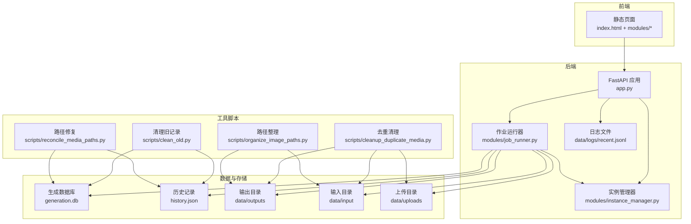
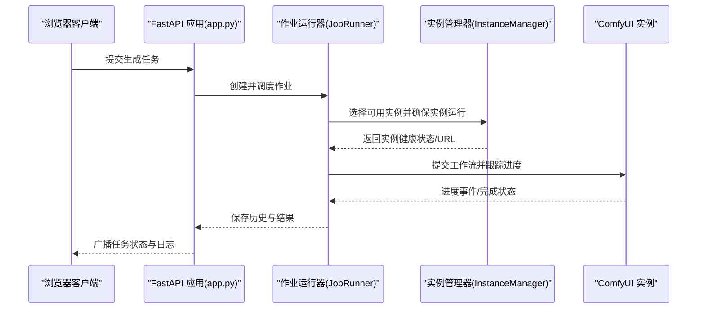
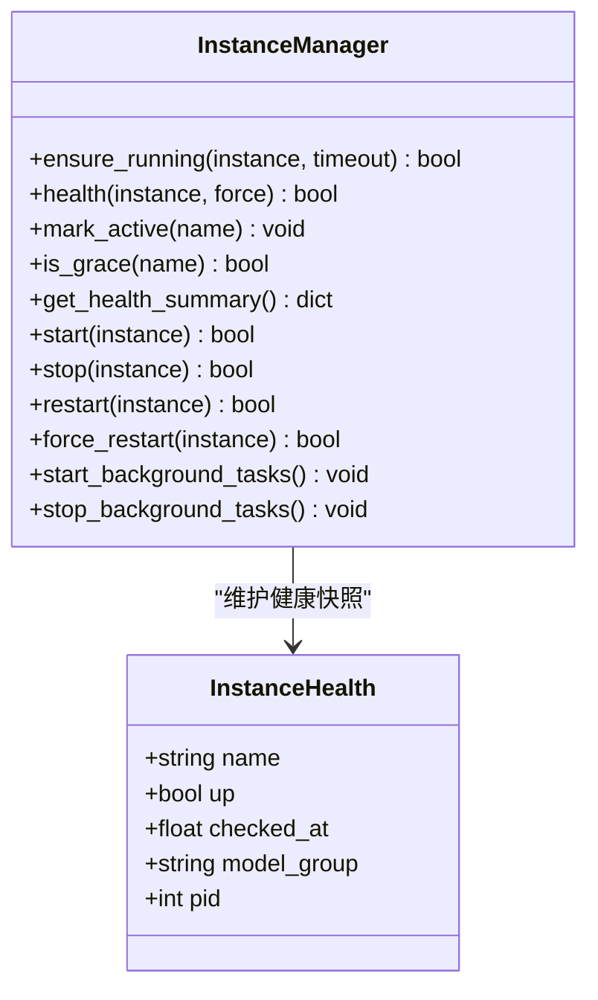
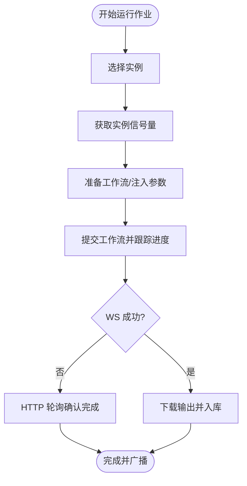
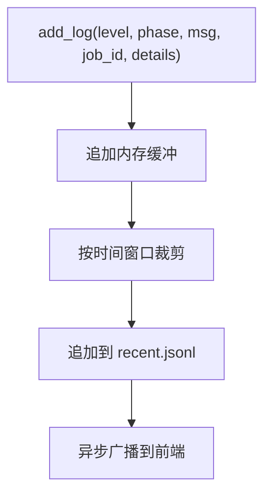
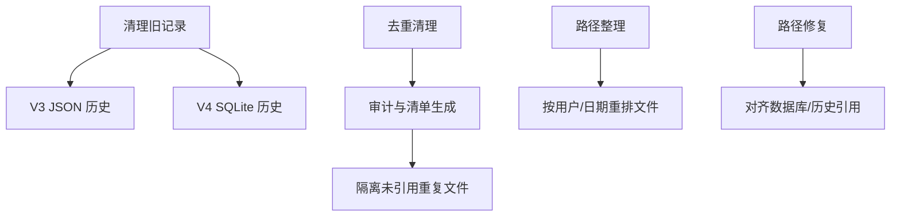
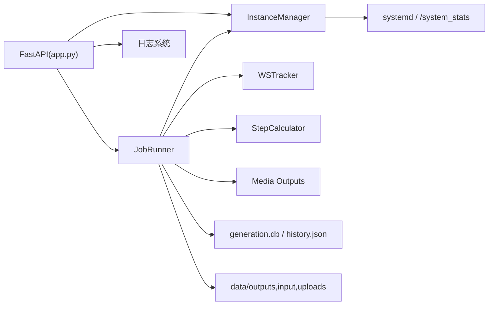
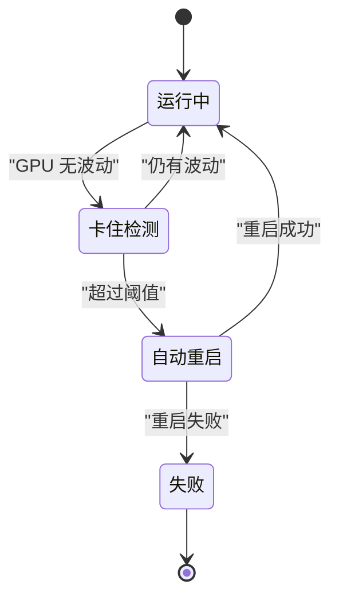

# 维护与故障排除

<cite>
**本文档引用的文件**
- [README.md](file://README.md)
- [app.py](file://app.py)
- [modules/instance_manager.py](file://modules/instance_manager.py)
- [modules/job_runner.py](file://modules/job_runner.py)
- [scripts/clean_old.py](file://scripts/clean_old.py)
- [scripts/cleanup_duplicate_media.py](file://scripts/cleanup_duplicate_media.py)
- [scripts/reconcile_media_paths.py](file://scripts/reconcile_media_paths.py)
- [scripts/organize_image_paths.py](file://scripts/organize_image_paths.py)
- [data/logs/recent.jsonl](file://data/logs/recent.jsonl)
</cite>

## 目录
1. [简介](#简介)
2. [项目结构](#项目结构)
3. [核心组件](#核心组件)
4. [架构总览](#架构总览)
5. [详细组件分析](#详细组件分析)
6. [依赖关系分析](#依赖关系分析)
7. [性能考虑](#性能考虑)
8. [故障排除指南](#故障排除指南)
9. [结论](#结论)
10. [附录](#附录)

## 简介
本指南面向系统运维与平台维护人员，围绕 Ez ComfyUI Showcase 的日常维护与故障排除提供实操指引。内容覆盖系统清理、日志轮转、数据库维护、缓存清理、常见问题诊断、故障排除流程、备份与恢复策略、升级与回滚流程、性能优化以及监控与告警配置。

## 项目结构
该系统采用前后端分离的架构：前端为静态 SPA，后端基于 FastAPI 提供 API；平台通过实例管理器统一调度多个 ComfyUI 实例，作业执行由作业运行器编排，日志与状态通过持久化文件与广播通道进行传播。

图表来源
- [app.py](file://app.py)
- [modules/instance_manager.py](file://modules/instance_manager.py)
- [modules/job_runner.py](file://modules/job_runner.py)
- [scripts/clean_old.py](file://scripts/clean_old.py)
- [scripts/cleanup_duplicate_media.py](file://scripts/cleanup_duplicate_media.py)
- [scripts/reconcile_media_paths.py](file://scripts/reconcile_media_paths.py)
- [scripts/organize_image_paths.py](file://scripts/organize_image_paths.py)

章节来源
- [README.md](file://README.md)
- [app.py](file://app.py)

## 核心组件
- 实例管理器：负责 ComfyUI 实例的健康检查、冷启动、空闲回收、死实例检测与重启，统一管理实例生命周期。
- 作业运行器：编排一次完整出图流程，串联实例选择、实例信号量、进度跟踪、结果下载与历史入库。
- 日志系统：内存缓冲 + 文件持久化，支持按时间窗口裁剪与中文消息映射，便于前端实时展示与排查。
- 数据与存储：SQLite 生成库、历史 JSON、输出/输入/上传目录，配合脚本进行路径规范化与冗余清理。

章节来源
- [modules/instance_manager.py](file://modules/instance_manager.py)
- [modules/job_runner.py](file://modules/job_runner.py)
- [app.py](file://app.py)

## 架构总览
系统通过 FastAPI 提供统一 API，前端通过 WebSocket 接收实时状态与日志；后端以模块化方式组织，实例管理器与作业运行器分别承担“资源管理”和“任务编排”的职责。

图表来源
- [app.py](file://app.py)
- [modules/job_runner.py](file://modules/job_runner.py)
- [modules/instance_manager.py](file://modules/instance_manager.py)

## 详细组件分析

### 实例管理器（InstanceManager）
- 职责：健康检查、冷启动、空闲回收、死实例检测与重启、启动/停止/重启动作执行。
- 关键能力：
  - 健康快照与缓存，减少频繁探测开销。
  - 防御期（刚启动）避免误判死实例。
  - 后台任务定期扫描 systemd 服务状态与健康状态不一致的实例并自动重启。
  - 支持本地 systemctl 与远程节点动作（预留）。

图表来源
- [modules/instance_manager.py](file://modules/instance_manager.py)

章节来源
- [modules/instance_manager.py](file://modules/instance_manager.py)

### 作业运行器（JobRunner）
- 职责：从队列取出作业，依次完成实例选择、信号量获取、工作流准备、进度跟踪、结果下载与历史入库。
- 关键能力：
  - 任务超时与卡住检测，支持自动纠错与实例重启。
  - WS 与 HTTP 轮询双通道兜底，提升稳定性。
  - 与实例管理器协作，确保实例可用与资源隔离。
  - 与图片保护、提示词优化、节点编辑等模块协同。

图表来源
- [modules/job_runner.py](file://modules/job_runner.py)

章节来源
- [modules/job_runner.py](file://modules/job_runner.py)

### 日志系统（add_log 与持久化）
- 能力：内存缓冲 + 文件持久化，支持按保留窗口裁剪，中文消息映射，WebSocket 广播。
- 用途：前端实时日志面板、问题定位与审计。

图表来源
- [app.py](file://app.py)
- [data/logs/recent.jsonl](file://data/logs/recent.jsonl)

章节来源
- [app.py](file://app.py)
- [data/logs/recent.jsonl](file://data/logs/recent.jsonl)

### 数据与存储维护脚本
- 清理旧记录：按截止时间删除历史记录与对应文件，支持 V3/V4 不同存储形态。
- 去重清理：基于哈希与引用关系识别重复媒体并安全移动至隔离区。
- 路径整理与修复：将非规范路径迁移至规范目录结构，修复数据库与历史文件中的引用。

图表来源
- [scripts/clean_old.py](file://scripts/clean_old.py)
- [scripts/cleanup_duplicate_media.py](file://scripts/cleanup_duplicate_media.py)
- [scripts/organize_image_paths.py](file://scripts/organize_image_paths.py)
- [scripts/reconcile_media_paths.py](file://scripts/reconcile_media_paths.py)

章节来源
- [scripts/clean_old.py](file://scripts/clean_old.py)
- [scripts/cleanup_duplicate_media.py](file://scripts/cleanup_duplicate_media.py)
- [scripts/organize_image_paths.py](file://scripts/organize_image_paths.py)
- [scripts/reconcile_media_paths.py](file://scripts/reconcile_media_paths.py)

## 依赖关系分析
- 模块耦合：
  - JobRunner 依赖 InstanceManager、WSTracker、StepCalculator、媒体输出模块等。
  - InstanceManager 依赖 systemd 服务状态与 ComfyUI /system_stats 探测。
  - 日志系统与 WebSocket 广播耦合，支撑前端实时反馈。
- 外部依赖：
  - ComfyUI 实例（WebSocket 与 HTTP API）。
  - SQLite 与 JSON 历史文件。
  - 文件系统（输出/输入/上传目录）。

图表来源
- [modules/job_runner.py](file://modules/job_runner.py)
- [modules/instance_manager.py](file://modules/instance_manager.py)
- [app.py](file://app.py)

章节来源
- [modules/job_runner.py](file://modules/job_runner.py)
- [modules/instance_manager.py](file://modules/instance_manager.py)
- [app.py](file://app.py)

## 性能考虑
- 实例信号量与并发控制：通过实例级信号量限制同时在跑的任务数量，避免显存争抢。
- 进度与超时策略：不同阶段设置不同超时阈值，视频类任务延长跟踪时间，避免误判。
- GPU 空闲检测与自动重启：当 GPU 在窗口内无波动时自动重启任务，缓解卡死。
- 日志缓冲与裁剪：内存缓冲 + 时间窗口裁剪，降低磁盘写入压力。
- 历史与媒体清理：定期清理旧记录与重复文件，释放磁盘空间。

章节来源
- [modules/job_runner.py](file://modules/job_runner.py)
- [app.py](file://app.py)

## 故障排除指南

### 日常维护任务
- 系统清理
  - 清理旧记录：使用清理脚本按截止时间删除历史与文件，适用于 V3/V4 存储形态。
  - 去重清理：基于哈希与引用关系识别重复媒体，生成清单并在确认后隔离未引用重复文件。
  - 路径整理与修复：将非规范路径迁移至规范目录结构，修复数据库与历史文件中的引用。
- 日志轮转
  - 日志文件按时间窗口裁剪，保留最近一段时间的日志条目，避免无限增长。
- 数据库维护
  - 使用路径修复脚本对齐数据库与历史文件中的引用，确保一致性。
- 缓存清理
  - 通过实例管理器的空闲回收与死实例检测，自动停止长时间无活动的实例，释放资源。

章节来源
- [scripts/clean_old.py](file://scripts/clean_old.py)
- [scripts/cleanup_duplicate_media.py](file://scripts/cleanup_duplicate_media.py)
- [scripts/organize_image_paths.py](file://scripts/organize_image_paths.py)
- [scripts/reconcile_media_paths.py](file://scripts/reconcile_media_paths.py)
- [app.py](file://app.py)

### 常见问题诊断
- 错误日志分析
  - 使用前端日志面板或查看 recent.jsonl 文件，关注 phase 与 message 字段，结合 job_id 定位具体作业。
  - 中文消息映射有助于快速理解 ComfyUI 执行错误、连接被拒、超时等问题。
- 性能问题定位
  - 观察 GPU 利用率与显存使用，结合进度与超时信息判断是否存在卡顿或卡死。
  - 检查实例健康状态与空闲回收情况，确认实例是否被意外停止或重启。
- 网络连接检查
  - 确认 /system_stats 可达，检查实例 URL 与端口配置。
  - 若 WS 连接失败，系统会自动切换到 HTTP 轮询兜底。

章节来源
- [data/logs/recent.jsonl](file://data/logs/recent.jsonl)
- [app.py](file://app.py)
- [modules/instance_manager.py](file://modules/instance_manager.py)
- [modules/job_runner.py](file://modules/job_runner.py)

### 故障排除流程
- 实例无响应
  - 检查 systemd 服务状态与 InstanceManager 健康快照，必要时执行强制重启。
  - 若实例处于防御期，等待防御窗口结束后再判定。
- 任务卡死
  - 系统会检测 GPU 在窗口内的波动，若无变化则自动重启任务并重置状态。
  - 若 WS 无法建立，系统会尝试 HTTP 轮询确认完成状态。
- 内存泄漏
  - 通过空闲回收与实例重启缓解；长期观察显存曲线与历史峰值，必要时缩短空闲回收时间阈值。

图表来源
- [modules/job_runner.py](file://modules/job_runner.py)

章节来源
- [modules/job_runner.py](file://modules/job_runner.py)
- [modules/instance_manager.py](file://modules/instance_manager.py)

### 备份与恢复策略
- 数据备份
  - generation.db 与 history.json：定期复制到备份目录，脚本提供备份函数。
  - 输出/输入/上传目录：按用户/日期结构存放，可整体打包备份。
- 配置备份
  - config/nodes.json、环境变量与 JWT 密钥文件：单独备份。
- 灾难恢复
  - 使用路径修复与整理脚本对齐引用与目录结构，恢复历史与生成记录。
  - 通过清理脚本清理过期数据，释放空间并保持系统整洁。

章节来源
- [scripts/reconcile_media_paths.py](file://scripts/reconcile_media_paths.py)
- [scripts/organize_image_paths.py](file://scripts/organize_image_paths.py)
- [scripts/clean_old.py](file://scripts/clean_old.py)

### 系统升级与回滚流程
- 版本升级
  - 更新应用版本与工作流配置，确保最小适用版本与变更记录一致。
  - 升级前备份 generation.db、history.json 与关键配置。
- 配置迁移
  - 使用路径整理与修复脚本迁移与修复引用，确保升级后数据一致性。
- 兼容性检查
  - 升级后验证实例健康、任务提交与完成、日志输出与前端交互。

章节来源
- [README.md](file://README.md)
- [scripts/reconcile_media_paths.py](file://scripts/reconcile_media_paths.py)

### 监控与预警机制
- 实时监控
  - GPU 显存/利用率/温度仪表盘，实例健康状态与任务进度。
- 告警建议
  - 实例长时间无响应、任务超时、WS 错误、GPU 长时间无波动等场景触发告警。
  - 结合日志文件与前端面板，形成闭环。

章节来源
- [README.md](file://README.md)
- [data/logs/recent.jsonl](file://data/logs/recent.jsonl)

## 结论
通过模块化的实例管理与作业编排、完善的日志与监控体系、以及可执行的清理与修复脚本，系统具备良好的可维护性与可恢复性。建议将上述流程纳入标准运维手册，定期演练升级回滚与故障恢复，确保平台稳定运行。

## 附录
- 快速启动与环境变量参考见项目自述文件。
- 常用端点与功能概览见项目自述文件。

章节来源
- [README.md](file://README.md)