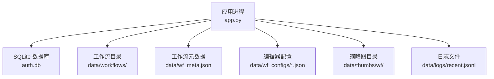
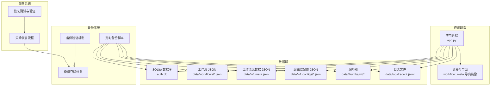
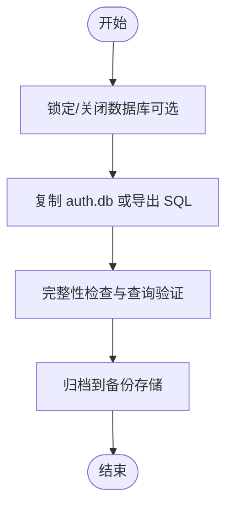
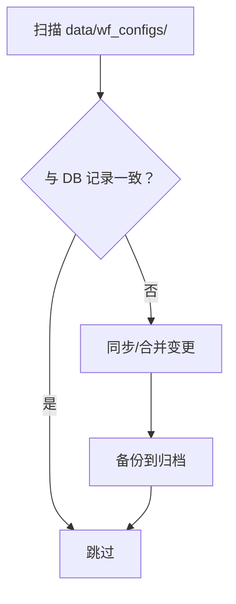
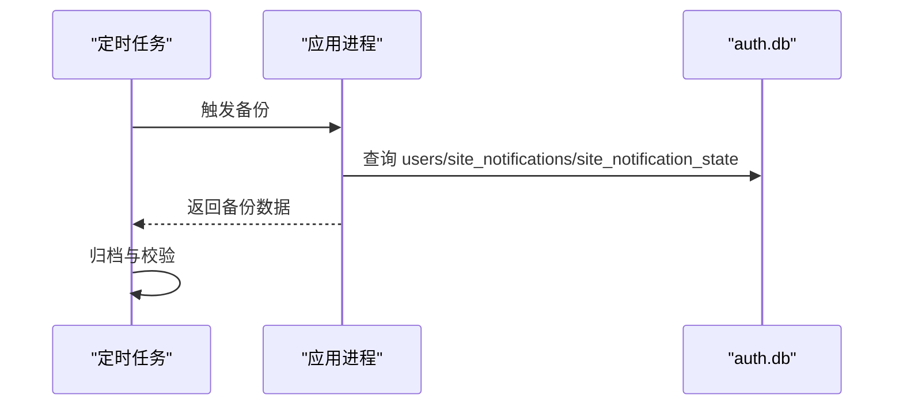
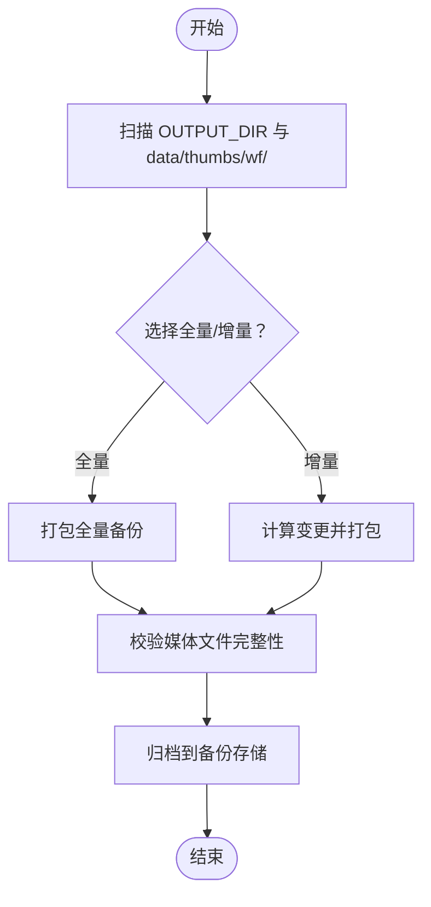
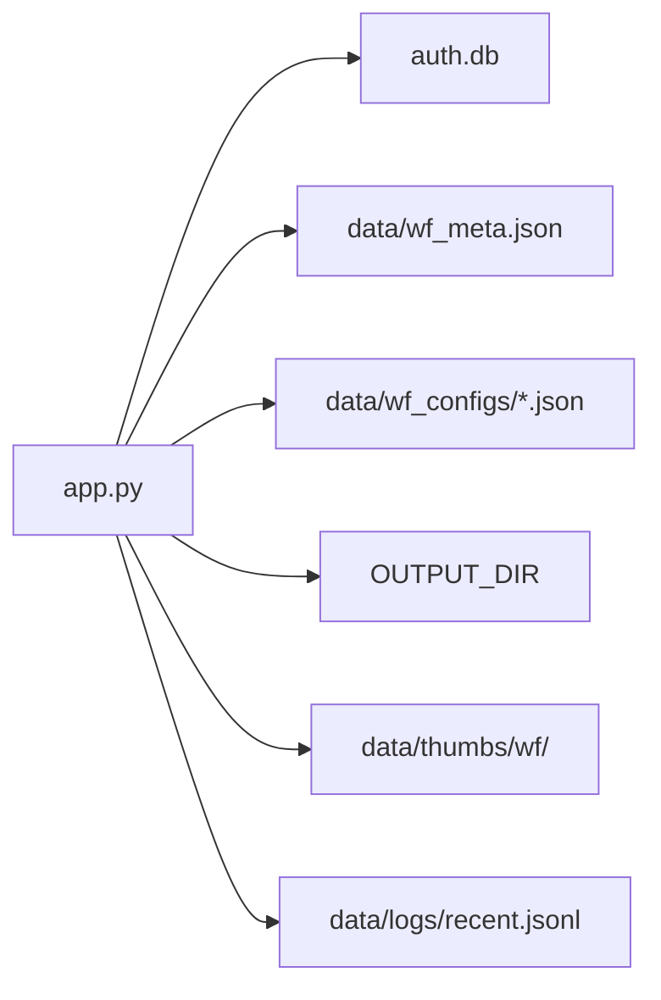
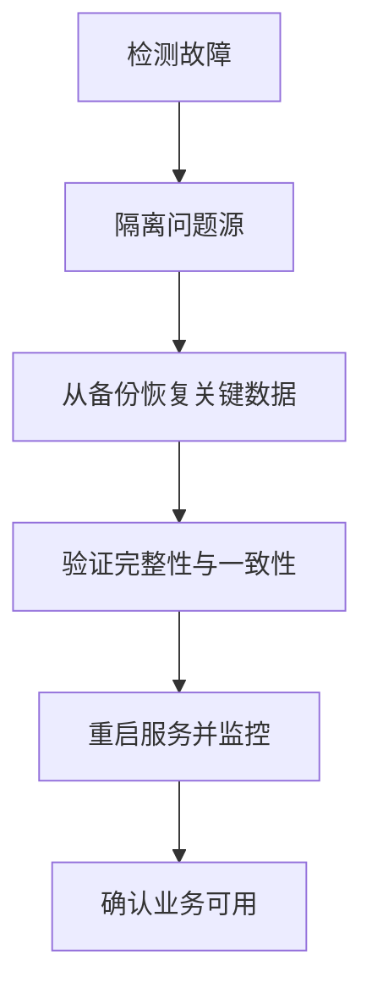

# 备份与恢复

<cite>
**本文引用的文件**
- [README.md](file://README.md)
- [app.py](file://app.py)
- [workflow-storage-architecture-plan.md](file://docs/workflow-storage-architecture-plan.md)
- [wf_meta.json](file://data/wf_meta.json)
- [wf_dirs.json](file://data/wf_dirs.json)
- [wf_configs 目录](file://data/wf_configs/)
- [thumbs/wf 目录](file://data/thumbs/wf/)
- [workflows 目录](file://data/workflows/)
- [auth.db 文件路径](file://app.py)
- [JWT 密钥文件路径](file://app.py)
- [日志文件路径](file://app.py)
</cite>

## 目录
1. [简介](#简介)
2. [项目结构](#项目结构)
3. [核心组件](#核心组件)
4. [架构总览](#架构总览)
5. [详细组件分析](#详细组件分析)
6. [依赖关系分析](#依赖关系分析)
7. [性能考量](#性能考量)
8. [故障排查指南](#故障排查指南)
9. [结论](#结论)
10. [附录](#附录)

## 简介
本文件面向 Ez ComfyUI Showcase 的运维与平台管理员，提供一套完整的备份与恢复方案。内容覆盖 SQLite 数据库备份、工作流配置与元数据备份、用户数据备份、媒体文件备份、自动化备份策略、灾难恢复流程、数据迁移方案、安全性保障、恢复测试与验证、以及备份监控与告警建议。目标是帮助团队在系统故障、数据损坏或服务中断等场景下，快速、可靠地恢复业务。

## 项目结构
围绕备份与恢复的关键目录与文件如下：
- 数据持久化位置
  - SQLite 数据库：认证与站点通知等表位于应用根目录下的 auth.db；工作流元数据与编辑器配置等表位于应用初始化时创建的数据库（通过应用代码初始化）。
  - 用户数据：用户表、站点通知表、通知状态表等。
  - 工作流与元数据：工作流 JSON 文件、工作流元数据 JSON、工作流编辑器配置 JSON、缩略图文件。
  - 日志：最近日志文件位于 data/logs/recent.jsonl。
- 关键环境变量与默认路径
  - 工作流目录、ComfyUI 端口、输出目录等由环境变量控制，影响备份范围与路径解析。

图表来源
- [app.py](file://app.py)
- [README.md](file://README.md)

章节来源
- [README.md: 80-86:80-86](file://README.md#L80-L86)
- [app.py: 78-123:78-123](file://app.py#L78-L123)

## 核心组件
- 认证与站点通知数据库（auth.db）
  - 包含用户、站点通知、通知状态等表，用于用户管理与站点公告。
- 工作流元数据与编辑器配置
  - 工作流元数据以 JSON 存储于 data/wf_meta.json，同时在数据库中维护 workflow_meta 表；编辑器配置以 JSON 存储于 data/wf_configs/，同时在数据库中维护 workflow_editor_config 表。
- 工作流与缩略图
  - 工作流 JSON 文件位于 data/workflows/；缩略图位于 data/thumbs/wf/，且与工作流文件同目录迁移逻辑已在应用中实现。
- 输出媒体与日志
  - 生成输出媒体位于 OUTPUT_DIR（由环境变量控制），日志文件位于 data/logs/recent.jsonl。

章节来源
- [app.py: 1725-1769:1725-1769](file://app.py#L1725-L1769)
- [app.py: 1681-1722:1681-1722](file://app.py#L1681-L1722)
- [app.py: 2733-2753:2733-2753](file://app.py#L2733-L2753)
- [app.py: 2756-2787:2756-2787](file://app.py#L2756-L2787)
- [app.py: 4824-4859:4824-4859](file://app.py#L4824-L4859)
- [app.py: 1325-1350:1325-1350](file://app.py#L1325-L1350)
- [app.py: 117-176:117-176](file://app.py#L117-L176)

## 架构总览
备份与恢复涉及以下数据域与职责边界：
- 数据域
  - 结构化数据：SQLite 数据库（auth.db）与工作流元数据/配置表。
  - 非结构化数据：工作流 JSON、缩略图、生成输出媒体、日志。
- 职责边界
  - 应用负责数据写入、迁移与导出镜像（如 wf_meta.json）。
  - 备份系统负责周期性采集这些数据域并进行归档与校验。
  - 恢复系统负责按需从归档中还原至生产环境。

图表来源
- [app.py](file://app.py)
- [workflow-storage-architecture-plan.md](file://docs/workflow-storage-architecture-plan.md)

## 详细组件分析

### SQLite 数据库备份（auth.db 与工作流元数据/配置表）
- 备份策略
  - 全量备份：直接复制 auth.db 文件；对于工作流元数据/配置表，可通过数据库导出 SQL 或使用数据库工具进行备份。
  - 增量备份：基于时间戳或 WAL/事务日志的增量备份（需数据库工具支持）。
- 自动化方案
  - 使用定时任务（如 cron）定期执行备份脚本；脚本中包含数据库关闭/锁定、复制/导出、校验、归档等步骤。
- 备份验证
  - 复制后对数据库文件进行完整性检查（如 sqlite3 integrity_check），并验证关键表存在且可查询。
- 存储位置
  - 建议将备份文件存放于独立的备份卷或对象存储，按日期/版本命名并保留多个轮转副本。

图表来源
- [app.py: 1725-1769:1725-1769](file://app.py#L1725-L1769)
- [app.py: 1681-1722:1681-1722](file://app.py#L1681-L1722)

章节来源
- [app.py: 78-105:78-105](file://app.py#L78-L105)
- [app.py: 1725-1769:1725-1769](file://app.py#L1725-L1769)
- [app.py: 1681-1722:1681-1722](file://app.py#L1681-L1722)

### 工作流配置备份（wf_configs 与 workflow_editor_config 表）
- 备份策略
  - 文件级备份：备份 data/wf_configs/ 下的所有编辑器配置 JSON 文件。
  - 数据库级备份：备份 workflow_editor_config 表，确保与文件镜像一致。
- 自动化方案
  - 定时扫描 data/wf_configs/ 并与数据库记录比对，发现差异则触发同步与备份。
- 备份验证
  - 对比文件与数据库记录的哈希或版本字段，确保一致性。
- 存储位置
  - 与 SQLite 备份统一归档，便于交叉验证。

图表来源
- [app.py: 4824-4859:4824-4859](file://app.py#L4824-L4859)
- [workflow-storage-architecture-plan.md:126-142](file://docs/workflow-storage-architecture-plan.md#L126-L142)

章节来源
- [app.py: 4824-4859:4824-4859](file://app.py#L4824-L4859)
- [workflow-storage-architecture-plan.md:126-142](file://docs/workflow-storage-architecture-plan.md#L126-L142)

### 用户数据备份（users、site_notifications、site_notification_state）
- 备份策略
  - 直接备份 auth.db 中的用户与通知相关表。
  - 如需离线审计，可导出为 CSV/SQL。
- 自动化方案
  - 与 SQLite 备份同步执行，确保一致性。
- 备份验证
  - 校验关键字段（用户名唯一性、角色、禁用状态、通知 ID 等）。

图表来源
- [app.py: 1725-1769:1725-1769](file://app.py#L1725-L1769)

章节来源
- [app.py: 1725-1769:1725-1769](file://app.py#L1725-L1769)

### 媒体文件备份（生成输出媒体、缩略图）
- 备份策略
  - 文件级全量备份：备份 OUTPUT_DIR（由环境变量控制）与 data/thumbs/wf/。
  - 增量备份：基于文件修改时间或内容哈希的增量策略。
- 自动化方案
  - 使用 rsync、tar 或云存储 SDK 进行定时同步与增量备份。
- 备份验证
  - 校验文件数量、大小与哈希，确保媒体文件可读可用。
- 存储位置
  - 建议使用对象存储或专用备份卷，设置生命周期策略。

图表来源
- [README.md: 80-86:80-86](file://README.md#L80-L86)
- [app.py: 1325-1350:1325-1350](file://app.py#L1325-L1350)

章节来源
- [README.md: 80-86:80-86](file://README.md#L80-L86)
- [app.py: 1325-1350:1325-1350](file://app.py#L1325-L1350)

### 日志备份（data/logs/recent.jsonl）
- 备份策略
  - 文件级备份：定期复制 recent.jsonl 并滚动归档。
- 自动化方案
  - 与媒体/数据库备份统一纳入定时任务。
- 备份验证
  - 校验日志行数与时间范围，确保可读性。

章节来源
- [app.py: 117-176:117-176](file://app.py#L117-L176)

## 依赖关系分析
- 应用对数据的依赖
  - 认证与站点通知依赖 auth.db。
  - 工作流元数据与编辑器配置依赖 wf_meta.json 与数据库表。
  - 媒体与缩略图依赖 OUTPUT_DIR 与 data/thumbs/wf/。
  - 日志依赖 data/logs/recent.jsonl。
- 备份系统的耦合
  - 备份脚本需与应用的环境变量、路径约定保持一致。
  - 备份与恢复需考虑文件权限与路径解析规则。

图表来源
- [app.py](file://app.py)
- [README.md](file://README.md)

章节来源
- [app.py: 78-123:78-123](file://app.py#L78-L123)
- [app.py: 117-176:117-176](file://app.py#L117-L176)

## 性能考量
- 备份窗口
  - 在低峰期执行全量备份，避免影响生成任务。
- 并发与锁
  - 数据库备份建议在应用关闭或使用只读快照时进行，减少锁竞争。
- 增量策略
  - 媒体文件采用基于内容哈希的增量，降低带宽与存储压力。
- 存储与压缩
  - 使用压缩与去重技术，结合对象存储的分片能力提升吞吐。

## 故障排查指南
- 备份失败
  - 检查磁盘空间、权限与网络连接；确认定时任务日志。
- 数据库损坏
  - 使用 sqlite3 integrity_check 进行完整性检查；必要时从最近一次完整备份恢复。
- 工作流元数据不一致
  - 对比 data/wf_meta.json 与数据库记录；必要时执行导出镜像重建。
- 媒体文件缺失
  - 校验 OUTPUT_DIR 与 data/thumbs/wf/ 的路径解析规则；核对备份归档。
- 日志不可读
  - 检查 recent.jsonl 是否被轮转或权限问题；确认应用日志写入路径。

章节来源
- [app.py: 117-176:117-176](file://app.py#L117-L176)
- [app.py: 1681-1722:1681-1722](file://app.py#L1681-L1722)
- [app.py: 2733-2753:2733-2753](file://app.py#L2733-L2753)

## 结论
通过将 SQLite 数据库、工作流元数据/配置、媒体文件与日志纳入统一的备份体系，并配合自动化脚本、验证机制与存储策略，可以有效降低数据丢失风险并缩短恢复时间。建议在生产环境中实施多副本、异地备份与周期性演练，持续完善监控与告警。

## 附录

### 灾难恢复流程
- 系统故障恢复
  - 恢复 auth.db、工作流元数据/配置表、媒体文件与日志至目标环境；重启应用并验证服务可用性。
- 数据损坏恢复
  - 从最近一次完整备份恢复；对数据库执行完整性检查；对媒体文件进行哈希校验。
- 服务中断恢复
  - 优先恢复关键数据（用户、通知、工作流元数据/配置），随后恢复媒体与日志；逐步启动应用与实例。

### 数据迁移方案
- 版本升级数据迁移
  - 在升级前执行全量备份；升级后运行迁移脚本（如 workflow_meta 迁移），并导出镜像文件进行交叉验证。
- 跨平台数据迁移
  - 统一备份 auth.db、工作流元数据/配置、媒体文件与日志；在目标平台按路径约定恢复。
- 批量数据导入导出
  - 使用数据库导出/导入与文件归档相结合的方式，确保导入时的路径解析与权限设置正确。

章节来源
- [workflow-storage-architecture-plan.md:112-171](file://docs/workflow-storage-architecture-plan.md#L112-L171)
- [app.py: 2733-2753:2733-2753](file://app.py#L2733-L2753)

### 备份数据的安全性保障
- 加密存储
  - 对备份文件进行端到端加密，密钥与证书集中管理。
- 访问控制
  - 限制备份存储的访问权限，仅授权人员可读取。
- 传输安全
  - 使用 HTTPS/FTPS 或云存储的传输加密通道。
- 审计与合规
  - 记录备份与恢复操作日志，满足合规要求。

### 恢复测试与验证
- 备份完整性检查
  - 对数据库执行完整性检查，对文件进行哈希校验。
- 恢复流程演练
  - 定期在测试环境执行恢复演练，验证路径解析与依赖项。
- 数据一致性验证
  - 比对恢复后的数据与源数据的关键字段与结构。

### 备份监控与告警
- 成功率监控
  - 统计每日/每周备份成功率，异常时自动告警。
- 失败告警
  - 备份失败、存储空间不足、完整性检查失败均触发告警。
- 存储空间预警
  - 设置阈值告警，及时扩容或清理旧备份。