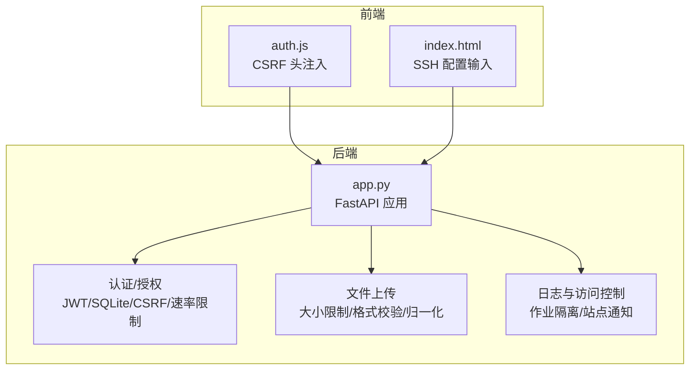
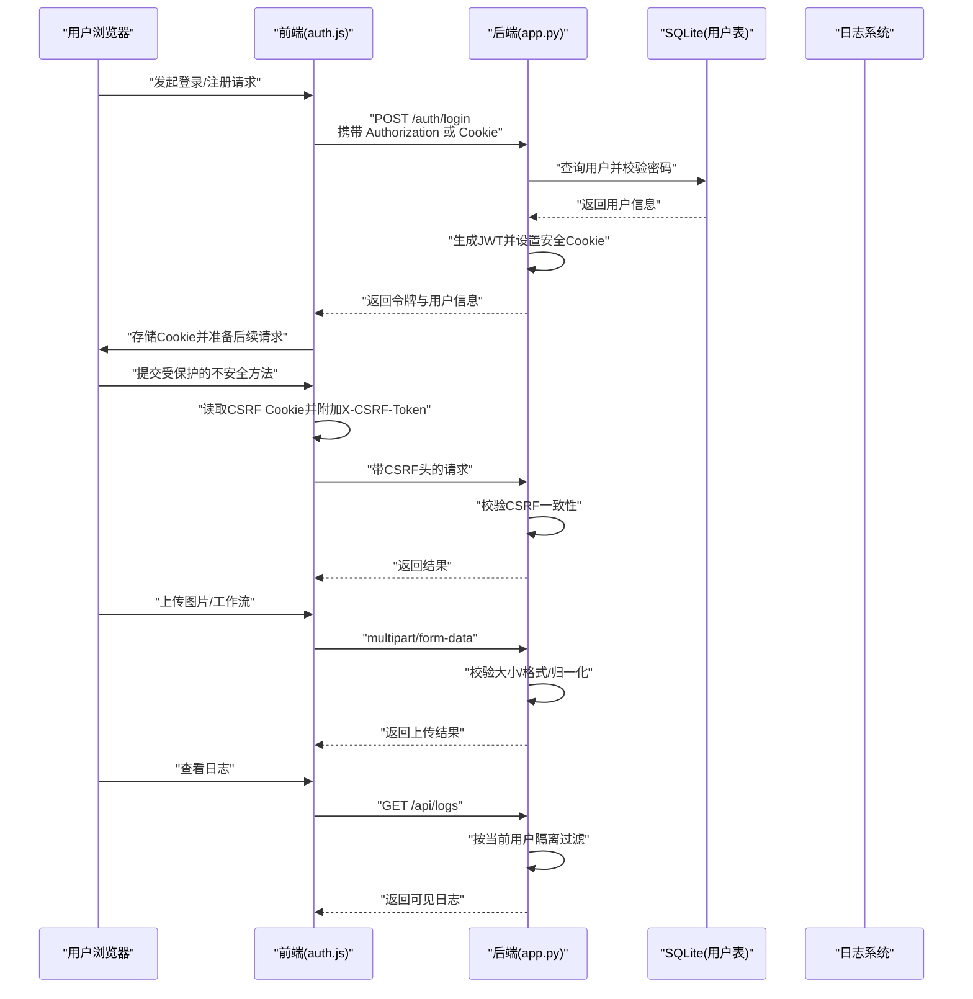
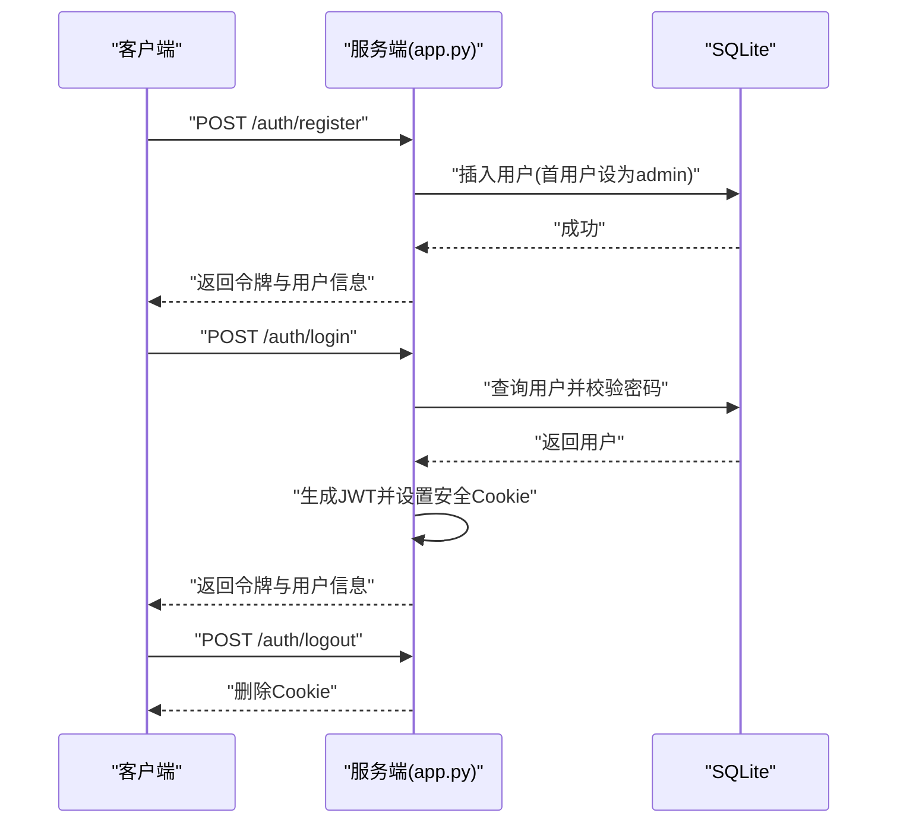
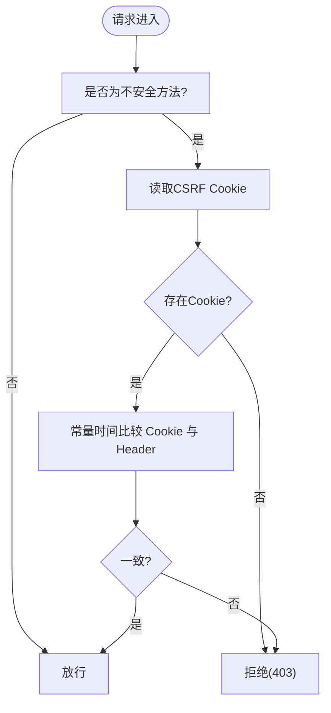
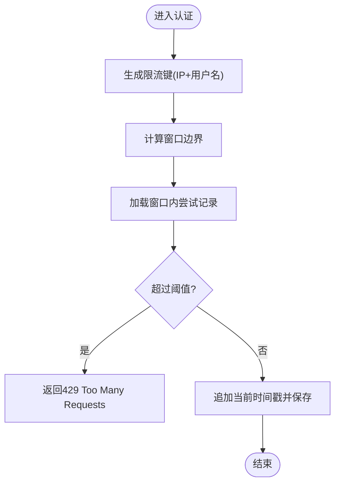
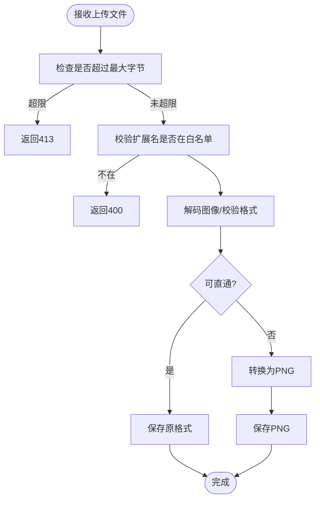
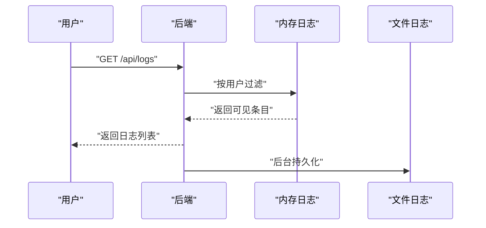
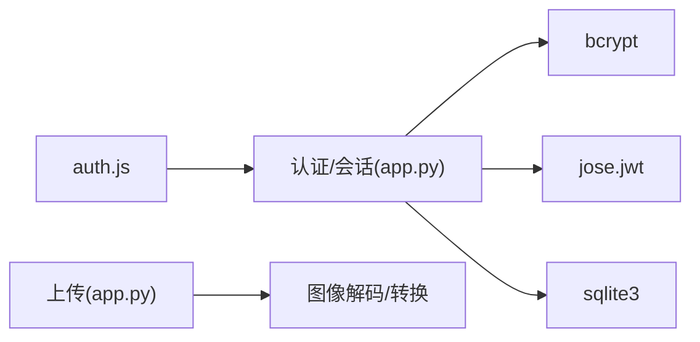

# 安全加固

<cite>
**本文引用的文件**
- [app.py](file://app.py)
- [auth.js](file://static/js/modules/auth.js)
- [index.html](file://static/index.html)
- [test_security_controls.py](file://tests/test_security_controls.py)
- [test_logs_api.py](file://tests/test_logs_api.py)
- [SECURITY_REVIEW.md](file://docs/archive/root-md-2026-06-03/SECURITY_REVIEW.md)
- [V4_PHASE1_IMPLEMENTATION.md](file://docs/archive/root-md-2026-06-03/V4_PHASE1_IMPLEMENTATION.md)
</cite>

## 目录
1. [简介](#简介)
2. [项目结构](#项目结构)
3. [核心组件](#核心组件)
4. [架构总览](#架构总览)
5. [详细组件分析](#详细组件分析)
6. [依赖关系分析](#依赖关系分析)
7. [性能考量](#性能考量)
8. [故障排查指南](#故障排查指南)
9. [结论](#结论)
10. [附录](#附录)

## 简介
本文件面向 Ez ComfyUI Showcase 的安全加固工作，围绕访问控制、网络安全、应用防护、数据安全、系统加固、安全审计与监控、第三方组件安全以及安全配置最佳实践等方面进行系统化梳理与落地建议。文档以代码库中已实现的安全能力为基础，结合测试用例与历史安全文档，形成可操作、可验证的安全加固方案。

## 项目结构
本项目采用后端 Python/FastAPI + 前端静态资源的分层架构，安全相关的关键位置集中在：
- 后端认证与授权：JWT、SQLite 用户表、速率限制、CSRF Cookie、会话 Cookie
- 前端安全交互：CSRF 头部注入、安全 Cookie 设置
- 文件上传与内容处理：上传大小限制、格式白名单、图像归一化
- 日志与访问控制：作业日志按用户隔离、站点通知管理
- 测试覆盖：认证速率限制、CSRF 校验、上传限额、日志可见性

图表来源
- [app.py](file://app.py)
- [auth.js](file://static/js/modules/auth.js)
- [index.html](file://static/index.html)

章节来源
- [app.py](file://app.py)
- [auth.js](file://static/js/modules/auth.js)
- [index.html](file://static/index.html)

## 核心组件
- 认证与会话管理：基于 JWT 的登录/注册/注销流程，Cookie 安全属性（HttpOnly、Secure、SameSite），CSRF Cookie 与头部校验
- 权限与角色控制：用户角色（admin/user）与受限接口依赖注入保护
- 速率限制：针对登录/注册的窗口计数限流
- 文件上传安全：上传大小上限、格式白名单、图像解码与安全模式判断、归一化输出
- 日志与访问控制：按用户隔离的日志查询、站点通知管理
- 前端交互：CSRF 头自动附加、安全 Cookie 使用

章节来源
- [app.py](file://app.py)
- [auth.js](file://static/js/modules/auth.js)
- [test_security_controls.py](file://tests/test_security_controls.py)
- [test_logs_api.py](file://tests/test_logs_api.py)

## 架构总览
下图展示认证与会话、CSRF、上传与日志访问控制的整体交互：

图表来源
- [app.py](file://app.py)
- [auth.js](file://static/js/modules/auth.js)

## 详细组件分析

### 认证与会话管理
- JWT 生成与解析：使用 HS256 算法，载荷包含用户标识、用户名、角色与过期时间；密钥优先来自环境变量，否则回退到本地文件生成并设置严格权限
- 会话 Cookie：认证 Cookie 与 CSRF Cookie 均设置 HttpOnly、根据请求协议决定 Secure 属性、SameSite=Lax、Path=/，并随令牌有效期设置 Max-Age
- 角色与权限：用户角色来自 SQLite 表 users，受限接口通过依赖注入强制校验当前用户身份与角色
- 注销：删除认证与 CSRF Cookie

图表来源
- [app.py](file://app.py)

章节来源
- [app.py](file://app.py)

### CSRF 防护
- CSRF Cookie 与请求头配对校验：前端在不安全方法请求时读取 CSRF Cookie 并附加 X-CSRF-Token 头，后端使用常量时间比较函数校验一致性
- Cookie 安全属性：非 HttpOnly，允许前端读取；根据 HTTPS 协议设置 Secure；SameSite=Lax；Path=/

图表来源
- [app.py](file://app.py)
- [auth.js](file://static/js/modules/auth.js)

章节来源
- [app.py](file://app.py)
- [auth.js](file://static/js/modules/auth.js)
- [test_security_controls.py](file://tests/test_security_controls.py)

### 速率限制（防暴力破解）
- 窗口计数：固定窗口内最多 N 次尝试，超限返回 429
- 维度：按来源 IP、用户名（小写去空白）聚合
- 成功或失败后均更新尝试列表，成功时清理

图表来源
- [app.py](file://app.py)

章节来源
- [app.py](file://app.py)
- [test_security_controls.py](file://tests/test_security_controls.py)

### 文件上传安全
- 上传大小限制：图片、视频、工作流分别由环境变量控制，超出即 413
- 读取策略：分块读取，累计字节超限立即拒绝
- 格式白名单：仅允许特定扩展名，未知格式直接拒绝
- 图像归一化：若满足直通条件则保持原格式，否则转换为 PNG；同时限定安全像素模式
- 存储：按用户与日期组织目录，避免路径穿越风险

图表来源
- [app.py](file://app.py)

章节来源
- [app.py](file://app.py)
- [test_security_controls.py](file://tests/test_security_controls.py)

### 日志与访问控制
- 日志可见性：用户只能看到自己作业的日志条目，防止越权查看
- 日志持久化：内存缓冲与文件落盘，带时间截断与容量限制
- 站点通知：管理员创建与管理，普通用户可见

图表来源
- [app.py](file://app.py)
- [test_logs_api.py](file://tests/test_logs_api.py)

章节来源
- [app.py](file://app.py)
- [test_logs_api.py](file://tests/test_logs_api.py)

### SSH 配置与敏感信息
- 前端表单支持 SSH 用户名、端口、认证方式（密码/密钥）、密码与密钥路径
- 后端解析时对敏感字段进行安全处理（如展开用户主目录、掩码跳过更新）

章节来源
- [index.html](file://static/index.html)
- [app.py](file://app.py)

## 依赖关系分析
- 认证模块依赖：bcrypt（密码哈希）、jose.jwt（JWT 编解码）、sqlite3（用户表）
- 上传模块依赖：类型校验、图像解码与转换
- 前端依赖：auth.js 读取 Cookie 并附加 CSRF 头

图表来源
- [app.py](file://app.py)
- [auth.js](file://static/js/modules/auth.js)

章节来源
- [app.py](file://app.py)
- [auth.js](file://static/js/modules/auth.js)

## 性能考量
- 速率限制：窗口计数与内存存储，需注意高并发下的内存占用与清理策略
- 上传处理：分块读取与图像归一化可能带来 CPU 与 I/O 压力，建议结合硬件能力调优环境变量阈值
- 日志：内存缓冲与文件落盘需平衡实时性与磁盘 IO

## 故障排查指南
- 登录/注册频繁失败被限流
  - 现象：出现 429
  - 排查：确认客户端 IP 与用户名组合是否触发阈值；等待窗口重置或降低尝试频率
  - 参考
    - [app.py](file://app.py)
    - [test_security_controls.py](file://tests/test_security_controls.py)
- CSRF 校验失败
  - 现象：不安全方法请求被拒绝
  - 排查：确认前端是否正确读取 CSRF Cookie 并附加 X-CSRF-Token；检查 SameSite/Secure 是否与协议匹配
  - 参考
    - [app.py](file://app.py)
    - [auth.js](file://static/js/modules/auth.js)
    - [test_security_controls.py](file://tests/test_security_controls.py)
- 上传文件过大
  - 现象：413 Payload Too Large
  - 排查：检查 EZ_UPLOAD_* 环境变量与实际文件大小；确认分块读取逻辑
  - 参考
    - [app.py](file://app.py)
    - [test_security_controls.py](file://tests/test_security_controls.py)
- 日志越权
  - 现象：能查看他人作业日志
  - 排查：确认当前用户上下文与作业归属；检查过滤逻辑
  - 参考
    - [app.py](file://app.py)
    - [test_logs_api.py](file://tests/test_logs_api.py)

章节来源
- [app.py](file://app.py)
- [auth.js](file://static/js/modules/auth.js)
- [test_security_controls.py](file://tests/test_security_controls.py)
- [test_logs_api.py](file://tests/test_logs_api.py)

## 结论
本项目在认证与会话、CSRF 防护、上传安全、日志访问控制等方面已具备基础安全能力，并通过测试用例进行了验证。建议在生产部署中进一步完善网络安全、系统加固与安全审计体系，确保整体安全基线达标。

## 附录

### 安全配置最佳实践清单
- 默认配置检查
  - JWT 密钥必须通过环境变量配置，不可使用默认或空值
  - 上传大小阈值应结合业务场景合理设定
  - 日志保留与轮转策略明确
- 安全基线设置
  - Cookie 必须设置 HttpOnly、Secure（HTTPS 环境）、SameSite=Lax
  - 速率限制窗口与阈值应与业务量匹配
  - 上传格式白名单与归一化策略严格执行
- 定期安全评估
  - 对认证接口进行渗透测试与弱口令检测
  - 审核日志访问策略与数据脱敏
  - 检查第三方依赖安全公告并及时升级

章节来源
- [V4_PHASE1_IMPLEMENTATION.md](file://docs/archive/root-md-2026-06-03/V4_PHASE1_IMPLEMENTATION.md)
- [SECURITY_REVIEW.md](file://docs/archive/root-md-2026-06-03/SECURITY_REVIEW.md)