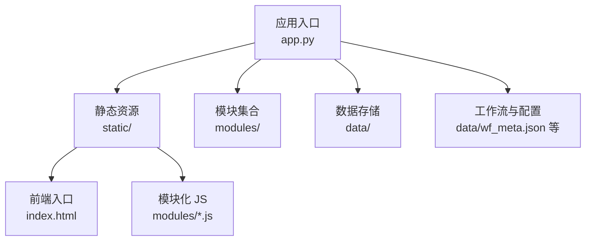
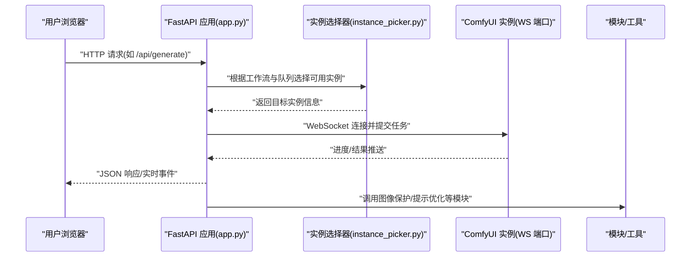
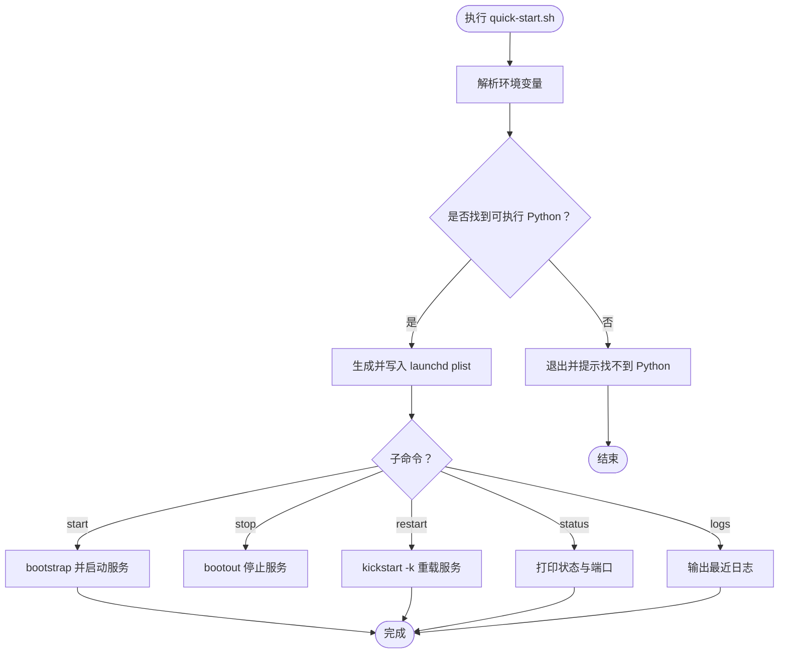
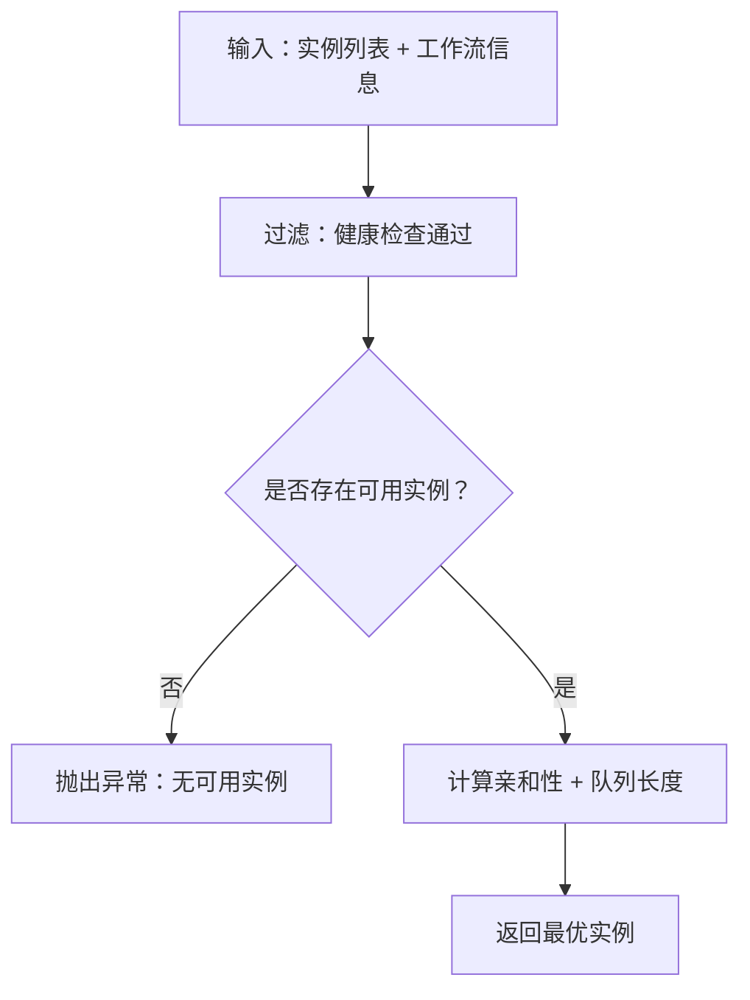
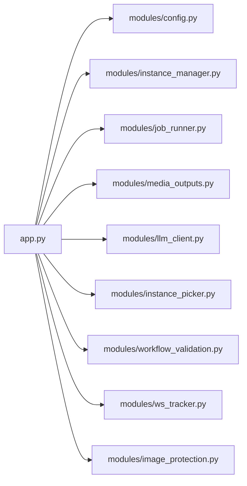

# 安装与部署

<cite>
**本文引用的文件**
- [README.md](file://README.md)
- [quick-start.sh](file://quick-start.sh)
- [app.py](file://app.py)
- [BRANCHING.md](file://BRANCHING.md)
- [modules/instance_picker.py](file://modules/instance_picker.py)
- [static/js/modules/nodes.js](file://static/js/modules/nodes.js)
</cite>

## 目录
1. [简介](#简介)
2. [项目结构](#项目结构)
3. [核心组件](#核心组件)
4. [架构总览](#架构总览)
5. [详细组件分析](#详细组件分析)
6. [依赖关系分析](#依赖关系分析)
7. [性能考虑](#性能考虑)
8. [故障排查指南](#故障排查指南)
9. [结论](#结论)
10. [附录](#附录)

## 简介
本文件面向 Ez ComfyUI Showcase 的安装与部署，覆盖以下主题：
- 环境准备：Python 版本要求、虚拟环境、依赖安装
- 快速启动脚本：环境变量、服务启动参数、端口设置
- macOS 服务集成：launchd 服务文件编写、开机自启、进程管理
- 生产部署流程：文件权限、防火墙、安全加固
- 多种部署方式对比与选择建议：本地、云服务器、容器化

说明：当前仓库未包含 systemd 服务文件、Dockerfile 或 Nginx 配置文件；本文在“系统服务与容器化”章节提供通用实践建议，不直接映射到具体源码文件。

## 项目结构
该项目采用前后端同构的单体应用模式：
- 后端：FastAPI 应用入口位于根目录，负责 API、静态资源托管、作业调度与 ComfyUI 实例交互
- 前端：静态资源位于 static/，包含 SPA 入口页面与模块化 JS
- 数据与配置：数据目录 data/ 存放认证数据库、日志、工作流元数据等
- 示例与工具：scripts/、tests/、docs/ 等辅助模块

图表来源
- [app.py:1-200](file://app.py#L1-L200)
- [README.md:40-59](file://README.md#L40-L59)

章节来源
- [README.md:40-59](file://README.md#L40-L59)
- [app.py:1-200](file://app.py#L1-L200)

## 核心组件
- 后端服务：基于 FastAPI，提供生成、历史、工作流、状态等 API
- 前端界面：SPA 架构，模块化组织，包含工作流管理、生成面板、历史画廊、GPU 监控等
- 实例管理：多实例调度与健康检查，支持亲和性与队列长度策略
- 安全与认证：JWT 密钥管理、登录速率限制、Cookie 安全策略
- 日志与持久化：内存日志缓冲与文件落盘，支持近期日志清理

章节来源
- [README.md:30-59](file://README.md#L30-L59)
- [app.py:78-124](file://app.py#L78-L124)
- [app.py:119-176](file://app.py#L119-L176)

## 架构总览
下图展示应用启动与请求处理的关键路径，以及与 ComfyUI 实例的交互：

图表来源
- [app.py:8903-8923](file://app.py#L8903-L8923)
- [modules/instance_picker.py:78-101](file://modules/instance_picker.py#L78-L101)

章节来源
- [app.py:8903-8923](file://app.py#L8903-L8923)
- [modules/instance_picker.py:78-101](file://modules/instance_picker.py#L78-L101)

## 详细组件分析

### 环境准备与依赖安装
- Python 版本：推荐 Python 3.14+（以满足现代依赖生态）
- 依赖安装：后端运行需要 FastAPI、uvicorn、aiofiles、Pillow 等；可在虚拟环境中安装
- 虚拟环境：建议使用 venv 或 conda 创建隔离环境，避免系统级污染

章节来源
- [README.md:68-76](file://README.md#L68-L76)

### 快速启动脚本 quick-start.sh 使用指南
- 作用：在 macOS 上通过 launchd 管理服务，实现开机自启、日志输出、状态查询
- 关键环境变量
  - EZ_COMFYUI_SERVICE_LABEL：服务标签，默认 com.ez-comfyui-showcase
  - EZ_COMFYUI_PORT：服务监听端口，默认 18000
  - EZ_COMFYUI_PYTHON：Python 可执行路径，默认优先使用 .venv/bin/python，否则回退到 PATH 中的 python3
  - EZ_COMFYUI_LOG / EZ_COMFYUI_ERR_LOG：标准输出与错误日志路径
- 支持命令
  - start：写入 launchd plist 并启动
  - stop：停止服务
  - restart：重载服务（使用 kickstart -k）
  - status：打印服务状态与端口
  - logs：查看最近日志
- 注意事项
  - 若未找到可执行 Python，脚本会报错退出
  - 端口变更通过环境变量传递给服务进程

图表来源
- [quick-start.sh:1-127](file://quick-start.sh#L1-L127)

章节来源
- [quick-start.sh:1-127](file://quick-start.sh#L1-L127)

### 系统服务与进程管理（macOS launchd）
- 服务文件生成：脚本通过内置 Python 写入 plist，设置工作目录、程序参数、环境变量、日志路径、开机自启与常驻
- 进程管理：使用 launchctl bootstrap/bootout/kickstart 控制生命周期
- 端口与日志：通过环境变量 EZ_COMFYUI_PORT 传入，日志分别写入 stdout/stderr 文件

章节来源
- [quick-start.sh:25-45](file://quick-start.sh#L25-L45)
- [quick-start.sh:51-84](file://quick-start.sh#L51-L84)
- [quick-start.sh:86-96](file://quick-start.sh#L86-L96)
- [quick-start.sh:98-104](file://quick-start.sh#L98-L104)

### 生产环境部署流程
- 文件权限
  - 生成密钥文件（如 JWT_SECRET_KEY）需设置严格权限（仅所有者可读写）
  - 日志与数据目录归属明确，避免权限泄露
- 防火墙
  - 仅开放对外服务所需端口（如 Nginx 反代端口），对内保留应用端口
- 安全加固
  - 强制 HTTPS（见 Nginx 反代章节）
  - 限制登录尝试频率，启用 CSRF 保护
  - 对外部可访问的 API 增加鉴权与速率限制

章节来源
- [app.py:92-114](file://app.py#L92-L114)
- [app.py:119-176](file://app.py#L119-L176)

### 多实例调度与实例选择
- 亲和性与队列长度：优先选择与工作流模型组匹配且空闲的实例
- 健康检查：过滤不可用实例，若无可选实例则抛出异常
- 状态聚合：按运行中/空闲/死亡/离线统计节点整体状态

图表来源
- [modules/instance_picker.py:78-101](file://modules/instance_picker.py#L78-L101)

章节来源
- [modules/instance_picker.py:78-101](file://modules/instance_picker.py#L78-L101)

### 端口与环境变量
- 应用端口：可通过命令行参数或环境变量指定
- ComfyUI 实例端口：通过环境变量配置 A/B 实例的 WebSocket 端口
- 输出目录：生成图片输出目录可通过环境变量配置

章节来源
- [README.md:78-86](file://README.md#L78-L86)
- [app.py:64-76](file://app.py#L64-L76)

### 设备与节点配置（用于多实例场景）
- 前端表单支持填写主机、SSH 连接、扫描端口范围、工作流目录等
- 后端节点管理接口会根据可见性与访问权限返回节点状态与实例健康度

章节来源
- [static/js/modules/nodes.js:177-200](file://static/js/modules/nodes.js#L177-L200)
- [app.py:8903-8923](file://app.py#L8903-L8923)

## 依赖关系分析
- 应用入口依赖模块化子系统（配置、实例管理、作业执行、媒体输出、LLM 客户端等）
- 前端模块通过 app.js 注册与加载，依赖后端 API 提供的数据与状态
- 实例选择器依赖健康检查与队列信息，决定任务路由

图表来源
- [app.py:29-59](file://app.py#L29-L59)

章节来源
- [app.py:29-59](file://app.py#L29-L59)

## 性能考虑
- 多实例调度：通过亲和性与队列长度选择实例，降低拥塞
- 日志缓冲：内存日志与定期落盘，减少频繁 IO
- 前端模块化：按需加载，提升首屏与交互性能

章节来源
- [modules/instance_picker.py:78-101](file://modules/instance_picker.py#L78-L101)
- [app.py:119-176](file://app.py#L119-L176)

## 故障排查指南
- 无法启动服务（macOS）
  - 检查 Python 路径与可执行权限
  - 查看 stdout/stderr 日志文件
  - 使用 status/logs 子命令确认状态与端口
- 无可用实例
  - 检查实例健康状态与队列长度
  - 确认工作流模型组与实例亲和性匹配
- 认证失败或登录被限流
  - 检查 JWT 密钥文件权限
  - 观察登录尝试频率与时间窗口

章节来源
- [quick-start.sh:20-23](file://quick-start.sh#L20-L23)
- [quick-start.sh:98-104](file://quick-start.sh#L98-L104)
- [modules/instance_picker.py:78-82](file://modules/instance_picker.py#L78-L82)
- [app.py:92-114](file://app.py#L92-L114)

## 结论
本文提供了从环境准备、快速启动脚本使用、macOS 服务集成到生产部署的安全与运维建议。对于 systemd 服务与 Docker/Nginx 配置，仓库未包含相应文件，建议参考通用最佳实践进行适配与落地。

## 附录

### 多种部署方式对比与选择建议
- 本地部署
  - 适合开发与小规模测试
  - 使用 quick-start.sh 在 macOS 上通过 launchd 管理服务
- 云服务器部署
  - 推荐使用 systemd 管理服务（通用实践）
  - 配置防火墙仅开放必要端口，结合反向代理提供 HTTPS
- 容器化部署
  - 建议编写 Dockerfile，暴露应用端口，挂载数据卷（日志、输出、密钥）
  - 使用 docker-compose 管理多容器编排（应用 + 反代）

说明：以上为通用实践建议，不直接对应现有源码文件。