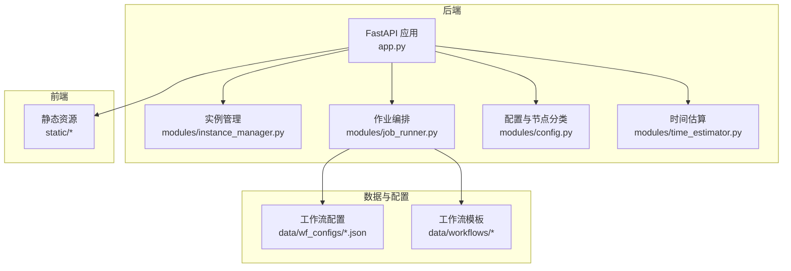
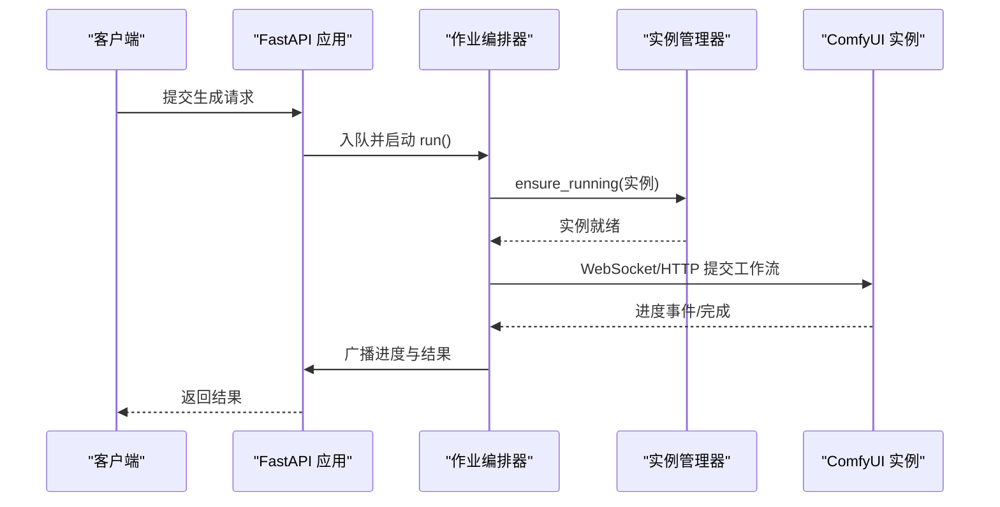
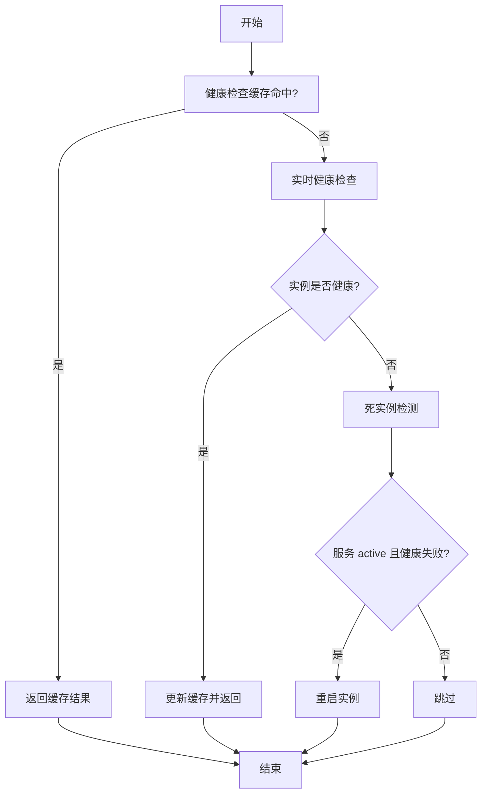
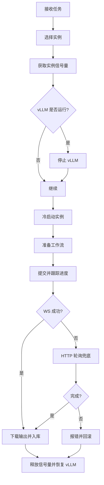
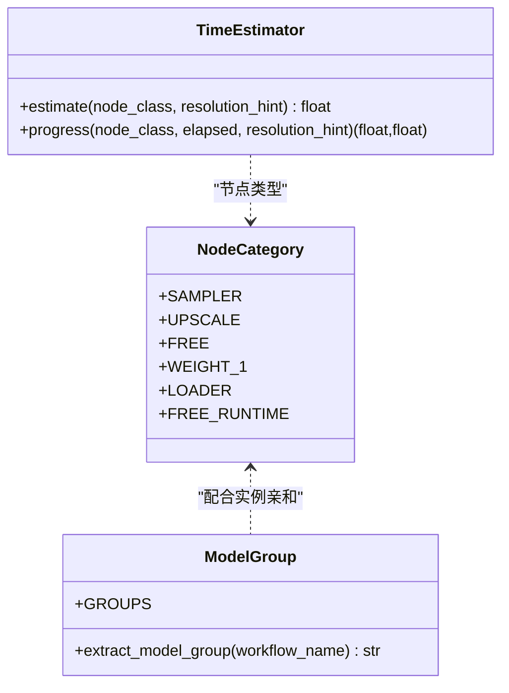
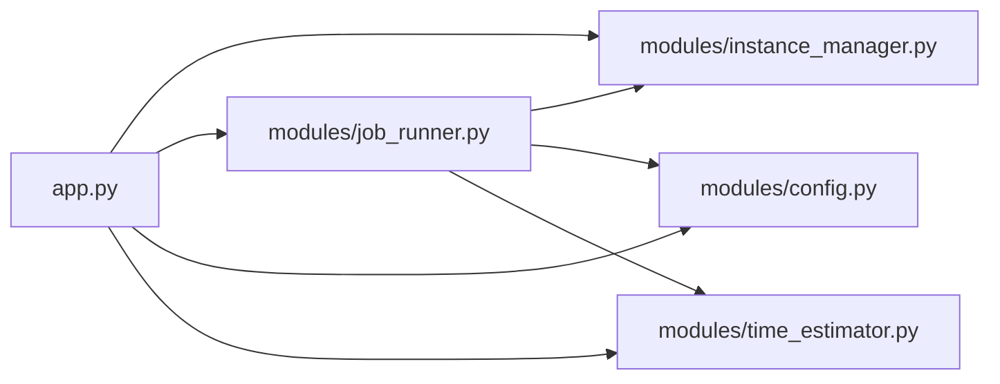

# 性能优化

<cite>
**本文引用的文件**   
- [app.py](file://app.py)
- [modules/config.py](file://modules/config.py)
- [modules/instance_manager.py](file://modules/instance_manager.py)
- [modules/job_runner.py](file://modules/job_runner.py)
- [modules/time_estimator.py](file://modules/time_estimator.py)
- [quick-start.sh](file://quick-start.sh)
- [data/wf_configs/SeedVR2_upscale_2k.json](file://data/wf_configs/SeedVR2_upscale_2k.json)
- [data/wf_configs/SeedVR2_upscale_4k.json](file://data/wf_configs/SeedVR2_upscale_4k.json)
- [data/wf_configs/I2V_10eros_v3_TiledSampler.json](file://data/wf_configs/I2V_10eros_v3_TiledSampler.json)
- [data/wf_configs/nunchaku_T2I_4k.json](file://data/wf_configs/nunchaku_T2I_4k.json)
</cite>

## 目录
1. [引言](#引言)
2. [项目结构](#项目结构)
3. [核心组件](#核心组件)
4. [架构总览](#架构总览)
5. [详细组件分析](#详细组件分析)
6. [依赖分析](#依赖分析)
7. [性能考虑](#性能考虑)
8. [故障排查指南](#故障排查指南)
9. [结论](#结论)
10. [附录](#附录)

## 引言
本文件面向 Ez ComfyUI Showcase 的性能优化，覆盖硬件与系统调优、Python/FastAPI 应用优化、数据库与缓存策略、前端性能、并发与负载、内存与 CPU、存储与网络、以及监控与分析工具。文档以仓库现有实现为依据，结合代码结构与配置文件，给出可落地的优化建议与最佳实践。

## 项目结构
系统采用 FastAPI 作为后端框架，模块化组织业务逻辑，包含实例管理、作业编排、进度追踪、提示词处理、媒体输出与缩略图生成等子模块；前端静态资源位于 static 目录，工作流配置与元数据位于 data/wf_configs 与 data/workflows。

**图表来源**
- [app.py](file://app.py)
- [modules/instance_manager.py](file://modules/instance_manager.py)
- [modules/job_runner.py](file://modules/job_runner.py)
- [modules/config.py](file://modules/config.py)
- [modules/time_estimator.py](file://modules/time_estimator.py)
- [data/wf_configs/SeedVR2_upscale_2k.json](file://data/wf_configs/SeedVR2_upscale_2k.json)

**章节来源**
- [app.py](file://app.py)
- [modules/instance_manager.py](file://modules/instance_manager.py)
- [modules/job_runner.py](file://modules/job_runner.py)
- [modules/config.py](file://modules/config.py)
- [modules/time_estimator.py](file://modules/time_estimator.py)
- [data/wf_configs/SeedVR2_upscale_2k.json](file://data/wf_configs/SeedVR2_upscale_2k.json)

## 核心组件
- FastAPI 应用与路由：负责认证、日志、WebSocket 广播、静态资源挂载、系统设置与作业队列等接口。
- 实例管理器：负责 ComfyUI 实例的健康检查、冷启动、空闲回收、死实例检测与后台任务。
- 作业编排器：串联实例选择、信号量控制、进度追踪、输出下载与历史入库。
- 配置与节点分类：定义节点类别、模型分组与状态映射，支撑进度计算与实例亲和。
- 时间估算：基于节点类型与分辨率估算耗时，辅助 UI 进度展示与用户预期管理。

**章节来源**
- [app.py](file://app.py)
- [modules/instance_manager.py](file://modules/instance_manager.py)
- [modules/job_runner.py](file://modules/job_runner.py)
- [modules/config.py](file://modules/config.py)
- [modules/time_estimator.py](file://modules/time_estimator.py)

## 架构总览
系统采用“应用层（FastAPI）—编排层（JobRunner）—实例层（ComfyUI）”三层协作模式。应用层负责请求接入与状态广播；编排层负责实例选择、并发控制与进度追踪；实例层负责具体生成任务。

**图表来源**
- [app.py](file://app.py)
- [modules/job_runner.py](file://modules/job_runner.py)
- [modules/instance_manager.py](file://modules/instance_manager.py)

## 详细组件分析

### 实例管理与空闲回收
- 健康检查缓存与超时：健康检查结果按固定周期缓存，避免频繁探测；同时对实例启动后的防御期进行保护，防止误判。
- 死实例检测：定期扫描 systemd 服务 active 且健康检查失败的实例，触发重启。
- 空闲回收：超过空闲阈值且无活跃任务时停止实例，节省资源。

**图表来源**
- [modules/instance_manager.py](file://modules/instance_manager.py)

**章节来源**
- [modules/instance_manager.py](file://modules/instance_manager.py)

### 作业编排与并发控制
- 实例信号量：每个实例持有一个信号量，限制并发生成任务数量，避免显存争用。
- 排队与阻塞：当同一实例有运行中任务时，新任务进入排队等待，减少冲突。
- vLLM 协调：在需要时暂停 vLLM 以释放显存，生成完成后恢复。
- 提交停滞自动修复：对提交后无响应的任务进行清理、中断与实例重启，提升鲁棒性。

**图表来源**
- [modules/job_runner.py](file://modules/job_runner.py)

**章节来源**
- [modules/job_runner.py](file://modules/job_runner.py)

### 节点分类与进度估算
- 节点分类：将节点划分为采样、上采样、加载器、权重、自由节点等类别，支撑进度计算与状态映射。
- 模型分组：根据工作流文件名关键词提取模型组，用于实例亲和与路由。
- 进度估算：基于节点类型与分辨率估算耗时，提供节点内进度与剩余时间估计。

**图表来源**
- [modules/config.py](file://modules/config.py)
- [modules/time_estimator.py](file://modules/time_estimator.py)

**章节来源**
- [modules/config.py](file://modules/config.py)
- [modules/time_estimator.py](file://modules/time_estimator.py)

### 工作流配置与显存/分块参数
工作流配置文件包含大量与显存占用、分块与离线缓存相关的参数键，可用于在不同硬件条件下进行精细调优，例如：
- 编码/解码分块大小与重叠
- 设备卸载与模型缓存开关
- 注意力模式与瓦片调试开关
- 视频/图像处理的 tile 与 overlap 参数

这些键位在多个工作流配置文件中出现，建议结合实例显存与分辨率进行参数微调，以平衡速度与稳定性。

**章节来源**
- [data/wf_configs/SeedVR2_upscale_2k.json](file://data/wf_configs/SeedVR2_upscale_2k.json)
- [data/wf_configs/SeedVR2_upscale_4k.json](file://data/wf_configs/SeedVR2_upscale_4k.json)
- [data/wf_configs/I2V_10eros_v3_TiledSampler.json](file://data/wf_configs/I2V_10eros_v3_TiledSampler.json)
- [data/wf_configs/nunchaku_T2I_4k.json](file://data/wf_configs/nunchaku_T2I_4k.json)

## 依赖分析
- 应用层依赖于模块化子系统：实例管理、作业编排、提示词处理、媒体输出、进度追踪与时间估算。
- 作业编排依赖于实例管理与 WebSocket 追踪，同时与工作流配置文件耦合，用于参数注入与校验。
- 实例管理依赖于 systemd 服务与健康检查端点，具备后台任务以维持系统稳定。

**图表来源**
- [app.py](file://app.py)
- [modules/instance_manager.py](file://modules/instance_manager.py)
- [modules/job_runner.py](file://modules/job_runner.py)
- [modules/config.py](file://modules/config.py)
- [modules/time_estimator.py](file://modules/time_estimator.py)

**章节来源**
- [app.py](file://app.py)
- [modules/instance_manager.py](file://modules/instance_manager.py)
- [modules/job_runner.py](file://modules/job_runner.py)
- [modules/config.py](file://modules/config.py)
- [modules/time_estimator.py](file://modules/time_estimator.py)

## 性能考虑

### 硬件资源配置建议
- 显存与批次数：根据实例显存容量与工作流节点类型，合理设置 batch 数与分块大小，避免 OOM。
- 分辨率与分块：高分辨率工作流建议开启编码/解码分块与重叠，降低显存峰值。
- 设备卸载与缓存：对大模型可启用设备卸载与模型缓存，减少重复加载开销。
- 注意力模式：针对特定模型启用高效注意力模式，缩短采样时间。

### 操作系统与内核调优
- 文件描述符与打开文件数：提高 ulimit，保障并发 IO 与长连接稳定。
- TCP 参数：适度增大发送/接收缓冲区，降低高延迟网络下的往返次数。
- I/O 调度：在机械盘场景下采用合适的调度算法，SSD 场景保持默认或评估关闭写延迟优化。
- 时钟源与节拍：在虚拟化环境确保高精度时钟源，减少调度抖动。

### Python/FastAPI 应用优化
- 事件循环与并发：使用异步 I/O 与信号量控制实例并发，避免阻塞主线程。
- 连接池与超时：为外部 HTTP 客户端设置合理的连接池与超时，避免慢依赖拖垮整体。
- 日志与持久化：控制日志频率与大小，避免磁盘写入成为瓶颈。
- 静态资源：启用 gzip/br 压缩与缓存头，减少带宽与首屏时间。

### 数据库与缓存策略
- SQLite 写入优化：批量写入与事务封装，减少 fsync 次数；必要时启用 WAL 模式。
- 进度与历史缓存：对热点数据进行内存缓存，降低重复读取成本。
- JWT 与会话：短生命周期令牌与安全存储，避免频繁鉴权开销。

### 前端性能优化
- 静态资源：开启压缩与持久缓存，利用 CDN 与浏览器缓存策略。
- JavaScript/CSS：拆分打包、懒加载与 Tree Shaking，减少初始包体。
- 渲染与交互：虚拟滚动、防抖与节流，降低主线程压力。

### 并发与负载优化
- 进程与线程：使用 uvicorn 多进程模式，结合 CPU 核心数与 GPU 数量分配 worker。
- 实例信号量：按实例显存与任务类型设置信号量上限，避免并发冲突。
- 负载均衡：多实例部署时通过反向代理分发请求，结合健康检查与熔断策略。

### 内存与 CPU 优化
- 内存泄漏检测：使用 tracemalloc/objgraph 定位泄漏点，关注长生命周期对象。
- 垃圾回收：调整 GC 分代阈值与周期，减少大对象分配频率。
- CPU 使用率：避免密集计算阻塞事件循环，将 CPU 密集任务交给子进程或专用服务。

### 存储性能优化
- 磁盘 I/O：使用 SSD 存储输出与缓存目录，避免频繁小文件写入。
- 文件系统：ext4/xfs 上启用合适的 mount 选项（如 noatime），减少元数据更新。
- 缓存目录：将临时与缓存目录置于高速存储，定期清理过期文件。
- 数据压缩：对中间结果与历史记录进行压缩归档，降低磁盘占用。

### 网络性能优化
- 连接优化：复用 HTTP/1.1 或启用 HTTP/2，减少握手开销。
- CDN 与边缘：静态资源与缩略图使用 CDN，降低跨域与跨网延迟。
- 带宽管理：对大文件传输进行分片与断点续传，结合速率限制。
- 延迟优化：就近部署实例，减少跨地域访问；WebSocket 保活与心跳优化。

### 监控与性能分析
- 性能测试：使用 wrk/ab/JMeter 进行并发与压测，观察 P95/P99 延迟。
- 指标采集：Prometheus + Grafana 监控 CPU/内存/磁盘/网络与请求指标。
- 日志分析：集中化日志与结构化日志，结合 ELK/Vector 进行检索与告警。
- 瓶颈定位：火焰图与采样剖析，定位热点函数与阻塞点。

## 故障排查指南
- 实例冷启动失败：检查 systemd 服务状态与日志，确认端口与权限；必要时强制重启并清理工残余进程。
- 提交后无响应：触发自动修复流程，清理队列、中断并重启实例；检查网络连通与超时设置。
- 进度停滞：监控 GPU 利用率与 VRAM 变化，超过阈值自动重启任务并重试。
- 队列堆积：检查实例信号量与排队策略，必要时增加实例或调整并发上限。
- 日志与历史：定期清理过期日志与历史，避免磁盘占满；保留关键错误堆栈以便回溯。

**章节来源**
- [modules/instance_manager.py](file://modules/instance_manager.py)
- [modules/job_runner.py](file://modules/job_runner.py)
- [app.py](file://app.py)

## 结论
通过模块化设计与精细化参数控制，Ez ComfyUI Showcase 在实例管理、作业编排与进度追踪方面具备良好的可扩展性与稳定性。结合本文提供的硬件、系统、应用、前端、并发、内存/CPU、存储与网络优化建议，以及监控与分析工具，可在不同规模与环境下实现更优的性能表现与用户体验。

## 附录

### 启动与服务管理
- 使用脚本将应用注册为用户服务，自动拉起并保持运行，便于生产部署与维护。

**章节来源**
- [quick-start.sh](file://quick-start.sh)