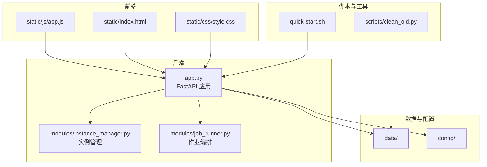
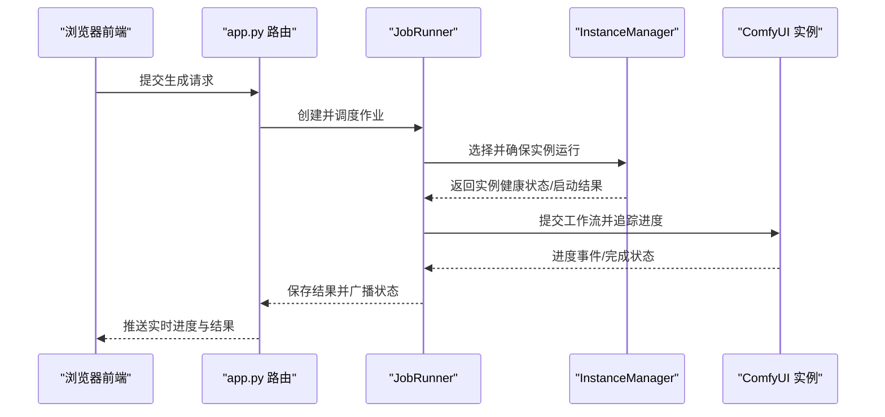
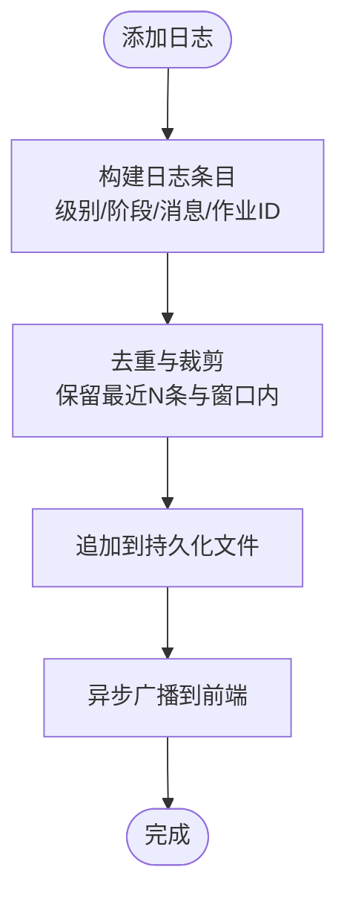
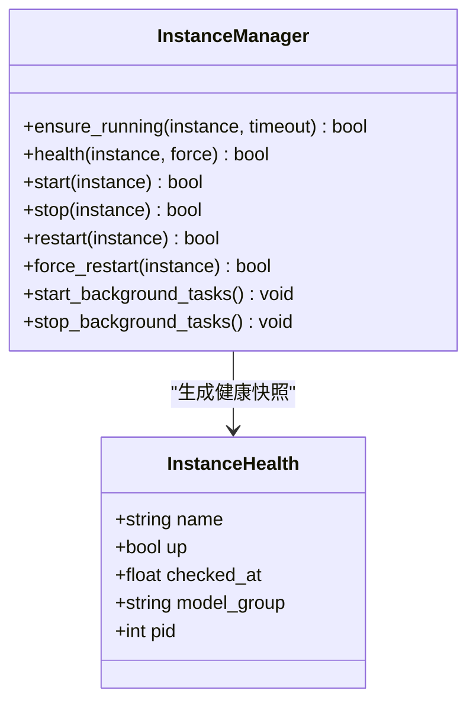
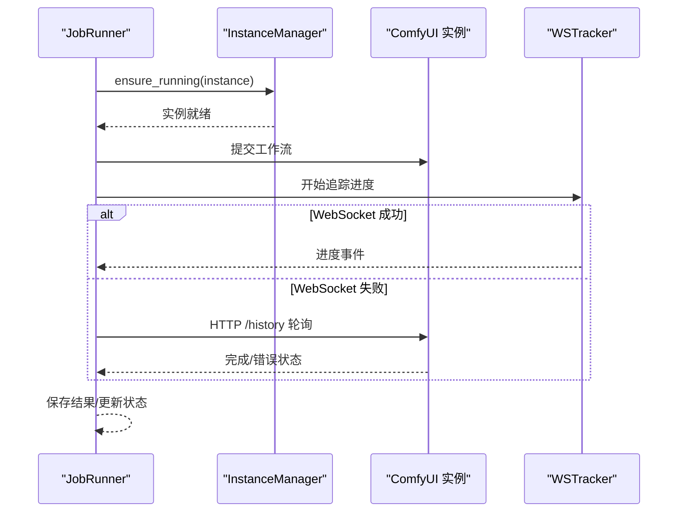
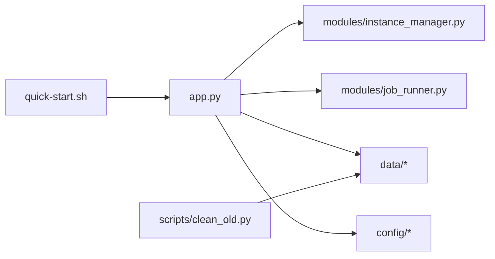

# 故障排除与维护

<cite>
**本文档引用的文件**
- [README.md](file://README.md)
- [VERSION](file://VERSION)
- [app.py](file://app.py)
- [quick-start.sh](file://quick-start.sh)
- [modules/instance_manager.py](file://modules/instance_manager.py)
- [modules/job_runner.py](file://modules/job_runner.py)
- [scripts/clean_old.py](file://scripts/clean_old.py)
</cite>

## 目录
1. [简介](#简介)
2. [项目结构](#项目结构)
3. [核心组件](#核心组件)
4. [架构总览](#架构总览)
5. [详细组件分析](#详细组件分析)
6. [依赖分析](#依赖分析)
7. [性能考虑](#性能考虑)
8. [故障排除指南](#故障排除指南)
9. [结论](#结论)
10. [附录](#附录)

## 简介
本文件面向 Ez ComfyUI Showcase 的运维与开发团队，提供系统化的故障排除与维护指南。内容覆盖服务启动失败、端口冲突、权限问题、依赖缺失等常见问题的诊断与修复；性能问题排查（响应缓慢、内存泄漏、CPU 占用过高、磁盘空间不足）；系统维护流程（定期维护任务、系统清理、日志清理、缓存清理）；升级与版本管理（版本升级步骤、兼容性检查、回滚策略、数据迁移）；故障恢复流程（服务崩溃恢复、数据库修复、配置文件恢复、依赖修复）；维护工具与脚本（系统检查脚本、性能监控脚本、日志分析脚本）；预防性维护（定期检查清单、健康检查、容量规划、风险评估）；以及维护记录与报告（维护日志、问题跟踪、性能报告、维护总结）。

## 项目结构
项目采用前后端分离的单体应用架构，后端基于 FastAPI，前端为纯静态资源（HTML/CSS/JS）。核心运行逻辑集中在 app.py 中，模块化组件位于 modules/ 目录，脚本与工具位于 scripts/ 目录，数据与配置位于 data/ 与 config/ 目录。

**图表来源**
- [app.py](file://app.py)
- [modules/instance_manager.py](file://modules/instance_manager.py)
- [modules/job_runner.py](file://modules/job_runner.py)
- [quick-start.sh](file://quick-start.sh)
- [scripts/clean_old.py](file://scripts/clean_old.py)

**章节来源**
- [README.md: 40-59:40-59](file://README.md#L40-L59)

## 核心组件
- 应用入口与路由：app.py 提供 FastAPI 应用、WebSocket 推送、日志系统、作业队列与状态管理。
- 实例管理：modules/instance_manager.py 负责 ComfyUI 实例的健康检查、冷启动、空闲回收、死实例检测与重启。
- 作业编排：modules/job_runner.py 负责工作流提交、进度追踪、结果下载、失败恢复与重试。
- 启动与服务管理：quick-start.sh 提供 macOS LaunchAgent 服务的安装、启动、停止、重启与状态查询。
- 清理与迁移：scripts/clean_old.py 提供历史数据清理与迁移脚本，支持 V3/V4 数据格式差异。

**章节来源**
- [app.py: 116-292:116-292](file://app.py#L116-L292)
- [modules/instance_manager.py: 43-532:43-532](file://modules/instance_manager.py#L43-L532)
- [modules/job_runner.py: 93-800:93-800](file://modules/job_runner.py#L93-L800)
- [quick-start.sh: 1-127:1-127](file://quick-start.sh#L1-L127)
- [scripts/clean_old.py: 1-123:1-123](file://scripts/clean_old.py#L1-L123)

## 架构总览
系统通过 app.py 统一调度，前端通过 WebSocket 与后端交互，后端通过 InstanceManager 管理 ComfyUI 实例，JobRunner 负责具体生成任务的编排与恢复。

**图表来源**
- [app.py: 116-292:116-292](file://app.py#L116-L292)
- [modules/job_runner.py: 234-715:234-715](file://modules/job_runner.py#L234-L715)
- [modules/instance_manager.py: 93-151:93-151](file://modules/instance_manager.py#L93-L151)

## 详细组件分析

### 日志系统与问题定位
- 日志缓冲与持久化：app.py 维护内存日志缓冲与 JSONL 文件持久化，支持按时间窗口裁剪与去噪（如缩略图噪声）。
- 日志接口：提供最近日志读取与过滤能力，便于前端面板展示与问题定位。
- 错误友好化：对连接被拒、超时等典型错误进行中文友好提示，降低诊断成本。

**图表来源**
- [app.py: 116-292:116-292](file://app.py#L116-L292)

**章节来源**
- [app.py: 116-292:116-292](file://app.py#L116-L292)

### 实例管理与冷启动自愈
- 健康检查：通过 /system_stats 端点探测实例可用性，支持缓存与强制刷新。
- 冷启动：并发去重锁、超时控制、强制重启（清理残留进程）、防御期（刚启动90秒内不误判）。
- 死实例检测：若 systemd 服务处于 active 但健康检查失败，则自动重启。
- 空闲回收：超过空闲超时且无活跃任务时停止实例，节省资源。

**图表来源**
- [modules/instance_manager.py: 43-532:43-532](file://modules/instance_manager.py#L43-L532)

**章节来源**
- [modules/instance_manager.py: 93-151:93-151](file://modules/instance_manager.py#L93-L151)
- [modules/instance_manager.py: 334-375:334-375](file://modules/instance_manager.py#L334-L375)

### 作业编排与故障恢复
- 选择实例：综合队列大小、健康状态、模型组亲和性与首选实例策略。
- 信号量与并发：按实例粒度的信号量控制并发，避免资源争用。
- 提交与追踪：优先 WebSocket 进度追踪，失败时回退到 HTTP 轮询。
- 提交停滞恢复：检测提交后无执行事件，清理队列、中断、必要时重启实例。
- 超时与重试：阶段超时策略、GPU 静止检测与自动重启、提交失败重试上限。

**图表来源**
- [modules/job_runner.py: 234-715:234-715](file://modules/job_runner.py#L234-L715)
- [modules/instance_manager.py: 93-151:93-151](file://modules/instance_manager.py#L93-L151)

**章节来源**
- [modules/job_runner.py: 234-715:234-715](file://modules/job_runner.py#L234-L715)
- [modules/job_runner.py: 716-768:716-768](file://modules/job_runner.py#L716-L768)

### 启动与服务管理（macOS）
- 使用 LaunchAgent 自动以用户会话启动服务，支持 start/stop/restart/status/logs 子命令。
- 通过 plist 配置工作目录、程序参数、环境变量与日志路径。
- 适用于本地开发与演示场景。

**章节来源**
- [quick-start.sh: 1-127:1-127](file://quick-start.sh#L1-L127)

### 数据清理与迁移
- 支持 V3（JSON）与 V4（SQLite）两种历史存储格式。
- 清理早于截止日期的历史记录，删除对应图片与缩略图文件，并同步更新 JSON 与 SQLite。
- 提供远程清理（通过 SSH）与本地清理两种执行方式。

**章节来源**
- [scripts/clean_old.py: 1-123:1-123](file://scripts/clean_old.py#L1-L123)

## 依赖分析
- 后端依赖：FastAPI、uvicorn、websockets、bcrypt、sqlite3、aiofiles 等。
- 前端依赖：静态资源，无打包器，直接通过 index.html 引入。
- 实例依赖：systemd 用户服务（systemctl --user）、ComfyUI WebSocket 与 REST API。
- 脚本依赖：Python 标准库与 sqlite3。

**图表来源**
- [app.py](file://app.py)
- [modules/instance_manager.py](file://modules/instance_manager.py)
- [modules/job_runner.py](file://modules/job_runner.py)
- [quick-start.sh](file://quick-start.sh)
- [scripts/clean_old.py](file://scripts/clean_old.py)

**章节来源**
- [README.md: 30-39:30-39](file://README.md#L30-L39)

## 性能考虑
- GPU 静止检测与自动重启：当 GPU 利用率长时间无波动时，自动中断并重启任务，避免卡死。
- 队列与并发控制：实例级信号量限制并发，结合队列大小与健康状态选择最优实例。
- 日志与内存：日志缓冲与持久化分离，按时间窗口裁剪，避免内存膨胀。
- I/O 与网络：WebSocket 优先，HTTP 轮询作为兜底，减少无效轮询频率。

**章节来源**
- [modules/job_runner.py: 600-715:600-715](file://modules/job_runner.py#L600-L715)
- [app.py: 116-292:116-292](file://app.py#L116-L292)

## 故障排除指南

### 服务启动失败
- 检查端口占用与防火墙规则，确认 EZ_COMFYUI_PORT 设置正确。
- 使用 quick-start.sh 的 status/logs 子命令查看服务状态与日志。
- 若为 systemd 服务问题，检查用户会话与 DBUS/XDG 环境变量。

**章节来源**
- [quick-start.sh: 86-104:86-104](file://quick-start.sh#L86-L104)
- [README.md: 78-86:78-86](file://README.md#L78-L86)

### 端口冲突
- 修改 EZ_COMFYUI_PORT 或调整其他服务端口。
- 确认 ComfyUI 实例端口（COMFYUI_A_PORT/COMFYUI_B_PORT）与后端路由不冲突。

**章节来源**
- [README.md: 78-86:78-86](file://README.md#L78-L86)

### 权限问题
- 确保 data/ 目录存在且具备读写权限，JWT 密钥文件权限为 0600。
- systemd 用户服务需要正确的 DBUS_SESSION_BUS_ADDRESS 与 XDG_RUNTIME_DIR。

**章节来源**
- [app.py: 82-102:82-102](file://app.py#L82-L102)
- [modules/instance_manager.py: 276-292:276-292](file://modules/instance_manager.py#L276-L292)

### 依赖缺失
- 安装 FastAPI、uvicorn、aiofiles、pillow 等依赖。
- 确认 Python 可执行文件路径正确，quick-start.sh 能找到 .venv/bin/python 或系统 python3。

**章节来源**
- [README.md: 68-76:68-76](file://README.md#L68-L76)
- [quick-start.sh: 16-23:16-23](file://quick-start.sh#L16-L23)

### ComfyUI 连接被拒/超时
- 检查实例健康状态与 /system_stats 可达性。
- 观察日志中的友好化错误提示，确认实例是否在启动中或已崩溃。
- 使用 InstanceManager 的强制重启能力清理残留进程。

**章节来源**
- [app.py: 296-302:296-302](file://app.py#L296-L302)
- [modules/instance_manager.py: 378-395:378-395](file://modules/instance_manager.py#L378-L395)

### 任务卡住与 GPU 静止
- 系统会检测 GPU 静止并尝试中断、清理队列、重启实例与重新入队。
- 若达到最大重试次数仍未恢复，任务将标记为错误。

**章节来源**
- [modules/job_runner.py: 600-715:600-715](file://modules/job_runner.py#L600-L715)

### 磁盘空间不足
- 使用 scripts/clean_old.py 清理历史记录与媒体文件。
- 定期清理 data/ 与输出目录，确保 /system_stats 与 /queue 接口可用。

**章节来源**
- [scripts/clean_old.py: 1-123:1-123](file://scripts/clean_old.py#L1-L123)

### 日志与监控
- 通过 /api/logs 获取最近日志，观察阶段、消息与详情字段。
- 使用 quick-start.sh logs 查看 stdout/stderr 日志尾部。

**章节来源**
- [app.py: 191-214:191-214](file://app.py#L191-L214)
- [quick-start.sh: 98-104:98-104](file://quick-start.sh#L98-L104)

## 结论
本指南提供了从启动、运行到维护与恢复的完整路径。建议在生产环境中结合日志监控、健康检查与容量规划，建立自动化巡检与告警机制，确保系统稳定与高效运行。

## 附录

### 版本与发布
- 版本号来源于 VERSION 文件，README 中标注当前版本与变更记录。
- 发布流程要求每次变更均需更新 VERSION 与 CHANGELOG。

**章节来源**
- [VERSION: 1-2:1-2](file://VERSION#L1-L2)
- [README.md: 96-122:96-122](file://README.md#L96-L122)

### 升级与回滚
- 升级步骤：备份 data/ 与 config/，更新代码，核对环境变量与端口，重启服务。
- 兼容性检查：核对 /system_stats 与 /queue 接口行为，确认实例端口与代理配置。
- 回滚策略：恢复备份，回退到上一个稳定版本。
- 数据迁移：使用 scripts/clean_old.py 或自定义脚本处理历史数据格式差异。

**章节来源**
- [scripts/clean_old.py: 46-95:46-95](file://scripts/clean_old.py#L46-L95)

### 维护工具与脚本
- quick-start.sh：服务安装、启动、停止、重启、状态查询与日志查看。
- scripts/clean_old.py：历史数据清理与迁移。

**章节来源**
- [quick-start.sh: 1-127:1-127](file://quick-start.sh#L1-L127)
- [scripts/clean_old.py: 1-123:1-123](file://scripts/clean_old.py#L1-L123)

### 预防性维护
- 定期检查清单：端口连通性、实例健康、日志留存、磁盘空间、权限与密钥。
- 健康检查：定时调用 /api/status 与 /system_stats。
- 容量规划：监控输出目录增长趋势，设置清理策略。
- 风险评估：识别长队列、频繁重启、GPU 静止等高风险信号。

**章节来源**
- [app.py: 116-292:116-292](file://app.py#L116-L292)
- [modules/instance_manager.py: 334-375:334-375](file://modules/instance_manager.py#L334-L375)