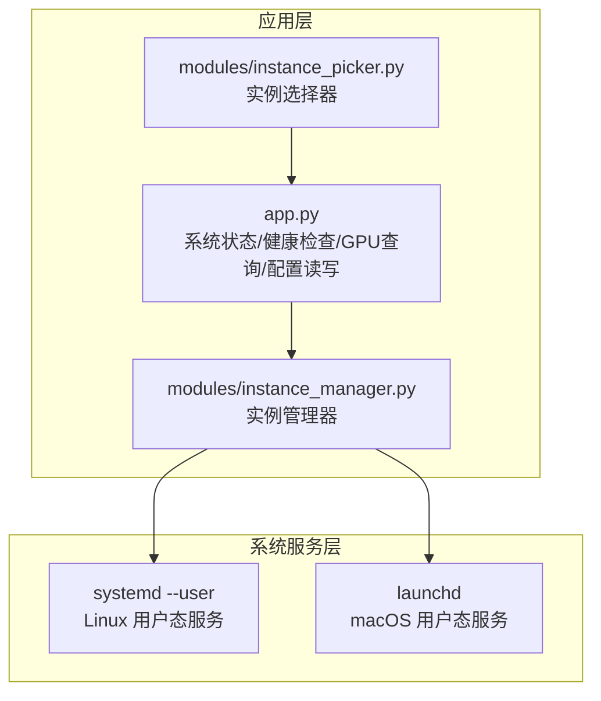
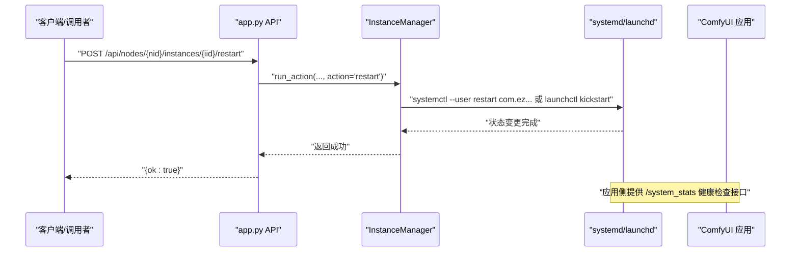
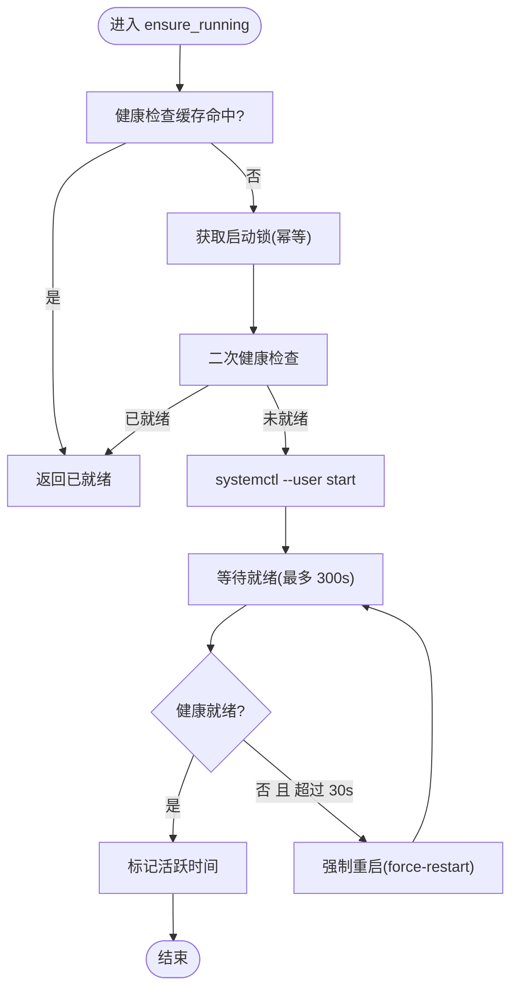
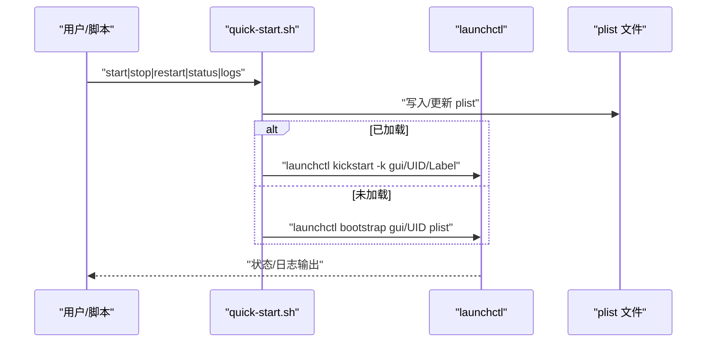
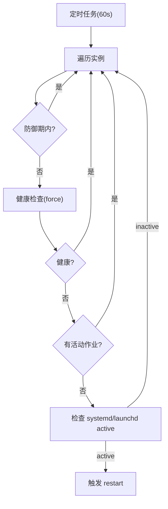
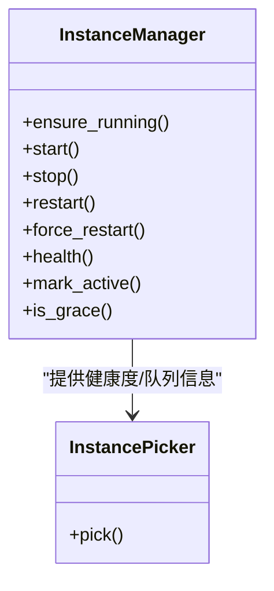
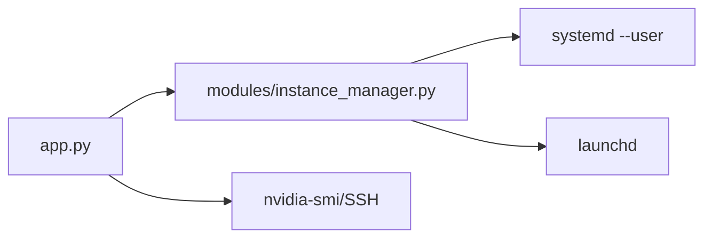

# 服务管理

<cite>
**本文档引用的文件**
- [app.py](file://app.py)
- [modules/instance_manager.py](file://modules/instance_manager.py)
- [quick-start.sh](file://quick-start.sh)
- [scripts/mac-llm.sh](file://scripts/mac-llm.sh)
- [tests/test_quick_start_script.py](file://tests/test_quick_start_script.py)
- [modules/instance_picker.py](file://modules/instance_picker.py)
- [app.py](file://app.py)
</cite>

## 目录
1. [引言](#引言)
2. [项目结构](#项目结构)
3. [核心组件](#核心组件)
4. [架构总览](#架构总览)
5. [详细组件分析](#详细组件分析)
6. [依赖关系分析](#依赖关系分析)
7. [性能考虑](#性能考虑)
8. [故障排查指南](#故障排查指南)
9. [结论](#结论)
10. [附录](#附录)

## 引言
本文件面向 Ez ComfyUI Showcase 的服务管理与运维场景，系统化梳理了两类平台的服务管理实践：
- Linux/macOS 用户态服务：通过 systemd --user（Linux）与 launchd（macOS）进行服务生命周期管理、自动重启与日志输出。
- 应用侧健康检查与自动恢复：基于实例健康检查、防御期与死实例检测的自动重启策略，以及空闲实例回收。

同时，文档覆盖服务监控与告警思路、配置热更新建议、扩展与负载均衡策略、故障恢复与性能调优要点，帮助团队建立稳定、可观测、可扩展的服务体系。

## 项目结构
围绕服务管理的关键文件与职责如下：
- app.py：提供远程节点与实例的 systemd/launchd 管理入口、健康检查接口、GPU 统计查询、节点与工作流配置读取与持久化。
- modules/instance_manager.py：实例生命周期管理器，负责健康检查、自动重启、空闲回收、防御期控制等。
- quick-start.sh：macOS launchd 服务脚本，生成 plist、启动/停止/重启/状态/日志查看。
- scripts/mac-llm.sh：macOS launchd 服务脚本（独立 LLM 服务），展示环境变量、日志路径、keepAlive 等配置。
- tests/test_quick_start_script.py：对 quick-start.sh 的行为进行断言测试，确保 restart 使用 kickstart、stop 成功 bootout 等。
- modules/instance_picker.py：实例选择器，体现健康度与队列长度等指标在调度中的作用。

**图表来源**
- [app.py](file://app.py)
- [modules/instance_manager.py](file://modules/instance_manager.py)
- [modules/instance_picker.py](file://modules/instance_picker.py)

**章节来源**
- [app.py](file://app.py)
- [modules/instance_manager.py](file://modules/instance_manager.py)
- [quick-start.sh](file://quick-start.sh)
- [scripts/mac-llm.sh](file://scripts/mac-llm.sh)
- [tests/test_quick_start_script.py](file://tests/test_quick_start_script.py)
- [modules/instance_picker.py](file://modules/instance_picker.py)

## 核心组件
- 实例管理器（InstanceManager）
  - 提供 ensure_running/start/stop/restart/force_restart 等生命周期方法。
  - 健康检查缓存、防御期（刚启动 90 秒）、空闲超时（默认 15 分钟）、死实例检测（60 秒周期）。
  - 自动重启策略：当 systemd 服务处于 active 状态但健康检查失败时触发重启；冷启动超过 30 秒未就绪时执行强制重启。
- 应用侧服务管理
  - Linux：通过 systemctl --user 执行 start/stop/restart/kill，支持本地与 SSH 远程执行，并注入必要的 D-Bus 环境变量。
  - macOS：通过 launchctl bootstrap/bootout/kickstart 管理服务，支持写入 plist、设置 KeepAlive、标准输出/错误日志路径。
- 健康检查与监控
  - 健康检查基于实例 /system_stats 接口可达性，默认缓存 15 秒，HTTP 超时 5 秒。
  - GPU 统计通过本地或 SSH 执行 nvidia-smi 采集，支持回退到进程占用与 /proc/meminfo。
- 配置热更新
  - 工作流配置支持从数据库与文件系统读取与迁移，保存时写入数据库并导出文件，便于持久化与跨实例共享。

**章节来源**
- [modules/instance_manager.py](file://modules/instance_manager.py)
- [app.py](file://app.py)

## 架构总览
下图展示了服务管理的整体交互：前端/外部调用通过 API 触发实例管理器，实例管理器再通过 systemd/launchd 控制服务生命周期；应用侧提供健康检查与 GPU 统计接口，供 UI 与自动化工具消费。

**图表来源**
- [app.py](file://app.py)
- [modules/instance_manager.py](file://modules/instance_manager.py)

## 详细组件分析

### systemd 服务管理（Linux 用户态）
- 配置文件语法与位置
  - 用户态服务位于 ~/.config/systemd/user/，服务单元文件命名与应用中使用的 service 名称一致。
  - 通过 systemctl --user start/stop/restart/kill 管理服务。
- 状态监控
  - 通过 _check_service_active_for_instance 检查 systemd 服务 active 状态；结合健康检查结果决定是否重启。
- 自动重启机制
  - 死实例检测循环每 60 秒扫描一次，若服务 active 且健康检查失败，则触发 restart。
  - 冷启动超过 30 秒未就绪时，执行 force-restart（先 kill -9 再 start）。
- 日志输出
  - systemd 会将 stdout/stderr 重定向至 journal，也可配合应用侧日志路径进行辅助定位。

**图表来源**
- [modules/instance_manager.py](file://modules/instance_manager.py)
- [app.py](file://app.py)

**章节来源**
- [modules/instance_manager.py](file://modules/instance_manager.py)
- [app.py](file://app.py)

### launchd 服务管理（macOS）
- plist 配置要点
  - Label、WorkingDirectory、ProgramArguments、RunAtLoad、KeepAlive、StandardOutPath、StandardErrorPath。
  - 环境变量可通过 EnvironmentVariables 注入（如 EZ_COMFYUI_PORT）。
- 生命周期管理
  - bootstrap：首次加载或重启服务。
  - bootout：卸载服务。
  - kickstart -k：无条件重启服务，避免 stop+start 的链式开销。
- 日志轮转
  - 通过 StandardOutPath/StandardErrorPath 指定日志文件，建议结合系统日志轮转策略或外部工具进行维护。

**图表来源**
- [quick-start.sh](file://quick-start.sh)

**章节来源**
- [quick-start.sh](file://quick-start.sh)
- [scripts/mac-llm.sh](file://scripts/mac-llm.sh)
- [tests/test_quick_start_script.py](file://tests/test_quick_start_script.py)

### 服务监控与告警机制
- 进程健康检查
  - 周期性调用 /system_stats 接口，缓存 15 秒，超时 5 秒；健康失败时触发死实例检测与自动重启。
- 资源使用监控
  - 本地：通过 nvidia-smi 查询 VRAM/温度/利用率；若无数据则回退到进程占用与 /proc/meminfo。
  - 远程：通过 SSH 执行相同命令，失败时返回“暂不可用”并保留最近一次有效样本。
- 异常告警
  - 建议：将健康检查失败、服务非 active 但应用不可达、GPU 数据持续不可用等事件上报统一告警平台；结合日志与指标进行聚合。

**图表来源**
- [modules/instance_manager.py](file://modules/instance_manager.py)

**章节来源**
- [modules/instance_manager.py](file://modules/instance_manager.py)
- [app.py](file://app.py)

### 服务配置热更新
- 工作流配置
  - 支持从数据库与文件系统加载，保存时写入数据库并导出文件，便于跨实例共享与持久化。
  - 迁移逻辑：将文件夹中的配置迁移到数据库，避免重复与丢失。
- 配置验证
  - 建议在保存前进行 JSON Schema 校验与字段完整性检查；失败时记录错误并拒绝写入。
- 配置监听
  - 可通过文件系统事件或定期扫描实现配置变更检测；变更后触发缓存刷新与通知。

**章节来源**
- [app.py](file://app.py)

### 服务扩展与负载均衡
- 多实例部署
  - 通过不同实例的 group 与亲和性策略进行模型隔离与资源分配。
- 服务发现
  - 健康检查接口与节点配置共同构成服务发现基础：UI 与 API 侧可拉取健康快照与实例列表。
- 流量分发
  - 基于实例健康度与队列长度进行选择，优先选择健康且空闲的实例；必要时按模型组亲和性进行路由。

**图表来源**
- [modules/instance_manager.py](file://modules/instance_manager.py)
- [modules/instance_picker.py](file://modules/instance_picker.py)

**章节来源**
- [modules/instance_manager.py](file://modules/instance_manager.py)
- [modules/instance_picker.py](file://modules/instance_picker.py)

### 故障恢复策略
- 自动重启
  - 死实例检测与强制重启（冷启动超时）相结合，降低人工干预成本。
- 降级处理
  - 当 GPU 查询失败时，保留最近一次有效样本并提示“缓存值”，避免 UI 中断。
- 故障转移
  - 通过实例选择器优先挑选健康实例，必要时切换到同组其他实例。

**章节来源**
- [modules/instance_manager.py](file://modules/instance_manager.py)
- [app.py](file://app.py)

## 依赖关系分析
- 模块耦合
  - app.py 作为入口，依赖实例管理器进行生命周期控制；实例管理器通过 hook 与 app.py 解耦，便于替换 systemd/launchd 执行路径。
- 外部依赖
  - Linux：systemd --user、D-Bus 环境变量。
  - macOS：launchctl、plist 文件。
  - 远程节点：SSH、nvidia-smi、/proc/meminfo。

**图表来源**
- [app.py](file://app.py)
- [modules/instance_manager.py](file://modules/instance_manager.py)

**章节来源**
- [app.py](file://app.py)
- [modules/instance_manager.py](file://modules/instance_manager.py)

## 性能考虑
- 并发配置
  - 利用实例选择器的队列长度与健康度进行并发调度，避免热点实例过载。
- 内存管理
  - GPU 查询失败时回退到进程占用与系统内存统计，减少额外 IO；保持最近一次有效样本以提升稳定性。
- CPU 亲和性
  - 可结合 systemd/launchd 的 ExecStartPre/ExecStartPost 或外部工具设置 CPU 亲和性与 cgroups，进一步优化资源隔离。

[本节为通用指导，无需特定文件引用]

## 故障排查指南
- systemd 无法启动/重启
  - 检查 ~/.config/systemd/user 下服务单元是否存在、权限是否正确；查看 journal 日志定位错误。
- launchd 无法加载
  - 确认 plist 路径与权限；使用 launchctl print gui/UID/Label 查看状态；使用 logs 子命令查看 stdout/stderr。
- 健康检查失败
  - 检查 /system_stats 接口可达性、防火墙与端口；确认应用已完全启动并接受请求。
- GPU 统计异常
  - 本地：确认 nvidia-smi 可用与驱动正常；远程：确认 SSH 通道与权限；若均失败，检查回退逻辑是否生效。

**章节来源**
- [quick-start.sh](file://quick-start.sh)
- [scripts/mac-llm.sh](file://scripts/mac-llm.sh)
- [app.py](file://app.py)

## 结论
Ez ComfyUI Showcase 的服务管理以“应用侧健康检查 + 系统服务生命周期管理”为核心，结合死实例检测、强制重启与空闲回收，形成闭环的自动恢复能力。通过 launchd 与 systemd 的统一抽象，实现了跨平台的一致体验；配合工作流配置的热更新与实例选择器的智能调度，满足多实例、多模型场景下的稳定性与可扩展性需求。

[本节为总结性内容，无需特定文件引用]

## 附录
- 常用命令参考
  - Linux：systemctl --user start/stop/restart/kill、journalctl --user-unit=...
  - macOS：launchctl bootstrap/bootout/kickstart/print，查看日志文件路径。
- 建议流程
  - 部署：生成并加载服务单元/Agent；设置 KeepAlive 与日志路径。
  - 监控：定期拉取 /system_stats 与 GPU 统计；异常时触发告警。
  - 维护：通过 restart/force-restart 清理异常进程；必要时手动调整实例亲和与队列上限。

[本节为通用指导，无需特定文件引用]