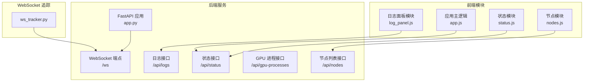
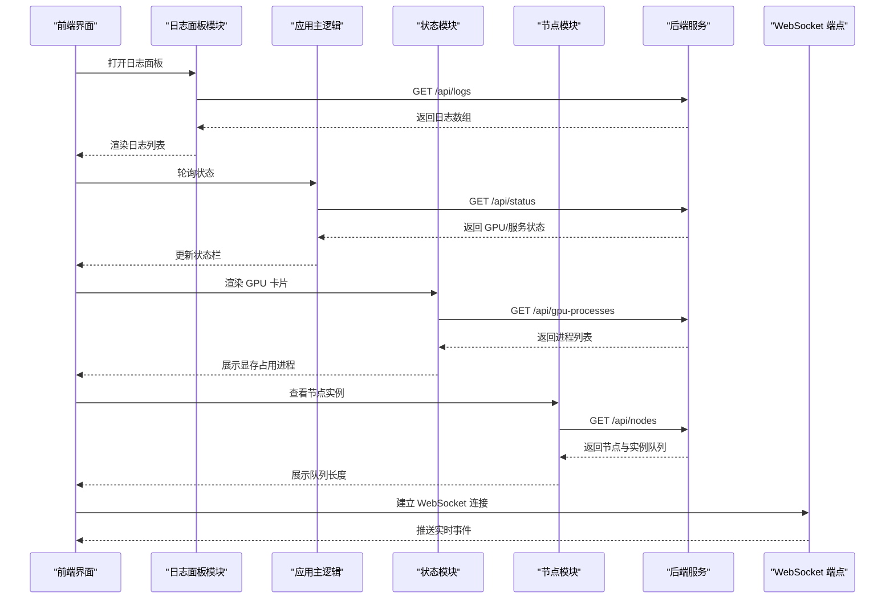
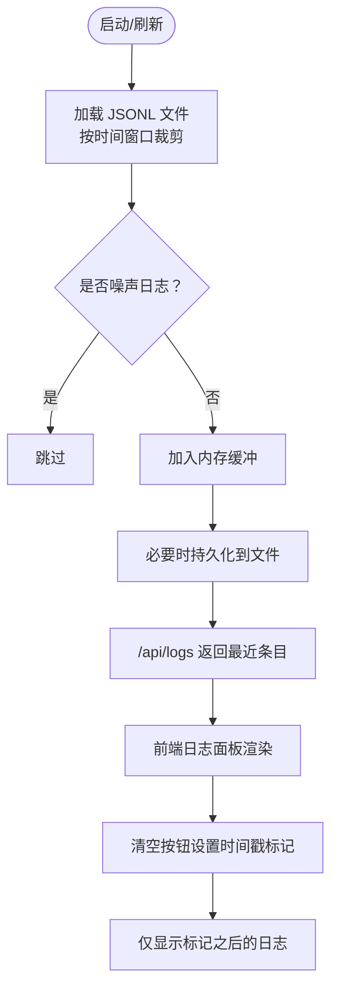
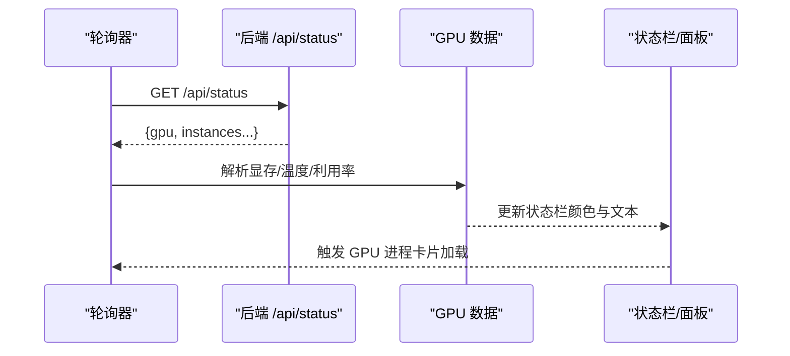
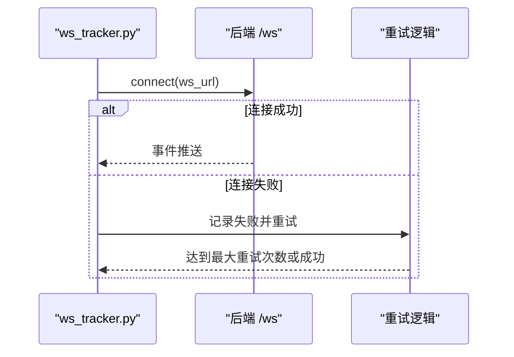
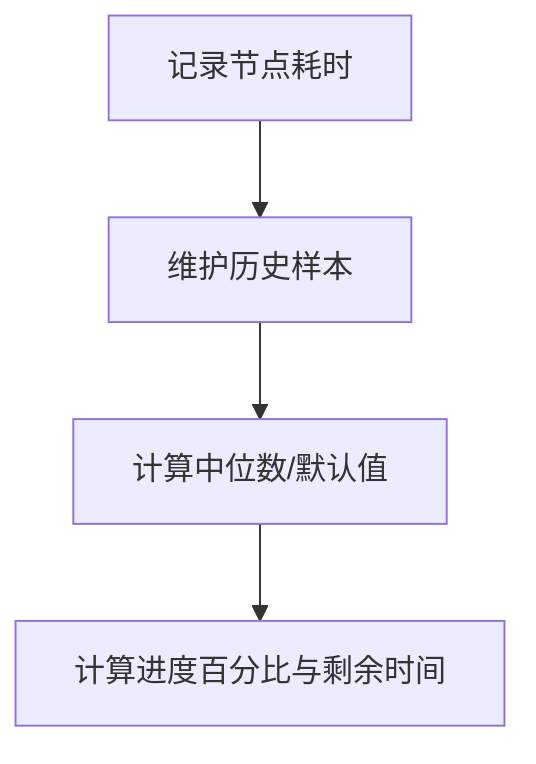
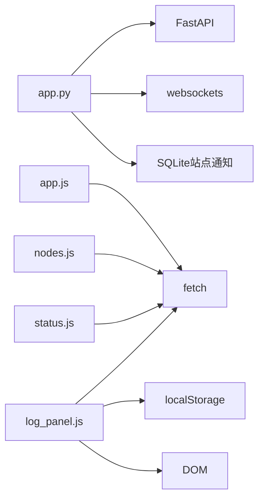

# 监控与日志

<cite>
**本文引用的文件**
- [app.py](file://app.py)
- [log_panel.js](file://static/js/modules/log_panel.js)
- [app.js](file://static/js/app.js)
- [status.js](file://static/js/modules/status.js)
- [nodes.js](file://static/js/modules/nodes.js)
- [ws_tracker.py](file://modules/ws_tracker.py)
- [test_logs_api.py](file://tests/test_logs_api.py)
- [test_status_button_runtime.py](file://tests/test_status_button_runtime.py)
- [time_estimator.py](file://modules/time_estimator.py)
</cite>

## 目录
1. [简介](#简介)
2. [项目结构](#项目结构)
3. [核心组件](#核心组件)
4. [架构总览](#架构总览)
5. [详细组件分析](#详细组件分析)
6. [依赖关系分析](#依赖关系分析)
7. [性能考量](#性能考量)
8. [故障排查指南](#故障排查指南)
9. [结论](#结论)
10. [附录](#附录)

## 简介
本文件面向 Ez ComfyUI Showcase 的监控与日志管理，系统性梳理以下方面：
- 监控指标：CPU/GPU 使用率、温度、显存占用、任务队列长度等
- 日志管理：访问日志、错误日志、业务日志的分类、格式化、持久化与权限控制
- 实时监控面板：WebSocket 连接状态、GPU 使用情况、任务队列长度的实时展示
- 日志分析与检索：日志聚合、关键字过滤、时间范围筛选、日志导出
- 告警机制：阈值设置、规则定义、通知渠道、告警去重
- 性能监控与分析：响应时间统计、吞吐量监控、瓶颈识别、趋势分析
- 日志轮转与清理：文件大小限制、保留周期、自动清理策略

## 项目结构
围绕监控与日志的关键代码分布在后端服务与前端模块中：
- 后端服务（FastAPI）负责日志缓冲、持久化、权限过滤、状态接口与 WebSocket 通道
- 前端模块负责日志面板渲染、过滤、清空、状态栏 GPU 信息展示、节点实例队列显示
- WebSocket 追踪模块负责与 ComfyUI 实例的连接、断线重连与事件回放

图表来源
- [app.py](file://app.py)
- [log_panel.js](file://static/js/modules/log_panel.js)
- [app.js](file://static/js/app.js)
- [status.js](file://static/js/modules/status.js)
- [nodes.js](file://static/js/modules/nodes.js)
- [ws_tracker.py](file://modules/ws_tracker.py)

章节来源
- [app.py](file://app.py)
- [log_panel.js](file://static/js/modules/log_panel.js)
- [app.js](file://static/js/app.js)
- [status.js](file://static/js/modules/status.js)
- [nodes.js](file://static/js/modules/nodes.js)
- [ws_tracker.py](file://modules/ws_tracker.py)

## 核心组件
- 日志缓冲与持久化：维护内存中的日志缓冲区，按时间窗口裁剪，并写入 JSONL 文件
- 权限与可见性：基于用户角色与作业归属过滤日志条目
- 实时状态：GPU 显存占比、温度、利用率、实例队列长度等
- WebSocket 通道：统一的实时事件通道，支持断线重连与客户端标识
- 前端日志面板：加载、渲染、过滤、清空日志，支持移动端视口适配
- 前端状态栏：根据 GPU 指标动态切换状态色（空闲/忙碌/过载）

章节来源
- [app.py](file://app.py)
- [log_panel.js](file://static/js/modules/log_panel.js)
- [app.js](file://static/js/app.js)
- [status.js](file://static/js/modules/status.js)

## 架构总览
后端通过 FastAPI 提供 REST 接口与 WebSocket 端点，前端通过 HTTP 与 WebSocket 获取实时状态与日志。日志以 JSONL 形式持久化，支持按用户权限与作业 ID 过滤。

图表来源
- [app.py](file://app.py)
- [log_panel.js](file://static/js/modules/log_panel.js)
- [app.js](file://static/js/app.js)
- [status.js](file://static/js/modules/status.js)
- [nodes.js](file://static/js/modules/nodes.js)

## 详细组件分析

### 日志系统与权限控制
- 日志缓冲与持久化
  - 内存缓冲上限与时间保留窗口由常量控制
  - 启动时从 JSONL 文件加载近期日志，剔除非可操作噪声日志
  - 写入新日志时追加到文件末尾
- 权限过滤
  - 管理员可查看全部日志
  - 普通用户仅可见自身或其可访问作业相关的日志
- 前端日志面板
  - 支持按级别过滤、清空（设置“从何时之后”标记）、移动端自适应
  - 实时事件到达时去重插入并滚动至底部

图表来源
- [app.py](file://app.py)
- [log_panel.js](file://static/js/modules/log_panel.js)

章节来源
- [app.py](file://app.py)
- [log_panel.js](file://static/js/modules/log_panel.js)
- [test_logs_api.py](file://tests/test_logs_api.py)

### 实时监控面板（GPU/队列/连接）
- GPU 信息
  - 状态栏根据显存占比、温度、利用率动态切换状态色
  - 支持查看占用显存的进程列表
- 任务队列
  - 节点实例行展示队列长度，局部更新避免整页闪烁
- WebSocket 连接
  - 统一的 /ws 端点用于推送实时事件
  - WebSocket 追踪模块负责连接、重试与事件回放

图表来源
- [app.js](file://static/js/app.js)
- [status.js](file://static/js/modules/status.js)
- [nodes.js](file://static/js/modules/nodes.js)
- [app.py](file://app.py)

章节来源
- [app.js](file://static/js/app.js)
- [status.js](file://static/js/modules/status.js)
- [nodes.js](file://static/js/modules/nodes.js)
- [test_status_button_runtime.py](file://tests/test_status_button_runtime.py)

### WebSocket 追踪与断线重连
- 连接建立与超时处理
- 异常捕获与重试机制
- 重连已有工作流的 WebSocket，仅恢复事件而不重复提交

图表来源
- [ws_tracker.py](file://modules/ws_tracker.py)
- [app.py](file://app.py)

章节来源
- [ws_tracker.py](file://modules/ws_tracker.py)
- [app.py](file://app.py)

### 性能监控与分析（时间估计）
- 节点耗时记录与中位数估计
- 基于历史与分辨率提示的耗时预测
- 进度计算与预期耗时输出

图表来源
- [time_estimator.py](file://modules/time_estimator.py)

章节来源
- [time_estimator.py](file://modules/time_estimator.py)

## 依赖关系分析
- 后端依赖
  - FastAPI：提供路由、WebSocket、依赖注入
  - websockets：WebSocket 客户端连接与异常处理
  - SQLite：站点通知状态持久化
- 前端依赖
  - fetch：HTTP 请求
  - DOM：日志面板与状态栏渲染
  - 本地存储：用户偏好与清空标记

图表来源
- [app.py](file://app.py)
- [log_panel.js](file://static/js/modules/log_panel.js)
- [status.js](file://static/js/modules/status.js)
- [nodes.js](file://static/js/modules/nodes.js)
- [app.js](file://static/js/app.js)

章节来源
- [app.py](file://app.py)
- [log_panel.js](file://static/js/modules/log_panel.js)
- [status.js](file://static/js/modules/status.js)
- [nodes.js](file://static/js/modules/nodes.js)
- [app.js](file://static/js/app.js)

## 性能考量
- 日志缓冲与持久化
  - 内存缓冲上限与时间窗口控制内存占用与查询范围
  - JSONL 追加写入降低锁竞争
- 前端渲染优化
  - 局部更新节点实例行，避免整页重绘
  - 日志面板按需渲染与滚动到底部
- WebSocket
  - 重试与超时参数平衡实时性与稳定性
- 时间估计
  - 中位数对异常值鲁棒，结合分辨率提示提升估计精度

## 故障排查指南
- 日志无法加载或为空
  - 检查日志文件路径与权限
  - 确认时间窗口内是否存在有效日志
  - 使用前端“清空”功能重置时间戳标记
- GPU 信息不更新
  - 检查后端状态接口返回内容
  - 确认前端状态栏更新逻辑是否被调用
- WebSocket 连接失败
  - 查看重试日志与异常栈
  - 确认端点可达与认证头正确
- 队列长度不变化
  - 检查节点实例状态与队列字段
  - 确认前端局部更新选择器是否匹配

章节来源
- [test_logs_api.py](file://tests/test_logs_api.py)
- [test_status_button_runtime.py](file://tests/test_status_button_runtime.py)
- [ws_tracker.py](file://modules/ws_tracker.py)

## 结论
本系统通过后端日志缓冲与权限过滤、前端实时面板与 WebSocket 通道，实现了可观测性与可运维性的基础能力。建议在现有基础上扩展：
- 告警规则与通知渠道（邮件/IM/Webhook）
- 指标采集与可视化（CPU/内存/网络/磁盘）
- 日志检索与导出（全文索引、分页、CSV 导出）
- 性能基线与趋势分析（直方图、分位数）

## 附录

### 监控指标清单与采集方式
- CPU 使用率
  - 方式：系统级采集（如 psutil 或系统工具），后端暴露 /api/system-stats
- 内存占用
  - 方式：RSS/虚拟内存统计，后端暴露 /api/system-stats
- 磁盘空间
  - 方式：文件系统容量与可用空间，后端暴露 /api/system-stats
- 网络流量
  - 方式：接口请求计数与字节统计，后端中间件埋点
- GPU 使用率/温度/显存
  - 方式：后端 /api/status 返回 GPU 字段，前端状态栏渲染

章节来源
- [app.py](file://app.py)
- [status.js](file://static/js/modules/status.js)

### 日志管理策略
- 分类
  - 访问日志：请求路径、方法、状态码、耗时
  - 错误日志：异常堆栈、错误码、上下文
  - 业务日志：作业阶段、消息、详情、用户与作业关联
- 格式化
  - JSONL 行式存储，字段包含时间戳、级别、阶段、消息、详情、用户与作业标识
- 存储策略
  - JSONL 文件按日期/大小轮转，保留最近 N 条与 T 秒内的日志
- 权限控制
  - 管理员可见全部；普通用户仅可见自身或其可访问作业的日志

章节来源
- [app.py](file://app.py)
- [log_panel.js](file://static/js/modules/log_panel.js)

### 实时监控面板功能
- WebSocket 连接状态
  - 连接/断开/重试状态可视化
- GPU 使用情况
  - 显存占比、温度、利用率、进程占用列表
- 任务队列长度
  - 节点实例队列长度与状态点

章节来源
- [app.py](file://app.py)
- [status.js](file://static/js/modules/status.js)
- [nodes.js](file://static/js/modules/nodes.js)

### 日志分析与检索
- 聚合
  - 按时间窗口聚合，去除噪声日志
- 关键字搜索
  - 前端输入过滤，后端可扩展正则匹配
- 时间范围筛选
  - 前端清空标记实现“从何时之后”的筛选
- 日志导出
  - 将当前列表导出为 CSV/JSON

章节来源
- [log_panel.js](file://static/js/modules/log_panel.js)
- [app.py](file://app.py)

### 告警机制配置
- 阈值设置
  - 显存占比 ≥ 80%、温度 ≥ 85℃、利用率 ≥ 95%
- 告警规则
  - 过载/忙碌/空闲三态，状态变更触发通知
- 通知渠道
  - 站点通知（SQLite 持久化）、邮件/IM/Webhook（待扩展）
- 告警去重
  - 用户维度抑制，直到新通知产生

章节来源
- [status.js](file://static/js/modules/status.js)
- [app.py](file://app.py)

### 性能监控与分析
- 响应时间统计
  - 接口耗时与节点耗时记录
- 吞吐量监控
  - 单位时间完成作业数
- 瓶颈识别
  - 基于队列长度与 GPU 指标判断
- 性能趋势分析
  - 历史中位数与默认值估计，结合分辨率提示

章节来源
- [time_estimator.py](file://modules/time_estimator.py)

### 日志轮转与清理策略
- 文件大小限制
  - JSONL 追加写入，达到阈值进行轮转
- 保留周期
  - 最近 N 条与 T 秒内的日志
- 自动清理
  - 启动时加载并裁剪，持久化时按上限截断

章节来源
- [app.py](file://app.py)