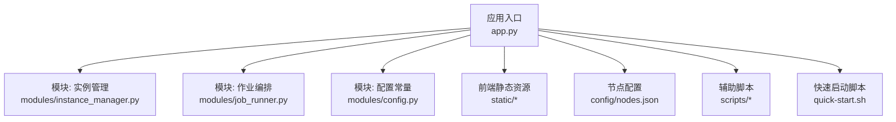
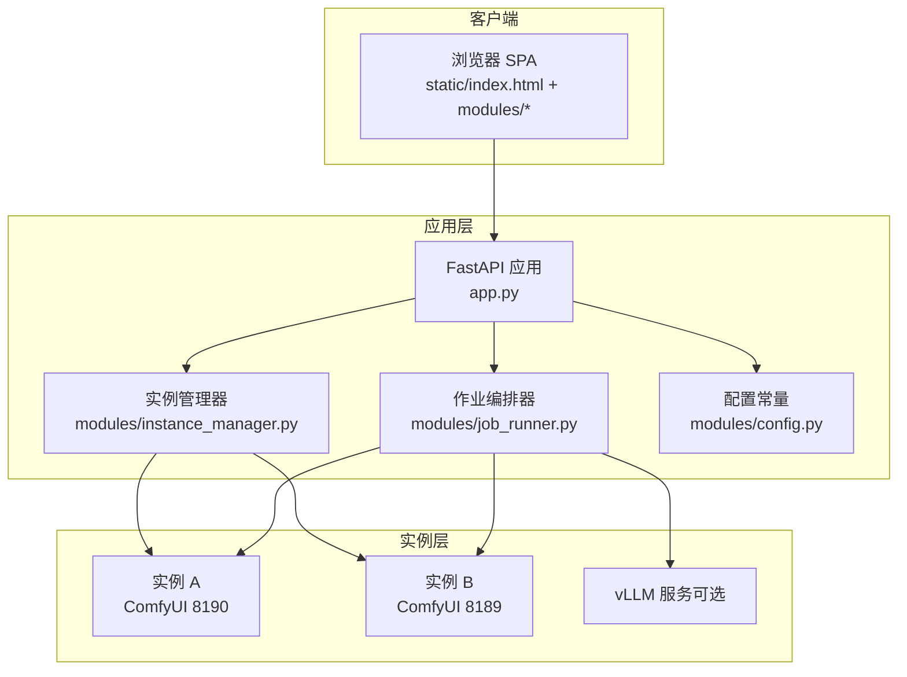
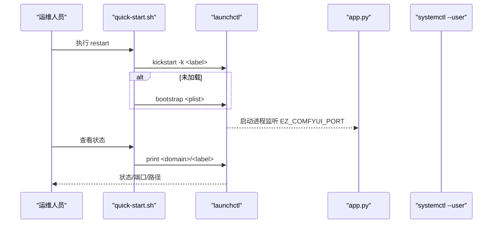
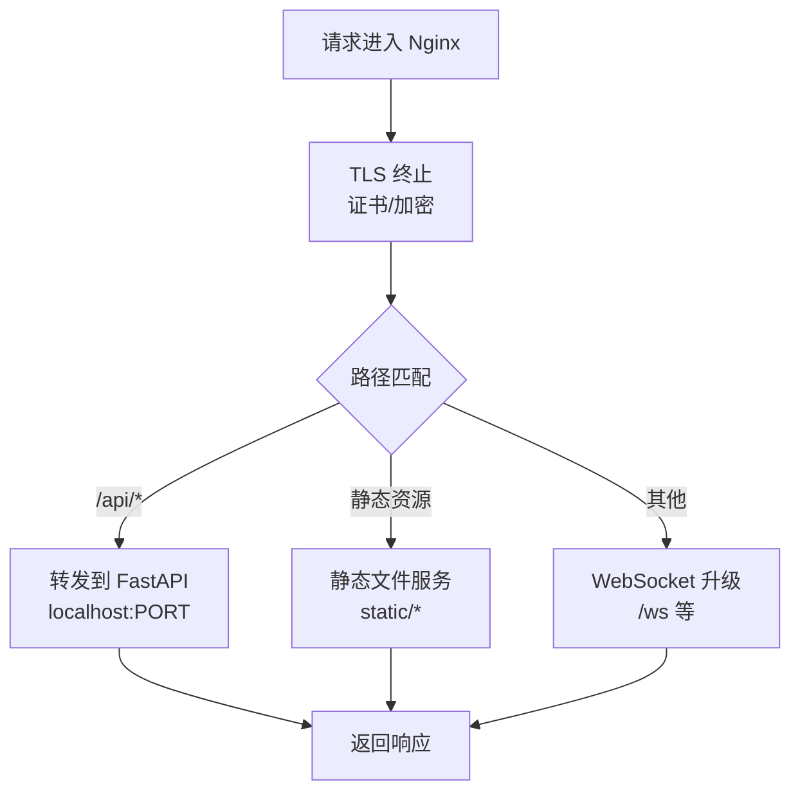
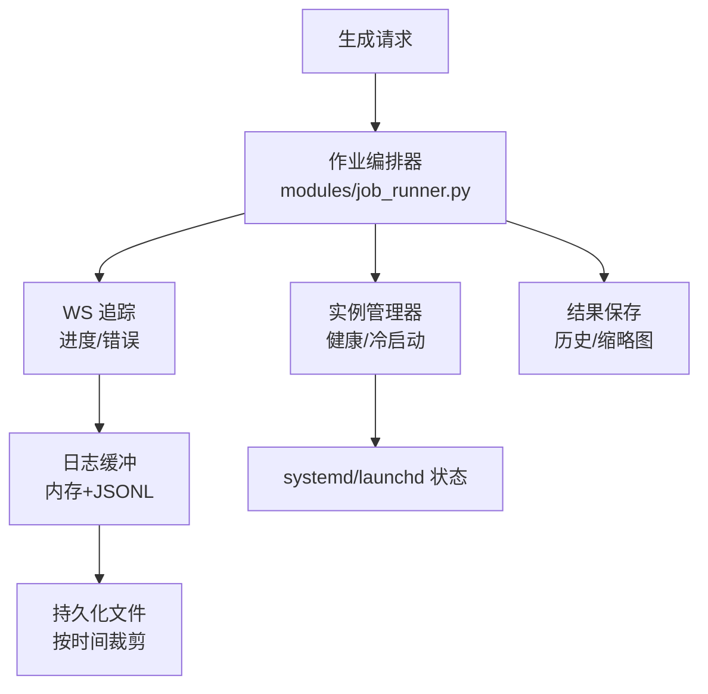
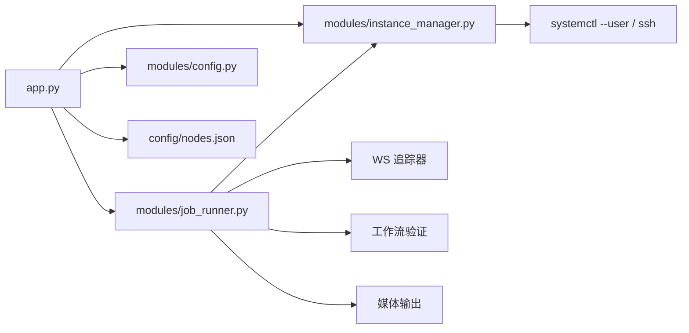

# 部署与维护

<cite>
**本文档引用的文件**
- [README.md](file://README.md)
- [app.py](file://app.py)
- [quick-start.sh](file://quick-start.sh)
- [config/nodes.json](file://config/nodes.json)
- [modules/config.py](file://modules/config.py)
- [modules/instance_manager.py](file://modules/instance_manager.py)
- [modules/job_runner.py](file://modules/job_runner.py)
- [scripts/gen_wf_configs.py](file://scripts/gen_wf_configs.py)
</cite>

## 目录
1. [简介](#简介)
2. [项目结构](#项目结构)
3. [核心组件](#核心组件)
4. [架构总览](#架构总览)
5. [详细组件分析](#详细组件分析)
6. [依赖关系分析](#依赖关系分析)
7. [性能考虑](#性能考虑)
8. [故障排除指南](#故障排除指南)
9. [结论](#结论)
10. [附录](#附录)

## 简介
本文件面向 Ez ComfyUI Showcase 的生产部署与长期维护，覆盖服务器环境准备、依赖安装、服务配置、SSL 证书、systemd 与 macOS LaunchAgents 管理、Nginx 反向代理、Docker 容器化、监控与日志、备份与恢复、性能优化、安全加固以及运维最佳实践。文档以仓库现有实现为依据，结合 README 中的技术栈与运行方式，给出可落地的运维方案。

## 项目结构
- 应用入口与后端：FastAPI 应用位于根目录，提供生成、作业、工作流、状态等 API；前端静态资源位于 static/，包含 SPA 入口与模块化 JS/CSS。
- 配置与节点：config/nodes.json 描述节点与实例、SSH 访问、端口范围、代理访问模板等。
- 模块化业务逻辑：modules/* 提供实例管理、作业编排、提示词优化、图像保护、工作流验证等能力。
- 辅助脚本：scripts/* 提供工作流配置生成、历史导入、媒体路径整理等工具；quick-start.sh 提供 macOS LaunchAgents 服务管理。

**图表来源**
- [app.py](file://app.py)
- [modules/instance_manager.py](file://modules/instance_manager.py)
- [modules/job_runner.py](file://modules/job_runner.py)
- [modules/config.py](file://modules/config.py)
- [config/nodes.json](file://config/nodes.json)
- [quick-start.sh](file://quick-start.sh)

**章节来源**
- [README.md: 40-59:40-59](file://README.md#L40-L59)
- [README.md: 30-39:30-39](file://README.md#L30-L39)

## 核心组件
- FastAPI 应用：提供生成、作业、工作流、状态等 API；内置 JWT 认证、速率限制、日志缓冲与持久化、WebSocket 广播、GPU 监控与任务超时管理。
- 实例管理器：负责 ComfyUI 实例的健康检查、冷启动、强制重启、空闲回收、死实例检测与恢复。
- 作业编排器：串联实例选择、vLLM 生命周期、工作流准备、WS 追踪、结果下载与历史入库。
- 节点与实例配置：通过 config/nodes.json 描述节点、实例、SSH 访问、端口范围、代理访问模板等。
- 前端静态资源：SPA 入口与模块化 JS，提供工作流管理、生成面板、历史画廊、GPU 监控等 UI。

**章节来源**
- [app.py: 116-292:116-292](file://app.py#L116-L292)
- [modules/instance_manager.py: 43-532:43-532](file://modules/instance_manager.py#L43-L532)
- [modules/job_runner.py: 93-800:93-800](file://modules/job_runner.py#L93-L800)
- [config/nodes.json: 1-57:1-57](file://config/nodes.json#L1-L57)

## 架构总览
系统采用“Web 应用 + 多实例 ComfyUI + 可选 vLLM”的分布式架构。应用通过节点配置连接到远端或本地 ComfyUI 实例，使用 WebSocket 跟踪生成进度，HTTP 接口进行队列与历史查询，前端通过 SPA 交互。

**图表来源**
- [app.py](file://app.py)
- [modules/instance_manager.py](file://modules/instance_manager.py)
- [modules/job_runner.py](file://modules/job_runner.py)
- [config/nodes.json](file://config/nodes.json)

## 详细组件分析

### 组件一：系统服务与进程管理（systemd 与 macOS LaunchAgents）
- systemd（Linux）：应用通过实例管理器调用 systemctl --user 管理用户态服务，支持启动、停止、重启、强制重启、健康检查、进程 PID 查询。
- macOS LaunchAgents（macOS）：提供 quick-start.sh 脚本，通过 launchctl 管理服务，支持 start/stop/restart/status/logs，自动写入 plist 并设置环境变量与日志路径。

**图表来源**
- [quick-start.sh: 51-96:51-96](file://quick-start.sh#L51-L96)
- [app.py: 915-939:915-939](file://app.py#L915-L939)

**章节来源**
- [modules/instance_manager.py: 276-318:276-318](file://modules/instance_manager.py#L276-L318)
- [app.py: 915-939:915-939](file://app.py#L915-L939)
- [quick-start.sh: 1-127:1-127](file://quick-start.sh#L1-L127)

### 组件二：反向代理与 SSL（Nginx）
- 反向代理：应用默认监听本地端口，建议通过 Nginx 暴露至公网，配置 HTTPS、压缩、缓存与安全头。
- 代理规则：将 /api/* 转发至后端 FastAPI；静态资源由 Nginx 直接提供；WebSocket 由 Nginx 支持升级。
- SSL 证书：建议使用 Let’s Encrypt 自动签发与续期；开启 HSTS、OCSP Stapling、TLS1.2+/TLS1.3。
- 安全配置：限制请求体大小、超时、速率限制、CORS、安全响应头、隐藏后端细节。

[此图为概念性示意，无需图表来源]

### 组件三：容器化部署（Docker）
- 镜像构建：基于 Python 基础镜像，复制项目代码，安装依赖（uvicorn/fastapi/aiofiles 等），暴露端口，设置非 root 用户与安全权限。
- 容器配置：挂载数据卷（JWT 密钥、日志、工作流、输出目录），设置环境变量（JWT_SECRET_KEY、EZ_COMFYUI_LOG_FILE 等），映射端口。
- 网络配置：容器加入与宿主机相同的网络命名空间或使用 host 网络，便于访问本地 ComfyUI 实例；或通过内部网络访问远端实例。
- 健康检查：通过 /api/status 健康探针；结合 Nginx/反向代理统一入口。

[本节为通用容器化建议，不直接对应具体源码文件]

### 组件四：监控与日志管理
- 应用日志：app.py 内置内存日志缓冲与 JSONL 文件持久化，支持按时间窗口裁剪与广播；可通过环境变量指定日志文件路径。
- 系统监控：实例管理器定期健康检查、空闲回收、死实例检测；GPU 监控通过 /system_stats 与 WS 追踪。
- 进程监控：systemd/launchd 管理进程生命周期；可结合进程级指标（CPU/内存/线程数）与服务状态。
- 错误追踪：作业编排器捕获超时、提交失败、WS 错误并记录堆栈；前端通过 WebSocket 接收实时日志与状态。

**图表来源**
- [app.py: 151-176:151-176](file://app.py#L151-L176)
- [app.py: 217-292:217-292](file://app.py#L217-L292)
- [modules/job_runner.py: 525-700:525-700](file://modules/job_runner.py#L525-L700)
- [modules/instance_manager.py: 334-375:334-375](file://modules/instance_manager.py#L334-L375)

**章节来源**
- [app.py: 116-292:116-292](file://app.py#L116-L292)
- [modules/job_runner.py: 525-700:525-700](file://modules/job_runner.py#L525-L700)
- [modules/instance_manager.py: 334-375:334-375](file://modules/instance_manager.py#L334-L375)

### 组件五：备份与恢复策略
- 数据卷与目录：JWT 密钥、日志、工作流、输出、认证数据库等应纳入备份计划。
- 备份策略：增量/全量结合，保留多版本；对日志与历史进行归档；对认证密钥与敏感配置单独加密存储。
- 恢复流程：验证备份完整性；按顺序恢复密钥→配置→日志→历史；重启服务并验证 /api/status 与前端 UI。
- 灾难恢复：建立异地副本与自动化演练；对关键依赖（ComfyUI 实例、vLLM）制定独立恢复预案。

[本节为通用运维建议，不直接对应具体源码文件]

### 组件六：性能优化建议
- 硬件配置：GPU 显存充足、PCIe 带宽与散热满足高并发；CPU/内存与磁盘 I/O 与生成吞吐匹配。
- 软件调优：合理设置实例并发数（max_concurrent）、队列长度、超时阈值；对长视频任务延长跟踪超时。
- 资源分配：systemd 限制 CPU/内存；Nginx 合理配置 worker 连接与缓冲；应用侧日志与缓存按需裁剪。
- 缓存策略：静态资源强缓存；API 结果短期缓存；缩略图与中间结果按需生成与清理。

[本节为通用性能建议，不直接对应具体源码文件]

### 组件七：安全加固措施
- 访问控制：启用 JWT Cookie（HttpOnly/SameSite/Secure），CSRF Token，速率限制，白名单/黑名单。
- 防火墙：仅开放 Nginx/SSH 端口；对 API 端口做内网访问限制。
- 漏洞扫描：定期扫描依赖与前端静态资源；及时更新基础镜像与运行时。
- 审计与合规：记录关键操作（启动/停止/重启）、异常告警；日志脱敏与留存策略。

[本节为通用安全建议，不直接对应具体源码文件]

## 依赖关系分析
- app.py 依赖 modules/* 模块完成实例管理、作业编排、提示词处理、图像保护、工作流验证等。
- 实例管理器依赖 systemd/launchd 与 SSH 执行实例生命周期动作。
- 作业编排器依赖实例管理器、WS 追踪器、工作流验证器与媒体输出模块。
- 节点配置提供实例端口、代理模板、SSH 凭据与工作流目录。

**图表来源**
- [app.py](file://app.py)
- [modules/instance_manager.py](file://modules/instance_manager.py)
- [modules/job_runner.py](file://modules/job_runner.py)
- [modules/config.py](file://modules/config.py)
- [config/nodes.json](file://config/nodes.json)

**章节来源**
- [app.py](file://app.py)
- [modules/instance_manager.py](file://modules/instance_manager.py)
- [modules/job_runner.py](file://modules/job_runner.py)
- [modules/config.py](file://modules/config.py)
- [config/nodes.json](file://config/nodes.json)

## 性能考虑
- 实例并发与队列：根据 GPU 显存与吞吐设定 max_concurrent，避免过度竞争；对长视频任务延长跟踪超时。
- 网络与代理：Nginx 合理配置 keepalive、gzip、缓冲区；WebSocket 升级与心跳保活。
- 日志与 I/O：日志文件按时间裁剪，避免无限增长；输出目录与缩略图生成策略按需调整。
- 进程与资源：systemd 限制资源；应用侧对大文件下载与历史入库设置超时与重试。

[本节为通用性能建议，不直接对应具体源码文件]

## 故障排除指南
- 实例无法访问：检查 /system_stats 可达性；确认 systemd/launchd 状态；必要时强制重启并观察日志。
- 生成卡住：WS 无事件或进度停滞，尝试 /interrupt 与队列清理；必要时重启实例并重试。
- 超时与错误：根据错误类型（连接被拒/超时/提交失败）定位实例状态与网络连通性。
- 日志定位：查看 JSONL 日志文件与内存缓冲；关注阶段与消息映射，结合前端 WebSocket 实时日志。

**章节来源**
- [modules/instance_manager.py: 334-375:334-375](file://modules/instance_manager.py#L334-L375)
- [modules/job_runner.py: 525-700:525-700](file://modules/job_runner.py#L525-L700)
- [app.py: 217-292:217-292](file://app.py#L217-L292)

## 结论
本文档基于仓库现有实现，给出了生产部署与维护的完整方案：服务管理（systemd/launchd）、反向代理（Nginx）、容器化、监控与日志、备份与恢复、性能优化与安全加固。建议在上线前完成环境验证、安全基线与演练，持续完善自动化与可观测性。

## 附录

### A. 生产环境部署清单
- 服务器与系统：Linux/macOS，Python 3.8+，systemd 或 macOS 用户态服务。
- 依赖安装：pip 安装 fastapi uvicorn aiofiles pillow；按需安装 sshpass（SSH 访问）。
- 端口与网络：应用端口（默认 9091，可通过环境变量覆盖）；实例端口（A:8190，B:8189）；Nginx HTTPS。
- 证书与域名：Let’s Encrypt 自动签发；DNS 解析与防火墙放行。
- 数据卷：JWT 密钥、日志、工作流、输出目录、认证数据库。

**章节来源**
- [README.md: 61-76:61-76](file://README.md#L61-L76)
- [README.md: 78-86:78-86](file://README.md#L78-L86)

### B. systemd 服务配置要点
- 单元文件：使用 --user 管理用户态服务；设置 WorkingDirectory、ProgramArguments、EnvironmentVariables。
- 开机自启：Enable 与 KeepAlive；结合健康检查与自动重启。
- 日志管理：StandardOutPath/StandardErrorPath；结合 Nginx/access.log 与应用 JSONL 日志。

**章节来源**
- [modules/instance_manager.py: 276-318:276-318](file://modules/instance_manager.py#L276-L318)

### C. Nginx 反向代理配置要点
- HTTPS：证书与私钥；HSTS、TLS 版本、加密套件。
- 转发规则：/api/* → FastAPI；静态资源直出；WebSocket 升级。
- 安全：限流、CORS、安全响应头、隐藏后端细节。

[本节为通用配置建议，不直接对应具体源码文件]

### D. Docker 容器化要点
- 镜像：基础 Python 镜像，复制代码，安装依赖，非 root 用户。
- 卷：JWT 密钥、日志、工作流、输出目录。
- 网络：host 网络或内部网络访问实例；暴露应用端口。
- 健康检查：/api/status；结合 Nginx 统一入口。

[本节为通用容器化建议，不直接对应具体源码文件]

### E. 监控与日志最佳实践
- 指标：实例健康、队列长度、生成耗时、GPU 使用率、WS 事件延迟。
- 日志：JSONL 文件按天轮转；内存缓冲保留最近若干条；前端实时日志与后端持久化互补。
- 告警：超时/错误率/实例不可用/WS 无事件等阈值告警。

**章节来源**
- [app.py: 151-176:151-176](file://app.py#L151-L176)
- [modules/instance_manager.py: 334-375:334-375](file://modules/instance_manager.py#L334-L375)

### F. 备份与恢复流程
- 备份：JWT 密钥、日志、工作流、输出、认证数据库；加密存储。
- 恢复：密钥→配置→日志→历史；重启服务并验证。
- 灾备：异地副本与演练；关键依赖独立恢复预案。

[本节为通用运维建议，不直接对应具体源码文件]

### G. 工作流配置生成脚本使用
- scripts/gen_wf_configs.py：根据工作流 JSON 自动生成工作流配置（字段区域、可见性、类型、范围等），输出到 data/wf_configs。

**章节来源**
- [scripts/gen_wf_configs.py: 1-175:1-175](file://scripts/gen_wf_configs.py#L1-L175)