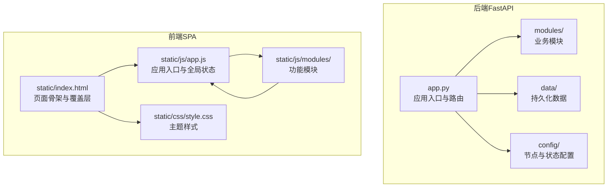
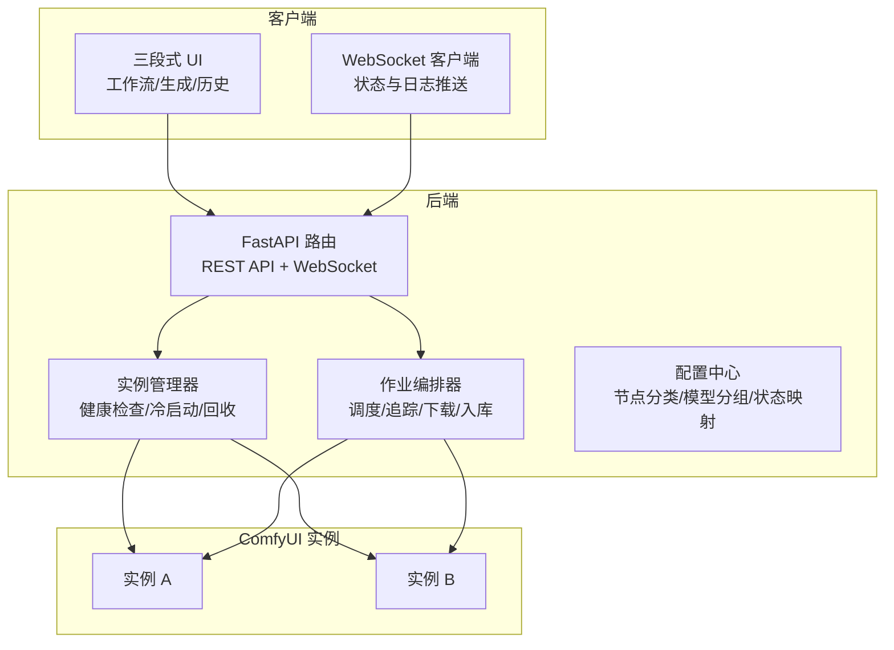
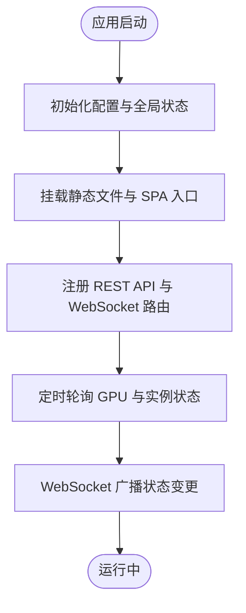
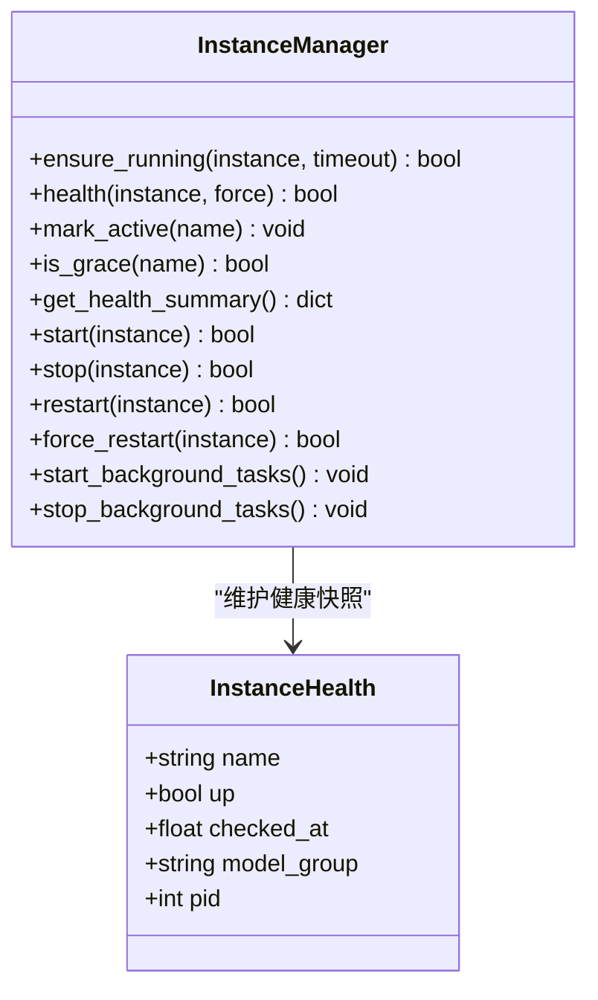
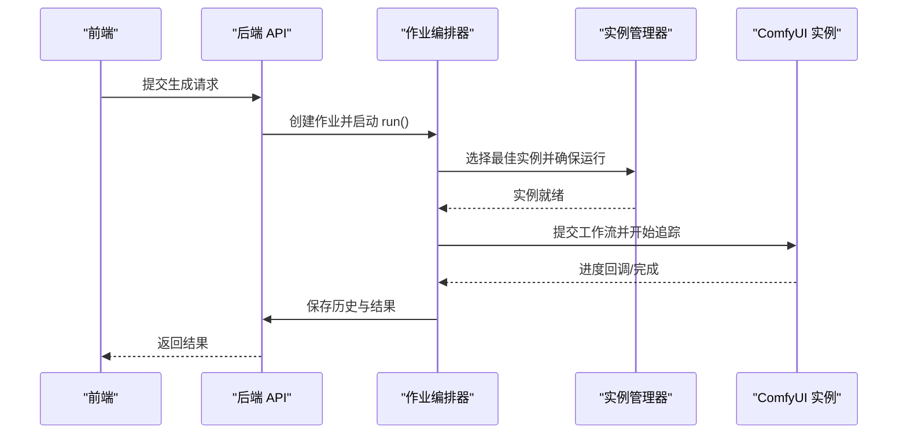
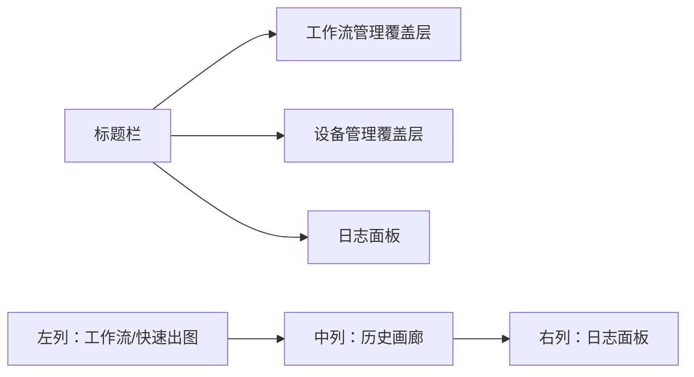
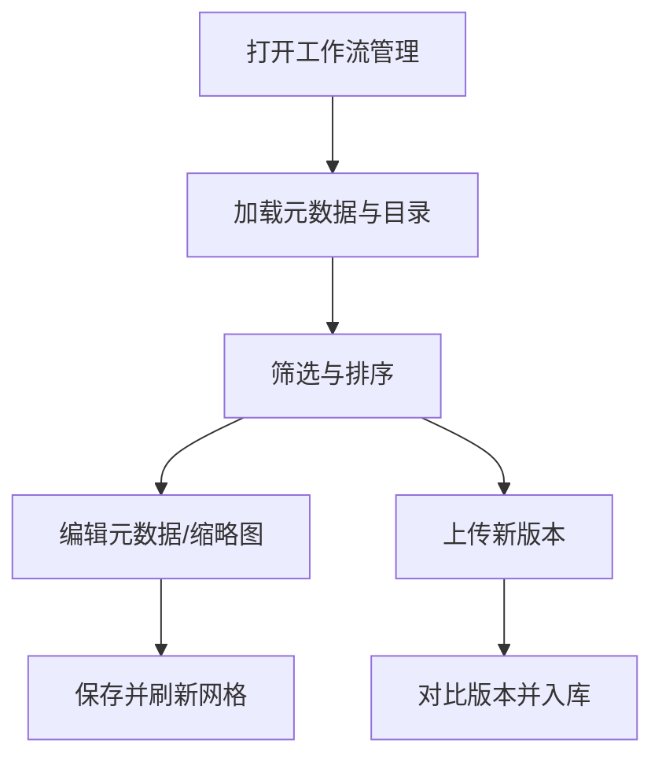
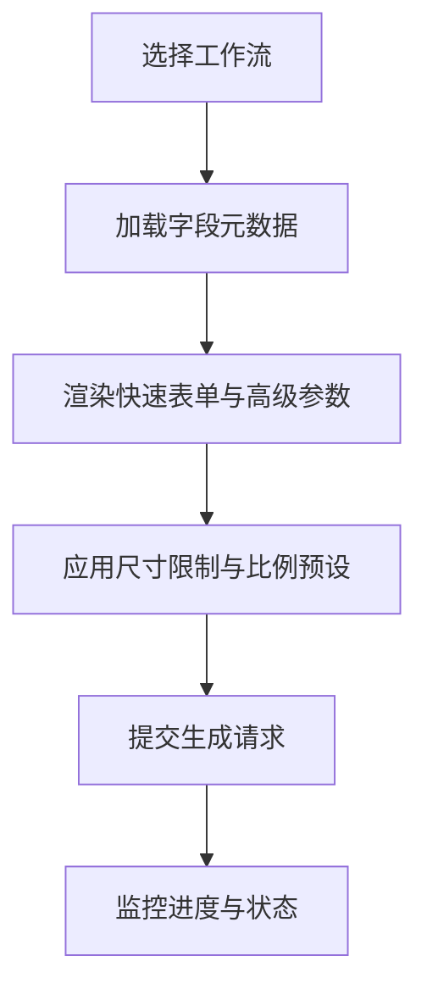
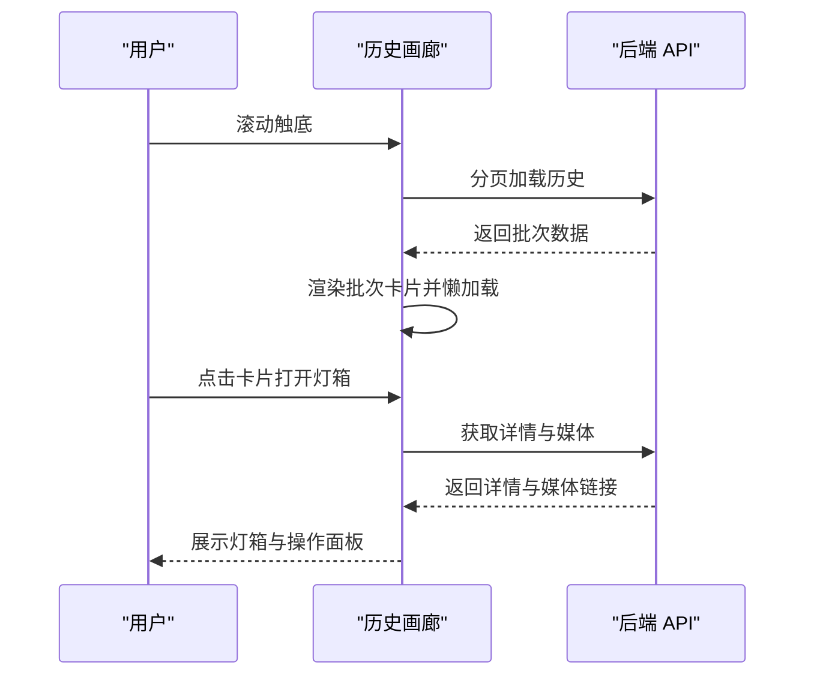
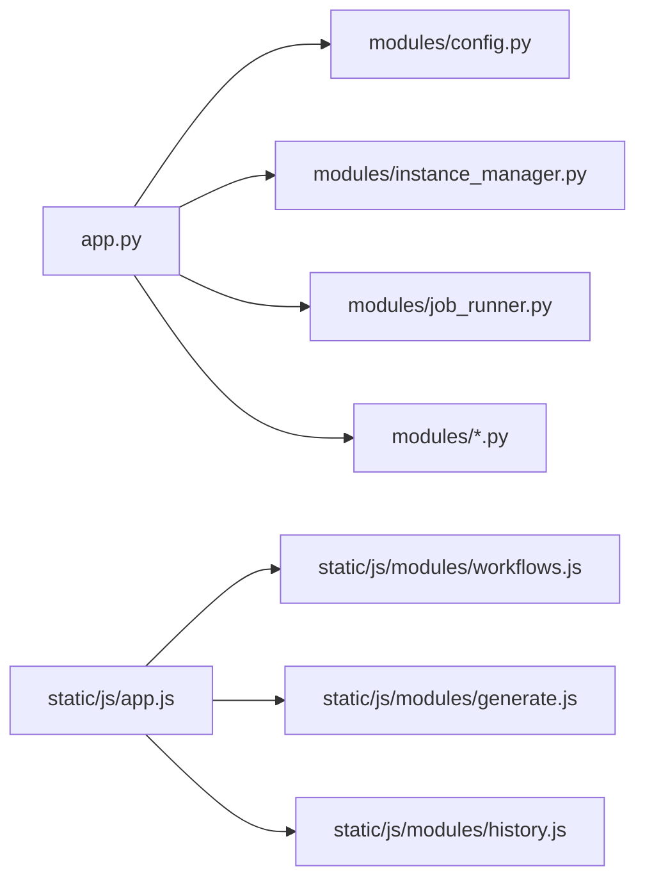

# 项目概述

<cite>
**本文档引用的文件**
- [README.md](file://README.md)
- [app.py](file://app.py)
- [modules/config.py](file://modules/config.py)
- [modules/instance_manager.py](file://modules/instance_manager.py)
- [modules/job_runner.py](file://modules/job_runner.py)
- [static/index.html](file://static/index.html)
- [static/js/app.js](file://static/js/app.js)
- [static/js/modules/workflows.js](file://static/js/modules/workflows.js)
- [static/js/modules/generate.js](file://static/js/modules/generate.js)
- [static/js/modules/history.js](file://static/js/modules/history.js)
</cite>

## 目录
1. [项目简介](#项目简介)
2. [项目结构](#项目结构)
3. [核心组件](#核心组件)
4. [架构总览](#架构总览)
5. [详细组件分析](#详细组件分析)
6. [依赖关系分析](#依赖关系分析)
7. [性能考量](#性能考量)
8. [故障排查指南](#故障排查指南)
9. [结论](#结论)
10. [附录](#附录)

## 项目简介

Ez ComfyUI Showcase 是一个面向多实例 ComfyUI 的 Web 管理与生成平台，旨在提供一体化的出图调度、可视化工作流管理、实时 GPU 监控与服务管理能力。项目采用前后端分离架构：后端基于 Python FastAPI，前端采用 Vanilla JS ES6 模块化组织，通过三段式 UI（工作流管理、生成面板、历史画廊）实现高效的人机交互。

- **核心价值与目标**
  - 多实例智能调度：在 A/B 两个 ComfyUI 实例间进行序列化调度，提升资源利用率与稳定性。
  - 三段式 UI：将工作流管理、生成面板与历史画廊整合在同一界面，降低切换成本。
  - 实时 GPU 监控：提供显存、温度、利用率的仪表盘，便于运维与容量规划。
  - 服务管理：在浏览器内一键启动/停止 ComfyUI 实例，简化运维流程。
  - 节点参数可视化编辑：支持对工作流节点参数进行可视化配置与快速复用。
  - 画廊系统：按标签/日期/模型筛选，支持无限滚动懒加载，提升浏览体验。
  - 快速出图：一键复用历史配置，加速迭代与批量生成。
  - 冷启动自愈：当无可用实例时自动拉起 ComfyUI，保障业务连续性。

- **技术栈概览**
  - 后端：Python 3 + asyncio + FastAPI
  - 前端：Vanilla JS ES6 模块 + CSS3
  - ComfyUI：双实例（A/B），高显存模式
  - Nginx：SSL 反向代理
  - 硬件：NVIDIA GB10，128GB 统一内存，CUDA 13

- **版本与演进**
  - 当前版本：v4.6.25
  - 版本发布遵循严格的变更记录与最小适用版本提升机制，确保发布流程规范化与可追溯性。

**章节来源**
- [README.md:1-122](file://README.md#L1-L122)

## 项目结构

项目采用模块化与前后端分离的设计理念，后端以 FastAPI 提供 REST API 与 WebSocket 支持，前端以 SPA 形式承载三段式 UI，并通过模块化 JS 组织功能逻辑。

**图表来源**
- [app.py:1-120](file://app.py#L1-L120)
- [static/index.html:1-659](file://static/index.html#L1-L659)
- [static/js/app.js:1-120](file://static/js/app.js#L1-L120)

**章节来源**
- [README.md:40-76](file://README.md#L40-L76)
- [static/index.html:1-659](file://static/index.html#L1-L659)

## 核心组件

- **后端核心**
  - 应用入口与生命周期：负责 FastAPI 应用初始化、静态文件挂载、WebSocket 广播、版本暴露与日志管理。
  - 实例管理：统一管理 ComfyUI 实例的健康检查、冷启动、空闲回收与死实例检测。
  - 作业编排：串联实例选择、进度追踪、结果下载与历史入库，处理提交卡顿与 GPU 静止等异常场景。
  - 配置与常量：集中管理节点分类、模型分组与状态映射，支撑进度计算与实例亲和路由。

- **前端核心**
  - 应用入口：初始化全局状态、版本徽章、轮询状态与服务开关。
  - 工作流管理：工作流 CRUD、缩略图上传、标签与排序、版本管理与共享控制。
  - 生成面板：字段元数据解析、尺寸限制与比例预设、提示词优化与翻译、一键复用与快速出图。
  - 历史画廊：无限滚动懒加载、筛选与排序、收藏与分享、对比与导出、视频编辑与帧预览。

**章节来源**
- [app.py:1-200](file://app.py#L1-L200)
- [modules/instance_manager.py:1-120](file://modules/instance_manager.py#L1-L120)
- [modules/job_runner.py:1-120](file://modules/job_runner.py#L1-L120)
- [modules/config.py:1-151](file://modules/config.py#L1-L151)
- [static/js/app.js:1-120](file://static/js/app.js#L1-L120)
- [static/js/modules/workflows.js:1-120](file://static/js/modules/workflows.js#L1-L120)
- [static/js/modules/generate.js:1-120](file://static/js/modules/generate.js#L1-L120)
- [static/js/modules/history.js:1-120](file://static/js/modules/history.js#L1-L120)

## 架构总览

系统采用前后端分离架构，后端通过 REST API 与 WebSocket 提供服务，前端以模块化 JS 实现三段式 UI 与交互逻辑。

**图表来源**
- [app.py:1-200](file://app.py#L1-L200)
- [modules/instance_manager.py:1-120](file://modules/instance_manager.py#L1-L120)
- [modules/job_runner.py:1-120](file://modules/job_runner.py#L1-L120)

**章节来源**
- [README.md:30-39](file://README.md#L30-L39)

## 详细组件分析

### 后端应用入口与生命周期（app.py）

- **职责**
  - 初始化 FastAPI 应用，挂载静态文件与 SPA 入口。
  - 暴露版本查询接口，记录并广播系统日志。
  - 维护全局状态（作业、历史、日志缓冲区），并通过 WebSocket 广播状态变更。
  - 提供实例健康检查、GPU 监控与服务管理接口。

- **关键机制**
  - 日志国际化与裁剪：将英文日志映射为中文，限制最大条目与保留时长，支持持久化。
  - 作业状态机：定义作业各阶段超时与错误消息，支持 GPU 静止检测与自动重启。
  - 实例亲和与路由：结合模型分组与队列大小，选择最优实例执行。

**图表来源**
- [app.py:1-200](file://app.py#L1-L200)

**章节来源**
- [app.py:1-200](file://app.py#L1-L200)

### 实例管理器（modules/instance_manager.py）

- **职责**
  - 统一管理 ComfyUI 实例的生命周期：健康检查、冷启动、空闲回收、死实例检测。
  - 提供幂等启动与去重锁，避免并发重复启动。
  - 后台协程定期扫描服务状态与空闲实例，自动回收以节省资源。

- **关键机制**
  - 健康快照：缓存实例健康状态，减少频繁 HTTP 请求。
  - 防御期：实例刚启动后的 90 秒内跳过死实例检测，避免误判。
  - 空闲回收：超过阈值未活跃的实例自动停止，降低资源占用。

**图表来源**
- [modules/instance_manager.py:23-214](file://modules/instance_manager.py#L23-L214)

**章节来源**
- [modules/instance_manager.py:1-200](file://modules/instance_manager.py#L1-L200)

### 作业编排器（modules/job_runner.py）

- **职责**
  - 串联实例选择、vLLM 管理、工作流准备、进度追踪、结果下载与历史入库。
  - 处理提交卡顿与 GPU 静止等异常场景，自动纠错与重启实例。
  - 通过依赖注入解耦外部函数，便于测试与扩展。

- **关键机制**
  - 实例信号量：按实例粒度控制并发，避免资源争用。
  - 提交重试：对无响应的提交进行清理与重试，限制最大次数。
  - 进度回调：通过 WebSocket 与 HTTP 轮询双通道追踪生成进度。

**图表来源**
- [modules/job_runner.py:234-320](file://modules/job_runner.py#L234-L320)
- [modules/instance_manager.py:93-151](file://modules/instance_manager.py#L93-L151)

**章节来源**
- [modules/job_runner.py:1-200](file://modules/job_runner.py#L1-L200)

### 前端应用入口与三段式 UI（static/js/app.js, static/index.html）

- **职责**
  - 初始化全局状态与模块注册，加载站点版本徽章。
  - 轮询后端状态，更新 GPU 仪表盘与服务按钮状态。
  - 提供服务弹窗、实例卡片与 GPU 进程管理等交互。

- **三段式 UI 结构**
  - 左列：工作流选择与快速出图表单。
  - 中列：出图历史瀑布流，支持无限滚动与筛选。
  - 右列：日志面板，可吸附至右侧。

**图表来源**
- [static/index.html:24-346](file://static/index.html#L24-L346)
- [static/js/app.js:630-690](file://static/js/app.js#L630-L690)

**章节来源**
- [static/index.html:1-200](file://static/index.html#L1-L200)
- [static/js/app.js:1-120](file://static/js/app.js#L1-L120)

### 工作流管理模块（static/js/modules/workflows.js）

- **职责**
  - 工作流 CRUD：上传、下载、删除、编辑元数据与缩略图。
  - 版本管理：保留历史版本，支持上传新版本并对比差异。
  - 共享控制：管理员可设置工作流共享状态。
  - 预览与筛选：根据标签与搜索关键字动态渲染卡片网格。

- **关键流程**
  - 缩略图上传：FormData 提交，更新预览并刷新网格。
  - 共享状态切换：通过 PUT 请求更新元数据并同步 UI。

**图表来源**
- [static/js/modules/workflows.js:581-620](file://static/js/modules/workflows.js#L581-L620)
- [static/js/modules/workflows.js:213-240](file://static/js/modules/workflows.js#L213-L240)

**章节来源**
- [static/js/modules/workflows.js:1-200](file://static/js/modules/workflows.js#L1-L200)

### 生成面板模块（static/js/modules/generate.js）

- **职责**
  - 字段元数据解析：根据工作流动态生成用户输入与高级参数区域。
  - 尺寸限制与比例预设：根据工作流类型自动限制最大像素与比例。
  - 提示词优化与翻译：基于本地 LLM API 进行提示词优化与语言切换。
  - 一键复用：从历史记录快速恢复参数并提交生成。

- **关键机制**
  - 尺寸限制：根据工作流类型（如 Flux2、Qwen、Z-Image）应用不同的尺寸上限与倍数。
  - 角度控制：针对 Qwen 多角度相机节点，提供角度描述与提示词生成。

**图表来源**
- [static/js/modules/generate.js:269-318](file://static/js/modules/generate.js#L269-L318)
- [static/js/modules/generate.js:119-140](file://static/js/modules/generate.js#L119-L140)

**章节来源**
- [static/js/modules/generate.js:1-200](file://static/js/modules/generate.js#L1-L200)

### 历史画廊模块（static/js/modules/history.js）

- **职责**
  - 无限滚动懒加载：基于 IntersectionObserver 触发分页加载。
  - 筛选与排序：按归属、类型与标签筛选，支持搜索与排序。
  - 收藏与分享：支持收藏、分享到首页列表与隐藏功能。
  - 对比与导出：支持图片对比、视频编辑与导出到不同工作流。

- **关键机制**
  - 乐观更新：在生成过程中以占位符卡片展示，完成后平滑过渡为正式卡片。
  - 详情缓存：对历史详情进行缓存与淘汰，提升交互流畅度。

**图表来源**
- [static/js/modules/history.js:440-458](file://static/js/modules/history.js#L440-L458)
- [static/js/modules/history.js:236-255](file://static/js/modules/history.js#L236-L255)

**章节来源**
- [static/js/modules/history.js:1-200](file://static/js/modules/history.js#L1-L200)

## 依赖关系分析

- **后端模块依赖**
  - app.py 依赖 modules 下的配置、实例管理、作业编排、提示词优化、媒体输出等模块。
  - modules/config.py 提供节点分类与模型分组常量，被多个模块引用。
  - modules/instance_manager.py 与 modules/job_runner.py 通过依赖注入解耦，便于测试与扩展。

- **前端模块依赖**
  - static/js/app.js 作为全局入口，注册并暴露模块，各功能模块通过 window.CW 暴露接口。
  - static/js/modules/workflows.js、generate.js、history.js 通过 API 与后端交互，实现 CRUD 与状态同步。

**图表来源**
- [app.py:29-59](file://app.py#L29-L59)
- [modules/config.py:1-151](file://modules/config.py#L1-L151)
- [modules/instance_manager.py:1-120](file://modules/instance_manager.py#L1-L120)
- [modules/job_runner.py:1-120](file://modules/job_runner.py#L1-L120)
- [static/js/app.js:86-111](file://static/js/app.js#L86-L111)

**章节来源**
- [app.py:29-59](file://app.py#L29-L59)
- [static/js/app.js:86-111](file://static/js/app.js#L86-L111)

## 性能考量

- **后端性能**
  - 健康检查缓存：实例健康状态缓存有效期内避免重复 HTTP 请求，降低延迟。
  - 后台协程：死实例检测与空闲回收在后台异步执行，不影响主线程。
  - 作业并发控制：实例级信号量限制并发，避免资源争用导致的性能抖动。

- **前端性能**
  - 三段式 UI：减少页面跳转，提升交互效率。
  - 无限滚动懒加载：分页加载与占位符卡片，降低首屏渲染压力。
  - 乐观更新：生成过程中的占位符卡片与平滑过渡，提升感知性能。

[本节为通用指导，无需特定文件分析]

## 故障排查指南

- **实例无法访问**
  - 检查 /system_stats 端点是否可达，确认实例健康状态。
  - 若服务 active 但健康失败，尝试重启实例并观察日志。

- **生成任务卡住**
  - 检查 GPU 静止检测：若任务在生成阶段长时间无波动，系统会自动重启任务。
  - 查看提交卡顿重试：对无响应的提交进行清理与重试，限制最大次数。

- **前端状态不同步**
  - 确认 WebSocket 连接正常，检查轮询状态与日志面板是否更新。
  - 刷新页面后重试，必要时清除浏览器缓存。

**章节来源**
- [modules/instance_manager.py:334-357](file://modules/instance_manager.py#L334-L357)
- [modules/job_runner.py:716-768](file://modules/job_runner.py#L716-L768)
- [static/js/app.js:151-185](file://static/js/app.js#L151-L185)

## 结论

Ez ComfyUI Showcase 通过前后端分离与模块化设计，构建了稳定高效的多实例 ComfyUI Web 管理平台。其核心优势在于：
- 多实例智能调度与冷启动自愈，保障业务连续性；
- 三段式 UI 与可视化节点编辑，显著提升用户体验；
- 实时 GPU 监控与服务管理，便于运维与容量规划；
- 历史画廊与快速出图能力，加速创意迭代与批量生成。

随着版本持续演进，项目在发布流程、功能完善与性能优化方面不断进步，为后续扩展与规模化部署奠定了坚实基础。

[本节为总结性内容，无需特定文件分析]

## 附录

- **环境变量与端口**
  - WORKFLOW_DIR：工作流 JSON 目录
  - COMFYUI_A_PORT / COMFYUI_B_PORT：实例 WebSocket 端口
  - OUTPUT_DIR：生成图片输出目录

- **API 端点概览**
  - /api/generate：提交生成任务
  - /api/jobs/{id}：查询任务状态
  - /api/workflows：获取工作流列表
  - /api/status：实例健康 + GPU 状态

**章节来源**
- [README.md:78-98](file://README.md#L78-L98)
- [README.md:87-98](file://README.md#L87-L98)