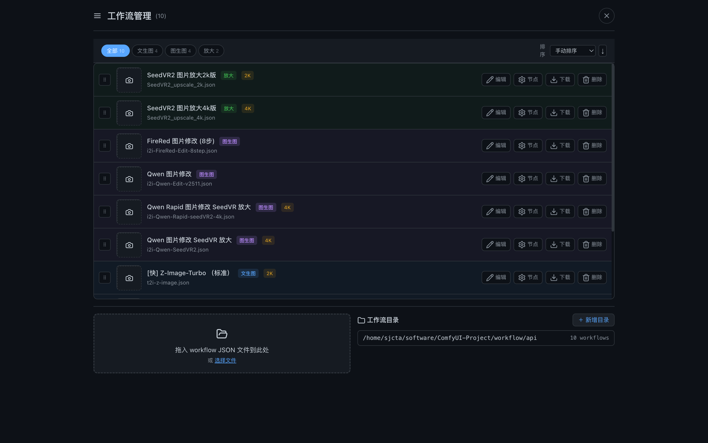

# Ez ComfyUI Showcase 🎨

Multi-instance ComfyUI Web Management & Generation Platform.

Current version: **v4.3.0**. The canonical project version is stored in [`VERSION`](../../VERSION) and exposed by `/api/version`.

Built for **DGX Spark (GB10)** with 128GB unified memory, running two parallel generation ComfyUI instances (A:8190 / B:8189) plus an isolated prompt auxiliary instance (Prompt:8191) behind an intelligent scheduler.

---

## Features

- **多实例分池调度** — 出图走 A/B 生成池，提示词优化和图片反推走独立 Prompt 辅助池
- **三段式 UI** — 工作流管理、生成面板、历史画廊一站式操作
- **GPU 监控** — 实时显存/功耗/温度仪表盘
- **服务管理** — 浏览器内一键启动/停止 ComfyUI 实例
- **节点编辑器** — 可视化修改 workflow 参数（prompt、seed、尺寸）
- **画廊系统** — 按标签/日期/模型筛选，无限滚动懒加载
- **快速出图** — 一键复用历史配置重新生成
- **冷启动自愈** — 无可用实例时自动拉起 ComfyUI

## Screenshots


*主界面 — 左侧生成控制面板（工作流选择、Prompt 输入、尺寸预设、参数调节）+ 右侧出图历史画廊*


*工作流管理页 — 管理 10 条预置工作流（文生图/图生图/放大），支持排序、编辑、节点查看、下载、删除和拖拽上传*

## Tech Stack

| Layer | Technology |
|-------|-----------|
| Backend | Python 3 + asyncio + FastAPI |
| Frontend | Vanilla JS ES6 Modules, CSS3 |
| ComfyUI | 2× generation instances (A/B) + 1× prompt auxiliary instance, --highvram |
| Nginx | SSL reverse proxy (`imdjj.cn:1213`) |
| Hardware | NVIDIA GB10, 128GB unified, CUDA 13 |

## Directory Structure

```
├── app.py                      # FastAPI backend (2084 lines)
├── static/
│   ├── index.html              # SPA 入口
│   ├── css/style.css           # 主题样式
│   └── js/
│       ├── app.js              # 核心加载器 + 模块注册
│       └── modules/
│           ├── workflows.js    # 工作流管理（CRUD + 缩略图）
│           ├── generate.js     # 生成面板 + 快速出图
│           ├── history.js      # 画廊 + 懒加载 + 筛选
│           ├── node-editor.js  # 节点参数编辑
│           ├── status.js       # GPU 实时监控
│           └── ui.js           # 通用 UI 组件
├── i2i-FireRed-Edit-1.1.json   # 图生图 workflow
├── i2i_Qwen_Edit.json          # Qwen 编辑 workflow
└── docs/project/README.md
```

## Quick Start

```bash
# 克隆仓库
git clone https://github.com/sjcta/ez-comfyui-showcase.git
cd ez-comfyui-showcase

# 安装依赖
pip install fastapi uvicorn aiofiles pillow

# 启动（默认 :9091）
python3 app.py

# 指定端口
python3 app.py --port 9091
```

### Environment Variables

| Variable | Default | Description |
|----------|---------|-------------|
| `WORKFLOW_DIR` | `./workflows` | ComfyUI workflow JSON 目录 |
| `COMFYUI_A_PORT` | `8190` | 实例 A WebSocket 端口 |
| `COMFYUI_B_PORT` | `8189` | 实例 B WebSocket 端口 |
| `OUTPUT_DIR` | `./output` | 生成图片输出目录 |

## API

| Endpoint | Method | Description |
|----------|--------|-------------|
| `/api/generate` | POST | 提交生成任务 |
| `/api/jobs/{id}` | GET | 查询任务状态 |
| `/api/workflows` | GET | 获取工作流列表 |
| `/api/status` | GET | 实例健康 + GPU 状态 |

## Version History

See [`CHANGELOG.md`](../releases/CHANGELOG.md) for the full user-facing update notes.

| Version | Highlights |
|---------|-----------|
| v4.3.0 | 正式升级 — 登录保持一个月、管理员网站通知、登录前首页、更多工作流、设备管理布局优化、历史画廊载入和 admin 轮询闪烁修复 |
| v4.2.3 | 图片保护校验 — 出图后先进入“图片校验中”，由本地轻量 worker 写回保护状态后再显示 |
| v4.2.2 | Safari 修复 — 登录/注册等弹窗遮罩拆分为独立合成层，避免黑色遮罩抖动或失效 |
| v4.2.1 | 小版本修正 — JSON 提示词中英切换稳定化、启动脚本 restart 修复、提示词助手与历史/状态 UI 累积修正 |
| v3.16 | 当前稳定版 — 三段式 UI + 双实例调度 + GPU 监控 |
| v3.15 | 模块化重构，JS 拆分为 6 个 ES6 模块 |
| v3.14 | Strict Mode 兼容，跨模块共享状态修复 |
| v3.13 | 画廊系统重写，懒加载 + 筛选功能 |
| v3.12 | 完整模块拆分（app.js 751行→6模块） |
| v3.10 | 三段式布局初始版本 |

## License

MIT © [Jeson Sun](https://github.com/sjcta)
