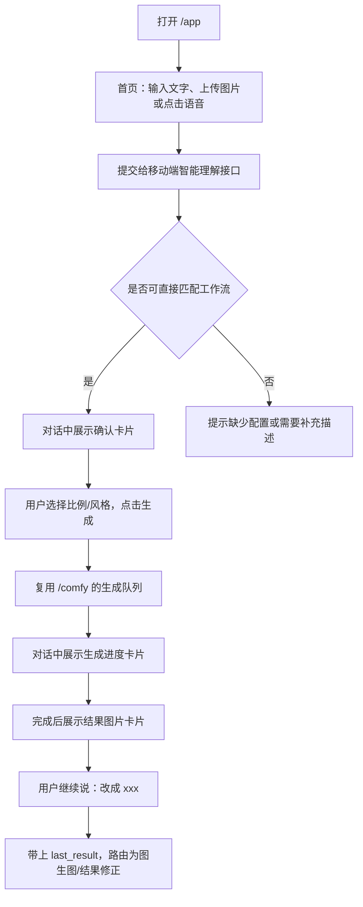

# Ez ComfyUI V5.0 Mobile Agent Overview

整理日期：2026-05-25

当前 V5.0 分支目标是在不拆散主项目能力的前提下，为手机用户提供一套更接近 ChatGPT / Gemini 手机端的极简创作入口。桌面端继续作为完整工作台存在，移动端则以“输入或口述想法 -> 智能理解 -> 最少确认 -> 生成 -> 对话中继续修改”为核心流程。

## 版本定位

- 桌面端：`/comfy`，保留当前 4.3 桌面端工作台体验和完整工作流操作能力。
- 手机端：`/app`，进入 V5.0 移动智能创作入口。
- 服务复用：移动端不作为独立系统运行，而是复用主项目的认证、工作流解析、生成队列、历史输出、图片访问和日志能力。
- 文件隔离：移动端核心逻辑放在 `modules/mobile_agent*.py`、`static/js/modules/mobile_agent/`、`static/css/mobile-agent.css`，避免把移动端业务逻辑继续堆进 `app.py`。

## 核心用户流程

这个流程的重点是减少跳转和页面滚动：用户不需要理解 ComfyUI 节点、字段、种子、模型实例或工作流文件名，只需要表达目标、确认少量按钮选项并等待结果。

## 移动端交互形态

- 首页采用深色极简布局，左上角显示 Ez ComfyUI 品牌，主文案上下居中。
- 输入区为大倒角胶囊/圆角形态，按钮更适合拇指点击。
- 图片按钮直接触发系统文件/相册选择，已选图片以内嵌缩略图展示在输入框右侧，并提供圆形关闭角标。
- 语音按钮点击后直接请求麦克风并开始采集，不跳转独立页面；录音时展开为“正在录音识别”的长条胶囊按钮，并带声波动画。
- 图片/语音默认使用紫色系渐变，发送按钮使用橙黄色渐变；语音展开时颜色互换，保持明显状态反馈。
- 所有主要按钮、展开、关闭、点击反馈遵循 300ms 动画节奏。
- 提交后不进入传统表单页，而是进入对话流：用户消息、确认卡片、任务卡片、结果卡片都保存在同一条创作上下文中。

## 对话式创作能力

V5.0 的移动端不把每次生成看成孤立任务，而是把生成结果放入当前对话上下文：

- 第一次输入“生成一只漫画风格的小猫”时，系统按文生图处理。
- 生成完成后，结果图片会作为 `last_result` 存入当前对话。
- 用户继续输入“改成赛博朋克风格”时，前端会把 `context.last_result` 一起发送给理解接口。
- 后端识别为对上一次结果的修改意图，并尝试切换到图生图工作流。
- 如果当前未配置默认图生图工作流，系统会明确提示需要配置，而不是显示笼统的“理解失败”。

这种设计让移动端更接近 agent 式体验：用户用自然语言连续修正目标，系统根据上下文预估下一步意图。

## 技术栈与模块边界

### 前端

- `static/js/modules/mobile_agent/mobile-agent.js`
  - 移动端状态机、首页、对话页、确认卡片、任务卡片、结果卡片。
  - 处理文字输入、图片上传、语音录制、登录提示、上下文保存和生成提交。
  - 调用 `/api/mobile-agent/understand` 做语义理解，调用 `/comfy/api/generate` 复用主生成接口。
- `static/css/mobile-agent.css`
  - 移动端专属样式，范围限定在 `.mobile-agent`。
  - 控制 Gemini-like 的极简暗色界面、大倒角按钮、胶囊操作区、声波动画、结果卡片和移动端安全区。
- `static/js/module_loader.js`
  - `/app` 下设置 `CW_MOBILE_API_BASE = '/app'`。
  - `/app` 的生成队列仍指向 `CW_JOB_API_BASE = '/comfy'`，保证移动端和桌面端共用同一套生成后端。

### 后端

- `modules/mobile_agent.py`
  - `IntentRouter`：轻量语义路由，先用规则和上下文识别文生图、结果修正、需要澄清、视频暂不支持等状态。
  - `PromptCompiler`：把自然语言整理成受控的提示词、风格、比例和宽高。
  - `build_generate_fields`：把移动端理解结果映射到工作流可填写字段。
- `modules/mobile_agent_routes.py`
  - 注册移动端接口，保持 `app.py` 只做依赖注入和路由挂载。
  - 负责读取移动端设置、校验工作流可见性、分析工作流字段、语音转写和对话线程接口。
- `modules/speech_transcriber.py`
  - 面向本地 Whisper 命令的语音转文字封装。
  - 当前目标是可替换、可失败、可提示，而不是强依赖云端语音服务。
- `modules/mobile_agent_threads.py`
  - SQLite 对话线程存储，按用户隔离保存移动端对话、最近结果、待完成任务和预览文本。
  - 这部分用于把“每次生成的内容用对话形式保存”从本地浏览器扩展到服务端持久化。

## 接口整理

| 接口 | 作用 |
| --- | --- |
| `POST /api/mobile-agent/understand` | 接收文字、图片/视频标记和上下文，返回意图、提示词、风格、比例、工作流和字段映射 |
| `POST /api/mobile-agent/transcribe` | 接收录音文件，调用本地 Whisper 类能力转写为文字 |
| `GET /api/mobile-agent/threads` | 获取当前用户的移动端对话线程列表 |
| `GET /api/mobile-agent/threads/{thread_id}` | 获取单条对话线程 |
| `PUT /api/mobile-agent/threads/{thread_id}` | 保存或更新移动端对话线程 |
| `DELETE /api/mobile-agent/threads/{thread_id}` | 删除当前用户自己的对话线程 |
| `POST /comfy/api/generate` | 移动端确认后复用主项目生成接口 |
| `GET /comfy/api/jobs/{job_id}` | 移动端任务卡片轮询/恢复生成状态 |
| `/comfy/api/images/...` | 移动端结果卡片读取最终图片 |

## 大模型与本地架构建议

当前移动端 V5.0 采用“规则优先、模型可插拔”的可靠架构：

- 语义路由先由轻量 `IntentRouter` 完成，避免每次点击都强依赖本地 LLM 的冷启动和推理延迟。
- 当本地 Qwen / Gemma / Llama 等轻量模型可用时，可作为二级增强层处理更复杂的意图归纳、提示词整理和工作流选择。
- 语音输入使用 Whisper 类本地能力，失败时只影响语音转文字，不影响文字输入主流程。
- 图片理解可继续复用已有 prompt interrogator / VLM 能力，用于后续“上传图片 -> 描述/改图”的增强。
- 工作流执行仍交给现有 ComfyUI 队列和实例管理，移动端只做更薄的智能编排层。

这种架构适合本地机器：首屏和普通输入保持快速，复杂理解能力逐步增强，任何模型失败都应降级为明确的用户提示。

## 工作流配置状态

- 默认文生图工作流：`t2i-z-image.json`。
- 默认图生图工作流：当前默认配置为空，需要在系统设置中配置后，移动端“继续修改上一张结果”的能力才能实际进入图生图生成。
- 风格选项：`cinematic`、`anime`、`realistic`。
- 比例选项：`1:1`、`3:4`、`9:16`。
- 宽高映射：
  - `1:1` -> `1024 x 1024`
  - `3:4` -> `960 x 1280`
  - `9:16` -> `720 x 1280`

## 当前测试覆盖

- `tests/test_mobile_agent.py`
  - 意图识别、提示词编译、比例/风格映射、结果修正上下文、图生图未配置提示、语音转写封装。
- `tests/test_mobile_agent_routes.py`
  - `/api/mobile-agent/understand`、工作流标题、字段映射、未配置工作流提示、语音转写接口。
- `tests/test_mobile_agent_ui.py`
  - 移动端模块加载、`/app` 与 `/comfy` API 分流、核心 UI 状态、生成 handoff、CSS 作用域和移动端布局约束。
- `tests/js/mobile_agent_shell.test.js`
  - 前端状态机、登录前拦截、上传图内嵌、语音状态、确认卡片、生成任务卡片、结果回填和 follow-up 上下文。
- `tests/test_mobile_agent_thread_store.py`
  - 服务端对话线程持久化、按用户隔离、保存/查询/删除接口。

## 已知限制与下一步

- 视频生成在移动端智能入口中仍标记为暂不支持，需要单独设计文生视频/图生视频的最小确认流程。
- 默认图生图工作流尚需配置，否则“改成 xxx”只能完成意图识别和提示，不会真正进入图生图生成。
- 上传图片目前已完成移动端交互入口，后续需要把上传图片与具体工作流输入节点、图片保护、VLM 识别流程打通。
- 本地 LLM 尚未成为强依赖，后续可把 Qwen / Gemma / Llama 接入为语义增强层，但需要保留规则降级路径。
- 移动端真实手机验证应继续覆盖：iOS Safari、Android Chrome、麦克风权限、相册上传、HTTPS 域名、Nginx `/app` 反代和 `/comfy` 共存。

## 发布提交原则

- V5.0 移动端是主项目的移动入口，不是独立服务。
- 每次移动端功能提交应保持范围清晰：前端、后端、测试、文档分层提交。
- 运行态数据、数据库、日志、缓存、`__pycache__` 不应进入版本提交。
- 提交前需要至少完成静态检查、单元测试和真实浏览器移动视口验证中的相关部分，并在提交说明中明确验证范围。
